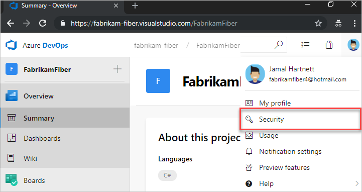
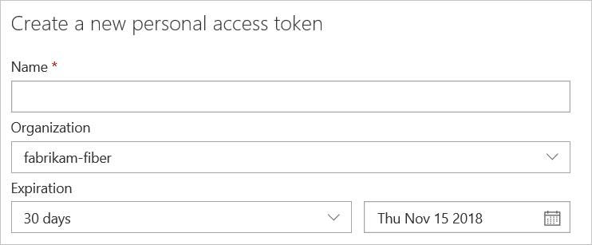
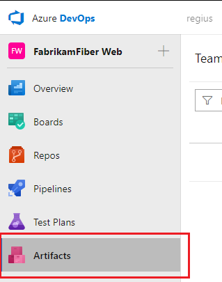
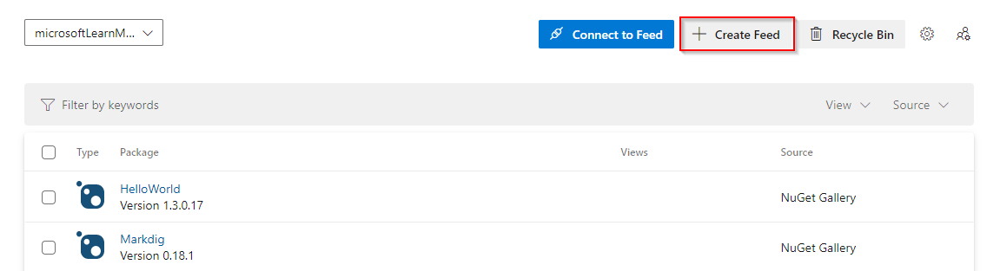
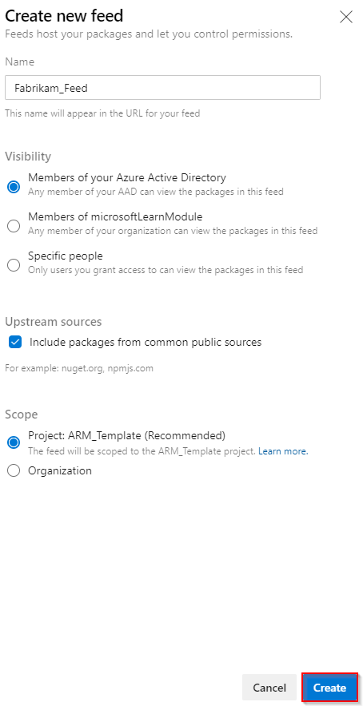
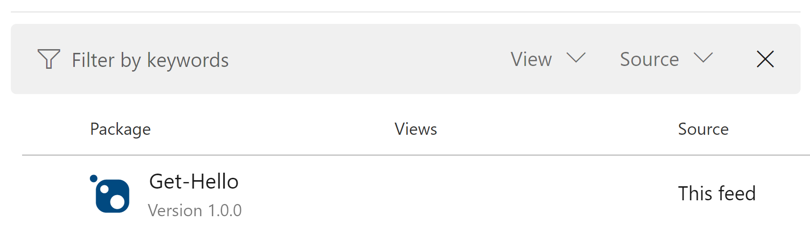

# Use Azure Artifacts as a private PowerShell repository

**Azure DevOps Services**

Azure Artifacts provides an easy way to share your PowerShell scripts and books across your entire team or company. By storing your PowerShell scripts in a private NuGet repository within Azure Artifacts, you can give members of your team the ability to download or update them quickly using the command line.

> [!NOTE]
> This guide assumes you've already set up Azure Artifacts. You can check out how to license the extension in the [License Azure Artifacts guide](../start-using-azure-artifacts.md).

In this tutorial, you'll learn how to use Azure Artifacts as a private PowerShell repository that your team can download and upload PowerShell modules to. You'll complete the following steps:

>[!div class="checklist"]      
> * Create a Personal Access Token (PAT) to authenticate other services with Azure DevOps Services
> * Create a feed within Azure Artifacts that will be used to store your PowerShell modules
> * Create, package, and send a PowerShell module to your Azure Artifacts Feed
> * Connect to the feed from PowerShell to see and download your modules  

## Prerequisites

- [The NuGet CLI](/nuget/tools/nuget-exe-cli-reference)
- An [Azure DevOps Services](https://azure.microsoft.com/services/devops/) account.

## Create a PAT to get command-line access to Azure DevOps Services

The first step is to create a PAT through the Azure DevOps Services UI to authenticate your command-line with the service.

1. Head to your organization in Azure DevOps Services: `https://dev.azure.com/<org_name>`

2. From your home page, open your profile. Go to your security details:

    > [!div class="mx-imgBorder"]
    >   

3. Create a personal access token.

    > [!div class="mx-imgBorder"]
    > 

4.  Provide a name and an expiration date for your token and select your organization.

    > [!div class="mx-imgBorder"]
    > 

5.  Select the [scopes](../../integrate/get-started/authentication/oauth.md#scopes) that this token will be authorized to access. You will only need **Packaging: Read, write & manage** permissions for this tutorial but you can also add more privileges if you'd like to use this token for other tasks.

6. When you're done, make sure to copy your token to a safe location, as you won't be able to view it afterwards.

> [!NOTE]
> To learn more about how to user personal access tokens, check out the [Authenticate with PAT](../../organizations/accounts/use-personal-access-tokens-to-authenticate.md) article.

## Create the feed

A feed is a central repository that can store multiple packages of different types. To store our packages, the PowerShell Modules in this scenario, we will need to create a new feed.

1. Navigate to **Azure Artifacts** from your organization.

    > [!div class="mx-imgBorder"]
    > 

2. Select **Create Feed**

    > [!div class="mx-imgBorder"]
    > 

3. In the dialog, provide a feed name and chose your visibility, scope and upstream sources.
 
    > [!div class="mx-imgBorder"]
    > 
    
4. Select **Create**. 

Now that you've created a feed that will act as your PowerShell repository, let's create and package a PowerShell module.

## Creating, packaging, and sending a module

These next steps will be using a simple `Get-Hello` script that simply writes "Hello from my Azure DevOps Services Package."

### Create the file structure

Create a folder named `Get-Hello`. Within that folder create a `Get-Hello.psm1` file:

``` 
|--- Get-Hello                     
    |--- Get-Hello.psm1     // This will become our PowerShell Module
    |--- Get-Hello.psd1     // This will become our module manifest
```

### Create and populate the PowerShell module and module manifest

1. Paste the following script into your newly created `Get-Hello.psm1` file:

    ```powershell
    Function Get-Hello{
        Write-Host "Hello from my Azure DevOps Services Package."
    }
    ```

2. Create the module manifest by running the following command in your `Get-Hello` directory path. This will write the module manifest to your `Get-Hello.psd1` file.

    ```powershell
    New-ModuleManifest -Path .\Get-Hello.psd1
    ```

3. Find the **Nested Modules** field in your `Get-Hello.psd1` file and paste in the path to your `Get-Hello.psm1` file. You may also need to define your `RootModule` when creating your own Module Manifests. To do so, paste the following snippet in your `Get-Hello.psd1`
    
    ```powershell
    RootModule = 'Get-Hello.psm1'
    ```

4. The `FunctionsToExport = @()` section is meant to define the module's exported functions. This is simply a list of all exported functions. The following is an example from `PowerShellGet.psd1`:

    ```powershell
    FunctionsToExport = @('Install-Module',
                          'Find-Module',
                          'Save-Module',
                          'Update-Module',
                          'Publish-Module', 
                          'Get-InstalledModule',
                          'Uninstall-Module',
                          'Find-Command', 
                          'Find-DscResource', 
                          'Find-RoleCapability',
                          'Install-Script',
                          'Find-Script',
                          'Save-Script',
                          'Update-Script',
                          'Publish-Script', 
                          'Get-InstalledScript',
                          'Uninstall-Script',
                          'Test-ScriptFileInfo',
                          'New-ScriptFileInfo',
                          'Update-ScriptFileInfo',
                          'Get-PSRepository',
                          'Set-PSRepository',                      
                          'Register-PSRepository',
                          'Unregister-PSRepository',
                          'Update-ModuleManifest')
    ```
    
    > [!TIP]
    > Your module manifest should export the `Get-Hello` function you created in Step 1.
    
5. It is also possible to define a list of files as part of your module. Just add this list under `FileList=@()`.

    ```powershell
    FileList = @('PSModule.psm1',
                 'PSGet.Format.ps1xml',
                 'PSGet.Resource.psd1')
    ```       

### Package and publish the module

We now have the module and the module manifest. We are ready to package it and publish it to our Azure Artifacts feed.

1. In an elevated PowerShell prompt, run the following snippet:

    ```powershell
    nuget spec Get-Hello
    ```

    The `spec` command will create a `Get-Hello.nuspec` file. This specifies the information that NuGet needs to package our module. Few things to keep in mind here:

   * The version number on the Module Manifest and the .nuspec file must match.
   * By default, if we leave the sample dependencies, NuGet will install jQuery.

    Here is the `Get-Hello.nuspec` file:

     ```xml
     <?xml version="1.0"?>
     <package >
     <metadata>
       <id>Get-Hello</id>
       <version>1.0.0</version>
       <authors>frantot</authors>
       <owners>frantot</owners>
       <requireLicenseAcceptance>false</requireLicenseAcceptance>
       <description>The module says hello to the user</description>
       <releaseNotes>This is the newest I know of.</releaseNotes>
       <copyright>Copyright 2019</copyright>
       <tags>PSModule</tags>
       <dependencies>
       </dependencies>
     </metadata>
     </package>
     ```

2. Now that we have both the PowerShell module and the NuGet spec file, we are ready to to pack it and publish it.

    - Package the module:
    
    ```powershell
    nuget pack Get-Hello.nuspec
    ```

    - Add the new package source to your NuGet configuration file:
    
    ```powershell
    nuget sources Add -Name "PowershellModules" -Source "https://pkgs.dev.azure.com/<org_name>/_packaging/<feed_name>/nuget/v3/index.json" -username "<user_name>" -password "<personal_access_token(PAT)>"
    ```
    
    If you're still using the older `visualstudio.com` URLs, use the following command instead:

    ```powershell
    nuget sources Add -Name "PowershellModules" -Source "https://<org_name>.pkgs.visualstudio.com/_packaging/<feed_name>/nuget/v3/index.json" -username "<user_name>" -password "<personal_access_token_you_created>"
    ```

    - Publish the NuGet package to your feed:
    
    ```powershell
    nuget push -Source "PowershellModules" -ApiKey AzureDevOpsServices "your .nupkg path. eg: .\Get-Hello.1.0.0.nupkg"
    ```

Our PowerShell module is now available in our feed.

> [!div class="mx-imgBorder"]
> 

> [!NOTE]
> Your `NuGet.config` file is located at `%appdata%\NuGet\NuGet.Config` for Windows, and at `~/.config/NuGet/NuGet.Config` or `~/.nuget/NuGet/NuGet.Config` for Mac/Linux (depending on the OS distribution).

## Connecting to the feed as a PowerShell repo

We now have a private repository within Azure Artifacts that we can push our PowerShell modules to and we have a module that we can install. In the next step, we will connect to our new Azure Artifacts feed so we can publish our own modules as well as install other modules published by members on our team.

1. Open an elevated PowerShell prompt

2. Set up authentication to access Azure Artifacts feeds. Replace the placeholders with your personal access token and email:

    ```powershell
        $patToken = "YOUR PERSONAL ACCESS TOKEN" | ConvertTo-SecureString -AsPlainText -Force
    ```

    ```powershell
    $credsAzureDevopsServices = New-Object System.Management.Automation.PSCredential("YOUR EMAIL", $patToken)
    ```

3. Register your PowerShell repository. The `SourceLocation` link can also be found by selecting **Connect to Feed** then **NuGet.exe** from the feed's page in Azure Artifacts.

    ```powershell
        Register-PSRepository -Name "PowershellAzureDevopsServices" -SourceLocation "https://pkgs.dev.azure.com/<org_name>/<project_name>/_packaging/<feed_name>/nuget/v2" -PublishLocation "https://pkgs.dev.azure.com/<org_name>/<project_name>/_packaging/<feed_name>/nuget/v2" -InstallationPolicy Trusted -Credential $credsAzureDevopsServices
    ```
    
    > [!IMPORTANT]
    > PowerShell does not support Version 3 of NuGet.
    
    If you're still using the older `visualstudio.com` URLs, use the following command instead:

    ```powershell
        Register-PSRepository -Name "PowershellAzureDevopsServices" -SourceLocation "https://<org_name>.pkgs.visualstudio.com/<project_name>/_packaging/<feed_name>/nuget/v2" -PublishLocation "https://<org_name>.pkgs.visualstudio.com/<project_name>/_packaging/<feed_name>/nuget/v2" -InstallationPolicy Trusted -Credential $credsAzureDevopsServices
    ```

    > [!TIP]
    > Omit `<project_name>/` from the URLs above if your Feed was created in the 'Organization' scope instead of the 'Project' scope
   
    > [!NOTE]
    > Certain versions of PowerShell requires restarting a new session after executing `Register-PSRepository` cmdlet to avoid the `Unable to resolve package source` warning. 

4. To confirm that the repository was registered successfully run the `Get-PSRepository` cmdlet. This command gets all module repositories registered for the current user:

    ```powershell
        Get-PSRepository
    ```

5. Find modules in our repository:

    ```powershell
        Find-Module -Repository PowershellAzureDevopsServices
    ```

    Our `Get-Hello` module should be one of the entries in the previous cmdlet's return message. To install it, run the following command:
    
    ```powershell
        Install-Module -Name Get-Hello -Repository PowershellAzureDevopsServices
    ```

    You can check for your module by running the following command:
    
    ```powershell
        Get-Module -ListAvailable Get-Hello
    ```

We now have our private PowerShell repository to publish and download our packages to and from our feed and best of all, available to everyone on our team.

## Credit

Credit to this [article on Medium](https://medium.com/@jsrice7391/using-vsts-for-your-companys-private-powershell-library-e333b15d58c8) that was used as a source for this tutorial.
