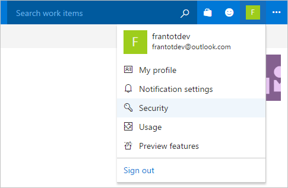
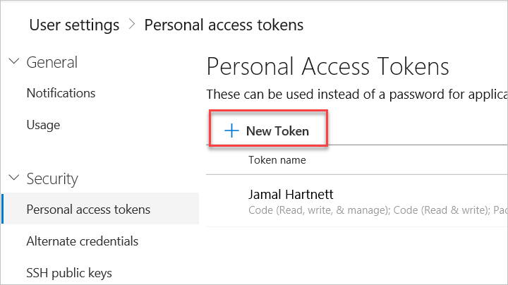
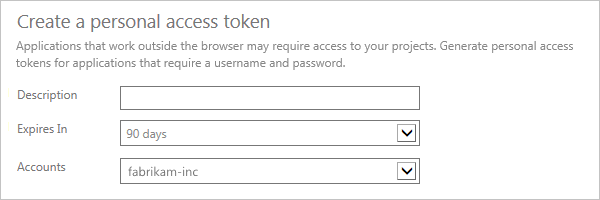

# Use Azure Artifacts as a private PowerShell repository

**Azure DevOps Services**

Azure Artifacts provides an easy way to share your PowerShell scripts and books across your entire team or company. By storing your PowerShell scripts in a private NuGet repository within Azure Artifacts, you can give members of your team the ability to download or update them quickly using the command line.

> [!NOTE]
> This guide assumes you've already set up Azure Artifacts. You can check out how to license the extension in the [License Azure Artifacts guide](../license-azure-artifacts.md).

In this tutorial, you'll learn how to use Azure Artifacts as a private PowerShell repository that your team can download and upload PowerShell modules to. You'll complete the following steps:

>[!div class="checklist"]      
> * Create a Personal Access Token (PAT) to authenticate other services with Azure DevOps Services
> * Create a feed within Azure Artifacts that will be used to store your PowerShell modules
> * Create, package, and send a PowerShell module to your Azure Artifacts Feed
> * Connect to the feed from PowerShell to see and download your modules  

## Prerequisites

1. [The NuGet CLI](https://docs.microsoft.com/nuget/tools/nuget-exe-cli-reference)
2. [An Azure DevOps Services Account](https://azure.microsoft.com/en-us/services/devops/)

## Create a PAT to get command-line access to Azure DevOps Services

The first step is to create a PAT through the Azure DevOps Services UI to authenticate your command-line with the service.

1. Head to your organization in Azure DevOps Services: `https://dev.azure.com/<org_name>`

2. From your home page, open your profile. Go to your security details:

    

3. Create a personal access token.

   

4.  Name your token. Select a lifespan for your token.

	If you have more than one organization, you can also select the organization where you want to use the token.

    

5.  Select the [scopes](/azure/devops/integrate/get-started/authentication/oauth#scopes) that this token will authorize for *your specific tasks*.

    For this tutorial, you will only need **Packaging: Read, write & manage** permissions, but you may want to add more if you'd like to use this token for other tasks.

6. When you're done, make sure to *copy the token*, as this value will only be shown once. You'll use this token as your password, you can choose to store this value in whatever manner you prefer, but it should be treated as safely as a password. **You will need this value later in the tutorial**.

> If you like, you can [learn more about using PATs to authenticate in Azure DevOps Services](/azure/devops/organizations/accounts/use-persona-access-tokens-to-authenticaate).

## Create the feed

A feed is a central repository that can store multiple packages of different types. We will need to create a feed in order to store packages, which will be PowerShell Modules in this scenario.

1. Navigate to **Azure Artifacts** from your organization.

2. On your first visit to **Azure Artifacts**, you'll be welcomed with an image telling you to create a new feed, click _+ New feed_. If you already have feeds in **Azure Artifacts**, simply click _+ New feed_ near the top of the UI.

3. In the dialog:
    * **Name**: Give the feed a name.
    * **Visibility**: Choose who can use your feed. The options are either: all people in your organization or, only you. Choose People in your organization for this scenario.
    * **Packages from public sources**: This is for enabling upstream sources like NuGet or NPM registries, this option is not applicable in this scenario, you can keep the default choice.
    
4. Click _Create_. 

Now that you have the feed created that will act as your PowerShell repository, let's create and package a PowerShell module to store.

## Creating, packaging, and sending a module

These next steps will be using a simple `Get-Hello` script that simply writes “Hello from my Azure DevOps Services Package.” If you are unfamiliar with PowerShell, the below code will get you what you want. 

### Create the file structure

Create a folder named `Get-Hello`. Within that folder create a `Get-Hello.psm1` file:

``` 
|--- Get-Hello                     
	|--- Get-Hello.psm1     // This will become our PowerShell Module
    |--- Get-Hello.psd1     // This will become our module manifest
```

### Create and populate the PowerShell module and module manifest

1. Paste the following into your newly created `Get-Hello.psm1` file:

    ```powershell
    Function Get-Hello{
    Write-Host "Hello from my Azure DevOps Services Package."
    }
    ```

2. Create the module manifest by running the following snippet in your `Get-Hello` directory:

    ```
    New-ModuleManifest -Path .\Get-Hello.psd1
    ```

    This will write the module manifest within the file specified (`Get-Hello.psd1`).

3. Within the new `Get-Hello.psd1` file, find the _Nested Modules_ field. Within that field place the path to your `Get-Hello.psm1` file. 

    It may also be necessary when creating your own Module Manifests to define your RootModule:
    
    ```
    RootModule = 'Get-Hello.psm1'
    ```

4. The ```FunctionsToExport = @()``` section is meant to define the module's exported functions. This is simply a list of all exported functions. Take part of an example from ```PowerShellGet.psd1```:

    ```
    FunctionsToExport = @('Install-Module',
                      'Find-Module',
                      'Save-Module',
                      'Update-Module',
                      'Publish-Module', 
                      'Get-InstalledModule',
                      'Uninstall-Module',
                      'Find-Command', 
                      'Find-DscResource', 
                      'Find-RoleCapability',
                      'Install-Script',
                      'Find-Script',
                      'Save-Script',
                      'Update-Script',
                      'Publish-Script', 
                      'Get-InstalledScript',
                      'Uninstall-Script',
                      'Test-ScriptFileInfo',
                      'New-ScriptFileInfo',
                      'Update-ScriptFileInfo',
                      'Get-PSRepository',
                      'Set-PSRepository',                      
                      'Register-PSRepository',
                      'Unregister-PSRepository',
                      'Update-ModuleManifest')
    ```
    
5. It is also possible to define a list of files as part of your module. Just add this list under ```FileList=@()```. The syntax is the same as above, and the clear example from the ```PowerShellGet.psd1``` definition is:

    ```
    FileList = @('PSModule.psm1',
             'PSGet.Format.ps1xml',
             'PSGet.Resource.psd1')
   ```	     

### Package and send the module

We now have the module and the module manifest. We are ready to package it and send it to our Azure Artifacts feed.

1. Within PowerShell, run:

    ```powershell
    nuget spec Get-Hello
    ```

    The `spec` command will create a `Get-Hello.nuspec` file. This specifies the information that NuGet needs when we package our module in the next few steps. There are two key things we need to do to this file:

    * _A key part here: WE NEED THE VERSION NUMBER TO HAVE 3 PLACES. (EX: 1.0.0) and match as described below_
    * The version number on the Module Manifest and the version number on the .nuspec file _must be the same_, use `1.0.0` for this tutorial.
    * By default, if we leave the sample dependencies, NuGet will install jQuery, we should take that out. Here is a sample `Get-Hello.nuspec` file:

    ```xml
    <?xml version="1.0"?>
    <package >
      <metadata>
        <id>Get-Hello</id>
        <version>1.0.0</version>
        <authors>frantot</authors>
        <owners>frantot</owners>
        <requireLicenseAcceptance>false</requireLicenseAcceptance>
        <description>The module says hello to the user</description>
        <releaseNotes>This is the newest I know of.</releaseNotes>
        <copyright>Copyright 2019</copyright>
        <tags>Francis Totten</tags>
        <dependencies>
        </dependencies>
      </metadata>
    </package>
    ```

3. Now that the module is made and the NuGet spec file is ready to go, we need to pack it up and ship it out. Run the following commands from PowerShell:

     Package the module with the defined parameters within the `.nuspec` file:
    ```powershell
    nuget pack Get-Hello.nuspec
    ```

    Add the Azure DevOps Services repo as a source for NuGet:
    ```powershell
    nuget.exe sources Add -Name "PowershellModules" -Source "https://pkgs.dev.azure.com/<org_name>/_packaging/<feed_name>/nuget/v3/index.json"
    ```
    
    If you're still using the older ```visualstudio.com``` URLs, use this command instead:
    ```powershell
    nuget.exe sources Add -Name "PowershellModules" -Source "https://<org_name>.pkgs.visualstudio.com/_packaging/<feed_name>/nuget/v3/index.json"
    ```

    Push the file to the NuGet feed in Azure Artifacts. You will have to change the name of the `.nupkg` file:
    ```powershell
    nuget.exe push -Source "PowershellModules" -ApiKey AzureDevOpsServices Get-Hello.nupkg
    ```

After the `nuget.exe push` command, PowerShell will ask you for your credentials. The first is a username which is not tied to anything. The second is the password. You can copy and paste your Azure DevOps Services PAT from before. Upon entering your access token, our module is now able to be installed from our feed in Azure Artifacts.

## Connecting to the feed as a PowerShell repo

We now have a private repository within Azure Artifacts that we can push our PowerShell modules to and we have a module that we can install. In the next step, we will connect PowerShell to our new Azure Artifacts feed so we can publish our modules and install modules published from others on our team.

1. Open a PowerShell session as an Administrator
2. Run the following command within PowerShell. The script will create a new Powershell Repository named `PowershellAzureDevopsServices` and sets the Publish and Source Location as the links to the NuGet feed. This link can also be found by clicking on _Connect to Feed_ within the feeds page in Azure Artifacts.

    ```powershell
    Register-PSRepository -Name "PowershellAzureDevopsServices" -SourceLocation "https://pkgs.dev.azure.com/<org_name>/_packaging/<feed_name>/nuget/v2" -PublishLocation "https://pkgs.dev.azure.com/<org_name>/_packaging/<feed_name>/nuget/v2" -InstallationPolicy Trusted
    ```
    
    > **NOTE:** You will notice above that the Publish and Source location both reference Version 2 of NuGet. PowerShell does not support Version 3 of NuGet.
    
    If you're still using the older ```visualstudio.com``` URLs, use this command instead:

    ```powershell
    Register-PSRepository -Name "PowershellAzureDevopsServices" -SourceLocation "https://<org_name>.pkgs.visualstudio.com/_packaging/<feed_name>/nuget/v2" -PublishLocation "https://<org_name>.pkgs.visualstudio.com/_packaging/<feed_name>/nuget/v2" -InstallationPolicy Trusted
    ```

3. We can confirm we have a repository by running:

    ```powershell
    Get-PSRepository
    ```

4. We now have a personal repository set up, but we will need credentials to be able to access it. Within PowerShell, run the following to take in your Personal access token and then use it within a PSCredential object which we will use to securely access our new feed.

    ```powershell
    $password = ConvertTo-SecureString 'YOUR PERSONAL ACCESS TOKEN FROM THE CREATING THE PIPELINE STEP' -AsPlainText -Force
    ```
    ```powershell
    $credsAzureDevopsServices = New-Object System.Management.Automation.PSCredential 'YOUR EMAIL FOR AZURE DEVOPS SERVICES', $password
    ```

5. Let's see what we can install from the feed by running the following:

    ```powershell
    Find-Module -Repository PowershellAzureDevopsServices -Credential $credsAzureDevopsServices
    ```

    We can see our `Get-Hello` module and install it:
    ```powershell
    Install-Module Get-Hello -Repository PowershellAzureDevopsServices -Credential $credsAzureDevopsServices
    ```

    You can check for your installed module:
    ```powershell
    Get-Module -ListAvailable Get-Hello
    ```

We now have a repository that pulls down NuGet packages with our PowerShell modules and scripts that we can have version control, access management and best of all, available to all our other developers.

## Credit

Credit to the [well-written article on Medium](https://medium.com/@jsrice7391/using-vsts-for-your-companys-private-powershell-library-e333b15d58c8) that was used as a source for this tutorial.
