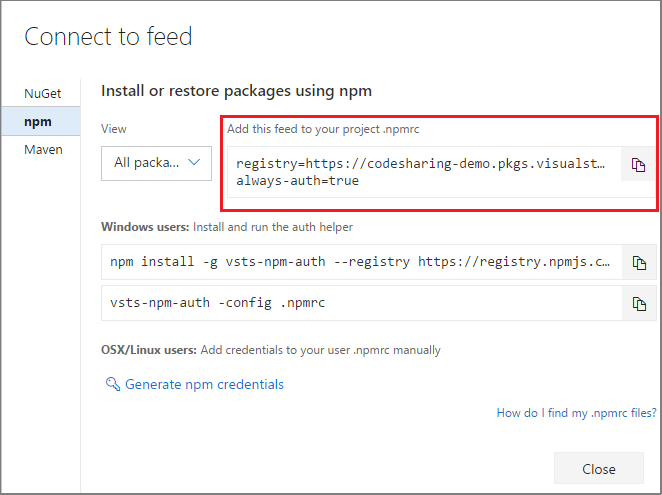

# Protect your open-source software packages with upstream sources

Upstream sources enable you to manage your product's OSS dependencies in a single feed. Using upstream sources makes it easy to use your favorite OSS packages, and can also give you additional protection against outages and corrupted or compromised packages. You can also publish private dependencies in the same feed that manages your OSS dependencies. Read all about [upstream sources and their benefits](/azure/devops/artifacts/concepts/upstream-sources).

This tutorial covers how to upgrade an existing project that uses OSS packages from public registries like nuget.org, npmjs.com, etc. to instead get those dependencies from an Azure Artifacts feed with upstream sources.

In this tutorial, you will:

>[!div class="checklist"]  
> * Create a new feed using upstream sources
> * Replace the public registry in your configuration files
> * Run an initial package restore to populate your feed
> * Check your feed to see the saved copy of everything you used from the public registry

## Create a feed with upstream sources enabled

1. Navigate to **Azure Artifacts**:

::: moniker range=">= azure-devops-2019"
    
   > [!div class="mx-imgBorder"] 
   >

::: moniker-end

::: moniker range="<= tfs-2018"
    
   

::: moniker-end

1. Select **+ New feed**:

::: moniker range=">= azure-devops-2019"
    
   > [!div class="mx-imgBorder"] 
   >

::: moniker-end

::: moniker range="<= tfs-2018"
    
   

::: moniker-end

1. In the dialog, provide a feed name and click _Create_. 

::: moniker range=">= azure-devops-2019"
    
   > [!div class="mx-imgBorder"] 
   >

::: moniker-end

::: moniker range="<= tfs-2018"
    
   

::: moniker-end

::: moniker range=">=tfs-2017 < azure-devops"

1. Navigate to the **Packages** page:

   

1. Select **+ New feed**:

   

1. In the dialog:

   - Give the feed a name.
   - Choose who can read and contribute (or update) packages in your feed.
   - Select _Use packages from public sources through this feed_
   - When you're done, choose **Create**.

   

::: moniker-end

Now that you've created the feed that we will use to store your packages, you will update your configuration files to point to the newly created feed.

## Replace the public registry in configuration files with the Azure Artifacts feed

The next step is to update your configuration file to point to the new Azure Artifacts feed instead of the public registry. There are two steps to achieve this:

1. Get your feed's URL
2. Update the configuration file with the feed URL

# [npm](#tab/npm)

::: moniker range=">= azure-devops-2019"

1. From your **Packages** page, click _Connect to Feed_

   > [!div class="mx-imgBorder"] 
   >

2. Copy the "registry" text:

   > [!div class="mx-imgBorder"] 
   >

::: moniker-end

::: moniker range="< azure-devops-2019"

1. From your **Packages** page, click _Connect to Feed_

    

2. Copy the "registry" text:

    

::: moniker-end

After you've got the feed URL, create a new text file named `.npmrc` in the root of your project (in the same folder as your `package.json` file). Open your new `.npmrc` file and paste the text that you copied in step 2 above.

# [NuGet](#tab/nuget)

[!INCLUDE [get a NuGet URL](../_shared/nuget/nuget-consume-endpoint.md)]

Now that we have the feed URL, we can add our feed as a package source by following these steps:

1. Create a new file named `nuget.config` in the root of your project.

2. Copy and paste the template below into your new `nuget.config` file:

   ```xml
       <?xml version="1.0" encoding="utf-8"?>
       <configuration>
       </configuration>
   ```

3. Run the following command with your feed name and feed URL:

   ```
   nuget sources add -Name "<feed_name>" -Source <feed_url> -configfile nuget.config
   ```

Now, we recommend a few steps to ensure that we use our feed instead of the public registry. To do so:

1. Add a `<clear />` tag to the `<packageSources>` section your `nuget.config` file, which was created in the previous step. For example:

   ```xml
   ...
   <packageSources>
   <clear />
   ...
   </packageSources>
   ```

---

## Run an initial package restore to populate your feed

Now that you have upstream packages set up, you'll need to run an initial package restore to populate your new feed with the upstream packages.

The basic steps are to clear your local package cache and then do a clean install of all the packages used by the project so that Azure Artifacts can save them from the upstream source. 

# [npm](#tab/npm)

Remove the `node_modules` folder in your project (find out more about the [node_modules folder](https://docs.npmjs.com/files/folders.html#node-modules)), and rerun:

```
npm install --force
```

> The `-force` option is to ensure the cache is bypassed. 

# [NuGet](#tab/nuget)

Clear your local package cache:

```
nuget locals --clear all
```

Then, download and install packages from the upstream sources:

```
nuget restore
```

---

The instructions above show the simplest way to populate your feed. In larger projects, you can also consider setting up a continuous integration (CI) build that has a clean cache on each build run. This build will then save any new packages from upstream sources as they're used.


## Check your feed to see the saved copy of everything you used from the public registry

Navigate to the feed you created in [Step 1](#create-a-feed-with-upstream-sources-enabled). This feed should now be populated with the packages that are used in your project. The **Source** field contains the public registry, or other upstream source, that you were using before completing this tutorial.
