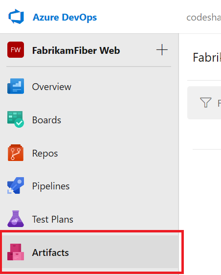
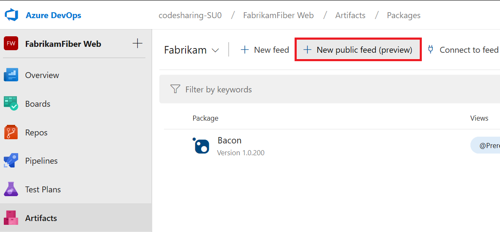
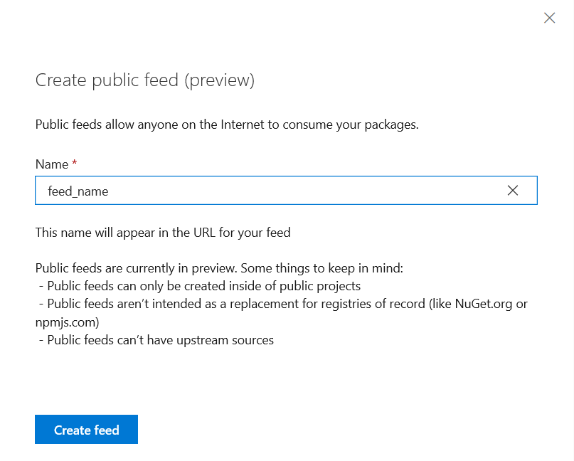
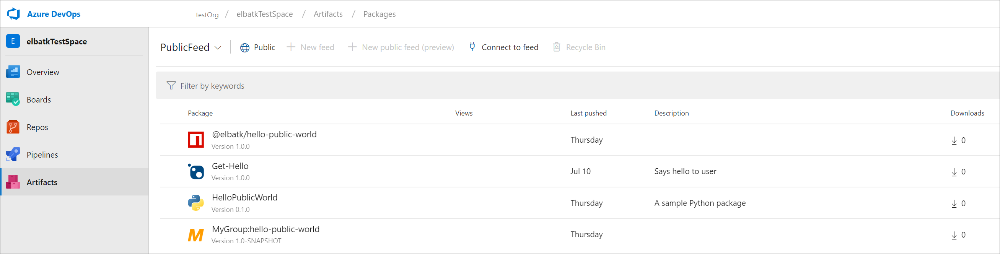

# Share your packages publicly (preview)

Azure Artifacts provides an easy way to share packages to users outside your organization using public feeds. Packages that are stored in public feeds can be restored, installed, or consumed by anyone on the Internet. 

> **Note:** Public feeds are project-scoped feeds that live inside a public project. You cannot convert an existing organization-scoped feed into a project-scoped feed or a public feed.

To learn more about feeds and their scopes, check out our [feeds documentation](../concepts/feeds.md).

## Prerequisites

* A public project. If you don't have one, [create one now](../../organizations/public/create-public-project.md)

## Create a feed

1. Go to **Azure Artifacts** in a public project:

   > [!div class="mx-imgBorder"] 
   >
   > 

1. Select **+ New public feed (preview)**:

   > [!div class="mx-imgBorder"] 
   >
   > 

1. In the dialog box:
   - Give the feed a name.
   - Select **Create feed**.

   > [!div class="mx-imgBorder"] 
   >
   >

## Publish your packages

Now that you have a public feed, it's time to populate it with packages! 

> **Note:** During the public preview, public feeds cannot store Universal Packages.

If you're publishing using NuGet or Dotnet _and_ you're using a credential provider to authenticate, public feeds require you to use the new credential provider instead of the older `CredentialProvider.VSS.exe`. You can learn more about the new credential provider, including install and setup instructions in the [artifacts-credprovider GitHub repo](https://github.com/Microsoft/artifacts-credprovider).

### From the command line

The following articles are quick guides that show you how to set up authentication and publish packages to your public feed from the command line. You can skip the "Create a feed" step in the following guides.

* [Quickstart - Push and consume NuGet packages](../get-started-nuget.md)
* [Quickstart - Push and consume npm packages](../get-started-npm.md)
* [Quickstart - Push and consume Maven packages](../get-started-maven.md)
* [Quickstart - Push and consume Python packages](../quickstarts/python-packages.md)

### From Azure Pipelines

The following articles cover publishing packages to feeds from builds within Azure Pipelines:

* [Publish NuGet packages from Azure Pipelines](../../pipelines/artifacts/nuget.md)
* [Publish npm packages from Azure Pipelines](../../pipelines/artifacts/npm.md)
* [Setting up Maven and Azure Pipelines](../../pipelines/artifacts/maven.md)
* [Publish Python packages from Azure Pipelines](../../pipelines/artifacts/pypi.md)

## Share your packages

> [!NOTE]
> Public feeds aren't intended to be a replacement for registries of record like NuGet.org or npmjs.com, and preview public feeds **cannot** have upstream sources.

To start sharing your packages, simply post or send your feed URL wherever you wish:

Sample feed URL: `https://dev.azure.com/<org_name>/<project_name>/_packaging?_a=feed&feed=<feed_name>`
 
As long as your project is public, anonymous and guest users will be greeted by the feed UX where they can see the available packages and learn how to consume them. Anonymous users will not have access to all features. E.g. Creating new feeds or accessing the recycle bin.

> [!div class="mx-imgBorder"] 
>
>

You can also [share individual packages with badges](../package-badges.md) which look like the example below. 

