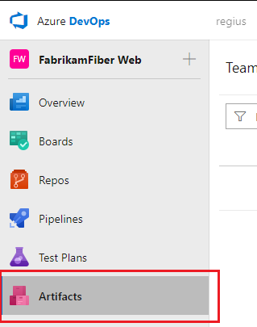

# Package Management is now Azure Artifacts

**Azure DevOps Services**

Recently, Azure DevOps Services (previously Visual Studio Team Services) underwent a big UI update. This update moved many popular hubs around, including the old **Packages** hub in the **Build and Release** hub group. As you may know already, the **Build and Release** hub group has become **Azure Pipelines**, and the previous **Packages** hub has been moved out to its own area known as **Azure Artifacts**.

## How to find your packages in Azure DevOps Services

Before the UI update, your Package Management home was in the **Packages** hub of the **Build and Release** hub group. You would navigate to it like so:

> If you're still using the previous navigation, or TFS, this is still how you would access your packages. 

The new update has introduced a new, top-level area that is the home of Package Management in Azure DevOps Services. This area is known as **Azure Artifacts** and can be reached simply by clicking on the _Artifacts_ button on the left of the UI:

