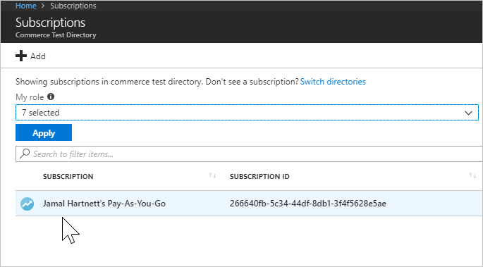
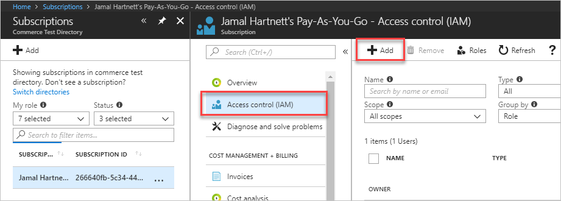
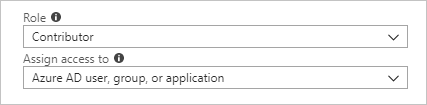
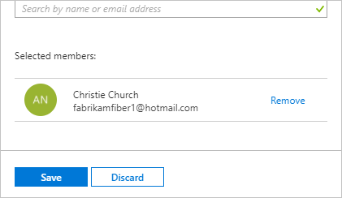

[//]: # (monikerRange: 'vsts')

# Add a user to make purchases for your VSTS account

**VSTS**

To let another user manage billing or make purchases through Visual Studio Marketplace for your VSTS account,
add [**owner**](https://docs.microsoft.com/en-us/azure/role-based-access-control/built-in-roles#owner), [**contributor**](https://docs.microsoft.com/en-us/azure/role-based-access-control/built-in-roles#contributor), [**service admin**](https://docs.microsoft.com/en-us/azure/billing/billing-add-change-azure-subscription-administrator#change-the-service-administrator-for-an-azure-subscription), or [**co-admin**](https://docs.microsoft.com/en-us/azure/billing/billing-add-change-azure-subscription-administrator#add-or-change-co-administrator) roles to users in the Azure subscription that's linked to your VSTS account.

1. [Sign in to the Azure portal](https://portal.azure.com/) as the Azure subscription administrator.

2. Enter *subscriptions* into the search box, select **Subscriptions** from the dropdown menu, and if there are more than one, choose the subscription to modify.

   

3. Choose **Access control (IAM)** and then **Add**.

   

4. From the dropdown menus, select the *role* to add members to and select an *assignment* type.

   

5. Select a user or group by entering their *name* or *email* (select a device by entering its *name*).

   

6. If your update is complete, choose **Save**.

A backup billing manager is added to your VSTS account.

>[!Note]
>If you're giving access to a user who isn't already in your directory, this user must accept their invitation, received via email, before they have access to the Azure subscription.

## Related articles

* [Set up billing](set-up-billing-for-your-account-vs.md)
* [Change the Azure subscription for billing](change-azure-subscription.md)
* [VSTS pricing](https://azure.microsoft.com/pricing/details/visual-studio-team-services/)
* [VSTS billing support](https://www.visualstudio.com/team-services/support/)