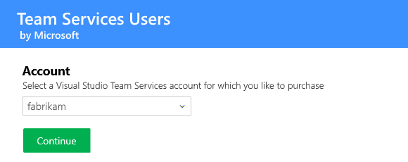
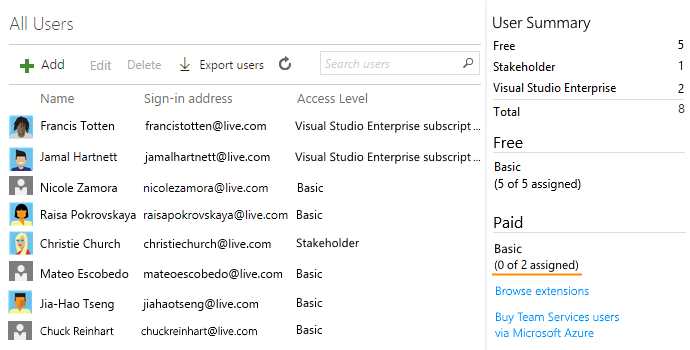

# Pay for VSTS users

**VSTS**

You only need to pay for users in your VSTS account when your team size exceeds the free limits. It's free to add users who have a 
[Visual Studio subscription](https://www.visualstudio.com/team-services/pricing/), plus you get 5 additional users free in your VSTS account. 
So if you have a team of 25 people and 20 of them have Visual Studio Professional subscriptions, then you would not need to pay for any VSTS users in your account.

When you reach the point where you exceed these free limits, you can [pay for additional VSTS users](https://marketplace.visualstudio.com/items?itemName=ms.vss-vstsuser) 
in whatever quantity you need. There are no required tiers--so if you only need to pay for 1 user, you can pay for 1 user. If you need 27, you pay for 27. 
When you pay for VSTS users, this increases the total number of users you can add as members in your account, adding to the free limits mentioned above. By paying for 
these additional VSTS users, you can then [add more team members to your VSTS account](../accounts/add-account-users-from-user-hub.md).

Your team members--whether they're Visual Studio subscribers, or are among the 5 free or the paid VSTS users--can use a comprehensive set of features in your VSTS account including 
version control, tools for Agile, Java, build, release management, and more. For a list of features included, see our 
[feature comparison](https://www.visualstudio.com/team-services/compare-features/).

## Prerequisites

*	To manage purchases, you'll need VSTS 
[project collection administrator or account owner permissions](faq-pay-for-basic-users.md#FindOwnerPCA).

*	You'll need an Azure subscription 
that you can link to your VSTS account for billing, 
if your VSTS account isn't linked already. 
[Which Azure subscriptions can I use?](faq-pay-for-basic-users.md#EligibleAzureSubscriptions)

>[!NOTE]
> To use an existing Azure subscription for billing, 
	you'll need at least co-administrator permissions for that subscription. 
	If you don't have permissions, 
	have an Azure Account Administrator or Service Administrator 
	[add you as a co-administrator to the Azure subscription that you want to use for billing](add-backup-billing-managers.md).
>
>	If you don't have an Azure subscription, 
	you can create a subscription when you start your purchase. 
	Or [create your Azure subscription here before you start](https://portal.azure.com). 
	You'll get the necessary administrator permissions 
	with your new subscription. 
>
>	Your VSTS account will reuse this Azure subscription 
	when you make future purchases for your VSTS account 
	via the [Visual Studio Marketplace](https://marketplace.visualstudio.com) 
	or the Azure portal. 

## Increase the number of paid VSTS users on your account

0.	As VSTS project collection administrator or account owner, 
sign in to [**Visual Studio Marketplace** > **Other** > **VSTS Users**](https://marketplace.visualstudio.com/items?itemName=ms.vss-vstsuser), 
and choose **Buy**.

	

0.  Select your VSTS account, 
if you have multiple accounts.

	

	
<a data-toggle="collapse" href="#expando-why-no-ts-account">Don't see your VSTS accounts? &#x25BC;</a>

	

	
To select your VSTS account here, you must have VSTS 
	[project collection administrator or account owner permissions](faq-pay-for-basic-users.md#FindOwnerPCA).	
	

0.	Confirm the Azure subscription, where your VSTS charges will be billed. 

	If you have multiple Azure subscriptions, 
	select the Azure subscription that you want to use.
	Or if you don't have an Azure subscription, 
	you can create a new one. 
	
	

	
<a data-toggle="collapse" href="#expando-why-no-azure-sub">Don't see the Azure subscription that you expect? &#x25BC;</a>

	

	
To use an existing Azure subscription for billing, 
	you'll need at least co-administrator permissions for that subscription. 
	If you don't have permissions, 
	have an Azure Account Administrator or Service Administrator 
	[add you as a Co-administrator to the linked Azure subscription](add-backup-billing-managers.md).
	

0.	Enter the number of paid VSTS users. You will also see the number of free users included, which is separate.

	

0.	Now go to your VSTS account, and 
[add new users](../accounts/add-account-users-assign-access-levels.md). 

	

	The number of users who you can assign paid Basic access appears here.

	

	Your user summary shows only the number of users with access levels assigned to them.

## Related information

- [Reduce or cancel paid VSTS users](reduce-cancel-paid-vsts-users.md)
- [Add more team members to your VSTS account](../accounts/add-account-users-from-user-hub.md)
- [Pay for TFS users](buy-access-tfs-test-hub.md)
- [Set up billing](set-up-billing-for-your-account-vs.md)
- [Add backup billing managers](add-backup-billing-managers.md)
- [Change the Azure subscription for billing](change-azure-subscription.md)
- [VSTS pricing](https://azure.microsoft.com/pricing/details/visual-studio-team-services/)
- [VSTS billing support](https://www.visualstudio.com/team-services/support/)