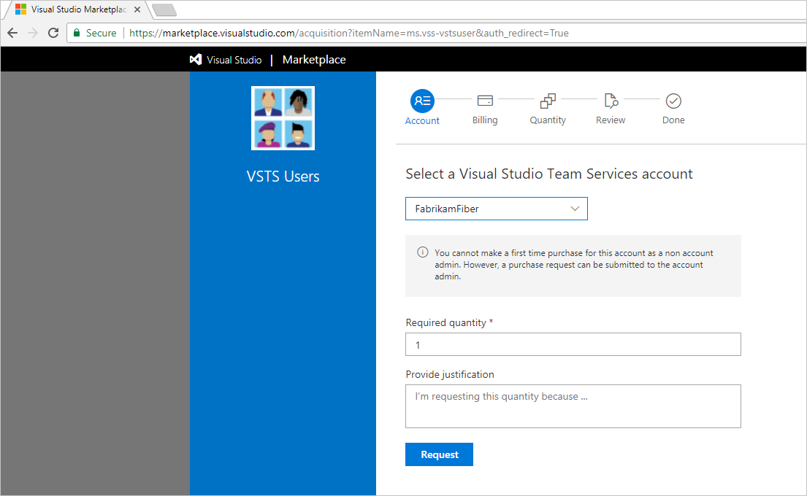
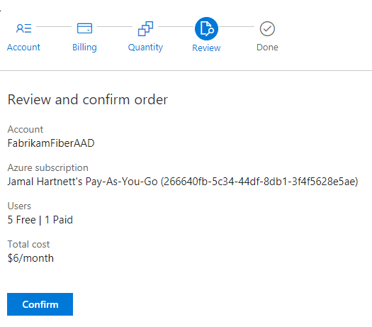
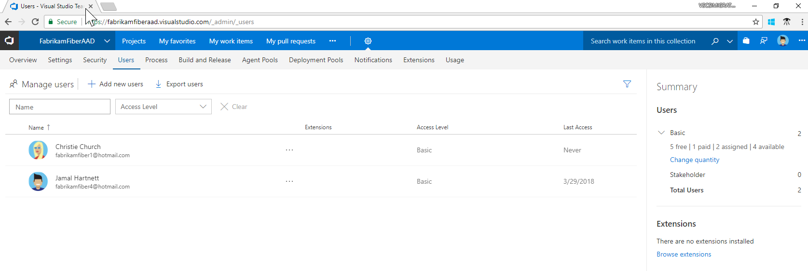

[//]: # (monikerRange: 'vsts')

# Quickstart: Pay for VSTS users (Basic)

**VSTS**

In this quickstart, you'll learn how to pay for more users in your VSTS account. You only need to pay for users when your team size exceeds the free limits. It's free to add users who have a [Visual Studio subscription](https://www.visualstudio.com/team-services/pricing/), plus you get 5 additional users free in your VSTS account.

[Pay for additional VSTS users](https://marketplace.visualstudio.com/items?itemName=ms.vss-vstsuser) in whatever quantity you need. When you pay for VSTS users, this increases the total number of users you can add as members in your account, adding to the free limits mentioned above.

For a list of features included, see our
[feature comparison](https://www.visualstudio.com/team-services/compare-features/).

If you don't have an Azure subscription, create a [free account](https://azure.microsoft.com/en-us/free/?WT.mc_id=A261C142F) before you begin.

## Prerequisites

The first time that you set up billing for your VSTS account - whether you do this via the Azure portal or as part of making a purchase in the Visual Studio Marketplace, you will need:

* [VSTS project collection administrator (PCA) or account owner permissions](../accounts/faq-add-delete-users.md#find-owner) - if you aren't a PCA or account owner, you'll be prompted to send a purchase request to the admins for your VSTS account.

   > [!div class="mx-imgBorder"]

* [The **owner** or **contributor** role on your Azure subscription](add-backup-billing-managers.md)

To make subsequent edits to paid quantities in your VSTS account, you only need the owner or contributor role on your Azure subscription.

## Increase the number of paid VSTS users on your account

1. Sign in to [**Visual Studio Marketplace** > **Other** > **VSTS Users**](https://marketplace.visualstudio.com/items?itemName=ms.vss-vstsuser), and choose **Get**.

   > [!div class="mx-imgBorder"]

2. Select your VSTS account, if you have multiple accounts, and then choose **Buy**.

   > [!div class="mx-imgBorder"]

3. Confirm the Azure subscription, where your VSTS charges will be billed, and then choose **Continue**.

   If you have multiple Azure subscriptions, select the Azure subscription that you want to use. Or if you don't have an Azure subscription, you can create a new one.

   > [!div class="mx-imgBorder"]

4. Enter the number of paid VSTS users and then choose **Continue**. You will also see the number of free users included, which is separate.

   > [!div class="mx-imgBorder"]

5. Review your order, and then choose **Confirm**.

   > [!div class="mx-imgBorder"]

6. Choose **Manage users** to go to your VSTS account and [add new users](../accounts/add-account-users-from-user-hub.md).

The number of users to whom you can assign Basic appears on the right side of your screen.

   > [!div class="mx-imgBorder"]

## Clean up resources

To remove users or make an adjustment, sign in to VSTS, choose **Manage users**, and then choose **Change quantity**.

## Next steps

> [!div class="nextstepaction"]
> [Buy CI/CD](https://docs.microsoft.com/en-us/vsts/billing/buy-more-build-vs?view=vsts)

## Related articles

* [Reduce or cancel paid VSTS users](reduce-cancel-paid-vsts-users.md)
