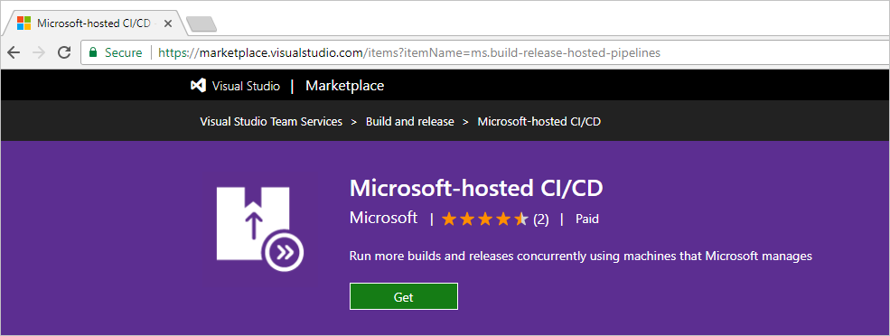
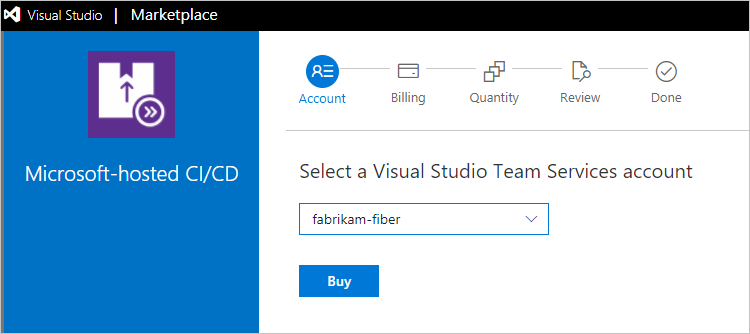
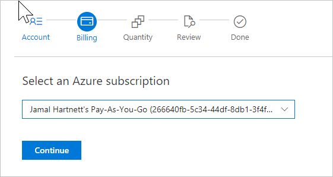
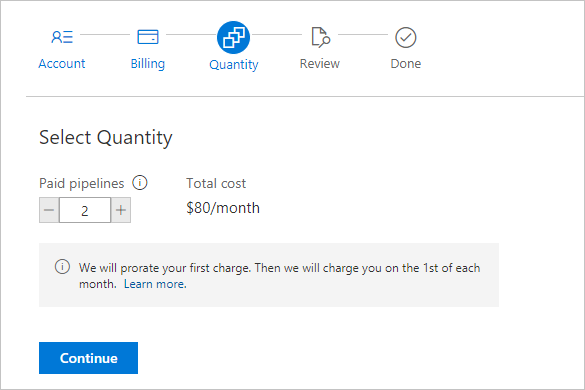
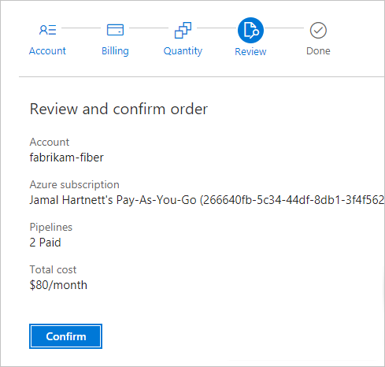
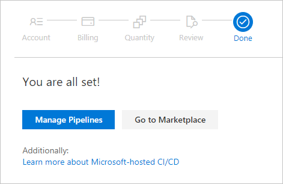
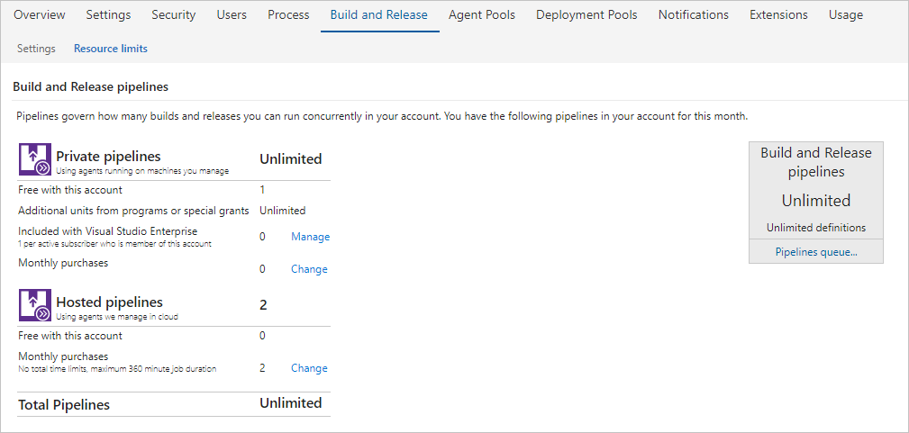

[//]: # (monikerRange: 'vsts')

# Quickstart: Buy CI/CD VSTS

**VSTS**

In this quickstart, you'll learn how to buy private or hosted pipelines and change your paid CI/CD capacity.

With VSTS you can run builds and deploy releases using the Microsoft-hosted CI/CD service, your own machines, or both.
We offer a **Free Tier** for each.

If you don't have an Azure subscription, create a [free account](https://azure.microsoft.com/en-us/free/?WT.mc_id=A261C142F) before you begin.

## Microsoft-hosted CI/CD (formerly Hosted Pipelines)

Each VSTS starts out with the free tier of Microsoft-hosted CI/CD, which provides the ability to run one concurrent build or release job, for up to 4 hours per month. If you need to run more than 4 hours per month, or you need to run more than one job at a time, you can switch to paid Microsoft-hosted CI/CD. When you pay per concurrent job, there are no monthly time limits for your builds and releases, and the maximum runtime for a single job is increased from 30 minutes to 6 hours. With Microsoft-hosted CI/CD, the price includes all infrastructure that Microsoft runs (virtual machines, databases, storage, egress, etc.) to deliver this service.

[Buy Microsoft-hosted CI/CD for your account](https://marketplace.visualstudio.com/items?itemName=ms.build-release-hosted-pipelines)

## Self-hosted CI/CD (formerly Private Pipelines)

VSTS also offers you a way to run a Microsoft CI/CD agent on machines that you manage, whether your machines are on premises or in the cloud. The free tier is one concurrent job.
Typically you'll choose this option when:

* there is custom software that runs in your build process which is not included in the Microsoft-hosted option above, or
* you already have a TFS build server running, and aren't ready to move your build definitions to VSTS.

[Buy self-hosted CI/CD](https://marketplace.visualstudio.com/items?itemName=ms.build-release-private-pipelines)

<a name="buy-build-release"></a>

## Prerequisites

The first time that you set up billing for your VSTS account--whether you do this via the Azure portal or as part of making a purchase in the Visual Studio Marketplace, you will need:

* [VSTS project collection administrator or account owner permissions](vsts-billing-faq.md#find-owner)
* [The **owner** or **contributor** role on your Azure subscription](add-backup-billing-managers.md)

To make subsequent edits to paid quantities in your VSTS account, you only need the owner or contributor role on your Azure subscription.

## Buying process

1. As VSTS project collection administrator or account owner, sign in to either:

 * [Visual Studio Marketplace > Build and release > **Hosted pipelines for Build and Release**](https://marketplace.visualstudio.com/items?itemName=ms.build-release-hosted-pipelines)
 * [Visual Studio Marketplace > Build and release > **Private pipelines for Build and Release**](https://marketplace.visualstudio.com/items?itemName=ms.build-release-private-pipelines)

2. Choose **Get**.

    

3. Select your VSTS account, if you have multiple accounts, then choose **Buy**.

    

4. Confirm the Azure subscription that you'll use for billing (you'll only see this the first time you set up billing), then choose **Continue**.

    If you have multiple Azure subscriptions,
  select the Azure subscription that you want to use.
  Or if you don't have an Azure subscription,
  create a new subscription now to use for billing.
  [VSTS billing FAQ](vsts-billing-faq.md)

    

5. Select the number of concurrent jobs that you want to buy, then choose **Continue**.

    

6. Review your order and choose **Confirm**.

    

7. To view your current CI/CD capacity, go to your VSTS account and  choose **Manage Pipelines**.

    

     

  To return to the Build & Release hub in
  your VSTS account at any time,
  go to your VSTS account toolbar,
  then go to **Build and Release**
  (```https://{youraccount}.visualstudio.com/_admin/_buildQueue?_a=resourceLimits```).

## XAML Build

The hosted XAML build controller is no longer supported.
  Accounts created on or after April 2016 do not have access to it.
  We plan to remove the hosted XAML build controller from all accounts in the near future.

  > **Important:** If you have an account where you still need to run [XAML builds](https://msdn.microsoft.com/en-us/library/ms181709%28v=vs.120%29.aspx),
  > you should set up an [on-premises build server](https://msdn.microsoft.com/en-us/library/ms252495%28v=vs.120%29.aspx)
  > and switch to an [on-premises build controller](https://msdn.microsoft.com/en-us/library/ee330987%28v=vs.120%29.aspx) now.

<a name="change-paid-pipelines"></a>

## Clean up resources

When your team's needs for build or release capacity change, you can change the number of paid concurrent jobs.

1. Go to your VSTS account toolbar, then go to **Build and Release**(```https://{youraccount}.visualstudio.com/_admin/_buildQueue?_a=resourceLimits```).

    

2. Choose **Change** for either Microsoft-hosted or self-hosted CI/CD, which takes you to the Visual Studio Marketplace.

3. In the Visual Studio Marketplace, choose **Get**, select your VSTS account, then update your number of paid concurrent jobs and confirm.

## Next steps

> [!div class="nextstepaction"]
> [Start free trials](https://docs.microsoft.com/en-us/vsts/billing/try-additional-features-vs?view=vsts)

## Related articles

* [VSTS: CI/CD concepts](../pipelines/licensing/concurrent-jobs-vsts.md)
* [TFS: CI/CD concepts](../pipelines/licensing/concurrent-pipelines-tfs.md)
* [Pricing for VSTS CI/CD](https://visualstudio.microsoft.com/team-services/pricing)