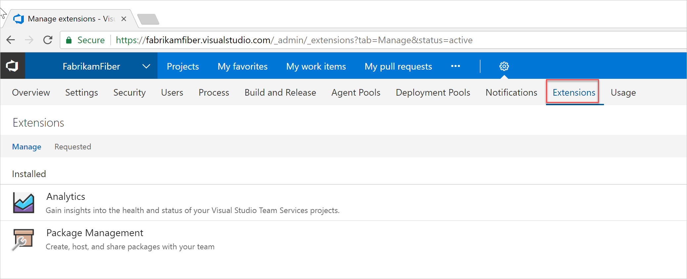
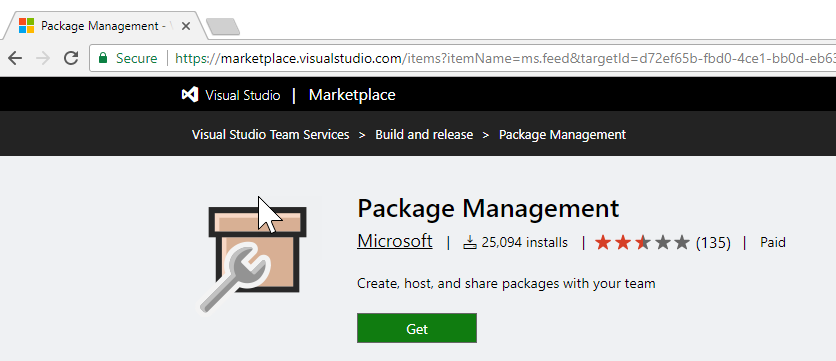

[//]: # (monikerRange: '>= tfs-2015')

# Change the number of paid users for a VSTS extension

**VSTS** | **TFS 2018** | **TFS 2017** | **TFS 2015**

To scale with your team's needs, you can increase or decrease the number of paid users for a feature or extension.

If you don't have an Azure subscription, create a [free account](https://azure.microsoft.com/en-us/free/?WT.mc_id=A261C142F) before you begin.

## Prerequisites

You'll need VSTS
[project collection administrator or account owner permissions](../accounts/faq-add-delete-users.md#find-owner).

1. Sign in to your VSTS account. (```https://{youraccount}.visualstudio.com```).

2. Go to **Extensions**, then select the extension you want to update.

   

3. Choose **Get**. You may be prompted to enter your credentials for the Marketplace.

   

4. Update the number of total paid users, then choose **Update**.

    

The number of paid extension users is updated.

> **To stop paying for an extension, [reduce the number of paid users to zero (0)](https://docs.microsoft.com/en-us/vsts/marketplace/how-to/change-paid-extension-users?view=vsts).**

## Next steps

- [Assign features or extensions to users](../marketplace/assign-paid-extensions.md)
- [Uninstall or disable extensions](https://docs.microsoft.com/en-us/vsts/marketplace/uninstall-disable-extensions?toc=%2Fvsts%2Fbilling%2Ftoc.json&bc=%2Fvsts%2Fbilling%2Fbreadcrumb%2Ftoc.json&view=vsts)

## Related articles

- [Change the Azure subscription for billing](change-azure-subscription.md)
- [VSTS pricing](https://azure.microsoft.com/pricing/details/visual-studio-team-services/)
