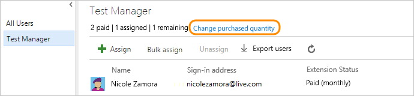

# Change number of paid extension users for VSTS

**VSTS** | **TFS 2018** | **TFS 2017** | **TFS 2015**


To scale with your team's needs, you can increase or decrease your total number of paid extension users.
You'll need VSTS 
[project collection administrator or account owner permissions](../accounts/faq-add-delete-users.md#find-owner). 

> [!IMPORTANT]
> To cancel access completely for a paid extension, 
> reduce all your paid users to zero (0). 
> [How do you bill changes in users?](../marketplace/faq-extensions.md#bill-period)

0.	Sign in to your VSTS account 
(```https://{youraccount}.visualstudio.com```).

0. Go to **Users**.

	

0.	Go to the extension pane. 
Change the number of extension users that you're paying for.

	

0.	Update your total paid extension users.

	


