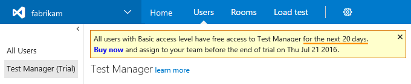

[//]: # (monikerRange: 'vsts')

# Frequently asked questions about trials for VSTS

**VSTS**

## Trial basics

### Q: Is there a VSTS account trial?

A: Rather than offering an account trial, VSTS provides an ongoing **Free Tier** of service that many customers find sufficient to try out the service: 5 VSTS users (Basic), 
5 Package Management users, Free Tier of Microsoft-hosted CI/CD (1 concurrent job, up to 4 hours per month), 1 self-hosted CI/CD concurrent job, 
and 20,000 virtual user minutes of cloud-based load testing per month. Additionally, you can do a 30-day trial of [Test Manager](https://marketplace.visualstudio.com/items/ms.vss-testmanager-web), 
[Package Management](https://marketplace.visualstudio.com/items?itemName=ms.feed), and a number of extensions offered by 
partners in the Visual Studio Marketplace.

### Q: How many times can I do a trial for Test Manager, Package Management, or paid extensions offered by partners?

A:  You can trial a feature or extension only once per account. Most trials are 30 days, and you can choose when to start the trial. Each trial is 
independent, so you could trial Test Manager this month, and then Package Management several months later.

### Q: How many users can use a feature or extension that is in trial?

A:  All users who have the Basic access level (i.e., not Stakeholders) can use Test Manager, Package Management, or extensions offered by partners 
during the trial period. There's no need to assign the feature or extension to you end users during the trial; they will be given access to it 
automatically. Some partner extensions may also be available to Stakeholders during the trial.

When the trial is over and you've chosen to purchase, you will then be able to 
[assign the feature or extension to your users](../marketplace/assign-paid-extensions.md) from within the Users hub. 

### Q: Who can start a trial?

A: You must be the VSTS [account owner or project collection administrator](vsts-billing-faq.md#find-owner)
to start a trial. If you don't have permissions, you can [request the extension](../marketplace/request-vsts-extension.md) instead.

### Q: How do I cancel my trial?

A: To stop your trial, just [uninstall the extension](../marketplace/uninstall-disable-vsts-extensions.md) from your VSTS account.

### Q: How do I check an extension's trial status?

A: Check the extension pane in your Users hub.

### Q:	What should I do when the trial is almost expired or has ended for extensions that include free users?

A:	Once a trial expires, only those users to whom the extension or feature has been assigned in the Users hub will be able to use it and you will
only be able to assign up to the number of free plus paid users included in your account. So for instance with Package Management, which includes 5 
free users, you can assign Package Management to 5 users at any time. If you buy 6 additional Package Management users, then you would be able to 
assign Package Management to 11 total users in your account.

## Related articles

- [Assign features or extensions to users](../marketplace/assign-paid-extensions.md)
- [Buy or change the number of paid users for a feature or extension](../billing/change-number-paid-extension-users.md)
- [Set up billing](set-up-billing-for-your-organization-vs.md)
- [Change the Azure subscription for billing](change-azure-subscription.md)
- [VSTS pricing](https://azure.microsoft.com/pricing/details/visual-studio-team-services/)
- [VSTS billing support](https://visualstudio.microsoft.com/team-services/support/)