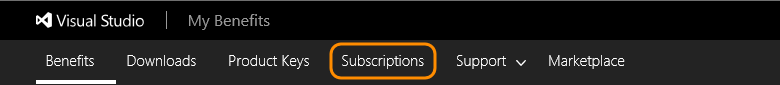

# Troubleshooting identity issues in VSTS for Visual Studio subscribers

When you activate your Visual Studio subscription, we link the identity (or login) that you used during activation with the Visual Studio subscription. This way, 
we can recognize you on the [Visual Studio subscriber portal](https://my.visualstudio.com), in VSTS, and in other experiences for subscribers. 
In VSTS, we check your Visual Studio subscription status each time you log in, and will grant you features automatically. Because these features are included 
as a subscriber benefit, it's free to add you as a member in any VSTS account when using an identity that is linked to your Visual Studio subscription.

Within the [Visual Studio subscriber portal](https://my.visualstudio.com), you may be able to add an alternate identity--in addion to the identity you used during 
activation. Today we allow you to add an alternate identity if you used a Microsoft account to activate your subscription. This way you can also add a
work or school account (which you use when logging into Visual Studio, Office 365, or your corporate or school network), allowing you to access VSTS using both 
your personal account and your work or school account.

## Steps to add an alternate identity to your Visual Studio subscription
0.	Sign in to the 
[Visual Studio subscriber portal](https://my.visualstudio.com).

	> If you're asked to choose "personal account" 
	> or "work or school account", choose "personal account" (your Microsoft account). 
	>
	> Sometimes you need to choose because your Microsoft account and your work or school 
	> account share the same email address. Although both identities use the same email address, 
	> they're still separate identities with different profiles, security settings, and permissions.
	>
	> Starting March 30, 2018 you will no longer be able to create a Microsoft account using an email 
	> that uses a domain that is managed in Azure Active Directory. You can still sign in using this 
	> email as a work account.

0.	Go to the **Subscriptions** tab.

	

0.	Under **Related Links**, go to **Add alternate account**.

	

0.	Enter your work or school account and choose **Add**.

	

0.	Use your work or school account to sign in to your VSTS account. 
There may be a slight delay for the information to propagate, so check again 15 minutes later.   (```https://{youraccount}.visualstudio.com```).

## FAQ

####Q:  Why doesn't VSTS recognize me as a Visual Studio subscriber?
When you visit the Users hub in VSTS, you can see a list of users who are members of the VSTS account and it shows details on which have been 
recognized as Visual Studio subscribers (under the access level column). If you show up with a Basic or Stakeholder access level when you use an 
identity that you know has been linked to your Visual Studio subscription then this is an error.

A:	This might happen for different reasons: 

*	You must have an active, valid, and 
[eligible Visual Studio subscription](../accounts/faq-add-delete-users.md#EligibleMSDNSubscriptions) 
that includes VSTS as a benefit.

*	If your Visual Studio subscription is valid and eligible, 
make sure you access the Visual Studio subscriber portal (```https://my.visualstudio.com```) 
before you sign in to VSTS. 

*	VSTS should automatically recognize your subscription when you sign in. 
If not, try having the VSTS account owner set 
[your access level to "Visual Studio subscriber" in the VSTS account](../accounts/add-account-users-assign-access-levels.md). 

If VSTS still doesn't recognize your subscription, try these other 
[troubleshooting tips](http://blogs.msdn.com/b/visualstudioalm/archive/2014/03/19/visual-studio-online-best-practices-troubleshooting-issues-with-the-quot-eligible-msdn-subscriber-license-type.aspx).

####Q:  Why can't I be added as a member of a VSTS account using my work or school account?

A:  Check with the VSTS account owner that they've 
[set up Azure Active Directory (Azure AD) access](../accounts/access-with-azure-ad.md) 
between the VSTS account and your organization's 
directory that manages your work or school account.
