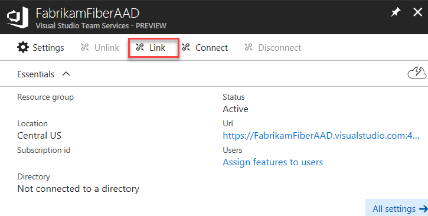

[//]: # (monikerRange: 'vsts')

#  Set up billing for your VSTS account

**VSTS**

During your first purchase for your VSTS account, we'll prompt you to select the Azure subscription to use for billing. All VSTS services are billed via Azure, and you are not required to use any other Azure services.

## Prerequisites

The first time that you set up billing for your VSTS account - whether you do this via the Azure portal or as part of making a purchase in the Visual Studio Marketplace, you will need:

* [VSTS project collection administrator or account owner permissions](../accounts/faq-add-delete-users.md#find-owner)
* [The **owner** or **contributor** role on your Azure subscription](add-backup-billing-managers.md)

To make subsequent edits to paid quantities in your VSTS account, you only need the owner or contributor role on your Azure subscription.

## Set up billing via the Azure Portal

If you'd like to set up billing for your VSTS account prior to making a purchase (because setting up billing is integrated when you make a purchase), you can set up billing from within the Azure portal.

1. [Sign in to the Azure portal](https://portal.azure.com/) as VSTS account owner and as Azure subscription co-administrator or greater.

    [Browser problems in Azure?](https://azure.microsoft.com/documentation/articles/azure-preview-portal-supported-browsers-devices/)

2. Enter *Team Services accounts* into the search box at the top of your screen and then select **Team Services accounts** in the drop-down menu.

    > [!div class="mx-imgBorder"]

3. Select your account.

   > [!div class="mx-imgBorder"]

4. Choose **Link**.

    > [!div class="mx-imgBorder"]

5. Select your Azure subscription and then choose **Link**. 

   > [!div class="mx-imgBorder"]

 After Azure sets up the link, your VSTS account appears linked to your Azure subscription.

> [!div class="mx-imgBorder"]

## Related articles

* [Add a backup billing manager](add-backup-billing-managers.md)
* [Change the Azure subscription for billing](change-azure-subscription.md)
* [VSTS pricing](https://azure.microsoft.com/pricing/details/visual-studio-team-services/)
* [VSTS billing support](https://www.visualstudio.com/team-services/support/)
