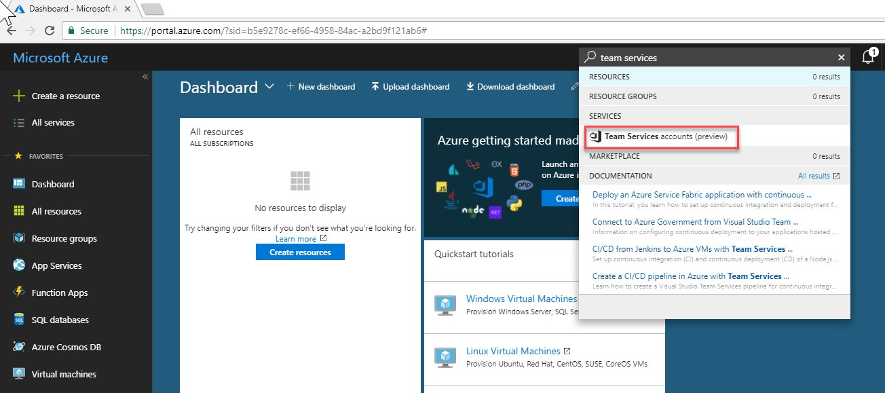
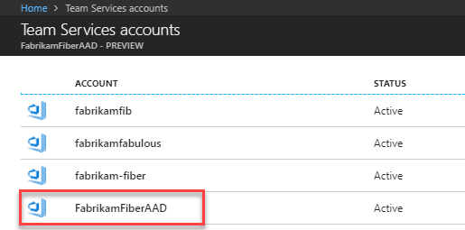
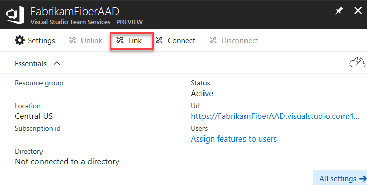
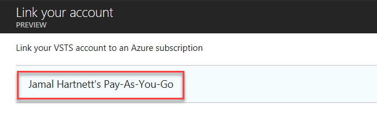
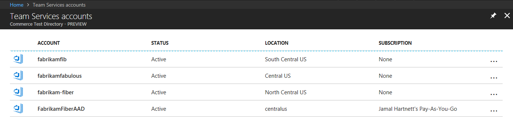

[//]: # (monikerRange: 'vsts')

# Quickstart: Set up billing for your VSTS account

**VSTS**

Make a purchase in the [Visual Studio Marketplace](https://marketplace.visualstudio.com/) to set up billing for your VSTS account. During that process we'll prompt you for an Azure subscription where charges should apply and allow you to create a new Azure subscription if you don't have one already.
This quickstart will help you set up billing for your VSTS account in advance of making purchases, so that you'll have this in place once you're ready to buy, however the preferred method is to simply make an initial purchase.

**All VSTS services are billed via Azure**, and you are not required to use any other Azure services.

If you don't have an Azure subscription, [create one](https://azure.microsoft.com/en-us/free/?WT.mc_id=A261C142F) before you begin. Please note that the Azure Free Trial is not supported.

## Prerequisites

The first time that you set up billing for your VSTS account - whether you do this via the Azure portal or as part of making a purchase in the Visual Studio Marketplace, you will need:

* [VSTS project collection administrator or account owner permissions](../organizations/accounts/faq-add-delete-users.md#find-owner)
* [An Azure subscription you can use to purchase](https://docs.microsoft.com/en-us/vsts/billing/add-backup-billing-managers?view=vsts)

To make subsequent edits to paid quantities in your VSTS account, you only need have access to purchase on the Azure subscription.

## Set up billing via the Azure Portal

If you'd like to set up billing for your account prior to buying something in the Visual Studio Marketplace, you can do so from within the Azure portal.

1. [Sign in to the Azure portal](https://portal.azure.com/) as VSTS account owner and as Azure subscription co-administrator or greater.

    [Browser problems in Azure?](https://azure.microsoft.com/documentation/articles/azure-preview-portal-supported-browsers-devices/)

2. Enter *Team Services accounts* into the search box at the top of your screen and then select **Team Services accounts** in the drop-down menu.

    > [!div class="mx-imgBorder"]

3. Select your account.

   > [!div class="mx-imgBorder"]

4. Choose **Link**.

    > [!div class="mx-imgBorder"]

5. Select your Azure subscription and then choose **Link**.

   > [!div class="mx-imgBorder"]

 After Azure sets up the link, your VSTS account appears linked to your Azure subscription.

> [!div class="mx-imgBorder"]

## Next steps

> [!div class="nextstepaction"]
> [Pay for users](buy-basic-access-add-users.md)

## Related articles

* [Billing FAQ](https://docs.microsoft.com/en-us/vsts/billing/vsts-billing-faq?view=vsts)
* [Add a backup billing manager](add-backup-billing-managers.md)
* [Change the subscription](https://docs.microsoft.com/en-us/vsts/billing/change-azure-subscription?view=vsts) for billing.
