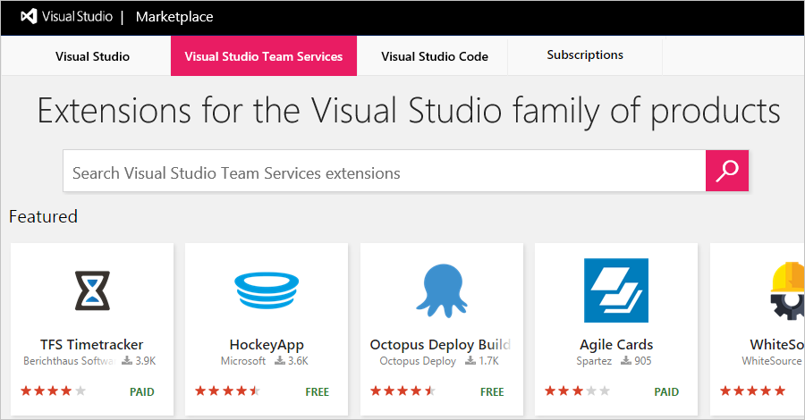
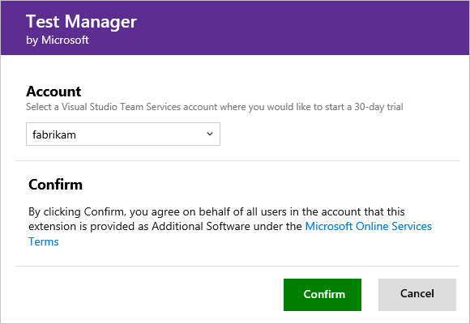
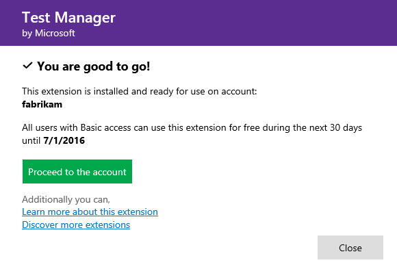

#  Free trials for paid VSTS features and extensions

**VSTS**

There are two paid features/extensions in VSTS offered by Microsoft that you can use free for a 30-day trial:
0. [Test Manager](https://marketplace.visualstudio.com/items/ms.vss-testmanager-web) (which is included on an ongoing basis for Visual Studio Enterprise, 
Visual Studio Test Professional, and MSDN Platforms subscribers)
0. [Package Management](https://marketplace.visualstudio.com/items?itemName=ms.feed) (which is included on an ongoing basis for Visual Studio Enterprise subscribers, 
plus another 5 users in your account)

During the trial, any user in your VSTS account whose access level is Basic (including Visual Studio subscribers) can use these features. 
You'll assign these features explicitly to users within the User hub once the trial ends and you choose to pay for a certain number of users on an ongoing basis.

This same process applies to paid extensions offered by other publishers within the Visual Studio Marketplace, including:
0. [Timetracker](https://marketplace.visualstudio.com/items?itemName=Berichthaus.TfsTimetracker)
0. [Agile Cards](https://marketplace.visualstudio.com/items?itemName=spartez.agile-cards)
0. [Enhanced Export PRO](https://marketplace.visualstudio.com/items?itemName=mskold.mskold-PRO-EnhancedExport)
0. [Code Quality NDepend](https://marketplace.visualstudio.com/items?itemName=ndepend.ndependextension)
0. [Backlog Essentials](https://marketplace.visualstudio.com/items?itemName=agile-extensions.backlog-essentials)

## Who can start these trials?

As the VSTS [account owner or project collection administrator](faq-billing-setup.md#find-owner), 
you can start extension trials for your VSTS account. 
Otherwise, you can 
[request extensions](/vsts/marketplace/install-vsts-extension#request) 
instead. Learn about other 
[VSTS extensions](https://marketplace.visualstudio.com/vsts).

[Can't access existing features?](faq-extension-trials.md#feature-access)

##  Start a trial for your VSTS account

0.  Sign in to the [Visual Studio Marketplace > VSTS](https://marketplace.visualstudio.com/vsts).

	

	[Why am I asked to choose between my work or school account and my personal account?](faq-extension-trials.md#ChooseOrgAcctMSAcct)

0.	Find and select a paid extension that you want to try.

	

0.  Select your VSTS account to install this extension.

	

	*	[Why don't I see any VSTS accounts?](faq-extension-trials.md#no-accounts) 
	*	[Why can't I start an extension trial for the selected account?](faq-extension-trials.md#no-permissions) 

0.	After your extension finishes installing, 
	go to your VSTS account to use your extension. 
	Let your team know that they have access too.

	

	[Need help?](faq-extension-trials.md#get-support)

##		Keep using your extension after the trial ends

Follow these steps *before* the trial ends  
to keep using your extension without disruption. 
Otherwise, your users will lose access when the trial expires. 
Charges won't start until the trial ends. 

> [!TIP]
> You only have to buy and assign extensions for users who need access. 
> Some extensions include free users. To keep access to such extensions, 
> [assign the extension up to the number of free users that you get](../marketplace/assign-paid-extensions.md). 
> For additional users who need access, 
> [buy the extension from the Visual Studio Marketplace](../marketplace/install-vsts-extension.md) 
> and [assign the extension to these users](../marketplace/assign-paid-extensions.md). 
> 
> [Learn how to modify the number of paid users of these features or extensions on your VSTS account](change-number-paid-extension-users.md).

If you lose access because the trial expires, 
just follow these steps to buy and assign the 
extension for users who need access.

0.	[Buy the extension](../marketplace/install-vsts-extension.md#install-extension) 
only for users who need access.

	To buy the extension, you can also go to the extension pane in your account.	

	

0.	[Assign the extension](../marketplace/assign-paid-extensions.md) 
only to users who need access.
