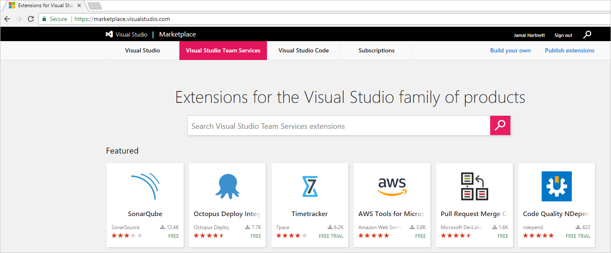

[//]: # (monikerRange: 'vsts')

# Quickstart: Start free trials for paid VSTS features and extensions

**VSTS**

In this quickstart, you'll learn how to start a trial for your VSTS account and how to keep using your extension after the trial ends.

There are two paid features in VSTS offered by Microsoft that you can use free for a 30-day trial:

- [Test Manager](https://marketplace.visualstudio.com/items/ms.vss-testmanager-web) (which is included on an ongoing basis for Visual Studio Enterprise, Visual Studio Test Professional, and MSDN Platforms subscribers)

- [Package Management](https://marketplace.visualstudio.com/items?itemName=ms.feed) (which is included on an ongoing basis for Visual Studio Enterprise subscribers, plus another 5 users in your account)

During the trial, any user in your VSTS account whose access level is Basic (including Visual Studio subscribers) can use these features.
You'll assign these features explicitly to users within the User hub once the trial ends and you choose to pay for a certain number of users on an ongoing basis.

This same process applies to paid extensions offered by other publishers within the Visual Studio Marketplace, including:

- [Timetracker](https://marketplace.visualstudio.com/items?itemName=Berichthaus.TfsTimetracker)
- [Agile Cards](https://marketplace.visualstudio.com/items?itemName=spartez.agile-cards)
- [Enhanced Export PRO](https://marketplace.visualstudio.com/items?itemName=mskold.mskold-PRO-EnhancedExport)
- [Code Quality NDepend](https://marketplace.visualstudio.com/items?itemName=ndepend.ndependextension)
- [Backlog Essentials](https://marketplace.visualstudio.com/items?itemName=agile-extensions.backlog-essentials)

If you don't have an Azure subscription, create a [free account](https://azure.microsoft.com/en-us/free/?WT.mc_id=A261C142F) before you begin.

## Prerequisites

As the VSTS [account owner or project collection administrator](vsts-billing-faq.md#find-owner), you can start trials for your VSTS account. 
All other users can [request extensions](../marketplace/install-vsts-extension.md).

## Start a trial for your VSTS account

1. Sign in to the [Visual Studio Marketplace > VSTS](https://marketplace.visualstudio.com/vsts).

    

2. Find and select a paid extension that you want to try.

    

3. Select your VSTS account to install this extension.

    

4. After your extension finishes installing, go to your VSTS account to use your extension.

    Let your team know that they have access too.

   

## Keep using your extension after the trial ends

Make sure to buy and assign the extension *before* the trial ends so that your users can continue using it without disruption. Otherwise, your users will lose access when the trial expires.
There's no penalty for buying early; charges don't start until the trial ends.

If you lose access because the trial expired before you could purchase, just buy and assign like you would if you weren't doing a trial:

1. [Buy the extension](../marketplace/install-vsts-extension.md#install-extension) for your users.

    To buy the extension, you can also go to the extension pane in your account.

    

2. [Assign the extension](../marketplace/assign-paid-extensions.md) to the users who need it.

## Clean up resources

To cancel a paid extension, you must have access to the Azure subscription that was used to buy it.

## Next steps

> [!div class="nextstepaction"]
> [Buy cloud-based load testing](buy-load-testing-vs.md)

## Related articles

- [Change the Azure subscription for billing](change-azure-subscription.md)
- [VSTS pricing](https://azure.microsoft.com/pricing/details/visual-studio-team-services/)
