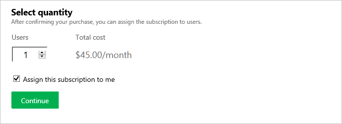
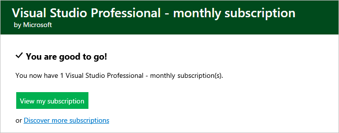
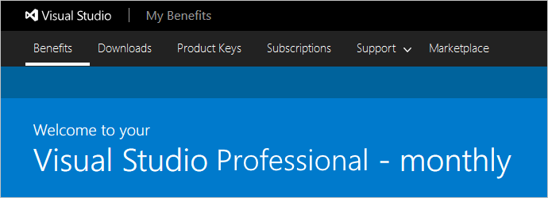
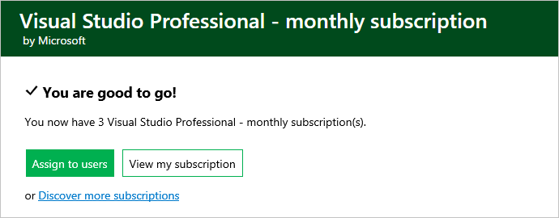

#	Buy Visual Studio Professional and Visual Studio Enterprise subscriptions

You can buy [Visual Studio Professional and Visual Studio Enterprise subscriptions](https://www.visualstudio.com/subscriptions/) 
from the [Visual Studio Marketplace](https://marketplace.visualstudio.com). 
These are what we call cloud subscriptions. [Compare cloud subscription benefits and pricing](https://www.visualstudio.com/vs/pricing/).

## Before you start

*	To bill your purchases, you'll need an [Azure subscription](https://azure.microsoft.com/en-us/pricing/purchase-options/). 
You can [sign up](https://portal.azure.com) 
before your first purchase or during your first purchase in the Visual Studio Marketplace.
Learn [which Azure subscriptions you can use for Visual Studio Marketplace purchases](../faq-azure-billing.md#billing). 

*	To sign up for your Azure subscription and buy from the Visual Studio Marketplace, 
you'll need a ["personal" Microsoft account](https://www.microsoft.com/account) 
or a ["work or school account"](https://azure.microsoft.com/en-us/documentation/articles/sign-up-organization/) 
if you're buying for your organization, and they manage identities with Azure Active Directory (Azure AD).

## Buy subscriptions

0.	Sign in to 
[Visual Studio Marketplace > Subscriptions](https://marketplace.visualstudio.com/subscriptions).

0.	Choose the subscription that you want to buy, for example:

	

0.	Select the Azure subscription to use for billing.
Or sign up for a new subscription, if you don't have one.

	

0.	Select the number of subscriptions to buy.

	

	If you don't want subscriptions assigned to yourself, clear **Assign this subscription to me**.

0.	Confirm and finish your purchase. 
To view your subscription benefits now, 
go to the Visual Studio subscriptions portal 
(```https://my.visualstudio.com```).

	

	

	Or if you purchased more than one subscription, 
	assign subscriptions to others in the 
	[Visual Studio Subscriptions Administration portal](https://manage.visualstudio.com/_apis/Home/redirect?RedirectSource=Commerce).

	

	

<a name="manage-subscriptions"></a>
##  Change the number of purchased subscriptions

To view all Visual Studio subscriptions purchased 
from the Visual Studio Marketplace and their assignments to users, 
change these subscriptions, 
or cancel these subscriptions as the subscription administrator, go to the 
[Visual Studio Subscriptions Administration portal](https://manage.visualstudio.com/_apis/Home/redirect?RedirectSource=Commerce), 
and sign in with the identity used to purchase these subscriptions.

*   To change the number of purchased subscriptions:

    

*   To cancel these subscriptions, reduce the number of subscriptions to zero (0). 
They won't renew at the end of the month.


## Marketplace and Billing Q&A

Visit [Marketplace support](../../marketplace/marketplace-billing-qa.md), 
[Visual Studio subscriptions troubleshooting](../faq-vs-subscriptions.md), or 
[Azure billing troubleshooting](../faq-azure-billing.md) to 
find answers to multiple common questions around the Visual Studio Marketplace and Azure billing. 


