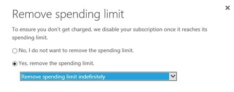
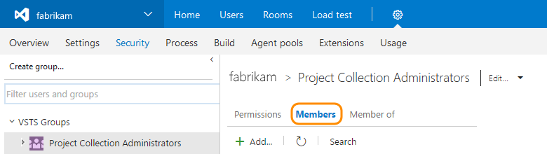
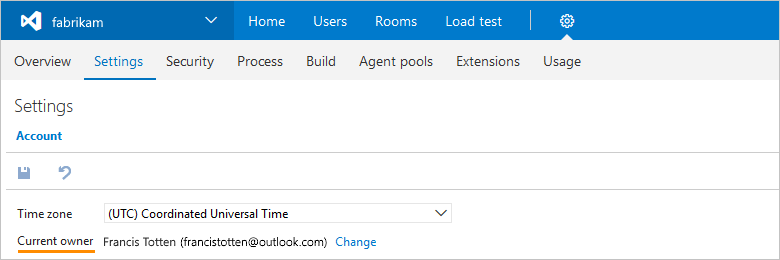

[//]: # (monikerRange: 'vsts')

# Visual Studio Team Services (VSTS) billing FAQ

Make sure to review [VSTS pricing](https://azure.microsoft.com/pricing/details/visual-studio-team-services//) and the [VSTS billing overview](overview.md) to start.

You have to set up billing when you need more than the **Free Tier** of resources in your VSTS account--5 VSTS users (Basic), 5 Package Management users, Free Tier of Microsoft-hosted CI/CD (1 concurrent job, up to 4 hours per month), 1 self-hosted CI/CD concurrent job, and 20,000 virtual user minutes of cloud-based load testing--or to buy other features for your users that are offered by Microsoft or by other companies via the [Visual Studio Marketplace](https://marketplace.visualstudio.com/).

### Q: Can I buy VSTS using a Purchase Order?

A: No. VSTS must be purchased using an Azure subscription. (Think of it as your Azure billing account.)

### Q: What types of Azure subscriptions can be used to buy VSTS?

A: Almost all Azure subscriptions can be used--we support Azure subscriptions connected to your
[Enterprise Agreement (EA)](https://azure.microsoft.com/pricing/enterprise-agreement/), Azure subscriptions set up by
Cloud Solution Providers (CSPs), Azure subscriptions set up through Microsoft Open License resellers, Pay-As-You-Go Azure subscriptions, and you can even buy using Azure subscriptions that Visual Studio subscribers set up as a subscriber benefit (but no, you can't use your monthly credit to pay for more Visual Studio subscriptions).

The only notable exclusion is that you cannot use the [Azure Free Trial](https://azure.microsoft.com/pricing/free-trial/).

### Q: Can I use the monthly Azure credits from my Visual Studio subscription to buy VSTS?

A: No, you can't use the monthly Azure credits from [Visual Studio subscriptions](https://visualstudio.microsoft.com/products/subscriber-benefits-vs)
to pay for VSTS. Before you make purchases using this type of Azure subscription, you must [remove your spending limit](https://azure.microsoft.com/pricing/spending-limits/).

> [!NOTE]
> Remove your spending limit indefinitely. This prevents disabling your Azure subscription when your recurring monthly charges are billed the next month.
> Otherwise, all resources billed to this subscription will be suspended, including virtual machines and all other workloads.

### Q: Am I required to buy other Azure services?

A: Not at all. If you only want to buy VSTS via Azure, you can do that.

### Q: Can tags be applied to Team Services Accounts from the Azure portal?

A: No, however this feature is on our backlog to add in the future.

## Enterprise Agreement (EA) customers

### Q: Can I use an Enterprise Agreement to buy VSTS?

A: Yes, you can. You'll need to be an owner or contributor for an Azure subscription that was created for your EA. Please make sure that you make your purchases for VSTS directly in the Visual Studio Marketplace. You cannot purchase VSTS using a Purchase Order. 

### Q: How can I tell whether I have the necessary privileges to buy services in the Visual Studio Marketplace through my organization's Enterprise Agreement?

A: The easiest approach to determine if you have the right privileges is to click the **Buy** button for a service offered in the Visual Studio Marketplace. You need to select an Azure subscription (which is a billing account) from a presented list of Azure subscriptions that are currently linked to your login. Because the name of the Azure subscription defaults to the type of billing account ("Pay-As-You-Go", "Enterprise Agreement", etc.), it is often clear if the Azure subscription is part of your Enterprise Agreement.

Another approach is to attempt to visit the [Azure Enterprise Portal](http://ea.azure.com).  If you can reach it successfully, then you already have either the Enterprise Admin or the Account Owner role. Only Account Owners can set up new Azure billing accounts in an Enterprise Agreement. If you cannot access the Azure Enterprise Portal, then please inquire within your organization to find out who your Enterprise Admin is, and ask that person to add you as an Account Owner within the Azure Enterprise Portal.  If you are unable to find this person, you can [submit a support ticket](http://aka.ms/AzureEntSupport) and request the contact information.  You need your organization's name and your Enterprise Agreement enrollment number for the support ticket.

### Q: Can I use the Azure Monetary Commitment funds from my Enterprise Agreement to buy VSTS?

A: Yes, you can use these prepaid funds for all VSTS services offered by Microsoft. Make sure to choose an Azure subscription that was created for your EA when you [set up billing for your VSTS account](set-up-billing-for-your-organization-vs.md).

The only exclusion is for VSTS extensions offered by partners in the Visual Studio Marketplace; these charges will appear on your next "overage" invoice. Typically this happens monthly, but due to historical rules for some EA customers, an overage invoice might not be issued for several months. Please consult a licensing specialist for your EA if you need to know what amount of additional purchases (purchases which are not eligible for Azure Monetary Commitment funds) will trigger an overage invoice.

## How charges are processed

### Q: How are user charges (VSTS User/Basic, Test Manager, and Package Management) and CI/CD concurrent job charges (for both Microsoft-hosted and self-hosted CI/CD) processed?

A: At the first purchase, we bill a prorated quantity to cover the remaining days in the current month. For instance, if a purchase of 10 Test Manager users was made on April 15, then we would charge 5 units because 50% of the month remains (15 days of a 30-day month). On the first of May, and each month thereafter until you cancel, the full 10 units will be billed.

When you increase the paid quantity later, we also prorate the increased units to cover the remaining days in the current month. So if you bought 1 more Test Manager users on May 10, we would bill roughly 0.677 units (21 days remaining in the 31-day month of May). 

### Q: How do reductions or cancellations work?

A: When you reduce or cancel user charges or CI/CD charges, you are canceling automatic renewal. The features and/or CI/CD capacity continue through the end of the current calendar month, taking effect on the fist day of the next month.

## Changes in Azure subscription status

### Q: What happens if I cancel my Azure subscription or my credit card expires?

A: When the Azure subscription used for billing on your VSTS account is not in active status--for example, because you cancel it or when the credit card used for billing expires--your VSTS account will revert to the free tier of service, but you'll keep any paid users or paid CI/CD concurrent jobs until next month.

>[!NOTE]
>You must keep your Azure subscription in good standing to avoid interruptions in paid VSTS services.

### Q:  Where can I check my bill or update billing details on my Azure subscription?

A:  If you're the owner or contributor for the Azure subscription used for billing your VSTS account, you can view your billing details on the [Azure account portal](https://account.azure.com/).

## Other questions

### Q: Why is my VSTS account already linked to an Azure subscription?

A: This happens if someone already set up billing for your VSTS account, either through the Azure portal or while purchasing something for this account via the
[Visual Studio Marketplace](https://marketplace.visualstudio.com/vsts). Each VSTS account can only use one Azure subscription for billing; charges cannot be split across multiple Azure subscriptions.

### Q:  Can I use the same Azure subscription for billing across multiple VSTS accounts?

A:  Yes, you can use the same Azure subscription for billing across multiple VSTS accounts. But you can't link a single VSTS account to multiple Azure subscriptions.

### Q: How do I find a project collection administrator?

A: You can find your [project collection administrator](../organizations/security/set-project-collection-level-permissions.md) in your VSTS account's security settings.

1. Go to your VSTS account's security settings.

   

2. Under **Security**, view your project collection administrators.

   

### Q: How do I find the account owner?

A: You can find the current owner in your VSTS account settings.

1. Go to your VSTS account settings.

    

2. Under **Settings**, find the current owner.

    

### Q: Can I buy VSTS from my software reseller?

A:  Yes you can, if your reseller participates in the Cloud Solution Provider (CSP) program. Just ask them.

## Buy VSTS now

* [VSTS users/Basic](https://marketplace.visualstudio.com/items?itemName=ms.vss-vstsuser)
* [Microsoft-hosted CI/CD](https://marketplace.visualstudio.com/items?itemName=ms.build-release-hosted-pipelines) (formerly hosted pipelines)
* [Self-hosted CI/CD](https://marketplace.visualstudio.com/items?itemName=ms.build-release-private-pipelines) (formerly private pipelines)
* [Test Manager](https://marketplace.visualstudio.com/items?itemName=ms.vss-testmanager-web)
* [Package Management](https://marketplace.visualstudio.com/items?itemName=ms.feed)

## Related articles

* [Set up billing](set-up-billing-for-your-organization-vs.md)
* [Add backup billing managers](add-backup-billing-managers.md)
* [Change the Azure subscription for billing](change-azure-subscription.md)
* [VSTS pricing](https://azure.microsoft.com/pricing/details/visual-studio-team-services/)
* [VSTS billing support](https://visualstudio.microsoft.com/team-services/support/)
