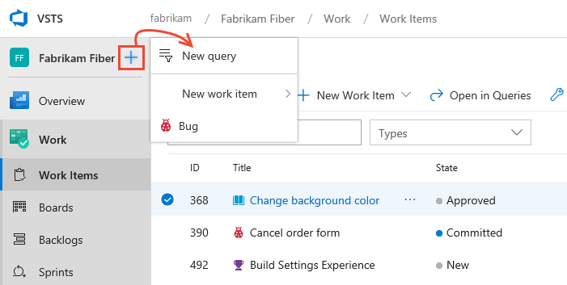
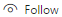
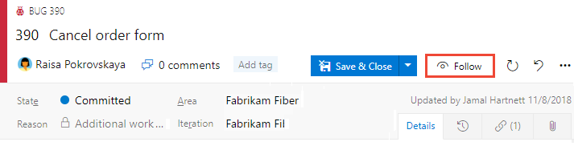
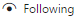

::: moniker range=">= tfs-2017"
# Add, update, and follow a work item 
::: moniker-end

::: moniker range="<= tfs-2015"
# Add and update a work item
::: moniker-end 

[!INCLUDE [temp](../_shared/version-vsts-tfs-all-versions.md)]

You add work items to plan and manage your project. You use different types of work items to track different types of work&mdash;such as user stories or product backlog items, tasks, bugs, or issues. You can describe the work to be done, assign work, track status, and coordinate efforts within your team.   

For additional clients that you can use, see [Best tools for adding, updating, and linking work items](../work-items/best-tool-add-update-link-work-items.md).

[!INCLUDE [temp](../_shared/prerequisites-work-items.md)]

<a id="define-new-work">  </a>
## Add a work item 
You can start adding work items once you connect to a project. 


# [Browser](#tab/browser) 

::: moniker range=">= azure-devops-2019"

Choose a **Boards** page&mdash;such as **Work Items**, **Boards**, or **Backlogs**. Then choose the  plus icon and select from the menu of options. 

> [!div class="mx-imgBorder"]


::: moniker-end


::: moniker range=">= tfs-2017 <= tfs-2018"

1.  From **Work**, choose the work item type from the New Work Item list of options. Here, we choose to create a User Story. 

	 

	> [!NOTE]  
	>Depending on the process chosen when the project was created&mdash;[Basic](../get-started/track-issues-tasks.md), [Agile](../work-items/guidance/agile-process.md), [Scrum](../work-items/guidance/scrum-process.md), 
	or [CMMI](../work-items/guidance/cmmi-process.md)&mdash;the types of work items you can create will differ. For example, backlog items may be called user stories (Agile), product backlog items (Scrum), or requirements (CMMI). All three are similar: they describe the customer value to deliver and the work to be performed.
	>
	> For an overview of all three processes, see [Choose a process](../work-items/guidance/choose-process.md). 
	
	Choose the  pin icon to have it show up within **Work** drop down menu. 

3. Enter a title and then save the work item. Before you can change the State from its initial default, you must save it.  

	  

	You can [add tags to any work item to filter backlogs and queries](../queries/add-tags-to-work-items.md).

	Work items you add are automatically scoped to your team's default area path and iteration path. To change the team context, see [Switch project or team focus](../../project/navigation/go-to-project-repo.md?toc=/azure/devops/boards/work-items/toc.json&bc=/azure/devops/boards/work-items/breadcrumb/toc.json).

::: moniker-end

::: moniker range="<= tfs-2015"

1. From a web browser, connect to the project that you want to work in. For example, the Fabrikam, Inc. team navigates to ```http://fabrikamprime:8080/tfs/DefaultCollection/Fabrikam%20Fiber%20Website/```.  

2. From a team home page, you can choose the type of work item you want to create.  

	  

	Work items you add are automatically scoped to your [team's area and iteration paths](../../organizations/settings/add-teams.md). To change the team context, see [Switch project or team focus](../../project/navigation/go-to-project-repo.md?toc=/azure/devops/boards/plans/toc.json&bc=/azure/devops/boards/plans/breadcrumb/toc.json)

3. Enter a title and then save the work item. Before you change the default State, you must save it.  

	  

	You can [add tags to any work item to filter backlogs and queries](../queries/add-tags-to-work-items.md).

::: moniker-end


# [Visual Studio 2019](#tab/visual-studio)

0. Open Visual Studio 2019, Team Explorer, and then choose **Work Items**. 

	> [!div class="mx-imgBorder"]  
	>  

	If you don't see the **Work Items** option, you need to connect to a project and not just a repository. From the Connect to a Project dialog. Use **CTRL-Shift** to select your options and then choose **Connect**.

	> [!div class="mx-imgBorder"]  
	> 

0. Choose **New Work Item** and select the work item type you want. 

	> [!div class="mx-imgBorder"]  
	> 

	If you work within Visual Studio 2017 or later version, a browser window will open with the work item form to fill out. If you work within Visual Studio 2015 or earlier version, a work item form opens within Visual Studio. 

---

Enter a title and then save the work item. Before you can change the State from its initial default, you must save it.  

  

You can [add tags to any work item to filter backlogs and queries](../queries/add-tags-to-work-items.md).

Work items you add are automatically scoped to your team's default area path and iteration path. To change the team context, see [Switch project or team focus](../../project/navigation/go-to-project-repo.md).

That's it! 

Create as many work items as you need of the type you need to track the work you want to manage.  


## Update work items as work progresses
As work progresses, team members can update the state and reassign it as needed. While the workflow states differ for different work item types, they usually follow a progression from New or Active to Completed or Done. 
::: moniker range=">= tfs-2017"
> [!div class="mx-imgBorder"]  
>    
::: moniker-end

::: moniker range="<= tfs-2015"
Note that the location of the State field may differ depending on the work item type you are updating. 
> [!div class="mx-imgBorder"]  
>    
::: moniker-end

::: moniker range=">= azure-devops-2019"
The following image shows the work flow states for a user story. If you want to discard a work item, change the state to Removed, or you can delete it. For details, see [Move, change, or remove a work item](remove-delete-work-items.md).  
     
::: moniker-end

::: moniker range="= tfs-2018"
The following image shows the work flow states for a user story. If you want to discard a work item, change the state to Removed, or you can delete it. For details, see [Remove or delete a work item](remove-delete-work-items.md).    

::: moniker-end

<br/>

<table>
<tbody valign="top">
<tr>
<td>
<p><b>Typical workflow progression:</b></p>
<ul>
<li>The product owner creates a user story in the **New** state with the default reason, **New user story** </li>
<li>The team updates the status to **Active** when they decide to complete the work during the sprint</li>
<li>A user story is moved to **Resolved** when the team has completed all its associated tasks and unit tests for the story pass.</li>
<li>A user story is moved to the **Closed** state when the product owner agrees that the story has been implemented according to the Acceptance Criteria and acceptance tests pass.</li>


</ul>
<p><b>Atypical transitions:</b></p>
<ul>
<li>Change the State from **Active** to **New**.</li>
<li>Change the State from **Resolved** to **Active**.</li>
<li>Change the State from **Resolved** to **New**.</li>
<li>Change the State from **Closed** to **Active**.</li>
<li>Change the State from **New** to **Removed**.</li>
<li>Change the State from **Removed** to **New**.</li>
</ul>
</td>
<td>

 
</td>
</tr>
</tbody>
</table>

Removed work items remain in the data store and can be reactivated by changing the State.   

With each update, changes are recorded in the History field which you can view through the **History** tab.  

::: moniker range=">= tfs-2017"
  
::: moniker-end

::: moniker range=">= tfs-2013 <= tfs-2015"
  
::: moniker-end

To find work items based on their history, see [History & auditing](../queries/history-and-auditing.md).  

[!INCLUDE [temp](../_shared/discussion-tip.md)] 

::: moniker range=">= tfs-2017"
## Follow a work item

When you want to track the progress of a single work item, choose the  follow icon. This signals the system to notify you when changes are made to the work item.   

> [!div class="mx-imgBorder"]  
>  

You'll only receive notifications when other members of your team modifies the work item, such as adding to the discussion, changing a field value, or adding an attachment. 

Notifications are sent to your preferred email address, which [you can change from your user profile](../../notifications/change-email-address.md).  

To stop following changes, choose the  following icon.
 
::: moniker-end

::: moniker range=">= tfs-2017 <= azure-devops-2019"

> [!IMPORTANT]
> To support the follow feature, [you must configure an SMTP server](/azure/devops/server/admin/setup-customize-alerts) in order for team members to receive notifications.  

::: moniker-end

## Try this next  

To quickly add backlog items, such as user stories, requirements or bugs, see these articles:  
> [!div class="nextstepaction"]
> [Create your backlog](create-your-backlog.md)
> [Kanban quickstart](../boards/kanban-quickstart.md) 


For descriptions of each field and work item form control, see [Work item field index](../work-items/guidance/work-item-field.md?toc=/azure/devops/boards/work-items/toc.json&bc=/azure/devops/boards/work-items/breadcrumb/toc.json ) and [Work item form controls](../work-items/work-item-form-controls.md?toc=/azure/devops/boards/work-items/toc.json&bc=/azure/devops/boards/work-items/breadcrumb/toc.json ).  


Once you've added several work items, you can use additional features to get [notified of changes](../../notifications/howto-manage-personal-notifications.md), [create queries](../queries/using-queries.md), [define status and trend charts](../../report/dashboards/charts.md), plus more.  

For additional clients that you can use to add work items, see [Clients that support tracking work items](../../user-guide/tools.md?toc=/azure/devops/boards/work-items/toc.json&bc=/azure/devops/boards/work-items/breadcrumb/toc.json).

