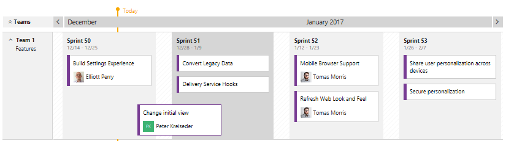

# Tasks supported by Backlogs, Boards, Taskboards, and Plans 

[!INCLUDE [version-lt-eq-azure-devops](../../includes/version-lt-eq-azure-devops.md)]

What can you do from a backlog view versus a board view? How do these tasks differ from delivery plans? How do changes you make in one show up on the other? What customizations can you make for each?

Which view should you use to work with Agile methods?  

**In a nutshell...**

-  Backlogs display work items as a list and boards display them as cards  
-  You use your product backlog to quickly plan and prioritize your work  
-  You use your sprint backlogs and taskboards when you work in Scrum   
-  You use your Kanban board to update work status and when you employ Kanban methods   
-  Each backlog is associated with a board, changes to priority order you make in one are reflected in its corresponding board  
-  Plans allow you to review the deliverables for several teams across sprints and a calendar schedule
-  Backlogs, boards, and plans are configurable for each team.  

With list backlogs, you can quickly develop your project plan, group and prioritize work, and make bulk updates on selected work items. With boards, you can quickly update status and fields displayed for each work item. 

And with plans, you can monitor progress, deliverables, and dependencies across several teams.  

## Access a backlog or board

You access your backlogs and boards from a web portal. If you work from the Stories (Agile) or Backlog items (Scrum) pages, you have access to the product backlog and Kanban board. When you work from a sprint page, you have access to the sprint backlog and taskboard. For an overview of working in Scrum or Kanban, see [What is Azure Boards?](../get-started/what-is-azure-boards.md).

::: moniker range=">= azure-devops-2019"

1. (1) Check that you've selected the right project, (2) choose **Boards>Backlogs**, and then (3) select the correct team from the team selector menu. 

	> [!div class="mx-imgBorder"]  
	> 

    To select another backlog, open the selector and then choose a different team or select the **View Backlog directory** option. Or, enter a keyword in the search box to filter the list of team backlogs for the project.

	> [!div class="mx-imgBorder"]  
	>  

	> [!TIP]    
	> Choose the :::image type="icon" source="../../media/icons/icon-favorite-star.png" border="false"::: star icon to favorite a team backlog. Favorited artifacts (:::image type="icon" source="../../media/icons/icon-favorited.png" border="false"::: favorited icon) appear at the top of the team selector list. 

1. Check that you have selected **Stories** (for Agile), **Issues** (for Basic), **Backlog items** (for Scrum), or **Requirements** (for CMMI) as the backlog level. 

	> [!div class="mx-imgBorder"]  
	>  

	[!INCLUDE [temp](../includes/note-basic-process.md)]

2. (Optional) To choose which columns should display and in what order, choose the  :::image type="icon" source="../../media/icons/actions-icon.png" border="false"::: actions icon and select **Column options**. To learn more, see [Change column options](../backlogs/set-column-options.md). 

	> [!div class="mx-imgBorder"]  
	>  

[!INCLUDE [temp](../includes/tip-configure-backlog-view.md)]

::: moniker-end

::: moniker range="< azure-devops-2019"

1. (1) Check that you've selected the right project, (2) choose **Boards>Backlogs**, and then (3) select the correct team from the team selector menu. 

	

	To choose another team, open the selector and select a different team or choose the :::image type="icon" source="../../media/icons/home-icon.png" border="false"::: **Browse all backlogs** option. Or, you can enter a keyword in the search box to filter the list of team backlogs for the project.

	> [!div class="mx-imgBorder"]  
	>  

	> [!TIP]    
	> Choose the :::image type="icon" source="../../media/icons/icon-favorite-star.png" border="false"::: star icon to favorite a team backlog. Favorited artifacts (:::image type="icon" source="../../media/icons/icon-favorited.png" border="false"::: favorited icon) appear at the top of the team selector list. 

1. Check that you have selected **Backlog items** (for Scrum), **Stories** (for Agile), or **Requirements** (for CMMI) as the backlog level. 

	> [!div class="mx-imgBorder"]  
	>  

2. (Optional) To choose which columns should display and in what order, choose the  :::image type="icon" source="../../media/icons/actions-icon.png" border="false"::: actions icon and select **Column options**. To learn more, see [Change column options](../backlogs/set-column-options.md). 

	> [!div class="mx-imgBorder"]  
	>  

::: moniker-end

::: moniker range="tfs-2018"

From your web browser, open your team's product backlog. (1) Select the team from the project/team selector, choose (2) **Work**, (3) **Backlogs**, and then (4) the product backlog, which is **Backlog items** (for Scrum), **Stories** (for Agile), or **Requirements** (for CMMI). 

> [!div class="mx-imgBorder"]
>  

To choose another team, open the project/team selector and select a different team or choose the **Browse** option. 

> [!div class="mx-imgBorder"]  
>  
	
::: moniker-end

## Three classes of backlogs, two types of boards  

To manage work, you have access to three classes of backlogs (portfolio, product, and sprint) and two types of boards (Kanban and Taskboards). Backlogs list work items, boards display work items as cards. Backlog and board views provide similar and distinct features to support planning and tracking. 

You use work items to share information, assign work to team members, track dependencies, organize work, and more. You can apply different filters to your backlogs and boards to just show those items of interest. 

[!INCLUDE [temp](../includes/note-configure-customize.md)]

### Portfolio, product, and sprint backlogs 

Portfolio backlogs typically track high-level features, scenarios, or epics. Your product backlog contains a prioritized list of user stories, deliverables, or works you plan to build or fix. Portfolio backlogs help you organize your product backlog into a hierarchy of elements. Sprint backlogs contain just those items that each team is working on during a scheduled sprint or iteration period. 

For details about working in each type of backlog, see [Create your backlog](create-your-backlog.md), [Define features and epics](define-features-epics.md), and [Sprint planning (sprint backlogs)](../sprints/assign-work-sprint.md). 

> [!TIP]  
> You can't sort a backlog by column. However, you can use the Create Query option on each backlog to create a query that you can sort on any field column you choose. To learn more about queries, see [Use the query editor to list and manage queries](../queries/using-queries.md).  

<a id="kanban-taskboards" />

### Kanban and Taskboards

Kanban and Taskboards support visualizing the flow of work and monitoring metrics to optimize that flow. Kanban boards track requirements, are sprint-independent, and you monitor the flow through the cumulative flow chart. Taskboards track tasks defined for a sprint and you monitor the flow via the sprint burndown chart. 

For details about working in each type of board, see [Kanban basics](../boards/kanban-basics.md) and [taskboard](../sprints/task-board.md). 

### Feature support across backlogs and boards

The following table indicates those elements or tasks associated with each type of backlog and board. 

::: moniker range=">= azure-devops-2019"

:::row:::
   :::column span="1":::
   **Associated element or task**
   :::column-end:::
   :::column span="1":::
   **Backlog type:**  **Portfolio**
   :::column-end:::
   :::column span="1":::
   **Backlog type:**  **Product**
   :::column-end:::
   :::column span="1":::
   **Board type:**  **Kanban**
   :::column-end:::
   :::column span="1":::
   **Backlog type:**  **Sprint**
   :::column-end:::
   :::column span="1":::
   **Board type:**  **Task**
   :::column-end:::
:::row-end:::
:::row:::
   :::column span="1":::
   Corresponding backlog or board type
   :::column-end:::
   :::column span="1":::
   Kanban
   :::column-end:::
   :::column span="1":::
   Kanban
   :::column-end:::
   :::column span="1":::
   Portfolio or product
   :::column-end:::
   :::column span="1":::
   Task
   :::column-end:::
   :::column span="1":::
   Sprint
   :::column-end:::
:::row-end:::
:::row:::
   :::column span="1":::
   Add items and child items  (see notes 1, 2)
   :::column-end:::
   :::column span="1":::
   Yes
   :::column-end:::
   :::column span="1":::
   Yes
   :::column-end:::
   :::column span="1":::
   Yes
   :::column-end:::
   :::column span="1":::
   Yes
   :::column-end:::
   :::column span="1":::
   Yes
   :::column-end:::
:::row-end:::
:::row:::
   :::column span="1":::
   Reorder items
   :::column-end:::
   :::column span="1":::
   Yes
   :::column-end:::
   :::column span="1":::
   Yes
   :::column-end:::
   :::column span="1":::
   Yes
   :::column-end:::
   :::column span="1":::
   Yes
   :::column-end:::
   :::column span="1":::
   Yes
   :::column-end:::
:::row-end:::
:::row:::
   :::column span="1":::
   Map items
   :::column-end:::
   :::column span="1":::
   Yes (except the top-level portfolio backlog)
   :::column-end:::
   :::column span="1":::
   Yes
   :::column-end:::
   :::column span="1":::
   No
   :::column-end:::
   :::column span="1":::
   No
   :::column-end:::
   :::column span="1":::
   No
   :::column-end:::
:::row-end:::
:::row:::
:::row:::
   :::column span="1":::
   Filter by keyword and select fields
   :::column-end:::
   :::column span="1":::
   Yes
   :::column-end:::
   :::column span="1":::
   Yes
   :::column-end:::
   :::column span="1":::
   Yes
   :::column-end:::
   :::column span="1":::
   Yes
   :::column-end:::
   :::column span="1":::
   Yes
   :::column-end:::
:::row-end:::
:::row:::
   :::column span="1":::
   Show/hide parents
   :::column-end:::
   :::column span="1":::
   Yes (except the top-level portfolio backlog)
   :::column-end:::
   :::column span="1":::
   Yes
   :::column-end:::
   :::column span="1":::
   No
   :::column-end:::
   :::column span="1":::
   No
   :::column-end:::
   :::column span="1":::
   No
   :::column-end:::
:::row-end:::
:::row:::
   :::column span="1":::
   Show/hide in progress items  (see note 3)
   :::column-end:::
   :::column span="1":::
   Yes
   :::column-end:::
   :::column span="1":::
   Yes
   :::column-end:::
   :::column span="1":::
   No
   :::column-end:::
   :::column span="1":::
   No
   :::column-end:::
   :::column span="1":::
   No
   :::column-end:::
:::row-end:::
:::row:::
   :::column span="1":::
   Forecast
   :::column-end:::
   :::column span="1":::
   No
   :::column-end:::
   :::column span="1":::
   Yes
   :::column-end:::
   :::column span="1":::
   No
   :::column-end:::
   :::column span="1":::
   No
   :::column-end:::
   :::column span="1":::
   No
   :::column-end:::
:::row-end:::
:::row:::
   :::column span="1":::
   Customize: show bugs (see note 1)
   :::column-end:::
   :::column span="1":::
   No 
   :::column-end:::
   :::column span="1":::
   Yes 
   :::column-end:::
   :::column span="1":::
   Yes 
   :::column-end:::
   :::column span="1":::
   Yes 
   :::column-end:::
   :::column span="1":::
   Yes 
   :::column-end:::
:::row-end:::
:::row:::
   :::column span="1":::
   Configure: Columns
   :::column-end:::
   :::column span="1":::
   Yes, see [Column options](set-column-options.md)
   :::column-end:::
   :::column span="1":::
   Yes, see [Column options](set-column-options.md)
   :::column-end:::
   :::column span="1":::
   Yes, see [Add columns](../boards/add-columns.md)
   :::column-end:::
   :::column span="1":::
   Yes, see [Column options](set-column-options.md)
   :::column-end:::
   :::column span="1":::
   Yes, see [Customize Taskboard](../sprints/customize-taskboard.md)
   :::column-end:::
:::row-end:::
:::row:::
   :::column span="1":::
   Display rollup progress, counts, or totals
   :::column-end:::
   :::column span="1":::
   Yes, see [Display rollup](display-rollup.md) 
   :::column-end:::
   :::column span="1":::
   Yes, see [Display rollup](display-rollup.md)
   :::column-end:::
   :::column span="1":::
   No
   :::column-end:::
   :::column span="1":::
   No
   :::column-end:::
   :::column span="1":::
   No
   :::column-end:::
:::row-end:::
:::row:::
   :::column span="1":::
   Customize: Add more backlog or board views 
   :::column-end:::
   :::column span="1":::
   Yes, see [Select backlog navigation levels](../../organizations/settings/select-backlog-navigation-levels.md)
   :::column-end:::
   :::column span="1":::
   Yes, when you add another team (see note 4)
   :::column-end:::
   :::column span="1":::
   Yes, see [Select backlog navigation levels](../../organizations/settings/select-backlog-navigation-levels.md)
   :::column-end:::
   :::column span="1":::
   Yes, see [Schedule sprints](../sprints/define-sprints.md)
   :::column-end:::
   :::column span="1":::
   Yes, see [Schedule sprints](../sprints/define-sprints.md)
   :::column-end:::
:::row-end:::
:::row:::
   :::column span="1":::
   Customize cards
   :::column-end:::
   :::column span="1":::
   n/a
   :::column-end:::
   :::column span="1":::
   n/a
   :::column-end:::
   :::column span="1":::
   [Customize: cards](../../boards/boards/customize-cards.md)
   :::column-end:::
   :::column span="1":::
   n/a
   :::column-end:::
   :::column span="1":::
   [Customize Taskboard](../sprints/customize-taskboard.md)
   :::column-end:::
:::row-end:::
:::row:::
   :::column span="1":::
   In-context reports 
   :::column-end:::
   :::column span="1":::
   [Cumulative flow](../../report/dashboards/cumulative-flow.md)  [Velocity](../../report/dashboards/team-velocity.md)
   :::column-end:::
   :::column span="1":::
   [Cumulative flow](../../report/dashboards/cumulative-flow.md)  [Velocity](../../report/dashboards/team-velocity.md)
   :::column-end:::
   :::column span="1":::
   [Cumulative flow](../../report/dashboards/cumulative-flow.md)  [Velocity](../../report/dashboards/team-velocity.md)
   :::column-end:::
   :::column span="1":::
   [Sprint burndown](../../report/dashboards/configure-sprint-burndown.md) 
   :::column-end:::
   :::column span="1":::
   [Sprint burndown](../../report/dashboards/configure-sprint-burndown.md) 
   :::column-end:::
:::row-end:::
:::row:::
   :::column span="1":::
   Duration (see note 5) 
   :::column-end:::
   :::column span="1":::
   Project or release
   :::column-end:::
   :::column span="1":::
   Project
   :::column-end:::
   :::column span="1":::
   Project
   :::column-end:::
   :::column span="1":::
   Sprint
   :::column-end:::
   :::column span="1":::
   Sprint
   :::column-end:::
:::row-end:::

::: moniker-end

::: moniker range="tfs-2018"

:::row:::
   :::column span="1":::
   **Associated element or task**
   :::column-end:::
   :::column span="1":::
   **Backlog type:**  **Portfolio**
   :::column-end:::
   :::column span="1":::
   **Backlog type:**  **Product**
   :::column-end:::
   :::column span="1":::
   **Board type:**  **Kanban**
   :::column-end:::
   :::column span="1":::
   **Backlog type:**  **Sprint**
   :::column-end:::
   :::column span="1":::
   **Board type:**  **Task**
   :::column-end:::
:::row-end:::
:::row:::
   :::column span="1":::
   Corresponding backlog or board type
   :::column-end:::
   :::column span="1":::
   Kanban
   :::column-end:::
   :::column span="1":::
   Kanban
   :::column-end:::
   :::column span="1":::
   Portfolio or product
   :::column-end:::
   :::column span="1":::
   Task
   :::column-end:::
   :::column span="1":::
   Sprint
   :::column-end:::
:::row-end:::
:::row:::
   :::column span="1":::
   Add items and child items  (see notes 1, 2)
   :::column-end:::
   :::column span="1":::
   Yes
   :::column-end:::
   :::column span="1":::
   Yes
   :::column-end:::
   :::column span="1":::
   Yes
   :::column-end:::
   :::column span="1":::
   Yes
   :::column-end:::
   :::column span="1":::
   Yes
   :::column-end:::
:::row-end:::
:::row:::
   :::column span="1":::
   Reorder items
   :::column-end:::
   :::column span="1":::
   Yes
   :::column-end:::
   :::column span="1":::
   Yes
   :::column-end:::
   :::column span="1":::
   Yes
   :::column-end:::
   :::column span="1":::
   Yes
   :::column-end:::
   :::column span="1":::
   Yes
   :::column-end:::
:::row-end:::
:::row:::
   :::column span="1":::
   Map items
   :::column-end:::
   :::column span="1":::
   Yes (except the top-level portfolio backlog)
   :::column-end:::
   :::column span="1":::
   Yes
   :::column-end:::
   :::column span="1":::
   No
   :::column-end:::
   :::column span="1":::
   No
   :::column-end:::
   :::column span="1":::
   No
   :::column-end:::
:::row-end:::
:::row:::
   :::column span="1":::
   Filter
   :::column-end:::
   :::column span="1":::
   Text or tags
   :::column-end:::
   :::column span="1":::
   Text or tags
   :::column-end:::
   :::column span="1":::
   Text or select fields
   :::column-end:::
   :::column span="1":::
   Text
   :::column-end:::
   :::column span="1":::
   Backlog items or people
   :::column-end:::
:::row-end:::
:::row:::
   :::column span="1":::
   Show/hide parents
   :::column-end:::
   :::column span="1":::
   Yes (except the top-level portfolio backlog)
   :::column-end:::
   :::column span="1":::
   Yes
   :::column-end:::
   :::column span="1":::
   No
   :::column-end:::
   :::column span="1":::
   No
   :::column-end:::
   :::column span="1":::
   No
   :::column-end:::
:::row-end:::
:::row:::
   :::column span="1":::
   Show/hide in progress items  (see note 3)
   :::column-end:::
   :::column span="1":::
   Yes
   :::column-end:::
   :::column span="1":::
   Yes
   :::column-end:::
   :::column span="1":::
   No
   :::column-end:::
   :::column span="1":::
   No
   :::column-end:::
   :::column span="1":::
   No
   :::column-end:::
:::row-end:::
:::row:::
   :::column span="1":::
   Forecast
   :::column-end:::
   :::column span="1":::
   No
   :::column-end:::
   :::column span="1":::
   Yes
   :::column-end:::
   :::column span="1":::
   No
   :::column-end:::
   :::column span="1":::
   No
   :::column-end:::
   :::column span="1":::
   No
   :::column-end:::
:::row-end:::
:::row:::
   :::column span="1":::
   Customize: show bugs (see note 1)
   :::column-end:::
   :::column span="1":::
   No 
   :::column-end:::
   :::column span="1":::
   Yes 
   :::column-end:::
   :::column span="1":::
   Yes 
   :::column-end:::
   :::column span="1":::
   Yes 
   :::column-end:::
   :::column span="1":::
   Yes 
   :::column-end:::
:::row-end:::
:::row:::
   :::column span="1":::
   Customize: Columns
   :::column-end:::
   :::column span="1":::
   Yes, see [Column options](set-column-options.md)
   :::column-end:::
   :::column span="1":::
   Yes, see [Column options](set-column-options.md)
   :::column-end:::
   :::column span="1":::
   Yes, see [Add columns](../boards/add-columns.md)
   :::column-end:::
   :::column span="1":::
   Yes, see [Column options](set-column-options.md)
   :::column-end:::
   :::column span="1":::
   Yes, see [Customize Taskboard](../sprints/customize-taskboard.md)
   :::column-end:::
:::row-end:::
:::row:::
   :::column span="1":::
   Customize: Add more backlog or board views 
   :::column-end:::
   :::column span="1":::
   Yes, see [Select backlog navigation levels](../../organizations/settings/select-backlog-navigation-levels.md)
   :::column-end:::
   :::column span="1":::
   Yes, when you add another team (see note 4)
   :::column-end:::
   :::column span="1":::
   Yes, see [Select backlog navigation levels](../../organizations/settings/select-backlog-navigation-levels.md)
   :::column-end:::
   :::column span="1":::
   Yes, see [Schedule sprints](../sprints/define-sprints.md)
   :::column-end:::
   :::column span="1":::
   Yes, see [Schedule sprints](../sprints/define-sprints.md)
   :::column-end:::
:::row-end:::
:::row:::
   :::column span="1":::
   [Customize: cards](../../boards/boards/customize-cards.md)
   :::column-end:::
   :::column span="1":::
   n/a
   :::column-end:::
   :::column span="1":::
   n/a
   :::column-end:::
   :::column span="1":::
   Yes
   :::column-end:::
   :::column span="1":::
   n/a
   :::column-end:::
   :::column span="1":::
   [Customize Taskboard](../sprints/customize-taskboard.md)
   :::column-end:::
:::row-end:::
:::row:::
   :::column span="1":::
   Charts 
   :::column-end:::
   :::column span="1":::
   [Cumulative flow](../../report/dashboards/cumulative-flow.md)  [Velocity](../../report/dashboards/team-velocity.md)
   :::column-end:::
   :::column span="1":::
   [Cumulative flow](../../report/dashboards/cumulative-flow.md)  [Velocity](../../report/dashboards/team-velocity.md)
   :::column-end:::
   :::column span="1":::
   [Cumulative flow](../../report/dashboards/cumulative-flow.md)  [Velocity](../../report/dashboards/team-velocity.md)
   :::column-end:::
   :::column span="1":::
   [Sprint burndown](../../report/dashboards/configure-sprint-burndown.md) 
   :::column-end:::
   :::column span="1":::
   [Sprint burndown](../../report/dashboards/configure-sprint-burndown.md) 
   :::column-end:::
:::row-end:::
:::row:::
   :::column span="1":::
   Duration (see note 5) 
   :::column-end:::
   :::column span="1":::
   Project or release
   :::column-end:::
   :::column span="1":::
   Project
   :::column-end:::
   :::column span="1":::
   Project
   :::column-end:::
   :::column span="1":::
   Sprint
   :::column-end:::
   :::column span="1":::
   Sprint
   :::column-end:::
:::row-end:::

::: moniker-end

> [!NOTE]  
> 1. Each team can determine how they want to track bugs: as requirements, as tasks, or not at all. When tracked as requirements, they appear in your product backlog, sprint backlogs, and Kanban board. When tracked as tasks, they appear in your sprint backlogs and taskboards. For details, see [Show bugs on backlogs and boards](../../organizations/settings/show-bugs-on-backlog.md).  
> 2. Work items that appear on each team backlog and board meet the criteria defined for the [team selected area and iteration paths](../../organizations/settings/about-teams-and-settings.md).  
> 3. The **In progress items Show/Hide** control is another filter you can apply to your product and portfolio backlogs. This control essentially shows or hides those work items where work has begun. It's useful to show/hide In Progress items when [forecasting sprint work](../sprints/forecast.md).  
> 4. When you [add a team](../../organizations/settings/add-teams.md), you essentially add another product backlog associated with that team. Each team can then manage their own set of sprint backlogs and portfolio backlogs. See [Manage teams and configure team tools](../../organizations/settings/manage-teams.md) for details.  
> 5. Duration refers to how you use your backlog or board to plan and track work over time. Once you change the State of a work item to done or completed, it no longer appears on a portfolio or project backlog. As you complete each sprint, the system maintains a history of your activity. You can review past sprints and sprint burndown charts by choosing the sprint listed under the Past section. For more information, see [Sprint burndown](../../report/dashboards/configure-sprint-burndown.md#past-sprints).

[!INCLUDE [temp](../includes/display-rollup-section.md)]

## "In Progress" filter for the backlog
 
The In progress items **Show/Hide** filter causes some backlog items to display or not display. Bugs and other backlog items aren't listed when **In progress items=Hide** and their assigned State corresponds to an In Progress state category. Bugs in a New state will display, however, bugs in an Assigned state won't. To learn more about state categories, see  [Workflow states and state categories](../work-items/workflow-and-state-categories.md).

On your [backlog](create-your-backlog.md), set **In progress items** to **Show** to see all active bugs and other items on your backlog.  

## Delivery Plans display team deliverables  

With Delivery Plans, you gain tailor-made views across several teams and their development backlogs&mdash;stories, features, or epics. You can use these views to drive alignment across teams by overlaying several backlogs onto your delivery schedule.    

::: moniker range="azure-devops"

> [!NOTE]   
> A new version of Delivery Plans is available in public preview for Azure Boards. This feature is now part of Azure Boards and not an extension. To enable it, see [Manage or enable features](../../project/navigation/preview-features.md) and turn on **New Delivery Plans**. This new version of Delivery Plans provides support for the following tasks: 
> - Epics can be added to a delivery plan 
> - Work item cards can span iteration boundaries 
> - Drag and drop borders show when a work item starts and ends 
> - You can add backlog items to a team from a plan
> - You can view work item dependencies 
> - Stakeholders can view plans

::: moniker-end

::: moniker range="< azure-devops"

You install Delivery Plans from the [Visual Studio Marketplace](https://marketplace.visualstudio.com/items?itemName=ms.vss-plans), in the Azure DevOps tab.

All users with [basic access](../../organizations/security/change-access-levels.md) can view, add, and configure Delivery Plans. Stakeholders, however, don't have access to Delivery Plans.  
::: moniker-end

When you configure a plan, you select the team or teams and backlog levels of interest. To learn more about Delivery Plans, see [Review team plans](../plans/review-team-plans.md). 

::: moniker range="azure-devops"
  
::: moniker-end

::: moniker range="< azure-devops"
  
::: moniker-end

<a id="task-board-items"/> 

## Taskboard items versus query list items

You may wonder why the items that are shown on the taskboard differ from those items that are listed in a query that was created from its corresponding sprint backlog. 

It's possible to assign tasks to an iteration but not have them linked to a parent backlog item. These items will show up in the created query, but might not show up on the taskboard itself. The system runs the query and then applies a few background processes before displaying the taskboard items.

These reasons can cause work items that belong to the Task Category to not appear on a sprint backlog or taskboard:  
- The task hasn't been linked to a parent backlog item. Only those bugs and tasks that you've linked to a parent product backlog item (Scrum), user story (Agile), or requirement (CMMI) whose iteration path is set to the sprint will appear on the sprint backlog page.   
- The task is a parent of another task, or the user story is a parent of another user story. If you've created a hierarchy of tasks or user stories, [only the child-level tasks or the child-level stories at the bottom of the hierarchy appear](resolve-backlog-reorder-issues.md#leaf-nodes).  
- The task's linked parent corresponds to a backlog item defined for another team. Or, the area path of the task's parent backlog item differs from the task's area path.  

## Customize backlog and board levels 

::: moniker range="azure-devops"

If you need more than three backlog and board levels, you can add more. To learn how, see [Customize your backlogs or boards for a process](../../organizations/settings/work/customize-process-backlogs-boards.md). 
::: moniker-end

::: moniker range=">= azure-devops-2019 < azure-devops"

If you need more than three backlog levels and board levels, you can add more. You can also add or modify the fields that are defined for a work item type (WIT) or add a custom WIT. To learn how, see the following articles based on the process model used to update your project:  

**Inheritance process model:**  
- [Customize your backlogs or boards for a process](../../organizations/settings/work/customize-process-backlogs-boards.md). 
- [Customize an inheritance process](../../organizations/settings/work/inheritance-process-model.md)  

**On-premises XML process model:**  
- [Add portfolio backlogs](../../reference/add-portfolio-backlogs.md)
- [Customize the On-premises XML process model](../../reference/on-premises-xml-process-model.md)

::: moniker-end

::: moniker range="tfs-2018" 
If you need more than three backlog and board levels, you can add more. To learn how, see [Add portfolio backlogs](../../reference/add-portfolio-backlogs.md).
::: moniker-end

## Related articles  

Now that you understand how backlogs, boards, and plans work, [get started using them to plan and track your work](../get-started/plan-track-work.md).

A few things to keep in mind...
- Every team owns their own backlog. To add a new set of backlogs and boards, you [add a new team](../../organizations/settings/add-teams.md) 
- To have work completed by several teams roll up to a portfolio backlog, you'll want to [setup the team hierarchy](../plans/portfolio-management.md)   
- Every backlog has a corresponding [Kanban board](../boards/kanban-basics.md) you can use to track progress and update status  
- Each team can control how [bugs show up on their backlogs](../../organizations/settings/show-bugs-on-backlog.md)  
- When you add child items, they're linked to their parent using parent-child links, which support hierarchical views and [tree queries](../queries/using-queries.md#tree-query)    

More articles of interest:

- [About teams and Agile tools](../../organizations/settings/about-teams-and-settings.md)   
- [Add work items](add-work-items.md)   
- [Dashboards](../../report/dashboards/dashboards.md)   

### More tools from the Marketplace 

You may find other tools to help plan and track your work from the [Visual Studio Marketplace](https://marketplace.visualstudio.com/search?target=AzureDevOps&category=Azure%20Boards&sortBy=Downloads), Azure DevOps tab.

