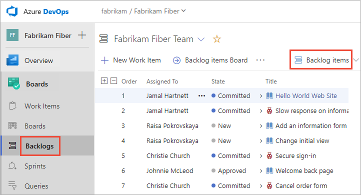

# Backlogs, portfolios, and Agile project management 

[!INCLUDE [temp](../_shared/version-vsts-tfs-all-versions.md)]

You plan and track your project using the suite of Agile tools you access from the web portal. Agile tools support the core Agile methods&mdash;Scrum and Kanban&mdash;used by software development teams today. Scrum tools support defining and managing work within sprints, setting capacity, and tracking tasks. Kanban tools allow you to manage a continuous flow of work via an interactive sign board.  

If you're new to Agile, see [What is Agile?](/azure/devops/learn/agile/what-is-agile) for an overview.

#### In a nutshell you use Backlogs to: 

- Quickly define the work your team is tasked with by [defining user stories, product backlog items, or requirements](create-your-backlog.md)
- [Reorder your backlog](create-your-backlog.md#move-items-priority-order) to make sure your working on the highest priority items first
- [Add details and estimates](create-your-backlog.md#estimates) to your backlog items 
- Quickly assign backlog items to team members and to sprints using either [bulk update](bulk-modify-work-items.md) or [drag and drop to a sprint](../sprints/assign-work-sprint.md)
- Group or organize backlog items by [mapping them within a hierarchy](organize-backlog.md)  
- Review the hierarchy or [portfolio of work assigned to multiple teams](#multi-team)
- [Forecast work](../sprints/forecast.md) to estimate what can be delivered within a sprint.

[!INCLUDE [temp](../_shared/setup-backlogs-boards.md)]

## Product and portfolio backlogs 

Backlogs present work items as lists. A product backlog represents your project plan, the roadmap for what your team plans to deliver. Your backlog also provides a repository of all the information you need to track and share with your team. Portfolio backlogs allow you to group and organize your backlog into a hierarchy. 

::: moniker range=">= azure-devops-2019"

  

::: moniker-end

::: moniker range=">= tfs-2017 <= tfs-2018"

::: moniker-end

::: moniker range="<= tfs-2015"

::: moniker-end

## Backlog configuration 

Each backlog is associated with a team. Team configuration settings determine the work items that will appear on the team backlog. Specifically, the team administrator defines the following for their team: 

- Selects the Area Paths that are active for the team, only work items assigned to these area paths appear on the team's backlog  
- Sets the default Area Path and Iteration Path used when defining work items from the team backlog 
- Selects the Iteration Paths that are active for the team
- Determines which backlog levels are active for the team 
- Defines how bugs will be treated, as requirements or as tasks. 

For details, see the following articles: 
- [Define iteration paths (aka sprints) and configure team iterations](../../organizations/settings/set-iteration-paths-sprints.md)
- [Define area paths and assign to a team](../../organizations/settings/set-area-paths.md)
- [Select backlog levels](../../organizations/settings/select-backlog-navigation-levels.md)
- [Show bugs on backlogs or boards](../../organizations/settings/show-bugs-on-backlog.md)

## Define work items and create your backlog  

You build your project plan by creating a backlog of work items that represent the features, requirements, user stories, or other work to perform. Portfolio backlogs provide support for organizing work in a hierarchical fashion and tracking major product initiatives or scenarios that rely on many stories or requirements.  Different types of work items help you track different types of work, such as user stories, tasks, bugs, issues, and more.  

<a id="stack-rank" />

## Backlog priority or stack rank order

 

The sequence of items on each backlog is determined according to where you have [added the items or moved the items on the page](create-your-backlog.md#move-items-priority-order). As you drag and drop items within the backlog list, a background process updates the [**Stack Rank** (Agile and CMMI processes)](../queries/planning-ranking-priorities.md) or [**Backlog Priority** (Scrum process)](../queries/planning-ranking-priorities.md) fields. These fields are used by the system to track the relative ranking of items on the product, feature, epic, or other portfolio backlog. By default, these fields don't appear on the work item form. 

  

You should refrain from using the bulk modify function to change the value of the backlog priority field. While you can assign a value to these fields, you'll be assigning the same value to all items you've selected for bulk edit.  

The preferred method for bulk edit is to use multi-select to move items to the top, bottom, or specific position within the page. If you must perform a bulk edit of one of the backlog order fields to get a large number of work items in the priority order you want, use [Excel](../backlogs/office/bulk-add-modify-work-items-excel.md). You can export a query containing the backlog items, update either the Backlog Priority or Stack Rank fields, and then publish your changes. 

## In Progress items and work listed on the backlog 

::: moniker range=">= tfs-2018" 

Backlogs are designed to display work that corresponds to a Proposed, In Progress, or Resolved category state. Once you've completed work and its state enters a *Done*, or *Closed* state, then it falls off the backlog view. You can always [create a query](../queries/using-queries.md) to view completed work, or view the [**Recently completed** pivot from the **Work Items** page](../work-items/view-add-work-items.md). 
::: moniker-end 

::: moniker range="<= tfs-2017" 

Backlogs are designed to display work that is in progress. Once you've completed work and it's state enters a *Done*, *Completed*, or *Closed* state, then it falls off the backlog view. You can always [create a query](../queries/using-queries.md) to view completed work. 

::: moniker-end 

In general, you'll want to display all items that are in the **In Progress** category state, which corresponds to the *Active* and *Committed* states. To focus on work that is proposed but not in progress, you can toggle the backlog view to turn off [**In Progress**](create-your-backlog.md#convert-ideas). This is useful when [forecasting your product backlog](../sprints/forecast.md). 

If your backlog is missing items, you might check if the **In Progress** view has been turned off. For additional information, see [Workflow states and state categories](../work-items/workflow-and-state-categories.md). 

## Organize your backlog, mapping and reparenting backlog items 

When you have a number of initiatives your teams are working on, you often times want to group the work according to these initiatives. By defining features and epics, you can group your work into a three-tiered hierarchy consisting of epics, features, and backlog items. 

For example, here the Customer Service team has organized several backlog items under two features and one epic. 

> [!div class="mx-imgBorder"]  
>   

## Work with multi-team ownership of backlog items  

When you have several teams, your hierarchical views may show items that belong to other teams. 

### View backlog items and parent items owned by other teams

Your team's product backlog lists only those items whose area path matches those assigned to your team. For details, see [Define area paths and assign to a team](../../organizations/settings/set-area-paths.md). However, if you show parents, 
you'll see the parent epic of the features and backlog items, even if the epic or feature is owned by another team. 

::: moniker range=">= azure-devops-2019"

Items that are owned by other teams appear with an information icon, .  

> [!div class="mx-imgBorder"]  
>    

> [!TIP]    
> Add the **Node Name** field as a column to identify the area path/team associated with the work items. 

::: moniker-end 

::: moniker range=">= tfs-2017 <= tfs-2018"

Items that are owned by other teams appear with an information icon, . 

> [!div class="mx-imgBorder"]  
>    

> [!TIP]    
> Add the **Node Name** field as a column to identify the area path/team associated with the work items. 

::: moniker-end   

::: moniker range="tfs-2017" 

Backlog displays with work item icons is supported for TFS 2017.2 and later versions. For TFS 2017.1 and earlier versions, items that are owned by other teams appear with hollow-filled bars.  

 
::: moniker-end

::: moniker range="<= tfs-2015" 

Items that are owned by other teams appear with hollow-filled bars.  

  
::: moniker-end   

### View Epics and child items owned by other teams

Here's another example that shows the **Epics** backlog for the **Management** team. 
Drilling down, you can see all the backlog items and features, even though they 
belong to one of three different teams: Customer Service, Phone, and Web.  

::: moniker range=">= azure-devops-2019"

> [!div class="mx-imgBorder"]  
>    
::: moniker-end 

::: moniker range=">= tfs-2017 <= tfs-2018" 

Here's another example that shows the **Epics** backlog for the **Management** team. 
Drilling down, you can see all the backlog items and features, even though they 
belong to one of three different teams: Customer Service, Phone, and Web.  

> [!div class="mx-imgBorder"]  
>   

::: moniker-end 

::: moniker range="<= tfs-2015" 

  

::: moniker-end 

From these views, you can reparent items, both those that you own and those owned by other teams. 
However, you can't reorder items that another team owns.  

This enables management teams to focus on high level features and epics, and development teams 
to focus on just those backlog items they're responsible to deliver. 

To make this work for you, you'll need to [add teams and set their area paths](../../organizations/settings/add-teams.md). 
For example, you can create a team structure similar to this one with two management and three development teams.

To learn more about hierarchical team and backlog structures, see [Portfolio management](../plans/portfolio-management.md).

<a id="leaf-node" />

## Display of leaf node work items  

When a product or portfolio backlog contains same-category, nested work items, only the last child item within the nested set displays on the Kanban board, sprint backlog, or taskboard. 

[!INCLUDE [temp](../_shared/display-leaf-nodes.md)]  

To learn more, see [Fix "Ordering backlog items is disabled"](../backlogs/resolve-backlog-reorder-issues.md).

## Permissions and access

As a member added to the Contributors group of a project, you can use most features provided under **Boards** or **Work**. Users with Basic access have full access to all features. Users with Stakeholder access are limited to certain features. For details, see [Work as a Stakeholder](../../organizations/security/access-levels.md#stakeholder-access). 

To learn more about permissions and access, see [Permissions and access for work tracking](../../organizations/security/permissions-access-work-tracking.md) and [About access levels](../../organizations/security/access-levels.md).   

To add users to a project, see [Add users to a project or team](../../organizations/security/add-users-team-project.md).

[!INCLUDE [temp](../_shared/add-portfolio-backlogs.md)]

## Try this next  

If you're just getting started, see [Start using Azure Boards](../get-started/index.md). 

## Related articles 

- [Web portal navigation](../../project/navigation/index.md) 
- [About Kanban and Agile project management](../boards/kanban-overview.md)  
- [About work items](../work-items/about-work-items.md)  

 

 