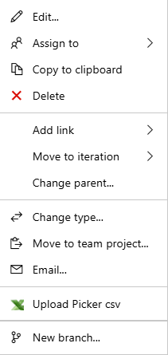
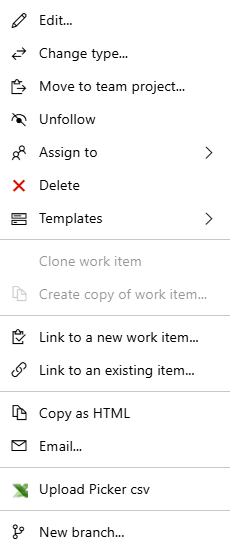
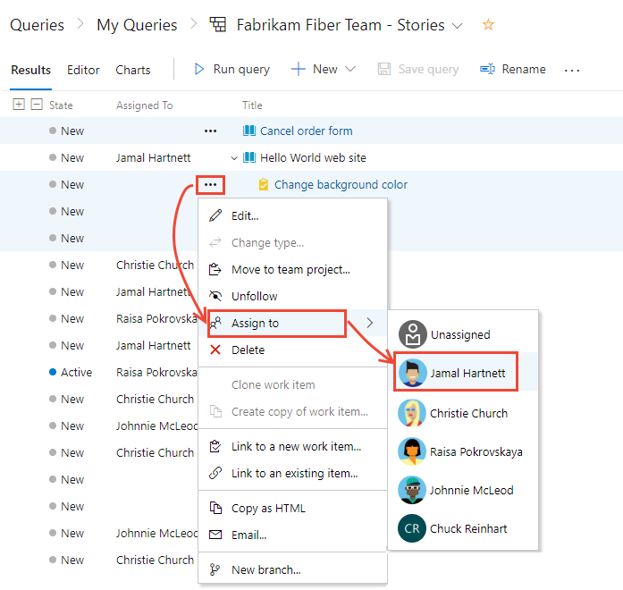

# Modify work items in bulk in Azure Boards 

[!INCLUDE [version-lt-eq-azure-devops](../../includes/version-lt-eq-azure-devops.md)]

Use bulk modify when you need to quickly make the same change to many work items. For example, you might want to change the priority of several bugs or reassign several tasks to the same team member. Use the web portal to quickly modify one or more fields for work items that contain the same value.  

> [!TIP]    
> To add work items in bulk or update multiple fields with different values, use [Excel](../backlogs/office/bulk-add-modify-work-items-excel.md). You can't complete a bulk add of work items through the web portal.   

With bulk modify, you may edit fields and add or remove tags. You can also reassign work or move work to a specific sprint. You can also use bulk modify to change the work item type or move work items to other projects. The options available to you depend on the platform you work from and the permissions you've been granted.

In this article you'll learn:  

> [!div class="checklist"]    
> * How to multi-select work items from a list and open the context menu  
> * Edit one or more fields of several work items    
> * Assign work from a backlog to a sprint using drag-and-drop 
> * Add or remove tags from several work items  

[!INCLUDE [temp](../includes/prerequisites-work-items.md)]

## Supported tasks

All of the following actions can be completed by team members that belong to the Contributors group. Members provided with Stakeholder access can run multi-select, bulk edit, change type, email, and copy as HTML/copy to clipboard actions. For more information, see [Work as a stakeholder](../../organizations/security/get-started-stakeholder.md).  

::: moniker range=">= azure-devops-2019"

:::row:::
   :::column span="1":::
   **Area**
   :::column-end:::
   :::column span="1":::
   **Task**
   :::column-end:::
:::row-end:::
---
:::row:::
   :::column span="1":::
   Multi-select work items  
   :::column-end:::
   :::column span="1":::
   - [Multi-select-query results](#multi-select)
   - [Multi-select-backlog](#multi-select)
   :::column-end:::
:::row-end:::
:::row:::
   :::column span="1":::
   Link work items 
   :::column-end:::
   :::column span="1":::
   - [Link to a new item](add-link.md#link)
   - [Link to an existing item](add-link.md#link)
   - [New branch](connect-work-items-to-git-dev-ops.md)1
   :::column-end:::
:::row-end:::
:::row:::
   :::column span="1":::
   Bulk edit/update/delete
   :::column-end:::
   :::column span="1":::
   - [Edit field(s)](#edit)
   - [Assign to](#assign-to)
   - [Move to iteration](#move-iteration)
   - [Change position](create-your-backlog.md#move-items-priority-order)
   - [Change parent](organize-backlog.md#reparent)
   - [Add/remove tags](#tags)
   - [Update from template](work-item-template.md)1
   - [Delete](remove-delete-work-items.md#delete) 1
   
   :::column-end:::
:::row-end:::
:::row:::
   :::column span="1":::
   Copy, clone, change type, move, or email work items  
   :::column-end:::
   :::column span="1":::
   - [Clone or copy a single item](copy-clone-work-items.md#copy-clone) 2
   - [Copy as HTML/Copy to clipboard](copy-clone-work-items.md#html)
   - [Email selected item(s)](../queries/share-plans.md)
   - [Change work item type](move-change-type.md#change-type)1
   - [Move items to another project](move-change-type.md#move)1, 3
   :::column-end:::
:::row-end:::

> [!NOTE]  
> 1. You can't perform certain functions on work items whose WITs belong to the [Hidden Types Category](../work-items/agile-glossary.md#hidden-types). This includes all work items that track tests&mdash;such as test cases, shared steps, and shared parameters&mdash;code review requests and responses, and feedback requests and responses. 
> 2. You can choose to copy or clone a single work item from a query results list or from the [Actions menu of the work item form](remove-delete-work-items.md). You can only perform a clone or copy action for a single work item. Choose Copy work item when you want to create a copy of a work item and change its work item type. Choose Clone when you want to create another instance of the work item without changes to its work item type. 
> 3. You must be a member of the Project Administrators group or be granted explicit permissions to [**Move work items**](../../organizations/security/set-permissions-access-work-tracking.md#move-delete-permissions).  

::: moniker-end

::: moniker range="tfs-2018"

:::row:::
   :::column span="1":::
   **Area**
   :::column-end:::
   :::column span="1":::
   **Task**
   :::column-end:::
:::row-end:::
---
:::row:::
   :::column span="1":::
   Multi-select work items  
   :::column-end:::
   :::column span="1":::
   - [Multi-select-query results](#multi-select)
   - [Multi-select-backlog](#multi-select)
   
   :::column-end:::
:::row-end:::
:::row:::
   :::column span="1":::
   Link work items 
   :::column-end:::
   :::column span="1":::
   - [Link to a new item](add-link.md#link)
   - [Link to an existing item](add-link.md#link)
   - [New branch](connect-work-items-to-git-dev-ops.md)1
   :::column-end:::
:::row-end:::
:::row:::
   :::column span="1":::
   Bulk edit/update/delete
   :::column-end:::
   :::column span="1":::
   - [Edit field(s)](#edit)
   - [Assign to](#assign-to)
   - [Move to iteration](#move-iteration)
   - [Change position](create-your-backlog.md#move-items-priority-order)
   - [Change parent](organize-backlog.md#reparent)
   - [Add/remove tags](#tags)
   - [Update from template](work-item-template.md)1
   - [Delete](remove-delete-work-items.md#delete) 1
   :::column-end:::
:::row-end:::
:::row:::
   :::column span="1":::
   Copy, clone, or email work items  
   :::column-end:::
   :::column span="1":::
   - [Clone or copy a single item](copy-clone-work-items.md#copy-clone) 2
   - [Copy as HTML/Copy to clipboard](copy-clone-work-items.md#html)
   - [Email selected item(s)](../queries/share-plans.md)
   
   :::column-end:::
:::row-end:::

> [!NOTE]
>1. You can't perform certain functions on work items whose WITs belong to the [Hidden Types Category](../work-items/agile-glossary.md#hidden-types). This includes all work items that track tests&mdash;such as test cases, shared steps, and shared parameters&mdash;code review requests and responses, and feedback requests and responses. 
>2. You can choose to copy or clone a single work item from a query results list or from the [Actions menu of the work item form](remove-delete-work-items.md). You can only perform a clone or copy action for a single work item. Choose Copy work item when you want to create a copy of a work item and change its work item type. Choose Clone when you want to create another instance of the work item without changes to its work item type. 
>3. For on-premises Azure DevOps, you must have an [SMTP server configured for your deployment](/azure/devops/server/admin/setup-customize-alerts). 

  
  

## Edit multiple work items in bulk   

To start a bulk edit, begin by multi-selecting the work items you want to modify, either from the query results or the backlog. You can craft your query using the [query editor or search box](../queries/using-queries.md). 

Multi-select of work items on the backlog and sprint backlogs works in the same way as multi-select works within query results. 

You can use bulk modify by selecting work items from the backlog page or query results list. From the backlog page context menu, change the backlog priority of several items (Change position or Move to position). Then,  assign them to a team member, move them to a different sprint, or [map them to a feature](organize-backlog.md#mapping).

The menu options available to you change depending on the platform you work from and whether you work from a backlog page or query results list.  

:::row:::
   :::column span="1":::
   **Backlog menu**  
   
   
   :::column-end:::
   :::column span="1":::
   **Query results multi-select menu**  
   
   
   :::column-end:::
:::row-end:::

::: moniker-end

### Select multiple items and open the context menu 

To select several items in a sequence, hold down the shift key. To select several non-sequential items, use the Ctrl key. Then, you can either drag the selected items to a new position within the backlog, to a different sprint. 

To open the context menu, select (  :::image type="icon" source="../media/icons/actions-icon.png" border="false"::: ) or (), and then choose the option from the menu. 

Here, we use the context menu to move several non-sequential items to the current sprint.

::: moniker range=">= azure-devops-2019"  

> [!div class="mx-imgBorder"]  
> 

::: moniker-end  

::: moniker range="tfs-2018"  

::: moniker-end

> [!TIP]  
> Use the backlog **Create Query** feature to create a query with the backlog items. You can then open the query within the web portal or [Excel](../backlogs/office/bulk-add-modify-work-items-excel.md) to perform additional bulk updates.  

 
  

## Reassign work items 

With work items selected, open the context menu for any selected item, and reassign all of them. By doing reassigning them, you can quickly assign them to a member of your team or to another sprint or iteration. 

> [!div class="mx-imgBorder"]  
>   

To learn more about the *Assign To* and *Iteration Path* fields, see [Query by assignment, workflow, or Kanban board changes](../queries/query-by-workflow-changes.md#workflow-fields) and [Query by area or iteration path](../queries/query-by-area-iteration-path.md).

  

## Edit one or more fields  

To assign or modify several fields, choose Edit from the context menu of one of the selected work items. Enter a value for each field that you want to update.  

::: moniker range=">= azure-devops-2019"

1. For audit purposes, you can type a description for your bulk update task. To learn more about each field, see the [Work item field index](../work-items/guidance/work-item-field.md). 

	> [!div class="mx-imgBorder"]  
	>   

2. From the Query results page, you must save all work items that you bulk-modified. When you bulk modify items from the backlog, they're automatically saved. Work items shown in bold text indicate that local changes haven't yet been saved to the data store.  The **Save items** button may be in a different place in the UI than shown in the picture below, depending on the layout of your browser and the specific version in use.

    > [!div class="mx-imgBorder"]  
    >  

::: moniker-end

::: moniker range="tfs-2018"

1. For audit purposes, you can type a description for your bulk update task. To learn more about each field, see the [Work item field index](../work-items/guidance/work-item-field.md). 

    !Screenshot of Query results page, bulk edit fields.](media/bulk-modify-edit-fields-ts.png)  

2. From the Query results page, you must save all work items that you bulk-modified. When you bulk modify items from the backlog, they're automatically saved. Work items shown in bold text indicate that local changes haven't yet been saved to the data store.  

    

::: moniker-end

[!INCLUDE [temp](../includes/assign-to-sprint.md)]

 

## Modify rich-text fields in bulk

Rich-text fields support entry of HTML syntax tags to support formatting. Rich-text fields correspond to the **Description**, **Acceptance Criteria**, **Repos Steps**, and others listed in [Query samples for select fields](../queries/query-index-quick-ref.md#sample-queries-for-select-fields). 

You can bulk update a rich-text field by using the bulk modify tool, selecting the field, and entering the text with syntax in the **Value** field. Or, you can create a work item template with the text you want to use and complete a bulk update by applying the template to the selected work items. For details on using work item templates, see [Use templates to add and update work items](work-item-template.md) 

For a worked example using templates showing entry of HTML formatted syntax, see [Sample work item templates, Add guidance in a rich-text field](../work-items/work-item-template-examples.md#rich-text). 

## Modify tags in bulk 

From the Edit work items dialog, select **Tags (Add)** or **Tags (Remove)**.  

Here we choose to add the *Service* tag to the selected work items. 

> [!div class="mx-imgBorder"]
> 

## Related articles

To add fields or customize a work item form, see [Customize your work tracking experience](../../reference/customize-work.md). The method you use depends on the process model that supports your project.  

### Migrate or change a large number of work items 

For large scale, organizational moves, use the REST API calls for [Work item batch operations](/rest/api/azure/devops/wit/work%20items#operations). 

At this time, you can't move work items to a different organization or collection. You can only migrate work item information by exporting and then importing them using [Excel](../backlogs/office/bulk-add-modify-work-items-excel.md). 

### Add multiple values to a field  

If you have implemented a [custom control that supports multiple values](https://marketplace.visualstudio.com/items?itemName=ms-devlabs.vsts-extensions-multivalue-control), you can use Excel to bulk edit the field, but you can't modify it using the web portal. In the web portal, you can only select a single value for the field.   
