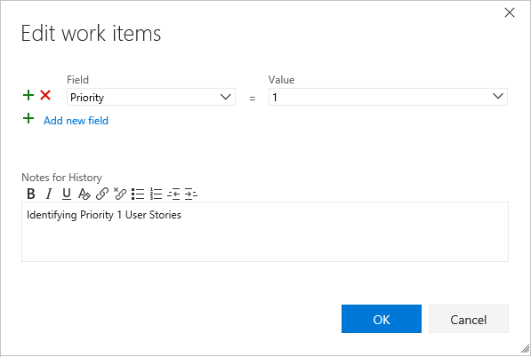

# Bulk modify work items  

[!INCLUDE [temp](../_shared/version-vsts-tfs-all-versions.md)]

Use bulk modify when you need to quickly make the same change to a number of work items. For example, you might want to change the priority of several bugs or reassign several tasks to the same team member. Use the web portal to quickly modify one or more fields for work items that will contain the same value.  

> [!TIP]    
> To add work items in bulk or update multiple fields with different values, use [Excel](../backlogs/office/bulk-add-modify-work-items-excel.md). You can't perform a bulk add of work items through the web portal.   

With bulk modify, you can edit fields, add or remove tags, reassign work, or move work to a specific sprint. You can also use bulk modify to change the work item type or move work items to other projects. The options available to you depend on the platform you work from and the permissions you've been granted.

In this article you'll learn:  

::: moniker range=">= tfs-2015"
> [!div class="checklist"]    
> * How to multi-select work items from a list and open the context menu  
> * Edit one or more fields of several work items    
> * Assign work from a backlog to a sprint using drag-and-drop 
> * Add or remove tags from several work items  

::: moniker-end

::: moniker range="tfs-2013"
> [!div class="checklist"]    
> * How to multi-select work items from a list and open the context menu  
> * Edit one or more fields of several work items    
> * Assign work from a backlog to a sprint using drag-and-drop 

::: moniker-end

[!INCLUDE [temp](../_shared/prerequisites.md)]

## Supported tasks

All of the following actions can be performed by team members that belong to the Contributors group. Members provided with Stakeholder access can perform multi-select, bulk edit, change type, email, and copy as HTML/copy to clipboard actions. For details, see [Work as a stakeholder](../../organizations/security/get-started-stakeholder.md).  

::: moniker range=">= azure-devops-2019"

<table width="80%">
<tbody valign="top">
<tr>
<th width="35%">Area</th>
<th width="65%">Task</th>
</tr>
<tr>
<td>Multi-select work items  </td>
<td>
<ul>
<li><a href="#multi-select" data-raw-source="[Multi-select-query results](#multi-select)">Multi-select-query results</a></li>
<li><a href="#multi-select" data-raw-source="[Multi-select-backlog](#multi-select)">Multi-select-backlog</a></li>
</ul>
</td>
</tr>
<tr>
<td>Link work items </td>
<td>
<ul>
<li><a href="add-link.md#link" data-raw-source="[Link to a new item](add-link.md#link)">Link to a new item</a></li>
<li><a href="add-link.md#link" data-raw-source="[Link to an existing item](add-link.md#link)">Link to an existing item</a></li>
<li><a href="connect-work-items-to-git-dev-ops.md" data-raw-source="[New branch](connect-work-items-to-git-dev-ops.md)">New branch</a>1</li>
</ul>
</td>
</tr>
<tr>
<td>Bulk edit/update/delete</td>
<td>
<ul>
<li><a href="#edit" data-raw-source="[Edit field(s)](#edit)">Edit field(s)</a></li>
<li><a href="#assign-to" data-raw-source="[Assign to](#assign-to)">Assign to</a></li>
<li><a href="#move-iteration" data-raw-source="[Move to iteration](#move-iteration)">Move to iteration</a></li>
<li><a href="create-your-backlog.md#move-items-priority-order" data-raw-source="[Change position](create-your-backlog.md#move-items-priority-order)">Change position</a></li>
<li><a href="organize-backlog.md#reparent" data-raw-source="[Change parent](organize-backlog.md#reparent)">Change parent</a></li>
<li><a href="#tags" data-raw-source="[Add/remove tags](#tags)">Add/remove tags</a></li>
<li><a href="work-item-template.md" data-raw-source="[Update from template](work-item-template.md)">Update from template</a>1</li>
<li><a href="remove-delete-work-items.md#delete" data-raw-source="[Delete](remove-delete-work-items.md#delete)">Delete</a> 1</li>
</ul>
</td>
</tr>
<tr>
<td>Copy, clone, change type, move, or email work items  </td>
<td>
<ul>
<li><a href="copy-clone-work-items.md#copy-clone" data-raw-source="[Clone or copy a single item](copy-clone-work-items.md#copy-clone)">Clone or copy a single item</a> 2</li>
<li><a href="copy-clone-work-items.md#html" data-raw-source="[Copy as HTML/Copy to clipboard](copy-clone-work-items.md#html)">Copy as HTML/Copy to clipboard</a></li>
<li><a href="../queries/share-plans.md" data-raw-source="[Email selected item(s)](../queries/share-plans.md)">Email selected item(s)</a></li>
<li><a href="remove-delete-work-items.md#change-type" data-raw-source="[Change work item type](remove-delete-work-items.md#change-type)">Change work item type</a>1</li>
<li><a href="remove-delete-work-items.md#move" data-raw-source="[Move items to another project](remove-delete-work-items.md#move)">Move items to another project</a>1, 3</li>
</ul>
</td>
</tr>
</tbody>
</table>

**Notes:**  
1. You can't perform certain functions on work items whose WITs belong to the [Hidden Types Category](../work-items/agile-glossary.md#hidden-types). This includes all work items that track tests&mdash;such as test cases, shared steps, and shared parameters&mdash;code review requests and responses, and feedback requests and responses. 
2. You can choose to copy or clone a single work item from a query results list or from the [Actions menu of the work item form](remove-delete-work-items.md). You can only perform a clone or copy action for a single work item. Choose Copy work item when you want to create a copy of a work item and change its work item type. Choose Clone when you want to create another instance of the work item without changes to its work item type. 
3. You must be a member of the Project Administrators group or be [granted explicit permissions to move work items](../../organizations/security/set-permissions-access-work-tracking.md#move-delete-permissions).  

::: moniker-end

::: moniker range="azure-devops-2019"

> [!NOTE] 
> To exercise the **Change work item type** or **Move work items to another project**, you must have [disabled the data warehouse](../../report/admin/disable-data-warehouse.md).   

::: moniker-end

::: moniker range=">= tfs-2017 <= tfs-2018"

<table width="80%">
<tbody valign="top">
<tr>
<th width="35%">Area</th>
<th width="65%">Task</th>
</tr>
<tr>
<td>Multi-select work items  </td>
<td>
<ul>
<li><a href="#multi-select" data-raw-source="[Multi-select-query results](#multi-select)">Multi-select-query results</a></li>
<li><a href="#multi-select" data-raw-source="[Multi-select-backlog](#multi-select)">Multi-select-backlog</a></li>
</ul>
</td>
</tr>
<tr>
<td>Link work items </td>
<td>
<ul>
<li><a href="add-link.md#link" data-raw-source="[Link to a new item](add-link.md#link)">Link to a new item</a></li>
<li><a href="add-link.md#link" data-raw-source="[Link to an existing item](add-link.md#link)">Link to an existing item</a></li>
<li><a href="connect-work-items-to-git-dev-ops.md" data-raw-source="[New branch](connect-work-items-to-git-dev-ops.md)">New branch</a>1</li>
</ul>
</td>
</tr>
<tr>
<td>Bulk edit/update/delete</td>
<td>
<ul>
<li><a href="#edit" data-raw-source="[Edit field(s)](#edit)">Edit field(s)</a></li>
<li><a href="#assign-to" data-raw-source="[Assign to](#assign-to)">Assign to</a></li>
<li><a href="#move-iteration" data-raw-source="[Move to iteration](#move-iteration)">Move to iteration</a></li>
<li><a href="create-your-backlog.md#move-items-priority-order" data-raw-source="[Change position](create-your-backlog.md#move-items-priority-order)">Change position</a></li>
<li><a href="organize-backlog.md#reparent" data-raw-source="[Change parent](organize-backlog.md#reparent)">Change parent</a></li>
<li><a href="#tags" data-raw-source="[Add/remove tags](#tags)">Add/remove tags</a></li>
<li><a href="work-item-template.md" data-raw-source="[Update from template](work-item-template.md)">Update from template</a>1</li>
<li><a href="remove-delete-work-items.md#delete" data-raw-source="[Delete](remove-delete-work-items.md#delete)">Delete</a> 1</li>
</ul>
</td>
</tr>
<tr>
<td>Copy, clone, or email work items  </td>
<td>
<ul>
<li><a href="copy-clone-work-items.md#copy-clone" data-raw-source="[Clone or copy a single item](copy-clone-work-items.md#copy-clone)">Clone or copy a single item</a> 2</li>
<li><a href="copy-clone-work-items.md#html" data-raw-source="[Copy as HTML/Copy to clipboard](copy-clone-work-items.md#html)">Copy as HTML/Copy to clipboard</a></li>
<li><a href="../queries/share-plans.md" data-raw-source="[Email selected item(s)](../queries/share-plans.md)">Email selected item(s)</a></li>
</ul>
</td>
</tr>
</tbody>
</table>

**Notes:**  
1. You can't perform certain functions on work items whose WITs belong to the [Hidden Types Category](../work-items/agile-glossary.md#hidden-types). This includes all work items that track tests&mdash;such as test cases, shared steps, and shared parameters&mdash;code review requests and responses, and feedback requests and responses. 
2. You can choose to copy or clone a single work item from a query results list or from the [Actions menu of the work item form](remove-delete-work-items.md). You can only perform a clone or copy action for a single work item. Choose Copy work item when you want to create a copy of a work item and change its work item type. Choose Clone when you want to create another instance of the work item without changes to its work item type. 
3. For on-premises TFS, you must have an [SMTP server configured for your deployment](/azure/devops/server/admin/setup-customize-alerts). 

::: moniker-end

::: moniker range="<= tfs-2015"

<table width="80%">
<tbody valign="top">
<tr>
<th width="35%">Area</th>
<th width="65%">Task</th>
</tr>
<tr>
<td>Multi-select work items  </td>
<td>
<ul>
<li><a href="#multi-select" data-raw-source="[Multi-select-query results](#multi-select)">Multi-select-query results</a></li>
<li><a href="#multi-select" data-raw-source="[Multi-select-backlog](#multi-select)">Multi-select-backlog</a></li>
</ul>
</td>
</tr>
<tr>
<td>Link work items </td>
<td>
<ul>
<li><a href="add-link.md#link" data-raw-source="[Link to a new item](add-link.md#link)">Link to a new item</a></li>
<li><a href="add-link.md#link" data-raw-source="[Link to an existing item](add-link.md#link)">Link to an existing item</a></li>
</ul>
</td>
</tr>
<tr>
<td>Bulk edit/update/delete</td>
<td>
<ul>
<li><a href="#edit" data-raw-source="[Edit field(s)](#edit)">Edit field(s)</a></li>
<li><a href="#assign-to" data-raw-source="[Assign to](#assign-to)">Assign to</a></li>
<li><a href="#move-iteration" data-raw-source="[Move to iteration](#move-iteration)">Move to iteration</a></li>
<li><a href="create-your-backlog.md#move-items-priority-order" data-raw-source="[Change position](create-your-backlog.md#move-items-priority-order)">Change position</a></li>
<li><a href="organize-backlog.md#reparent" data-raw-source="[Change parent](organize-backlog.md#reparent)">Change parent</a></li>
<li><a href="remove-delete-work-items.md#delete" data-raw-source="[Delete](remove-delete-work-items.md#delete)">Delete</a> 1</li>
</ul>
</td>
</tr>
<tr>
<td>Copy, clone, or email work items  </td>
<td>
<ul>
<li><a href="copy-clone-work-items.md#copy-clone" data-raw-source="[Clone or copy a single item](copy-clone-work-items.md#copy-clone)">Clone or copy a single item</a> 2</li>
<li><a href="copy-clone-work-items.md#html" data-raw-source="[Copy as HTML/Copy to clipboard](copy-clone-work-items.md#html)">Copy as HTML/Copy to clipboard</a></li>
<li><a href="../queries/share-plans.md" data-raw-source="[Email selected item(s)](../queries/share-plans.md)">Email selected item(s)</a></li>
</ul>
</td>
</tr>
</tbody>
</table>

**Notes:**  
1. You can't perform certain functions on work items whose WITs belong to the [Hidden Types Category](../work-items/agile-glossary.md#hidden-types). This includes all work items that track tests&mdash;such as test cases, shared steps, and shared parameters&mdash;code review requests and responses, and feedback requests and responses. 
2. You can choose to copy or clone a single work item from a query results list or from the [Actions menu of the work item form](remove-delete-work-items.md). You can only perform a clone or copy action for a single work item. Choose Copy work item when you want to create a copy of a work item and change its work item type. Choose Clone when you want to create another instance of the work item without changes to its work item type. 
3. For on-premises TFS, you must have an [SMTP server configured for your deployment](/azure/devops/server/admin/setup-customize-alerts). 

::: moniker-end

  
  

## Bulk edit multi-selected work items   

To start a bulk edit, begin by multi-selecting the work items you want to modify, either from the query results or the backlog. You can craft your query using the [query editor or search box](../queries/using-queries.md). 

::: moniker range=">= tfs-2015"

Multi-select of work items on the backlog and sprint backlogs works in the same way as multi-select works within query results. 

::: moniker-end

::: moniker range="tfs-2015"

Requires TFS 2015.1 or later versions.

::: moniker-end

You can use bulk modify by selecting work items from the backlog page or query results list. From the backlog page context menu, you can change the backlog priority of several items (Change position or Move to position), assign them to a team member, move them to a different sprint, or [map them to a feature](organize-backlog.md#mapping).

The menu options available to you change depending on the platform you work from and whether you work from a backlog page or query results list.  
 

::: moniker range=">= tfs-2018"

<!---#### Azure Boards and TFS 2018-->

<table valign="top">
<tr valign="top">
<td>

<strong>Backlog menu</strong>
  </td>

<td>

<strong>Query results multi-select menu</strong>
  </td>
</tr>
</table>
::: moniker-end

::: moniker range="tfs-2017"

<!---#### TFS 2017-->

<table valign="top">
<tr valign="top">
<td>

<strong>Backlog multi-select menu</strong> 
  </td>
<td>

<strong>Query results multi-select menu</strong> 
  
</td>
</tr>
</table>

::: moniker-end

::: moniker range="<= tfs-2015"

<!---#### TFS 2015, TFS 2013-->

<table valign="top">
<tr valign="top">
<td>

<strong>Backlog multi-select menu</strong>
  
</td>
<td>

<strong>Query results multi-select menu</strong>
  </td>
</tr>
</table>

::: moniker-end

### To multi-select and open the context menu 

To select several items in a sequence, hold down the shift key. To select several non-sequential items, use the Ctrl key. Then, you can either drag the selected items to a new position within the backlog, to a different sprint. 

To open the context menu, click () or (), and then choose the option from the menu. 

Here, we use the context menu to move several non-sequential items to the current sprint.

::: moniker range=">= azure-devops-2019"  

> [!div class="mx-imgBorder"]  
> 

::: moniker-end  

::: moniker range=">= tfs-2017 <= tfs-2018"  

::: moniker-end

::: moniker range=">= tfs-2013 <= tfs-2015"  

  

::: moniker-end

> [!TIP]  
> Use the backlog **Create Query** feature to create a query with the backlog items. You can then open the query within the web portal or [Excel](../backlogs/office/bulk-add-modify-work-items-excel.md) to perform additional bulk updates.  

 
  

## Reassign work items 

With work items selected, open the context menu for any selected item, and reassign all of them. By doing this, you can quickly assign them to a member of your team or to another sprint or iteration. 

::: moniker range=">= tfs-2017"

> [!div class="mx-imgBorder"]  
>   

::: moniker-end

::: moniker range="<= tfs-2015"

  
 ::: moniker-end

To learn more about the *Assign To* and *Iteration Path* fields, see [Query by assignment, workflow or Kanban board changes](../queries/query-by-workflow-changes.md#workflow-fields) and [Query by area or iteration path](../queries/query-by-area-iteration-path.md).

  

## Edit one or more fields  

To assign or modify several fields, choose Edit from the context menu of one of the selected work items. Enter a value for each field that you want to update.  

::: moniker range=">= azure-devops-2019"

1. For audit purposes, you can type a description for your bulk update task. To learn more about each field, see the [Work item field index](../work-items/guidance/work-item-field.md). 

	> [!div class="mx-imgBorder"]  
	>   

2. From the Query results page, you must save all work items that you bulk-modified. When you bulk modify items from the backlog, they are automatically saved. Work items shown in bold text indicate that local changes have not yet been saved to the data store.  

    > [!div class="mx-imgBorder"]  
    >  

::: moniker-end

::: moniker range=">= tfs-2017 <= tfs-2018"

1. For audit purposes, you can type a description for your bulk update task. To learn more about each field, see the [Work item field index](../work-items/guidance/work-item-field.md). 

      

2. From the Query results page, you must save all work items that you bulk-modified. When you bulk modify items from the backlog, they are automatically saved. Work items shown in bold text indicate that local changes have not yet been saved to the data store.  

    

::: moniker-end

::: moniker range=">= tfs-2013 <= tfs-2015"

<!---#### TFS 2015, TFS 2013-->

1. For audit purposes, you can type a description for your bulk update task. To learn more about each field, see the [Work item field index](../work-items/guidance/work-item-field.md). 

    

2. Save all work items that you bulk-modified. Work items shown in bold text indicate that local changes have not yet been saved to the data store.  

      

::: moniker-end

::: moniker range=">= tfs-2015"

[!INCLUDE [temp](../_shared/assign-to-sprint.md)]

::: moniker-end

::: moniker range=">= tfs-2015"

## Bulk modify tags 

From the Edit work items dialog, select **Tags (Add)** or **Tags (Remove)**.  
::: moniker-end

::: moniker range=">= tfs-2017"

Here we choose to add the *Service* tag to the selected work items. 

> [!div class="mx-imgBorder"]
> 

::: moniker-end

::: moniker range="tfs-2015"

Here we choose to add the *Beta* tag to the selected work items. 

 

Bulk update of work items to add or remove tags from the web portal requires TFS 2015.2 or later version. To bulk edit work items when connecting to TFS 2015.1 or earlier versions, [use Excel](../backlogs/office/bulk-add-modify-work-items-excel.md).
 
::: moniker-end 

## Related articles

To add fields or customize a work item form, see [Customize your work tracking experience](../../reference/customize-work.md). The method you use depends on the process model that supports your project.  

### Migrate or change a large number of work items 

For large scale, organizational moves, use the REST API calls for [Work item batch operations](https://visualstudio.microsoft.com/docs/integrate/api/wit/batch). 

At this time, you can't move work items to a different organization or collection. You can only migrate work item information by exporting and then importing them using [Excel](../backlogs/office/bulk-add-modify-work-items-excel.md). 

### Add multiple values to a field  

If you have implemented a [custom control that supports multiple values](https://marketplace.visualstudio.com/items?itemName=ms-devlabs.vsts-extensions-multivalue-control), you can use Excel to bulk edit the field, but you can't modify it using the web portal. In the web portal, you can only select a single value for the field.   

