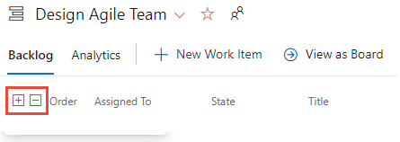
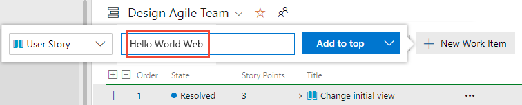
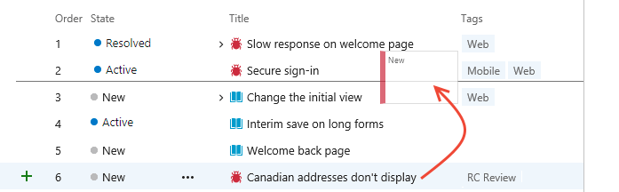

# Configure your backlog view in Azure Boards

[!INCLUDE [version-gt-eq-azure-devops-2019](../../includes/version-gt-eq-2019.md)]

Your backlogs are designed to support many project management tasks. Chief among them are: 
- Define work to be done 
- Prioritize work 
- Group work into a hierarchical view
- Assign work to iterations 
- Forecast work 

Each backlog&mdash;product or portfolio&mdash;is a tool you share with your team members. When you add backlog items, prioritize items, or link work items using parent-child links, team members see the changes when they refresh their backlog. 

To effectively perform select tasks, it's good to know how to set your view options to support those tasks.  

> [!TIP]  
> You can't sort your backlog on a column. To view a sorted listed, select **Create query** from your backlog. Save and open the query. Modify the query if needed to be a flat list query. You can then sort the query results. To learn more about queries, see [Use the query editor to list and manage queries](../queries/using-queries.md).

## Backlog configuration options

You have the following tools to configure your backlog view: **Expand/Collapse one level**, **Column Options**, **Backlog level selector**, **View options**, and **Filter** toolbar. The options you set for each backlog level&mdash;stories, features, epics (Agile process) or product backlog items, features, epics (Scrum process)&mdash;are distinct. The options you set persist until you change them. 
 :::image type="content" source="media/configure-view-options/customization-tools.png" alt-text="Screenshot showing the four types of Backlog configuration tool options.":::  

### Expand and collapse the hierarchy  

The default view when you select a backlog level is to show the collapsed view. Only those items associated with the backlog level selected are shown. You can expand and collapse the hierarchy by using the  and collapse  icons to expand or collapse one level of the hierarchy. Your selection doesn't persist once you switch to a different page or view.   

> [!div class="mx-imgBorder"]  
>   
 

### Backlog level selector 

The number of backlog levels available to you are set by your team administrator and may have been customized to add custom work item types or backlog levels. Each backlog automatically applies the filters associated with the **Area Paths** and **Iteration Paths** selected for the team. 

> [!NOTE]  
> Prior to using the tools described in this article, we recommend that you review [Set up your project's backlogs and boards](set-up-your-backlog.md) to ensure you have configured your backlog to support your team's needs. 

From the **Backlogs** page, you can select the product backlog or a portfolio backlog. You select a backlog from the backlog level selector next to the :::image type="icon" source="../../media/icons/view-options-icon.png" border="false"::: **View options** icon. The labels within this selector vary depending on the process selected for your project, customization made to that process, and configurations made by your team administrator as shown in the following images.  
:::row:::
   :::column span="1":::
      **Agile process**  
      :::image type="content" source="media/configure-view-options/agile-process-levels.png" alt-text="Screenshot of Backlog level selector for the Agile process.":::  
   :::column-end:::
   :::column span="1":::
      **Scrum process**  
      :::image type="content" source="media/configure-view-options/scrum-process-levels.png" alt-text="Screenshot of Backlog level selector for the Scrum process.":::  
   :::column-end:::
   :::column span="1":::
      **Basic process**  
      :::image type="content" source="media/configure-view-options/basic-process-levels.png" alt-text="Screenshot of Backlog level selector for the Basic process."::: 
   :::column-end:::
:::row-end:::
:::row:::
   :::column span="1":::
      **CMMI process**  
      :::image type="content" source="media/configure-view-options/cmmi-process-levels.png" alt-text="Screenshot of Backlog level selector for the CMMI process.":::  
   :::column-end:::
   :::column span="1":::
      **Customized process**  
      :::image type="content" source="media/configure-view-options/customized-process-levels.png" alt-text="Screenshot of Backlog level selector for the Customized process.":::   
   :::column-end:::
   :::column span="1":::
       
   :::column-end:::
:::row-end:::

For information on team configuration of backlog levels, see [Select backlog navigation levels for your team](../../organizations/settings/select-backlog-navigation-levels.md).
 

### View options menu

The :::image type="icon" source="../../media/icons/view-options-icon.png" border="false"::: **View options** menu controls the following options. 

::: moniker range="azure-devops"
:::row:::
   :::column span="2":::
      :::image type="content" source="media/configure-view-options/view-options-menu-cloud.png" alt-text="Screenshot of View options menu, Azure DevOps Services."::: 
   :::column-end:::
   :::column span="3":::
      - **Parents**: Show the hierarchical grouping of parent-child work items. Useful when adding child work items, reparenting a work item, or displaying rollup columns.  

      - **Forecasting**: Show the **Forecast** tool and forecast lines. The **Forecast** option only appears for the first-level backlog and depends on the assignment of **Story Points**, **Effort**, or **Size**.   

      - **In Progress Items**: Show items whose workflow **State** corresponds to an *In Progress* workflow state category. If you turn the **In Progress** control off, then items that are in the *Active*, *Committed*, or *Resolved* states or a custom workflow state defined in the In Progress state category won't appear in the backlog. To learn more about category workflow states, see [How to use workflow states and state categories](../work-items/workflow-and-state-categories.md).

      - **Completed Child Items**: Show child items that have been completed. Typically you turn this **On** when reviewing reviewing a rollup column. 
          
      - **Keep hierarchy with filters**: Maintain the backlog hierarchy when filtering.   

      - **Mapping**: Shows the **Mapping** pane to support drag-and-drop linking of work items to parent items. The **Mapping** option doesn't appear when you've selected the highest backlog level configured for your team. 

      - **Planning**: Shows the **Planning** pane to support drag-and-drop of work items to **Iteration Paths**.  
   :::column-end:::
:::row-end:::
::: moniker-end

::: moniker range="< azure-devops"
:::row:::
   :::column span="2":::
      :::image type="content" source="media/configure-view-options/view-options-menu.png" alt-text="Screenshot of View options menu."::: 
   :::column-end:::
   :::column span="3":::
      - **Parents**: Show the hierarchical grouping of parent-child work items. Useful when adding child work items, reparenting a work item, or displaying rollup columns.  

      - **Forecasting**: Show the **Forecast** tool and forecast lines. The **Forecast** option only appears for the first-level backlog and depends on the assignment of **Story Points**, **Effort**, or **Size**.   

      - **In Progress Items**: Show items whose workflow **State** corresponds to an *In Progress* workflow state category. If you turn the **In Progress** control off, then items that are in the *Active*, *Committed*, or *Resolved* states or a custom workflow state defined in the In Progress state category won't appear in the backlog. To learn more about category workflow states, see [How to use workflow states and state categories](../work-items/workflow-and-state-categories.md).

      - **Completed Child Items**: Show child items that have been completed. Typically you turn this **On** when reviewing reviewing a rollup column. 

      - **Mapping**: Shows the **Mapping** pane to support drag-and-drop linking of work items to parent items. The **Mapping** option doesn't appear when you've selected the highest backlog level configured for your team. 

      - **Planning**: Shows the **Planning** pane to support drag-and-drop of work items to **Iteration Paths**.  
   :::column-end:::
:::row-end:::
::: moniker-end

### Filter bar 

Turn on filtering when you want to find one or more work items based on a keyword, tag, assignment, or other field you display using **Column Options**. You enable the filter feature by choosing :::image type="icon" source="../../media/icons/filter-icon.png" border="false"::: **Filter**.

:::image type="content" source="media/configure-view-options/filter-toolbar.png " alt-text="Screenshot of backlog filter toolbar.":::

Filtering displays a flat list of all items in the hierarchy when you have selected to show **Parents**. The hierarchical grouping is restored once you dismiss the filter toolbar. The filter toolbar persists until you dismiss it.  

For more information, see [Filter backlogs, boards, and plans](filter-backlogs-boards-plans.md).   

::: moniker range="azure-devops"

## Filter your backlog and maintain the hierarchy 
 
You can filter your backlog and maintain the hierarchy of work by choosing show **Parents** and **Keep hierarchy with filters** from the **View Options** menu. 

:::image type="content" source="media/filter/keep-hierarchy-with-filters.png" alt-text="Screenshot of View options menu, Keep hierarchy with filters selected."::: 

Use these options when you want to show work items assigned to one or more team members, work item types, area or iteration paths, or combination of these and keywords. The hierarchy is maintained and work items that match the filter criteria are shown in bold text.  

::: moniker-end

## Define backlog items

It's useful to be able to add work items quickly and refine details later when more information becomes available. Use queries on your backlog to triage, review, refine, and add details to work items that you entered through your backlog. 

To quickly define many items to a backlog, perform the following steps. 

1. Select the backlog level that you want to add items to. 
1. From the **View options** menu, turn the slider for **Parents** and **Forecasting** to **Off**. 
1. (Optional) turn **In Progress Items** on or off. 
1. (Optional) Minimize the number of columns displayed on your backlog, or select those fields you want to view.
1. Choose :::image type="icon" source="../../media/icons/blue-add-icon.png" border="false"::: **New Work Item**, enter a title, choose **Add to top** or **Add to bottom**, and then press **Enter**. We recommend you add items to the bottom of the backlog if your team has a process for prioritizing backlog items. 
 
    > [!div class="mx-imgBorder"]
    >  
    
	Work items are automatically assigned the default **Area Path** and **Iteration Path** selected for the team.  

	> [!NOTE]  
	> If you have **Stakeholder** access , you can only add work items to the bottom of the backlog. For more information, see [Stakeholder access quick reference](../../organizations/security/stakeholder-access.md).

1. Continue entering a **Title** and pressing the **Enter** key to define more backlog work items.  

For more information, see [Create your product backlog](create-your-backlog.md) and [Define features and epics](define-features-epics.md).
 
## Prioritize your product backlog 

If your team follows Agile or Scrum methods, they'll want to prioritize the backlog to make sure that the most important work to complete is situated at the top of the backlog. To prioritize a backlog, follow these steps. 

1. Select the backlog level you want to prioritize.
1. Turn the **Parents** view option **Off**.  
1. Drag the work items up or down within the backlog. Or, if you prefer to use the keyboard, hold down the Alt key and use the up and down arrows.

	> [!div class="mx-imgBorder"]
	> 

	To reorder a backlog, you must have **Basic** or higher level access. If you have Stakeholder access, you can't reorder backlog items. For more information, see [Stakeholder access quick reference](../../organizations/security/stakeholder-access.md).

> [!NOTE]  
> Changes you make to the priority impact all backlog items. When other team members refresh their backlog, they'll see the new priorities. A background process updates the [**Stack Rank** (Agile, Basic, and CMMI processes)](../queries/planning-ranking-priorities.md) or [**Backlog Priority** (Scrum process)](../queries/planning-ranking-priorities.md) fields. These fields are used by the system to track the relative ranking of items on the product, feature, epic, or other portfolio backlog. By default, these fields don't appear on the work item form. The priority ranking is assigned separately to each backlog level, which you can check by adding the field to a backlog and viewing a hiearchical list. 
 
Backlogs that participate in portfolio management or that contain nested same-type child items might not allow you to reorder the items. For more information, see these articles:  
- [Backlogs, portfolios, and Agile project management, Work with multi-team ownership of backlog items](backlogs-overview.md#multi-team)
- [Fix reordering and nesting issues](resolve-backlog-reorder-issues.md)
 
## Prioritize a portfolio backlog

The method for prioritizing a portfolio backlog is similar to that described for a product backlog. The main difference is that you prioritize child items within each portfolio item. Each backlog level&mdash;**Stories**, **Features**, **Epics**&mdash;supports priority ordering distinct from every other level.   

**Prioritize the portfolio items:**
1. Select the portfolio backlog level you want to prioritize. 
1. Turn the **Parents** view option **Off**.  
1. Drag the work items up or down within the backlog.   
2. Within each item, you can expand to see child items and drag these items into priority order.

**Prioritize child items:**
1. Expand each portfolio item.  
1. Drag each child item up or down within the expanded item.   

> [!NOTE]  
> To reorder a backlog, you must have **Basic** or higher level access. If you have Stakeholder access, you can't reorder backlog items. For more information, see [Stakeholder access quick reference](../../organizations/security/stakeholder-access.md).

## Link work items to a parent (mapping) 

You can drag items to quickly link one or several work items to a parent portfolio item. 
 
> [!TIP]  
> Prior to opening mapping work items, add the portfolio backlog items you want to link work items to and prioritize them. The **Mapping** pane lists the portfolio backlog items in priority order. 

1. Select the backlog level you want to link to parent items. For example, choose **Stories** to link to **Features**. 
1. Open :::image type="icon" source="../../media/icons/view-options-icon.png" border="false"::: **View options** and choose **Mapping**. 
	The Mapping pane opens. By default, the pane lists the next-level up portfolio items for the current team. 
1. (Optional) To map items to parent items owned by a different team, choose it from the team selector in the **Mapping** pane as shown in the following image.   
	:::image type="content" source="media/configure-view-options/mapping-pane-selector.png" alt-text="Screenshot of Team selector in Mapping pane."::: 
1. Drag work items from the backlog to the portfolio item listed in the **Mapping** pane. 
	 The system creates a parent-child link in the background. The backlog item turns bold and then unbold as the system saves the changes. 

	Note, you can select multiple backlog items and drag them to a portfolio item. To select several items in a sequence, hold down the shift key. To select several non-sequential items, use the **Ctrl** key. Then, you can drag the selected items.  

1. (Optional) You can also drag a backlog item within the expanded hierarchical view to reparent a work item. 

::: moniker range=">= azure-devops-2020"

> [!TIP]   
> To view the work items that are unparented, you can add the **Parent** field as a column. The **Title** of the parent item is listed for those items that have been linked to a parent. 

::: moniker-end

For more information, see [Organize your backlog and map child work items to parents](organize-backlog.md).
 

## Add child items to a portfolio backlog item  

1. Select the portfolio backlog level, such as **Features**, that you want to add items to. 
1. Choose :::image type="icon" source="../../media/icons/blue-add.png" border="false"::: **Add User Story, Bug** for the feature you want to add the child item to as shown in the following image. Your labels may differ based on process and customizations. 

1. In the work item form that appears, enter a **Title** and any other required fields or details. Save the work item to close it. 
 
For more information, see [Define features and epics, add child items](define-features-epics.md#add-child-items).

## View or find unparented work

To view or find unparented work:

1. Select the backlog level you want to inspect for unparented items. 
1. Open **View options** and choose **Parents**.
1. Scroll to the bottom of the backlog and expand **Unparented Stories**, **Unparented Features**, or similar entries. Unparented work items are listed under these entries.  
	:::image type="content" source="media/configure-view-options/unparented-stories.png" alt-text="Screenshot of Unparented stories.":::  

## Assign work to a sprint or iteration

Similar to using the **Mapping** pane, you can use the **Planning** pane to assign one or more work items to an **Iteration Path** or sprint. 

1. Make sure all **Iteration Paths** have been selected for your team that you want to show in the **Planning** pane. 
1. Choose the backlog level that contains the work items you want to assign.   
1. Open **View options**, turn off **Completed Child Items** and choose **Planning**.  
1. Drag work items from the backlog to the portfolio item listed in the **Mapping** pane. 
	 The system creates a parent-child link in the background. The backlog item turns bold and then unbold as the system saves the changes. 

	Note, you can select multiple backlog items and drag them to a portfolio item. To select several items in a sequence, hold down the shift key. To select several non-sequential items, use the **Ctrl** key. Then, you can drag the selected items.  
	:::image type="content" source="media/configure-view-options/assign-sprint-planning-pane.png" alt-text="Screenshot showing drag of a backlog item to a Planning pane sprint."::: 

## Forecast a backlog 

The **Forecast** tool is only available for the product backlog. Use these steps to forecast your backlog. To use the **Forecast** tool, you must have **Basic** or higher level access. This feature isn't available to users granted **Stakeholder** access.  

1. Make sure that future **Iteration Paths** have been selected for your team. 
2. Choose the backlog level for your team. 
3. (Optional) Add the **Story Points**, **Effort**, or **Size** field as a column based on the process your project uses. 
3. Open **View options** and turn off **Parents** and **In Progress** items, and **Completed Child Items**.  Turn on **Forecast**. 
4. Enter a velocity estimate in the **Forecasting based on velocity** of box.  
5. Review the forecast lines that appear, similar to the ones shown in the following image. 
	:::image type="content" source="../sprints/media/forecast-s125.png" alt-text="Screenshot of backlog showing Forecast lines."::: 
    The forecast tool doesn't reference any iteration assignments made to the product backlog items. 

> [!TIP]  
> You can drag items to reprioritize them with forecast lines shown. You can also use the **Planning** pane with the **Forecast** tool turned on.  

For more information, see [Forecast your product backlog](../sprints/forecast.md).

::: moniker range="azure-devops"

## Review progress made to your backlog 

You can add a rollup progress bar, count of work items, or sum of any integer or numeric field as a column to the backlog. This option allows you to review progress made to parent work items based on the completion of their child items. These child items can be Tasks for User Stories, User Stories and Bugs for Features, or Features for Epics. 
 
1. Select the backlog level you want to view progress on
1. Open **View options**, show **Completed Child Items**  
1. Open **Column Options**, choose **Add a rollup column**, and select the progress bar or count to display. 

	:::image type="content" source="media/configure-view-options/progress-feature.png" alt-text="Screenshot of Scenario backlog showing Rollup column for Progress by Feature."::: 

    It can take several moments for the progress bar or count to appear. 

For more information, see [Display rollup progress or totals](display-rollup.md).
 

::: moniker-end
 

## Related articles

- [Set up your project's backlogs and boards](set-up-your-backlog.md)
- [Create your product backlog](create-your-backlog.md)  
- [Define features and epics](define-features-epics.md)  
- [Organize your backlog and map child work items to parents](organize-backlog.md) 
- [Configure team settings](../../organizations/settings/manage-teams.md)  

### Bulk modify tools 

- [Bulk modify (web)](bulk-modify-work-items.md) 
- [Bulk add or modify (Excel)](office/bulk-add-modify-work-items-excel.md) 
- [Import or update work items in bulk by using CSV files](../queries/import-work-items-from-csv.md)

