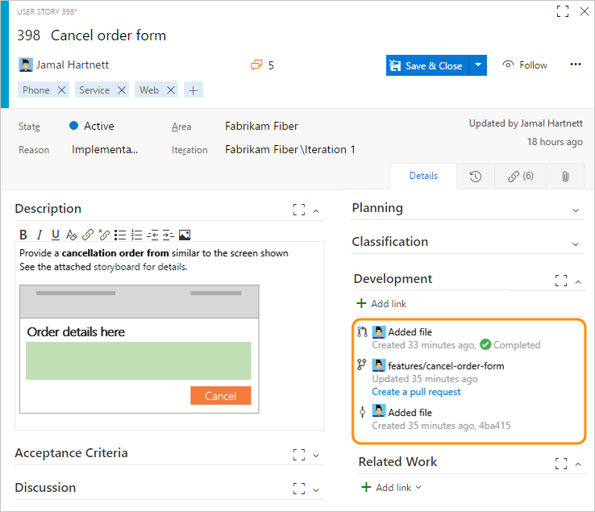
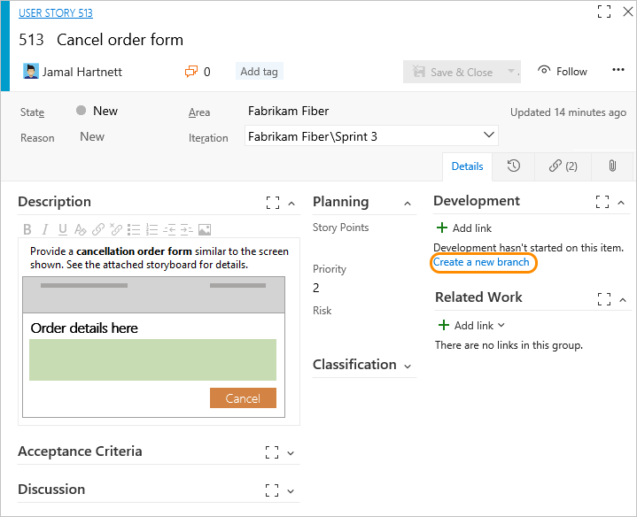
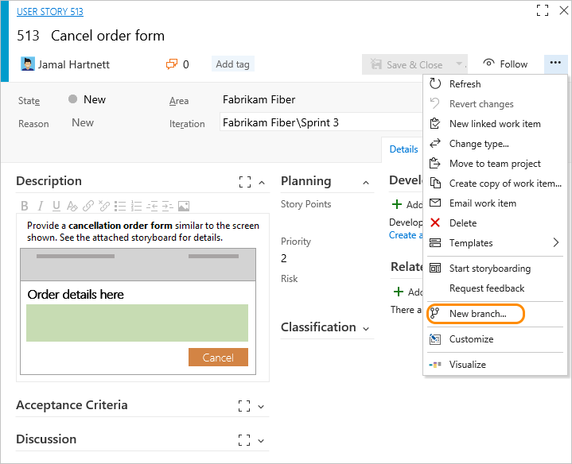
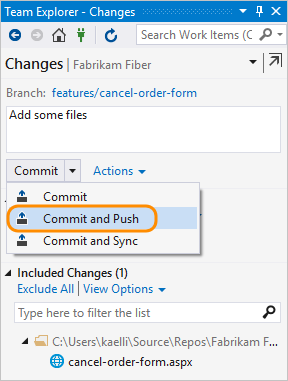
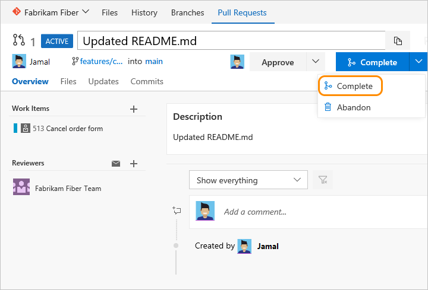
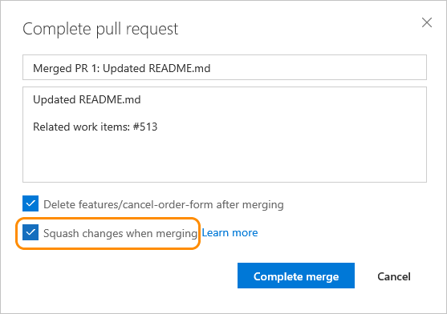
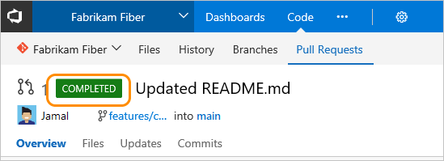
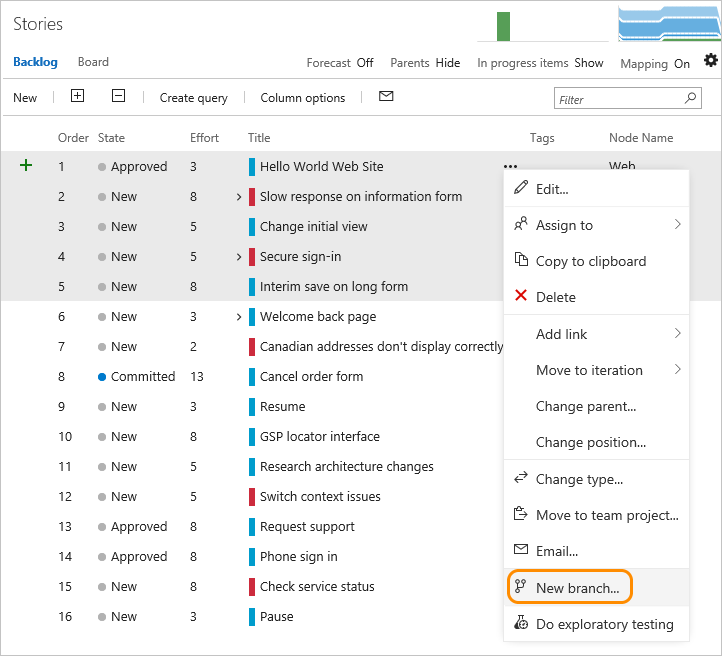
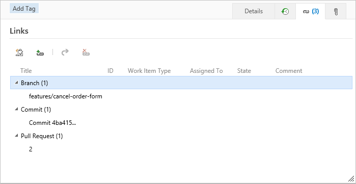
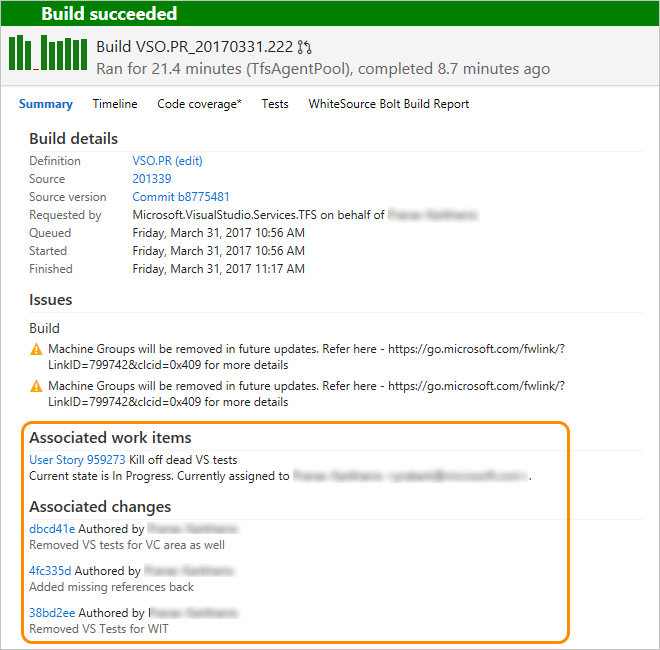

# Drive Git development from a work item   

[!INCLUDE [temp](../../includes/version-tfs-2017-through-vsts.md)]

One of the ways your team can drive their development and stay in sync is to link your work items to the objects created during development, such as branches, commits, pull requests, and builds. You can begin that linking by creating a branch from one or more work items. Later, you can create pull requests, quickly open commits, and maintain a record of development operations performed to complete specific work.  

Review this article to learn:  

>[!div class="checklist"]    
> * How to create a new branch or pull request from a work item   
> * Complete the pull request  
> * Perform a squash merge  
> * Create a branch for several work items  
> * Link a work item to existing development and build objects    


::: moniker range=">= azure-devops-2019"  

> [!IMPORTANT]   
> This article addresses creating new branches and adding links to commits and pull requests to a Git repository hosted on Azure DevOps. To link to GitHub commits and pull requests, see [Link GitHub commits and pull requests to work items](../github/link-to-from-github.md). 

::: moniker-end


The **Development** section records all Git development processes that support completion of the work item. This section can show your team information needed to take the next development step and minimize navigational steps to accomplish common development tasks. It also supports traceability, providing visibility into all the branches, commits, pull requests, and builds related to the work item.<br/>    


  

::: moniker range="tfs-2017"

> [!NOTE]   
> The **Development** section within the work item form is not supported in TFS 2015 and earlier versions. Consider [upgrading to a later Azure DevOps Server version](https://visualstudio.microsoft.com/downloads/). 

::: moniker-end

From it, you can quickly access branches, pull requests, and commits which are linked to the work item. Also, you can initiate a pull request for a branch you've created or linked to from the work item.  


## Prerequisites

::: moniker range="azure-devops"

* You must connect to a project. If you don't have a project yet, [create one](../get-started/sign-up-invite-teammates.md). 
* You must be added to a project as a member of the **Contributors** or **Project Administrators** security group. To get added, [Add users to a project or team](../../organizations/security/add-users-team-project.md). 
* To view or modify work items, you must have your **View work items in this node** and **Edit work items in this node** permissions set to **Allow**. By default, the **Contributors** group has this permission set. To learn more, see [Set permissions and access for work tracking](../../organizations/security/set-permissions-access-work-tracking.md).  

::: moniker-end

::: moniker range="< azure-devops"

* You must connect to a project. If you don't have a project yet, [create one](../../organizations/projects/create-project.md).
* You must be added to a project as a member of the **Contributors** or **Project Administrators** security group. To get added, [Add users to a project or team](../../organizations/security/add-users-team-project.md). 
* To view or modify work items, you must have your **View work items in this node** and **Edit work items in this node** permissions set to **Allow**.  By default, the **Contributors** group has this permission set. To learn more, see [Set permissions and access for work tracking](../../organizations/security/set-permissions-access-work-tracking.md).  

::: moniker-end


<a id="git-development">  </a>

## Workflow process 

Consider creating a new branch when there are no linked code artifacts. If there is a branch but no pull requests, consider creating a pull request. Here's a typical workflow sequence when working with a Git repository. 

1. Start work on the work item by creating a branch. You can add a new Git branch from within the Development section...  

	 
 
	... or, from the form's   :::image type="icon" source="../media/icons/actions-icon.png" border="false":::  Actions menu.  

	 

	Name the branch and select the repository on which it's based.   

	  

	Branches you create are automatically linked to the work item.  

	> [!NOTE]  
	> You can only create a branch once you've added files to the main branch, which we recommend you label ```main``` or other distinctive label. The system automatically adds a README file to the initial repo created with each new project.   

2. The system will open to the repository and branch that you just created. 

	You can edit a file within the web portal. 

	Or, if you have extensive file edits or need to add files, then you'll need to work from Visual Studio or other supported IDE. You'll want to add a new local branch from the branch you just created. For details, see [Update code with fetch and pull, Download changes with fetch](../../repos/git/pulling.md#download-changes-with-fetch). (While any code editing and committing process will work, we work best with an edition of Visual Studio.)  

3. Add or modify files in the branch that you created.   

	From Visual Studio or other supported IDE, commit and push changes from your local branch to the repository.  

	  

	If this is the first time pushing changes from a new branch, you'll need to publish the branch before pushing your changes. For more details, see [Share code with push](../../repos/git/pushing.md).   

4. <a id="create-pull-request">  </a> Create a [pull request](../../repos/git/pull-requests.md) from the work item form.  

	You create a pull request to merge the changes you made to a main branch and get your changes reviewed by other members of your team.  

	 

5.	Your view will switch to **Code**, Pull Requests page. Complete creating the pull request as shown. 
  
 	   

	> [!NOTE]  
	> Once you've created a pull request, you can't create a new pull request for the same branch until you complete the previous pull request.  
	 
	  

	Check the box for **Squash changes when merging** and then complete the merge. 

	  

6. Upon completion, you should see a similar screen as follows.   

	> [!div class="mx-imgBorder"]
	> 

7.	Open the work item form or refresh the form, expand the **Development** section (choose **Maximize Development** :::image type="icon" source="../media/icons/full-screen-icon.png" border="false":::), and you'll see the links that have been added to support the operations you just completed.  

	  


<a id="add-branch-multi-wi">  </a>

## Create a branch for several work items  

You can also add a new branch from the work item listed on the backlog or Kanban board without having to open the work item. Using [multi-select](bulk-modify-work-items.md), you can select several work items and create a new branch where they're all linked to the branch. 

For example, here we select the first five items to link to a new branch.  

 

And, we specify the name of the branch.  

   


<a id="link-objects">  </a>

## Link to existing development and build objects

All items listed under the Development section also appear under the **Links** :::image type="icon" source="media/icon-links-tab-wi.png" border="false"::: tab. All development actions initiated from the Development section are also recorded under the **History** :::image type="icon" source="media/icon-history-tab-wi.png" border="false"::: tab. 

  

To link a work item to an existing object, choose the  Add links icon and then choose the link type.  


[Linking, traceability, and managing dependencies](../queries/link-work-items-support-traceability.md).   


### Remove a link 

If you want to remove a link, you can do so from the **Development** section by highlighting it first and then choose **Remove link** :::image type="icon" source="../media/icons/delete_icon.png" border="false":::.  

  

Or, you can select it from the **Links** :::image type="icon" source="media/icon-links-tab-wi.png" border="false"::: tab and choose **Actions** :::image type="icon" source="../media/icons/actions-icon.png" border="false"::: for the link and then choose the **Remove link** :::image type="icon" source="../media/icons/delete_icon.png" border="false"::: option.

## Related articles


- [Configure repositories and branches to integrate with work tracking](../../repos/git/configure-repos-work-tracking.md)
- [Configure pipelines to support work tracking](../../pipelines/integrations/configure-pipelines-work-tracking.md)
- [Add work items](add-work-items.md)  
- [Git overview](../../repos/git/index.yml) 
- [Link GitHub commits and pull requests to work items](../github/link-to-from-github.md)  
- [Link to work items from other objects](../../notifications/add-links-to-work-items.md)
- [Add work items](add-work-items.md)  
- [Git overview](../../repos/git/index.yml) 

Keep in mind that the **Development** section only appears within the web portal work item form. The work item tracking experience and forms that appear in Visual Studio or other supported clients don't display several of the features that are available from the web portal. 

### Associated work items in build 

With Git commits, any work items that have been linked to a commit are listed under the Associated work items in the build summary page.  

  

<!--- Add info about option to set build linking; link to release notes if needed --> 
 

### Link types showing in the Development section

Links shown in this section appear as a result of these actions:   
- Creating a branch, commit, or pull request from the work item    
- Specifying the work item ID during a commit, pull request, or other supported Git or TFVC operation   
- Specifically linking the work item from the **Development** section or **Links** :::image type="icon" source="media/icon-links-tab-wi.png" border="false"::: tab to a source code branch, build, or other supported Git or TFVC operation.  

Hovering over any entry listed under the Development section activates the hyperlink to the associated object.    

::: moniker range=">= azure-devops-2019"
The link types you can add within the development section are Branch, Build, Changeset, Commit, Found in build, Integrated in build, Pull Request, and Versioned Item. 

 
::: moniker-end

::: moniker range=">= tfs-2017 <= tfs-2018"
The link types you can add within the development section are Branch, Build, Changeset, Commit, Pull Request, and Versioned Item. 

 

::: moniker-end

::: moniker range=">= tfs-2017 <= azure-devops-2019"
To learn more about the links control or to customize the Development links control, see [LinksControlOptions elements, Development links control](../../reference/xml/linkscontroloptions-xml-elements.md#development-links-control). 
 
::: moniker-end

<!---
and only work with the current build processes (not XAML builds)
-->
