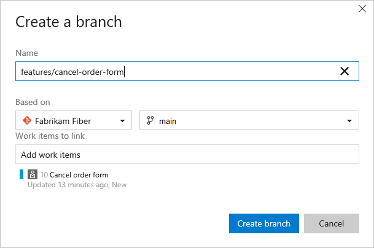
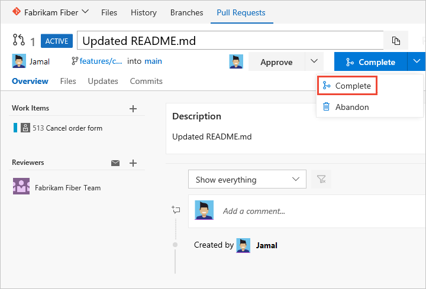
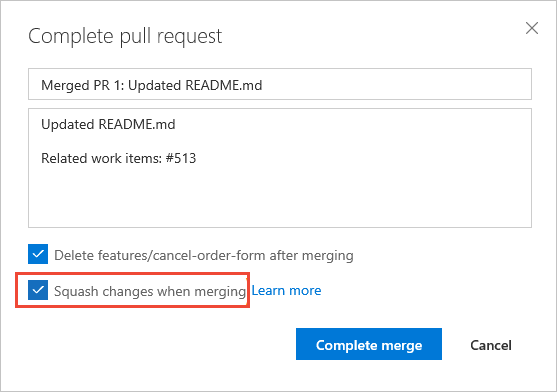

# Drive Git development from a work item in Azure Boards   

[!INCLUDE [version-lt-eq-azure-devops](../../includes/version-lt-eq-azure-devops.md)]

Linking your work items to development objects such as branches, commits, pull requests, and builds is a powerful way to drive development and keep your team synchronized. By creating branches directly from work items, you establish a clear connection between tasks and code changes. As development progresses, you can associate pull requests and commits with these work items, ensuring a comprehensive record of the operations performed to complete specific work.

This article covers how to create new branches, add links to commits, and manage pull requests in a Git repository hosted on Azure DevOps. For instructions on linking GitHub commits and pull requests to work items, see [Link GitHub commits and pull requests to work items](../github/link-to-from-github.md).

> [!TIP]
> You can set up automatic linking and other settings that link work items to Git commits, pull requests, builds, and more. For more information, see the following resources:   
> - [Cross-service overview](../../cross-service/cross-service-overview.md#azure-boards---azure-repos) 
> - [Configure pipelines to support work tracking](../../pipelines/integrations/configure-pipelines-work-tracking.md?toc=/azure/devops/boards/toc.json) 
> - [Link work items to builds and deployments](add-link.md#link-work-items-to-deployments).

## Development control

The **Development** control tracks all Git development activities that contribute to the completion of a work item. It provides your team with the necessary information to take the next development steps, minimizing the need for multiple navigational actions to accomplish common tasks. Additionally, it enhances traceability by displaying all related branches, commits, pull requests, and builds associated with the work item, ensuring comprehensive visibility into the development process.   

::: moniker range=">= azure-devops-2020"  
:::image type="content" source="media/git/development-control.png" alt-text="Screenshot of work item form, Development control.":::
::: moniker-end

::: moniker range="azure-devops-2019"  
:::image type="content" source="media/git/development-control-2019.png" alt-text="Screenshot of work item form, Development control, Azure DevOps Server 2019.":::
::: moniker-end

From the **Development** control, you can quickly access branches, pull requests, and commits linked to the work item. Additionally, you can initiate a pull request for a branch you created or linked directly from the work item.

> [!NOTE]
> The **Development** control is only available within the web portal's work item form. The work item tracking experience and forms in Visual Studio or other supported clients do not display several features available in the web portal. 

## Prerequisites

::: moniker range="azure-devops"

| Category | Requirements |
|--------------|-------------|
| **Project access** | [Project member](../../organizations/security/add-users-team-project.md). |
| **Permissions** | Member of the **Contributors** or [**Project Administrators**](../../organizations/security/add-users-team-project.md) group. |
| **Access levels** | - To view or modify work items: **View work items in this node** and **Edit work items in this node** permissions set to **Allow**. By default, the **Contributors** group has this permission set. For more information, see [Set permissions and access for work tracking](../../organizations/security/set-permissions-access-work-tracking.md). |
|**Access levels**   |To reorder a backlog or use the Forecast tool: At least [**Basic** access](../../organizations/security/access-levels.md). Users with **Stakeholder** access can't reorder backlog items or use the Forecast tool. For more information, see [Stakeholder access quick reference](../../organizations/security/stakeholder-access.md).    |

::: moniker-end

::: moniker range="< azure-devops"

| Category | Requirements |
|--------------|-------------|
| **Project access** | [Project member](../../organizations/security/add-users-team-project.md). |
| **Permissions** | Member of the **Contributors** or [**Project Administrators**](../../organizations/security/add-users-team-project.md) group. |
| **Access levels** | - To view or modify work items: **View work items in this node** and **Edit work items in this node** permissions set to **Allow**. By default, the **Contributors** group has this permission set. For more information, see [Set permissions and access for work tracking](../../organizations/security/set-permissions-access-work-tracking.md). |

::: moniker-end

<a id="git-development">  </a>

## Workflow process 

Consider creating a new branch when there are no linked code artifacts. If a branch exists, but no pull requests, consider creating a pull request. Here's a typical workflow sequence when working with a Git repository. 

1. Start work on the work item by creating a branch. You can add a new Git branch from within the Development section...  

   :::image type="content" source="media/git/development-control-git-github-create-branch.png" alt-text="Screenshot of Development control, Create branch link.":::	

	... or, from the form's  :::image type="icon" source="../media/icons/actions-icon.png" border="false"::: Actions menu.  

	:::image type="content" source="media/git/actions-menu-new-branch-option.png" alt-text="Screenshot shows User story work item form, Action menu, add new branch."::: 

	Name the branch and select the repository.   

	

	When you create branches, they automatically get linked to the work item.  

	> [!NOTE]  
	> You can only create a branch once you've added files to the main branch, which we recommend you label ```main``` or other distinctive label. The system automatically adds a README file to the initial repo created with each new project.   

   The system opens to the repository and branch that you created. 

2.	You can edit a file within the web portal. 

	Or, if you have extensive file edits or need to add files, work from Visual Studio or other supported IDE. Add a new local branch from the branch you created. For more information, see [Update code with fetch and pull, Download changes with fetch](../../repos/git/pulling.md#download-changes-with-fetch). (While any code editing and committing process works, we work best with an edition of Visual Studio.)  

3. Add or modify files in the branch that you created.   

	From Visual Studio or other supported IDE, commit and push changes from your local branch to the repository.  

	  

	If it's your first time pushing changes from a new branch, publish the branch before you push changes. For more information, see [Share code with push](../../repos/git/pushing.md).   

4. <a id="create-pull-request">  </a> Create a [pull request](../../repos/git/pull-requests.md) from the work item form.  

	Create a pull request to merge the changes you made to a main branch and get your changes reviewed by other members of your team.  

	:::image type="content" source="media/git/create-pull-request.png" alt-text="Screenshot shows Development control, Create pull request link.":::  

5. Your view switches to **Code**, Pull Requests page. Complete creating the pull request as shown. 
  
      

   > [!NOTE]  
   > Once you've created a pull request, you can't create a new pull request for the same branch until you complete the previous pull request.  
	 
     

   Check the box for **Squash changes when merging** and then complete the merge. 

     

6. Upon completion, you should see a similar screen as follows.   

	> [!div class="mx-imgBorder"]
	> 

7.	Open the work item form or refresh the form, expand the **Development** section (choose **Maximize Development** :::image type="icon" source="../media/icons/full-screen-icon.png" border="false":::), and you see the links that were added to support the operations you completed.  

     

<a id="add-branch-multi-wi">  </a>

## Create a branch for several work items  

You can also add a new branch from the work item listed on the backlog or board without having to open the work item. Using [multi-select](bulk-modify-work-items.md), you can select several work items and create a new branch where they're all linked to the branch. 

For example, here we select the first five items to link to a new branch.  

:::image type="content" source="media/git/git-dev-multi-select-backlog-create-new-branch.png" alt-text="Screenshot of select multiple items from backlog, Create branch link.":::

And, we specify the name of the branch.  


<a id="link-objects">  </a>

## Link to existing development and build objects

All items listed under the Development section also appear under the **Links** :::image type="icon" source="media/icon-links-tab-wi.png" border="false"::: tab. All development actions started from the Development section are also recorded under the **History** :::image type="icon" source="media/icon-history-tab-wi.png" border="false"::: tab. 

  

To link a work item to an existing object, choose the  Add links icon and then choose the link type.  


### Remove a link 

If you want to remove a link, you can do so from the **Development** section by highlighting it first and then choose **Remove link** :::image type="icon" source="../media/icons/delete_icon.png" border="false":::.  

  

Or, you can select it from the **Links** :::image type="icon" source="media/icon-links-tab-wi.png" border="false"::: tab and choose **Actions** :::image type="icon" source="../media/icons/actions-icon.png" border="false"::: for the link and then choose the **Remove link** :::image type="icon" source="../media/icons/delete_icon.png" border="false"::: option.

## Related articles

- [Learn about Azure DevOps cross-service](../../cross-service/cross-service-overview.md)
- [Configure pipelines to support work tracking](../../pipelines/integrations/configure-pipelines-work-tracking.md)
- [Add work items](add-work-items.md)  
- [Learn about Git](../../repos/git/index.yml) 
- [Link GitHub commits and pull requests to work items](../github/link-to-from-github.md)  
- [Link to work items from other objects](../../organizations/notifications/add-links-to-work-items.md)

### Associated work items in build 

With Git commits, any work items that were linked to a commit are listed under the Associated work items in the build summary page.  

  

<!--- Add info about option to set build linking; link to release notes if needed --> 
 
### Link types showing in the Development section

Links shown in this section appear because of the following actions:   
- Creating a branch, commit, or pull request from the work item    
- Specifying the work item ID during a commit, pull request, or other supported Git or TFVC operation   
- Specifically linking the work item from the **Development** section or **Links** :::image type="icon" source="media/icon-links-tab-wi.png" border="false"::: tab to a source code branch, build, or other supported Git or TFVC operation.  

Hovering over any entry listed under the Development section activates the hyperlink to the associated object.    

The link types you can add within the development section are Branch, Build, Changeset, Commit, Found in build, Integrated in build, Pull Request, and Versioned Item. 


::: moniker-end

::: moniker range="=azure-devops-2019"
For more information about the links control or to customize the Development links control, see [LinksControlOptions elements, Development links control](/previous-versions/azure/devops/reference/xml/linkscontroloptions-xml-elements#development-links-control). 
 
::: moniker-end

<!---
and only work with the current build processes (not XAML builds)
-->
