# Drive Git development from a work item in Azure Boards   

[!INCLUDE [version-lt-eq-azure-devops](../../includes/version-lt-eq-azure-devops.md)]

Link work items to branches, commits, pull requests, and builds so your team can trace every code change back to a planned task. When you create a branch from a work item, Azure Boards links them automatically.

This article walks through creating branches, linking commits, and managing pull requests in an Azure DevOps Git repository. For GitHub repositories, see [Link GitHub commits and pull requests to work items](../github/link-to-from-github.md).

> [!TIP]
> Set up automatic linking so work items stay connected to commits, pull requests, and builds without manual effort:
> - [Azure Boards and Azure Repos integration](../../cross-service/cross-service-overview.md#azure-boards-and-azure-repos-integration)
> - [Configure pipelines to support work tracking](../../pipelines/integrations/configure-pipelines-work-tracking.md?toc=/azure/devops/boards/toc.json) 
> - [Link work items to builds and deployments](add-link.md#link-work-items-to-deployments)
>
> [!INCLUDE [ai-assistance-mcp-server-tip](../../includes/ai-assistance-mcp-server-tip.md)]

## Development control

The **Development** control on the work item form displays linked branches, commits, pull requests, and builds in one place. From this control, you can create branches or pull requests and navigate directly to any linked artifact.

::: moniker range="<=azure-devops"
:::image type="content" source="media/git/development-control.png" alt-text="Screenshot of work item form, Development control.":::
::: moniker-end

> [!NOTE]
> The **Development** control appears only in the web portal. Visual Studio and other clients don't include it.

## Prerequisites

| Category | Requirements |
|--------------|-------------|
| **Project access** | [Project member](../../organizations/security/add-users-team-project.md). |
| **Permissions** | Member of the **Contributors** or [**Project Administrators**](../../organizations/security/add-users-team-project.md) group. |
| **Work item access** | **View work items in this node** and **Edit work items in this node** set to **Allow**. The **Contributors** group has this permission by default. For more information, see [Set permissions and access for work tracking](../../organizations/security/set-permissions-access-work-tracking.md). |

## Create a branch, make changes, and submit a pull request

1. In the **Development** section of the work item, select **Create a branch**.

   :::image type="content" source="media/git/development-control-git-github-create-branch.png" alt-text="Screenshot of Development control, Create branch link.":::	

	Alternatively, select :::image type="icon" source="../media/icons/actions-icon.png" border="false"::: **Actions** > **New branch**.

	:::image type="content" source="media/git/actions-menu-new-branch-option.png" alt-text="Screenshot shows User story work item form, Action menu, add new branch."::: 

1. Name the branch, select the repository, and select **Create branch**.

	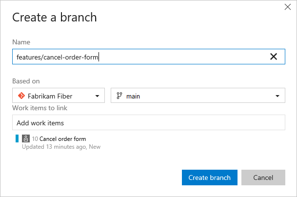

	The branch links to the work item automatically, and the repository opens to the new branch.

	> [!NOTE]  
	> The main branch must contain at least one file before you can create a branch. Each new project includes a README file in the initial repo.   

1. Edit files in the web portal, or clone the repo and work locally in Visual Studio or another IDE. For more information, see [Download changes with fetch](../../repos/git/pulling.md#download-changes-with-fetch).  

1. Commit and push your changes to the repository.

	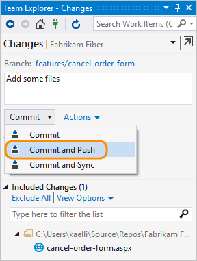  

	For a new branch, publish it before pushing. For more information, see [Share code with push](../../repos/git/pushing.md).   

1.  In the **Development** section, create a [pull request](../../repos/git/pull-requests.md) to merge your changes and start a code review.

	:::image type="content" source="media/git/create-pull-request.png" alt-text="Screenshot shows Development control, Create pull request link.":::  

1. Complete the pull request on the **Pull Requests** page. 
  
   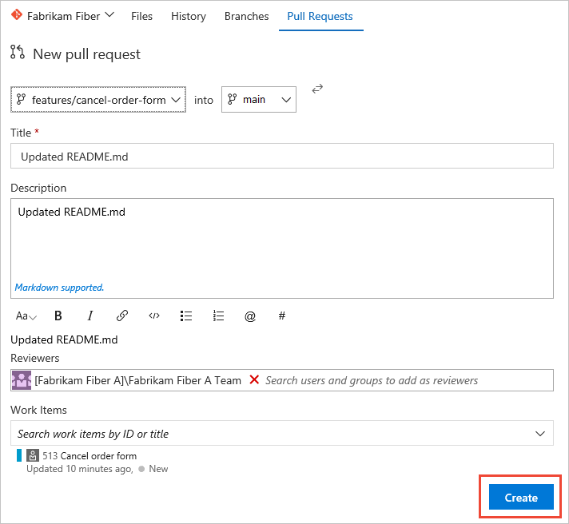   

   > [!NOTE]  
   > You can't create another pull request for the same branch until the current one completes.  
	 
   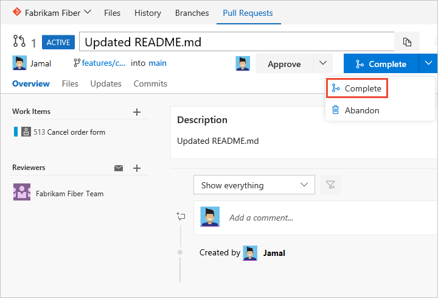  

   (Optional) Select **Squash changes when merging**, and then complete the merge.

   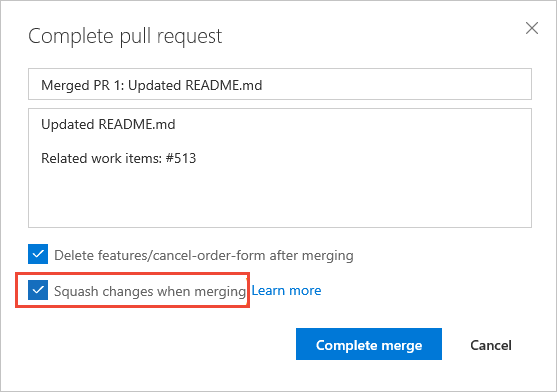  

1. A confirmation appears after the pull request completes.

	> [!div class="mx-imgBorder"]
	> 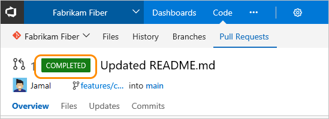

1. Refresh the work item form and select **Maximize Development** :::image type="icon" source="../media/icons/full-screen-icon.png" border="false"::: to see links for the branch, commits, and pull request.

   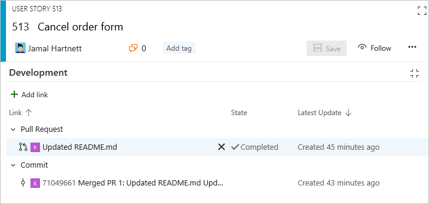  

## Create a branch for several work items  

Use [multi-select](bulk-modify-work-items.md) on the backlog or board to select multiple work items, and then create a branch that links to all of them at once.

:::image type="content" source="media/git/git-dev-multi-select-backlog-create-new-branch.png" alt-text="Screenshot of select multiple items from backlog, Create branch link.":::

Specify the branch name in the dialog.

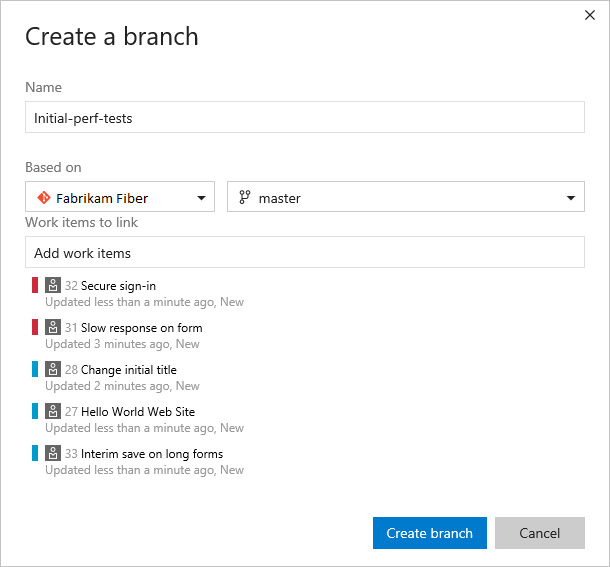

## Link to existing development and build objects

Development links also appear on the **Links** :::image type="icon" source="media/icon-links-tab-wi.png" border="false"::: and **History** :::image type="icon" source="media/icon-history-tab-wi.png" border="false"::: tabs of the work item form.

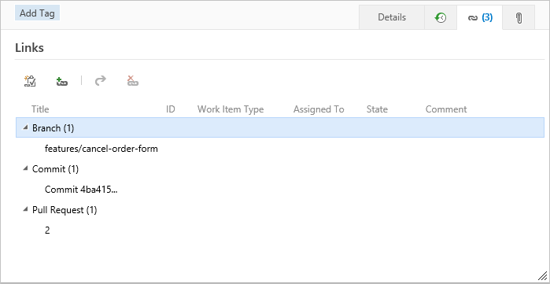  

To link a work item to an existing branch, commit, build, or other object, select :::image type="icon" source="../media/icons/add-link-icon.png" border="false"::: **Add link** and choose the link type.

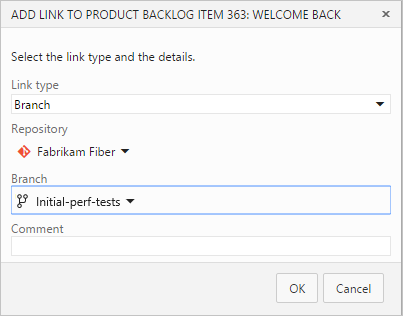

### Remove a link 

In the **Development** section, select the link and select **Remove link** :::image type="icon" source="../media/icons/delete_icon.png" border="false":::.

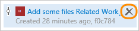  

On the **Links** :::image type="icon" source="media/icon-links-tab-wi.png" border="false"::: tab, select **Actions** :::image type="icon" source="../media/icons/actions-icon.png" border="false"::: > **Remove link** :::image type="icon" source="../media/icons/delete_icon.png" border="false"::: for the link.

### Associated work items in build 

The build summary page shows work items linked to Git commits under **Associated work items**.

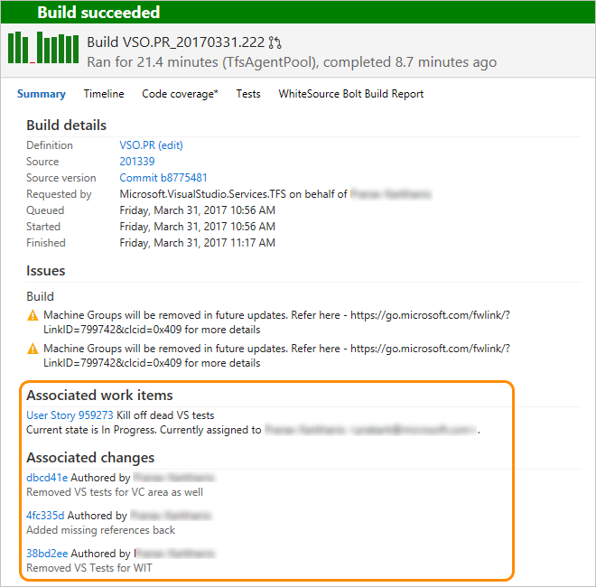  

### Supported link types

Links appear in the **Development** section when you:
- Create a branch, commit, or pull request from the work item
- Reference the work item ID in a commit, pull request, or other Git or TFVC operation
- Manually add a link from the **Development** section or **Links** :::image type="icon" source="media/icon-links-tab-wi.png" border="false"::: tab

Supported link types include Branch, Build, Changeset, Commit, Found in build, Integrated in build, Pull Request, and Versioned Item.

> [!TIP]
> *Integrated in build* also works for GitHub repositories with YAML pipelines. For more information, see [View build status for YAML pipelines](../github/link-to-from-github.md#view-build-status-for-yaml-pipelines-integrated-in-build).

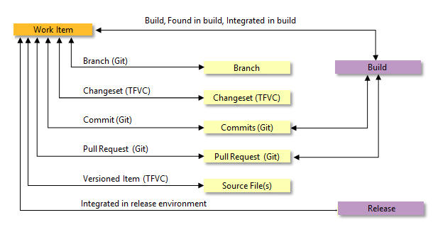

## Use AI to link work items to development

If you connect the [Azure Boards MCP Server](../../mcp-server/mcp-server-overview.md) to your AI agent in agent mode, you can use natural language prompts to manage links between work items and development objects.

| Task | Example prompt |
|------|----------------|
| Link a work item to a PR | `Add a pull request link from user story #234 to pull request #567` |
| Find linked work items | `Show me all work items that have pull request links in the current sprint` |
| Check development status | `List all user stories in the Active state that don't have any development links` |
| View links for a work item | `Show me all links for work item #890, including commits and pull requests` |
| Find unlinked PRs | `Which open pull requests in the FabrikamFiber repo aren't linked to any work item?` |
| Summarize recent commits | `Summarize the commits linked to bug #452 and tell me if the fix looks complete` |
| Trace a feature end-to-end | `Show me every branch, PR, and build linked to feature #100 and its child user stories` |

> [!NOTE]
> Agent mode and the MCP Server use natural language, so you can adjust these prompts or ask follow-up questions to refine the results.

## Related content

- [Learn about Azure DevOps cross-service](../../cross-service/cross-service-overview.md)
- [Configure pipelines to support work tracking](../../pipelines/integrations/configure-pipelines-work-tracking.md)
- [Manage work items](manage-work-items.md)  
- [Learn about Git](../../repos/git/index.yml) 
- [Link GitHub commits and pull requests to work items](../github/link-to-from-github.md)  
- [Link to work items from other objects](add-link.md)
