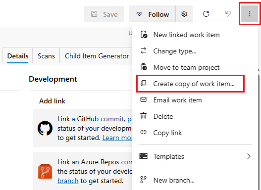
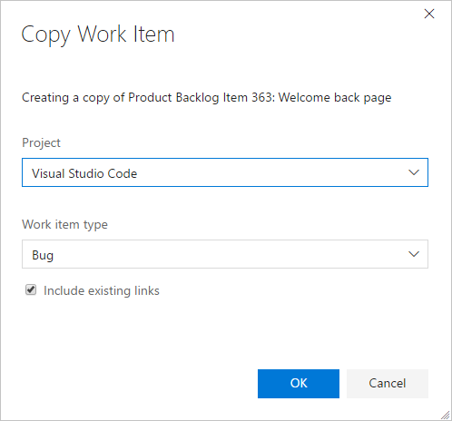
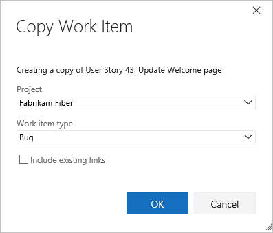
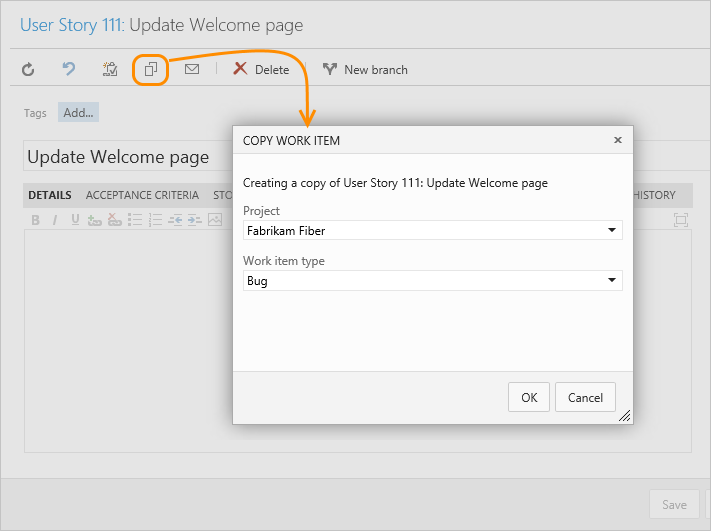
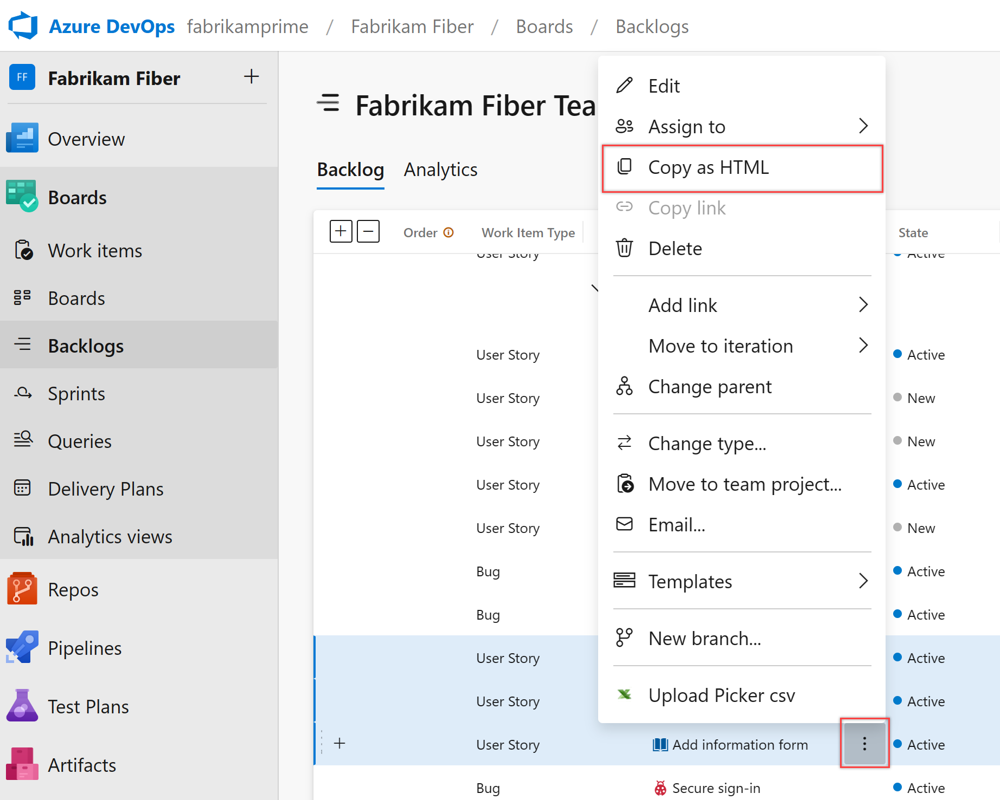
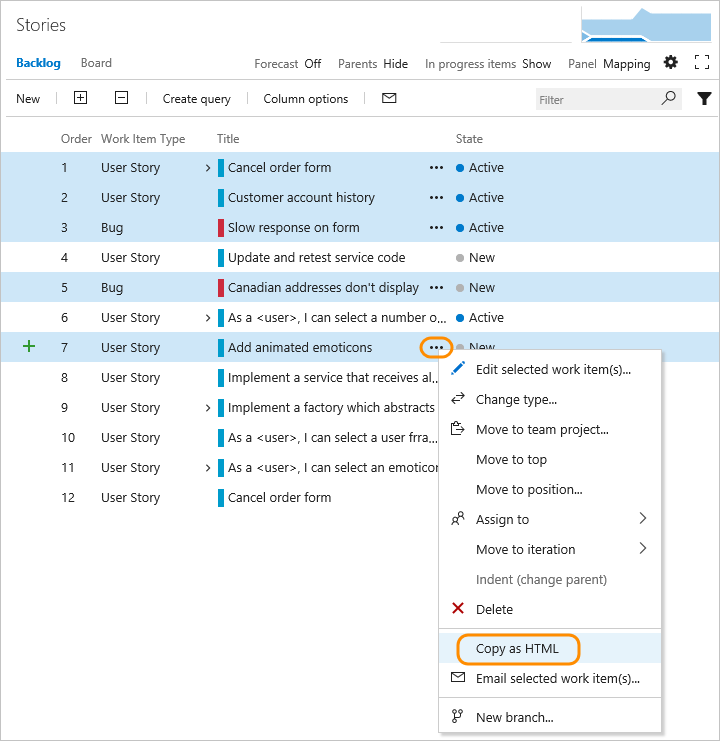
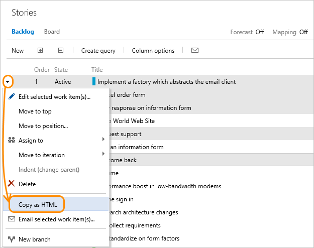
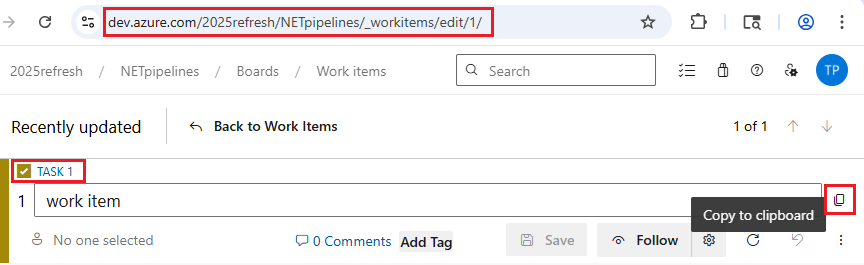
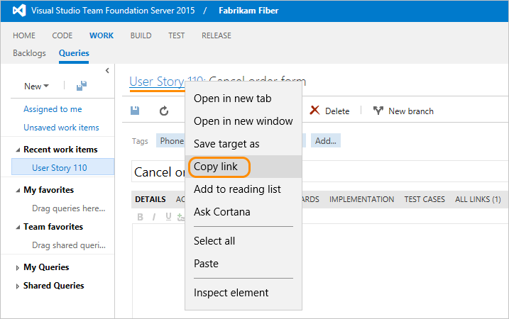
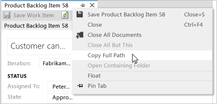

# Copy or clone work items  

[!INCLUDE [temp](../includes/version-all.md)] 
   
::: moniker range=">= azure-devops-2019"

There are two types of copy functions you can use. The first is to duplicate a single work item, referred to as copy or clone. In addition, you can choose to change the project or work item type when copying/cloning a work item. 

::: moniker-end

::: moniker range="< azure-devops-2019"

There are two types of copy functions you can use. The first is to duplicate a single work item, referred to as copy or clone. 

::: moniker-end

The second copy function is to copy a multi-selected list of work items to the clipboard, referred to as copy as HTML or copy to clipboard. 

::: moniker range="< azure-devops-2019"

> [!TIP]    
> You can't copy or clone linked work items at this time. To learn more, see the [Azure Boards FAQs](../faqs.yml#how-do-i-copy-or-clone-a-work-item-with-all-linked-items). 

::: moniker-end

Use this article to learn how to:  

>[!div class="checklist"]      
> * Copy or clone a work item, essentially making a duplicate of a work item     
> * Change the work item type, for example from a bug to a user story 
> * Copy a list of work items to email or share with others  
> * Copy the URL of a work item  

[!INCLUDE [temp](../includes/image-differences.md)] 

[!INCLUDE [temp](../includes/prerequisites-work-items.md)]

## Copy or clone a work item   

Clone a work item when you want to create another instance of it. This action opens a form with all fields filled out. Copy a work item when you want to create another instance of it and optionally change its work item type. This action opens a form with all fields filled out except for the Title. A related link to the original work item is created. Also any parent link is copied over. No history or attachments are copied over from the original work item.  

> [!NOTE]
> It is possible that some fields are copied over depending on the on-premise version you are working with and how you have customized your work item types. If the work item type of the work item that you are cloning has no state transition rule that says to clear the *Closed By* field when the *State* is **New** or **Active**, then that field gets copied over. The current system out-of-box templates have this rule defined. It was added to TFS 2018 and later versions. 

::: moniker range=">= azure-devops-2020"

1. From the web portal, open the work item you want to copy or clone, open the &hellip; context menu, and choose **Create copy of work item**.  
     

1. Choose the project and work item type if different from the copied work item.  Optionally change the Title and provide additional details. 

    :::image type="content" source="media/copy/copy-work-item-s171.png" alt-text="Copy work item dialog":::

	Optionally, check one or more of the boxes: 

	> [!NOTE]   
	> When you copy the work item to a different project, **Include child work items** is disabled. 

	- **Include existing links**: To link the copied work item as a Related link type and maintain all other related and external links included in the copied work item.  
	- **Include existing attachments**: To include attachments in the copied work item
	- **Include child work items**: To include existing links to child work items in the copied work item. This feature isn't recursive. Only those work items directly linked as children to the work item being copied are included.  

1. In the work item form that opens, update other fields as needed. All work items start in the New state.   

::: moniker-end

::: moniker range="azure-devops-2020"
> [!NOTE]   
> The **Include child work items** feature requires installation of Azure DevOps Server 2020.1 update. To learn more, see [Azure DevOps Server 2020 Update 1 RC1 Release Notes, Boards](/azure/devops/server/release-notes/azuredevops2020u1#copy-work-item-to-copy-children).  
::: moniker-end

::: moniker range="azure-devops-2019"

1. From the web portal, open the work item you want to copy or clone, open the &hellip; context menu, and choose **Create copy of work item**.  
     

1. Choose the project and work item type if different from the copied work item.   

    :::image type="content" source="media/copy/copy-work-item-2020.png" alt-text="Copy work item dialog":::

	Optionally, check one or more of the boxes: 

	- **Include existing links**: To link the copied work item as a Related link type and maintain all other related and external links included in the copied work item.  
	- **Include existing attachments**: To include attachments in the copied work item.

1. Choose **OK**.

1. In the work item form that opens, update other fields as needed. All work items start in the New state.  

::: moniker-end

::: moniker range="tfs-2018"
1. From the web portal, open the work item you want to copy or clone, open the &hellip; context menu, and choose **Create copy of work item**.  
     
1. Choose the project and work item type if different from the copied work item.  Optionally change the Title and provide additional details. To link the copied work item as a Related link type and maintain all other links (related links and external links) included in the copied work item, check the **Include existing links** checkbox.  

      

1. Choose **OK**.

1. In the work item form that opens, update other fields as needed. All work items start in the New state.  
::: moniker-end

::: moniker range="tfs-2017"

1. From the web portal, open the work item you want to copy or clone, open the &hellip; context menu, and click **Create copy of work item**.  

     

1. Choose the project and work item type if different from the copied work item. To link the copied work item as a Related link type and maintain all other links (related links and external links) included in the copied work item, check the **Include existing links** checkbox.  

      

1. Choose **OK**.

1. In the work item form that opens, update other fields as needed. All work items start in the New state.  
::: moniker-end

::: moniker range="tfs-2015"

1. From the web portal, open the work item you want to copy or clone, and click the copy/clone icon. The copied work item is automatically linked to the original work item through a Related link type.

     

2. Choose the project (if copying to another project) and work item type if different from the copied work item. Choose **OK**.

1. In the work item form that opens, update other fields as needed. All work items start in the New state.  

::: moniker-end

::: moniker range="tfs-2013"

1. From the web portal, open the work item you want to copy or clone, and click the copy/clone icon. The copied work item is automatically linked to the original work item through a Related link type. 

      

2. Choose the project (if copying to another project) and work item type if different from the copied work item. Optionally change the Title and provide additional details. The copied work item is automatically linked to the original work item through a Related link type.  
::: moniker-end

::: moniker range=">= azure-devops-2019"

## Change the work item type  

If you have a large number of work items whose type you want to change, use [Change work item type](../../reference/add-modify-wit.md). If Change work item type isn't available to you, you can export a set of work items using Excel, copy them to a new Excel list, and re-import them by specifying a different work item type. See [Bulk add or modify work items with Excel](../backlogs/office/bulk-add-modify-work-items-excel.md). 
::: moniker-end

## Copy a list of work items  

With this option, you can copy an HTML formatted table of selected items from either a backlog page or query results list. You can then email this list using your choice of email client, or paste into a Word document, Excel spreadsheet, or other application. 

::: moniker range="<= azure-devops-2019"
> [!NOTE]  
> The data copied with **Copy as HTML** is the same as that copied when you select **Email selected work items**. If you don't have an SMTP server configured, you can work around this by using **Copy as HTML**. For on-premises Azure DevOps, all email actions require an [SMTP server to be configured](/azure/devops/server/admin/setup-customize-alerts). 
::: moniker-end

::: moniker range=">= tfs-2018"

1. From the web portal, open a backlog or query results page, and [multi-select the work items](bulk-modify-work-items.md#multi-select) you want to copy to the clipboard. 

2. Open the &hellip; context menu of one of the selected work items, and then choose **Copy to clipboard** or **Copy as HTML**. 

    Here we multi-select from the product backlog and choose <b>Copy to clipboard</b>.

     

::: moniker-end

::: moniker range="tfs-2017"

1. From the web portal, open a backlog or query results page, and [multi-select the work items](bulk-modify-work-items.md#multi-select) you want to copy to the clipboard. 

2. Open the &hellip; context menu of one of the selected work items, and then choose **Copy as HTML**.   

    Here we multi-select from the backlog page. 

     
   ::: moniker-end 

::: moniker range=">= tfs-2013 <= tfs-2015"

1. From the web portal, open a backlog or query results page, and [multi-select the work items](bulk-modify-work-items.md#multi-select) you want to copy to the clipboard. 

2. Open the  context menu of one of the selected work items, and then choose **Copy as HTML**. 

    Here we multi-select from the backlog page.

     
   ::: moniker-end 

## Paste the contents into your email client

Paste the contents of the clipboard into your email client or other application. To open a linked work item, requires users to have read access to the project or area node for those work items. 

The formatted table contains a link to each work item included in your selected results list. A link to a query that will open only those work items selected is also provided. 

  

## Copy the URL

#### [Browser](#tab/browser/)

::: moniker range=">= tfs-2017"
Copy the URL from the web browser address or hover over the title and then click the  copy-to-clipboard icon.  

::: moniker-end

::: moniker range=">= tfs-2013 <= tfs-2015" 
Right click the link ID to open the browser copy link option.

 
::: moniker-end

#### [Visual Studio](#tab/visual-studio/)

In Visual Studio, right-click the work item tab to copy the URL. The URL opens the work item in the web portal.  

* * *

## Related topics

-  [Azure Boards FAQs](../faqs.yml) 
- [Bulk modify work items](bulk-modify-work-items.md)   
- [Move, change, or delete work items](remove-delete-work-items.md)  
- [Pre-populate fields using work item templates](work-item-template.md)

