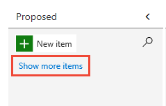
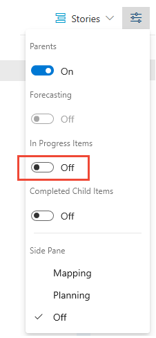

# Create and manage your backlog

[!INCLUDE [version-lt-eq-azure-devops](../../includes/version-lt-eq-azure-devops.md)]

The product backlog is your project plan, which shows what your team intends to deliver. It contains user stories, backlog items, or requirements that you add to it. Your backlog is a flat list of work items, as the following image illustrates, which shows a Scrum process for Azure Boards. For the Agile, Basic, and Capability Maturity Model Integration (CMMI) process models, the **Backlog items** selection appears as **Stories**, **Issues**, and **Requirements**.

Your product backlog is one of three classes of backlogs available to you: *backlogs*, *boards*, and *plans*.

:::image type="content" source="media/create-backlog/intro-image.png" alt-text="Screenshot of a Backlog of Scrum process product backlog items.":::

[!INCLUDE [link other articles](../includes/note-configure-customize.md)]

## Prerequisites

[!INCLUDE [prerequisites](../includes/prerequisites.md)]

::: moniker range="azure-devops"
[!INCLUDE [ai-assistance-mcp-server-tip](../../includes/ai-assistance-mcp-server-tip.md)]
::: moniker-end

## Backlog and sprint work item filtering

Your product **Backlog**, **Board**, and sprint backlogs display work items based on the following criteria:

| Process | Work Item Type | Backlog Name |
|---------|----------------|--------------|
| [Basic](../get-started/plan-track-work.md) | Issue | **Issues** |
| [Agile](../work-items/guidance/agile-process.md) | User Story | **Stories** |
| [Scrum](../work-items/guidance/scrum-process.md) | Product Backlog Item | **Backlog items** |
| [CMMI](../work-items/guidance/cmmi-process.md) | Requirement | **Requirements** |

More filtering criteria:
- **Area Path** matches one of your team's selected Area Paths
- **Iteration Path** is under your team's Default Iteration Path

[!INCLUDE [temp](../includes/basic-process-note.md)] 

Sprint backlogs and Taskboards apply these same filters plus the selected **Iteration Path**. You can only select Iteration Paths [preselected by your team](../../organizations/settings/set-iteration-paths-sprints.md#list-team-iterations). Sprint backlogs display only work items assigned to the selected sprint—child tasks assigned to other sprints aren't displayed.

> [!div class="mx-imgBorder"]
> 

For more information, see [Define area paths and assign to a team](../../organizations/settings/set-area-paths.md) and [Define sprint paths and configure team iterations](../../organizations/settings/set-iteration-paths-sprints.md#list-team-iterations).

## Add a backlog

Every project includes a default team with backlogs. To support more teams, see [Create or add a team](../../organizations/settings/add-teams.md).

Each process defines the following specific backlog levels:

- [Agile](../work-items/guidance/agile-process.md): **Stories**, **Features**, and **Epics**
- [Basic](../get-started/plan-track-work.md): **Issues** and **Epics**
- [Scrum](../work-items/guidance/scrum-process.md): **Backlog items**, **Features**, and **Epics**
- [CMMI](../work-items/guidance/cmmi-process.md): **Requirements**, **Features**, and **Epics**

::: moniker range="<=azure-devops"

To customize your backlog, see [Inherited process model](../../organizations/settings/work/inheritance-process-model.md) or [On-premises XML process model](../../reference/on-premises-xml-process-model.md).
::: moniker-end

## Open your backlog

From your web browser, follow these steps to open your product backlog.  

1. Sign in to your project (`https://dev.azure.com/{Your_Organization}/{Your_Project}`).
1. Select **Boards** > **Backlogs**.

   :::image type="content" source="media/create-backlog/open-backlogs.png" alt-text="Screenshot of sequence selection for opening Backlogs in Boards.":::

   To select a different backlog, choose a different team or select the **View Backlog directory** option. You can also enter a keyword in the search box to filter the team backlogs for the project.

   :::image type="content" source="media/create-backlog/backlog-team-selector.png" alt-text="Screenshot showing team selection dropdown menu.":::

   > [!TIP]
   > Choose the :::image type="icon" source="../../media/icons/icon-favorite-star.png" border="false"::: star icon to favorite a team backlog. Favorited artifacts (:::image type="icon" source="../../media/icons/icon-favorited.png" border="false"::: favorited icon) appear at the top of the team selector list.

1. Check that you selected **Stories** (for Agile), **Issues** (for Basic), **Backlog items** (for Scrum), or **Requirements** (for CMMI) as the backlog level.

   :::image type="content" source="media/create-backlog/backlog-selector.png" alt-text="Screenshot shows the option to Choose backlog level.":::

1. (Optional) To select which columns display and in what order, select the :::image type="icon" source="../../media/icons/actions-icon.png" border="false"::: actions icon and **Column options**. For more information, see [Change column options](../backlogs/set-column-options.md).

   :::image type="content" source="media/create-backlog/open-column-options.png" alt-text="Screenshot showing Column Options button selection.":::

[!INCLUDE [tip backlog view](../includes/tip-configure-backlog-view.md)]

## Track bugs on your backlog

Some teams track bugs along with requirements on the backlog. Other teams track bugs as tasks completed in support of a requirement, so bugs appear on their [Taskboard](../sprints/task-board.md). Before you determine how to manage bugs, see [Bugs as requirements or tasks](../configure-customize.md#show-bugs) and [Show bugs on backlogs and boards](../../organizations/settings/show-bugs-on-backlog.md).

<a id="convert-ideas"></a>

## Convert ideas into backlog items

Your backlog shows work that you plan to do or that's in progress. As soon as the **State** of a work item is set to *Done* or *Completed*, the work item doesn't appear on your backlog. You can use the [backlog controls](backlogs-overview.md#product-backlog-controls) to filter or change your view.

If you already defined a long list of items, you don't need to reenter them one at a time. Instead, use [bulk work items with CSV files](../queries/import-work-items-from-csv.md) or [Microsoft Excel](../backlogs/office/bulk-add-modify-work-items-excel.md) to import them to your backlog.

1. Before you add work items, select :::image type="icon" source="../../media/icons/view-options-icon.png" border="false"::: **View options** and turn the slider for **Parents** and **Forecasting** to **Off**. Optionally, turn **In Progress Items** on or off.

   :::image type="content" source="media/create-backlog/view-options-parents-off.png" alt-text="Screenshot of view options parents turned off.":::

1. To add a work item, select :::image type="icon" source="../../media/icons/blue-add-icon.png" border="false":::**New Work Item** and enter a title. Select **Enter** or select **Add to top**. The default **Area Path** and **Iteration Path** selected for the team are assigned to work items. For more information, see [Manage and configure team tools](../../organizations/settings/manage-teams.md).

   :::image type="content" source="media/create-backlog/add-new-items-agile.png" alt-text="Screenshot of work item added by using New Work Item.":::

   > [!NOTE]  
   > If you have **Stakeholder** access, you can only add work items to the bottom of the backlog. For more information, see [Stakeholder access quick reference](../../organizations/security/stakeholder-access.md).

Depending on whether you create your project with [Basic](../get-started/plan-track-work.md), [Agile](../work-items/guidance/agile-process.md), [Scrum](../work-items/guidance/scrum-process.md), or [CMMI](../work-items/guidance/cmmi-process.md), the items in your backlog might be called issues, user stories, PBIs, or requirements. All of these terms describe the customer value to be delivered and the work to be performed.

By default, user stories appear on Agile backlogs, issues on Basic backlogs, PBIs and bugs appear on Scrum backlogs, and requirements appear on CMMI backlogs.

<a id="reorder-backlog">  </a>
<a id="move-items-priority-order">  </a>

## Reorder your backlog

Reorder your items to create a prioritized list of work. Review and prioritize your backlog frequently to help your team know what's most important to deliver next.

You can't sort your backlog on a column. To view a sorted list, select **Create query**. Save and open the query, and sort the query results. For more information about queries, see [Use the query editor to list and manage queries](../queries/using-queries.md).

To reorder your backlog, drag the work items. Or, if you prefer to use the keyboard, hold down the **Alt** key and use the up and down arrows.

:::image type="content" source="media/create-backlog/cyb-order-backlog.png" alt-text="Screenshot of Reordered work items in the backlog.":::

> [!NOTE]  
> To reorder a backlog, have at least Basic access. If you have Stakeholder access, you can't reorder backlog items. For more information, see [Stakeholder access quick reference](../../organizations/security/stakeholder-access.md).

Backlogs that participate in portfolio management or that contain nested same-type child items might not allow you to reorder the items. For more information, see the following articles:

- [Work with multi-team ownership of backlog items](backlogs-overview.md#multi-team)
- [Troubleshoot reordering and nesting issues](resolve-backlog-reorder-issues.md)

<a id="estimates">  </a>

## Add details and estimates to backlog items

Add detailed information to each backlog item. This information helps your team estimate effort and deliver successfully.

**To edit a work item:**
1. Double-click the item or select **Enter** to open the work item form.
1. Add descriptions, field values, or discussion notes.
1. Use the :::image type="icon" source="../media/icons/icon-attachments-tab-wi.png" border="false"::: **Attachments** tab to share supporting files.

Provide enough detail for your team to understand scope, estimate work, create tests, and deliver the expected outcome.

[!INCLUDE [note user assigned](../includes/note-user-assigned.md)]

### [Agile process](#tab/agile-process)

For example, assign the story to Raisa Pokrovskaya and add a discussion note that at-mentions Raisa.

:::image type="content" source="../get-started/media/plan-track-work/user-story-form-add-details.png" alt-text="Screenshot of User Story work item form, add details.":::

Select **Save & Close** when you're done.

### [Basic process](#tab/basic-process)

For example, assign the issue to Raisa Pokrovskaya and add a discussion note that at-mentions Raisa.

:::image type="content" source="../get-started/media/track-issues/issue-form-add-details.png" alt-text="Screenshot of Issues work item form, add details.":::

Select **Save & Close** when you're done.

### [Scrum process](#tab/scrum-process)

For example, assign the product backlog item to Christie Church and set an Effort level of 8.

:::image type="content" source="media/create-backlog/pbi-form.png" alt-text="Screenshot of Product Backlog Item form.":::

Select **Save & Close** when you're done.

### [CMMI process](#tab/cmmi-process)

For example, assign the product backlog item to Jamal Hartnett and set Size to 8.

:::image type="content" source="../work-items/guidance/media/cmmi-requirement-form.png" alt-text="Screenshot of Requirements work item form.":::

Select **Save & Close** when you're done.

***

### Key fields for backlog planning

Use these essential fields to estimate effort and define requirements for sprint planning:

| Field | Purpose |
|-------|---------|
| [Effort](../queries/query-numeric.md), [Story Points](../queries/query-numeric.md), [Size](../queries/query-numeric.md) | **Estimate work required** - Use relative sizing (powers of 2, Fibonacci sequence, or your team's preferred scale). These estimates calculate [velocity](../../report/dashboards/team-velocity.md) and [forecast sprints](../sprints/forecast.md). |
| [Business Value](../queries/query-numeric.md) | **Set priority** - Assign relative value compared to other items. Higher numbers indicate greater business value. |
| [Description](../queries/titles-ids-descriptions.md) | **Define scope** - Provide clear details about user needs and requirements. Focus on what users want to accomplish and why. |
| [Acceptance Criteria](../queries/titles-ids-descriptions.md) | **Define "Done"** - Describe specific criteria for completion. Establish shared understanding between team and customers for acceptance testing. |
| [Impact Assessment](/previous-versions/azure/devops/boards/work-items/guidance/cmmi/guidance-requirements-field-reference-cmmi) | **Assess risk (CMMI only)** - Document customer impact of not implementing the requirement. |

<a id="show-hide-in-progress"></a>  

## Show or hide In Progress items

Use the **View options** selector to toggle **In Progress Items** visibility. When turned off, items in *Active*, *Committed*, or *Resolved* states (or states that map to the [In Progress category state](../work-items/workflow-and-state-categories.md)) don't appear in the backlog.

:::image type="content" source="media/create-backlog/in-progress-control-2020.png" alt-text="Screenshot shows the  View options selector with In progress selected.":::

**Hide** in progress items when [forecasting work](../sprints/forecast.md).

<a id="show-hide-completed"></a>  

## Show or hide work items in Completed state

Use the **View options** selector to toggle **Completed Child items** visibility based on your needs.

:::image type="content" source="media/create-backlog/completed-child-items-control-2020.png" alt-text="Screenshot shows the View options selector with Completed child items selected.":::

**Show** completed child items to [view rollup columns](display-rollup.md).  
**Hide** completed child items when [forecasting work](../sprints/forecast.md).

[!INCLUDE [temp](../includes/note-closed-items.md)]

## Review checklist for work items, backlogs, and boards

If you don't see the work items you expect on your [product Backlog](create-your-backlog.md) or [board](../boards/kanban-quickstart.md), complete the following checks: 

1. Make sure you selected the team backlog or board of interest. To learn how, see [Use breadcrumbs and selectors to go to and open artifacts](../../project/navigation/use-breadcrumbs-selectors.md). 

1. [Create a query](../queries/using-queries.md) of your backlog items, specifying the work item types that belong to your Requirements category and the Area Path associated with your team, for example:  

	> [!div class="mx-imgBorder"]
	> 

1. Add the <strong>State</strong>, <strong>Area Path</strong>, and <strong>Iteration Path</strong> fields to the [column options](set-column-options.md).

1. Check the query results and that the values of the work items you expect to show up on your backlog meet these criteria:
	- <strong>Area Path</strong> belongs to your team's area path(s)
	- <strong>Iteration Path</strong> belongs under your team's default iteration path
	- <strong>State</strong> isn't Closed, Completed, Done, or Removed. 

> [!NOTE]
> You can also filter your product backlog to show or hide work items that are in an **In Progress** state category, corresponding to an Active, Resolved, Committed, Doing workflow state. 

## Other factors that affect work items in your backlogs and boards

The following settings influence the type and number of work items that appear in your backlogs and boards. 

- In your board, newly added work items don't appear if they're stack ranked lower within the product backlog. By choosing **Show more items**, you can cause the board to refresh and display more work items. 

	> [!div class="mx-imgBorder"]  
	> 

- If you turn off the **In Progress** view, work items where work has started don't appear in the backlog list.  

	::: moniker range="<=azure-devops"
	> [!div class="mx-imgBorder"]  
	>   
	::: moniker-end

- Work items appear in the priority order in which you add or move them. You manage this order or sequence by the **Stack Rank** (Basic, Agile, and CMMI processes) or **Backlog Priority** (Scrum) field. For more information, see the Stack rank section in [Backlogs, portfolios, and Agile project management](backlogs-overview.md#stack-rank).

- Each backlog displays up to 999 work items. If your backlog exceeds this limit, consider adding a team and moving some of the work items to the other team's backlog.  

- Sprint backlogs show only those work items that meet the team's area path and the **Iteration Path** defined for the sprint. 

- Inheritance process model: If an administrator [disables or deletes a work item type](../../organizations/settings/work/customize-process-work-item-type.md#enable-disable), it doesn't appear on backlogs and boards. 

- On-premises XML process model: If an administrator [deletes or destroys a work item type](../../reference/witadmin/witadmin-import-export-manage-wits.md), it doesn't appear on backlogs and boards.

::: moniker range="azure-devops"

<a id="use-ai-assistance"></a>

## Use AI to manage your backlog

If you configure the [Azure DevOps MCP Server](../../mcp-server/mcp-server-overview.md), you can use AI assistants to manage your backlog by using natural language prompts.

### Example prompts for backlog management

| Task | Example prompt |
|------|----------------|
| **Get backlog items** | ```copilot-prompt Get list of work items for <Stories> backlog in <Contoso> project ``` |
| **View my work items** | ```copilot-prompt Get my work items for project <Contoso> ``` |
| **Create work items** | ```copilot-prompt Create a new user story in <Contoso> project with title '<Add search functionality>' ``` |
| **Update work items** | ```copilot-prompt Update work item <1234> with Story Points = <5> and State = <Active> ``` |
| **Prioritize backlog** | ```copilot-prompt Get all work items in the product backlog for <Contoso> and prioritize them for a <two-week> sprint with <three> developers ``` |
| **Triage work** | ```copilot-prompt List work items for <Stories> backlog, find all security-related bugs, and assign the first <4> to the current iteration ``` |

> [!TIP]
> - If you're using Visual Studio Code, [agent mode](/visualstudio/ide/copilot-chat-context#agent-mode) is especially helpful for troubleshooting complex backlog scenarios.
> - To avoid using stale or cached data from previous queries, add to your prompt, "Do not use previously fetched data."

::: moniker-end

## Next step

With your backlog in place, your team can begin work on the top-priority items. Now it's time to decide how you want to work as a team. Choose your team's workflow: Scrum for structured sprints or Kanban for continuous flow. You can use these methods independently or together.

> [!div class="nextstepaction"]
> [Scrum: Schedule sprints](../sprints/define-sprints.md) or [Kanban](../boards/kanban-quickstart.md)

## Related content

- [Configure and customize Azure Boards](../configure-customize.md)  
- [Bulk modify work items](bulk-modify-work-items.md)
- [Interactively filter backlogs, boards, queries, and plans](filter-backlogs-boards-plans.md)
- [Backlog priority or stack rank order](backlogs-overview.md#stack-rank)
- [Add a team, move from one default team to several teams](../../organizations/settings/add-teams.md)
