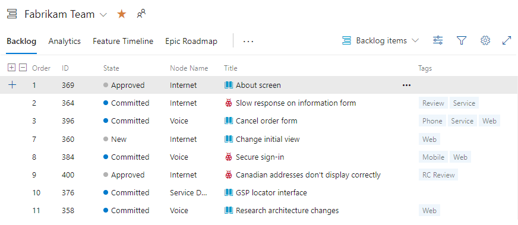
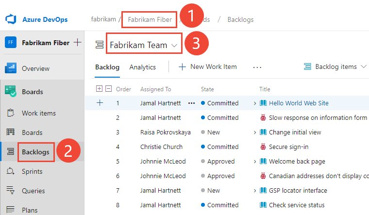
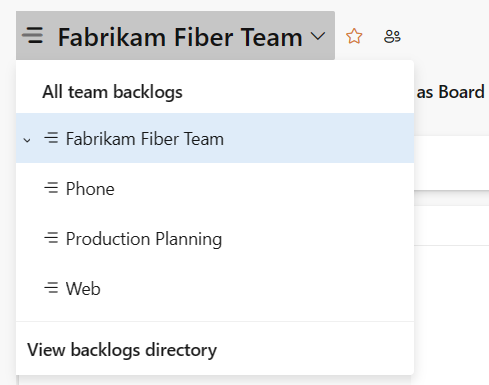
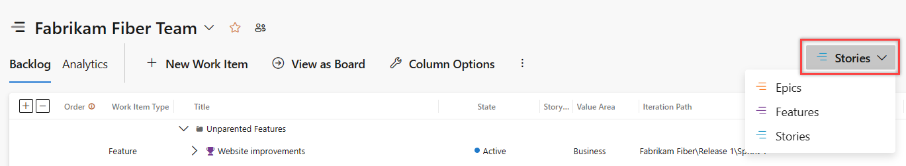
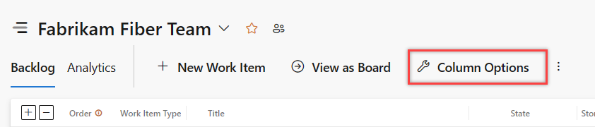
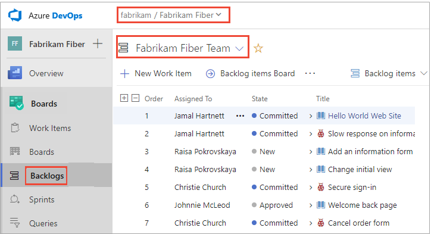
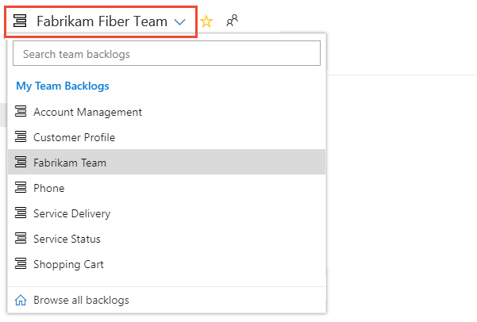
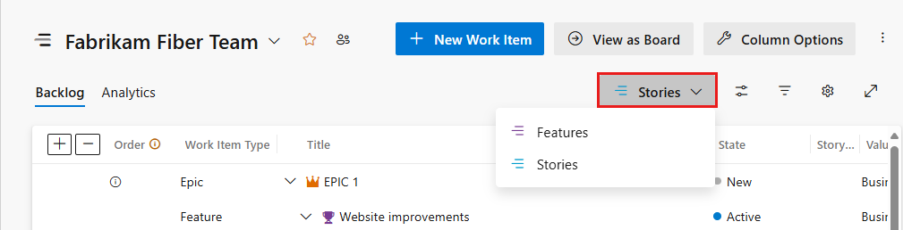
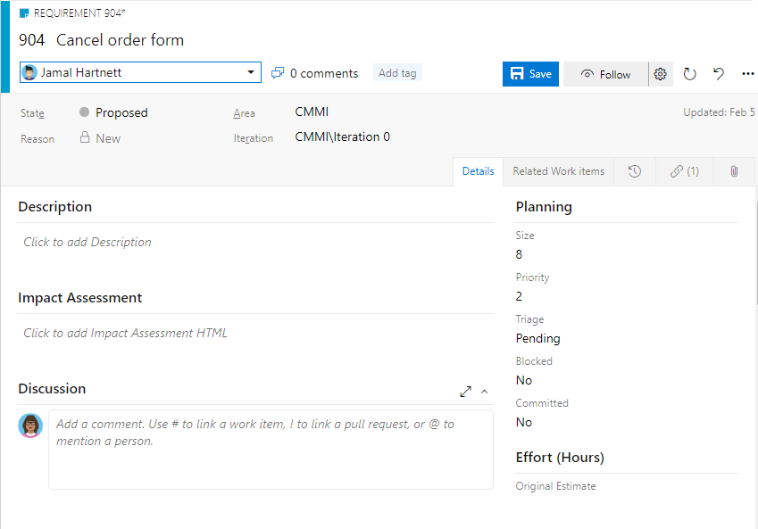

# Create your product backlog 

[!INCLUDE [temp](../includes/version-all.md)]

Your product backlog corresponds to your project plan, the roadmap for what your team plans to deliver. You create your product backlog by adding user stories, backlog items, or requirements. As shown in the following image, your backlog consists of a flat list of work items. 

> [!NOTE]   
> The following image illustrates the product backlog image for a Scrum process for Azure DevOps Services. For the Agile, Basic, and CMMI process models, the **Backlog items** selection appears as **Stories**, **Issues**, and **Requirements**. 

> [!div class="mx-imgBorder"]  
> 

After you define it, you have a prioritized list of features and requirements to build. Your backlog also provides a repository of all the information you need to track and share with your team. And, you're able to [interactively filter the backlog](filter-backlogs-boards-plans.md) to focus on a subset of work items.  

[!INCLUDE [temp](../includes/note-configure-customize.md)]

Your backlog consists of a list of [work items](../work-items/about-work-items.md). 
You use work items to share information, assign work to team members, track dependencies, organize work, 
and more. Because the most important work appears at the top of the list, your team always knows what to work on next.

> [!NOTE]  
> Your product backlog is one of three classes of backlogs available to you. For an overview of the features supported on each backlog and the two types of boards, see [Backlogs, boards, and plans](backlogs-boards-plans.md). If you're not seeing the work items you expect on your backlog, review [Setup your backlogs and boards](set-up-your-backlog.md).   

[!INCLUDE [temp](../includes/prerequisites.md)]

## Open your backlog  

From your web browser, open your product backlog.  

::: moniker range=">= azure-devops-2020"

1. (1) Check that you have selected the right project, (2) choose **Boards>Backlogs**, and then (3) select the correct team from the team selector menu. 

	> [!div class="mx-imgBorder"]  
	> 

    To select another backlog, open the selector and then choose a different team or select the **View Backlog directory** option. Or, enter a keyword in the search box to filter the list of team backlogs for the project.

	> [!div class="mx-imgBorder"]  
	>  

	> [!TIP]    
	> Choose the  :::image type="icon" source="../../media/icons/icon-favorite-star.png" border="false":::  star icon to favorite a team backlog. Favorited artifacts (:::image type="icon" source="../../media/icons/icon-favorited.png" border="false"::: favorited icon) appear at the top of the team selector list. 

1. Check that you have selected **Stories** (for Agile), **Issues** (for Basic), **Backlog items** (for Scrum), or **Requirements** (for CMMI) as the backlog level. 

	> [!div class="mx-imgBorder"]  
	>  

2. (Optional) To choose which columns should display and in what order, choose the  :::image type="icon" source="../../media/icons/actions-icon.png" border="false":::  actions icon and select **Column options**. To learn more, see [Change column options](../backlogs/set-column-options.md). 

	> [!div class="mx-imgBorder"]  
	>  

::: moniker-end

::: moniker range="azure-devops-2019"

1. Check that you selected the right project, and select **Boards** > **Backlogs**. Then select the correct team from the team selector menu. 

    

    To select another backlog, open the selector and then choose a different team or select the :::image type="icon" source="../../media/icons/home-icon.png" border="false"::: **Browse all backlogs** option. Or, enter a keyword in the search box to filter the list of team backlogs for the project.

    > [!div class="mx-imgBorder"]  
    >  

    > [!TIP]    
    > Select the  :::image type="icon" source="../../media/icons/icon-favorite-star.png" border="false":::  star icon to make a team backlog a favorite. Favorite artifacts (:::image type="icon" source="../../media/icons/icon-favorited.png" border="false"::: favorite icon) appear at the top of the team selector list. 

1. Check that you selected **Stories** for Agile, **Issues** for Basic, **Backlog items** for Scrum, or **Requirements** for CMMI as the backlog level. 

    > [!div class="mx-imgBorder"]  
    >  

2. (Optional) To select which columns display and in what order, select the  :::image type="icon" source="../../media/icons/actions-icon.png" border="false":::  actions icon and select **Column options**. To learn more, see [Change column options](../backlogs/set-column-options.md). 

    > [!div class="mx-imgBorder"]  
    >  

::: moniker-end

::: moniker range=">= tfs-2017 <= tfs-2018"

On your web browser, open your team's product backlog and select the team from the project and team selector. Then select **Work** > **Backlogs**. Select the product backlog, which is **Backlog items** for Scrum, **Stories** for Agile, or **Requirements** for CMMI. 

> [!div class="mx-imgBorder"]
>  

To select another team, open the project and team selector. Select a different team, or select the **Browse** option. 

> [!div class="mx-imgBorder"]  
>  

::: moniker-end
::: moniker range="<= tfs-2015"

On your web browser, open your team's product backlog. Select **Boards** > **Backlogs**. 

::: moniker-end

## Track bugs on your backlog 

You can choose how you want to manage bugs. Some teams like to track bugs along with requirements on the backlog. Other teams like to track bugs as tasks performed in support of a requirement. The bugs then appear on their [taskboard](../sprints/task-board.md).

Before deciding, review [Configure and customize, Treat bugs as requirements or tasks](../configure-customize.md#show-bugs) for guidance. Or, go directly to [Show bugs on backlogs and boards](../../organizations/settings/show-bugs-on-backlog.md). 

<a id="convert-ideas" />

## Convert ideas into backlog items 

Your backlog shows work that you plan to do or have started to work on. As soon as the state of a work item is set to Done or Completed, the work item no longer shows up on your backlog. You can use the [backlog controls](product-backlog-controls.md) to filter or change your view. 

> [!TIP]  
> If you already defined a long list of items, you don't have to reenter them one at a time. Instead, use [Microsoft Excel](../backlogs/office/bulk-add-modify-work-items-excel.md) to quickly import them to your backlog.

Users with **Stakeholder** access can only add work items to the end of the backlog. For details, see [About access levels](../../organizations/security/access-levels.md).

::: moniker range=">= azure-devops-2019"

1. Before you add work items, select the :::image type="icon" source="../../media/icons/view-options-icon.png" border="false"::: view options icon and turn the slider for **Parents** and **Forecasting** to **Off**. Optionally, turn **In Progress Items** on or off. 

    > [!div class="mx-imgBorder"]
    >  

1. To add a work item, select :::image type="icon" source="../../media/icons/blue-add-icon.png" border="false":::**New Work Item** and enter a title. Then press Enter or select **Add to top**. 

    > [!div class="mx-imgBorder"]
    >  

	> [!NOTE]  
	> If you have Stakeholder access, you can only add work items to the bottom of the backlog. 

2. Repeat this step to capture all your ideas as work items.  

::: moniker-end

::: moniker range="<= tfs-2018"

To build your backlog, enter a title and select **Add**. If you don't see the **Add** link, select **New** to open the quick add panel. Optionally, set **In progress items** to **Show** or **Hide**.

 

> [!NOTE]  
> If you have Stakeholder access, you can only add work items to the bottom of the backlog. 

Repeat this step until you capture all your main ideas. 

::: moniker-end

> [!NOTE]  
> Depending on whether you create your project with [Basic](../get-started/plan-track-work.md), [Agile](../work-items/guidance/agile-process.md), [Scrum](../work-items/guidance/scrum-process.md), or [CMMI](../work-items/guidance/cmmi-process.md), the items in your backlog might be called issues, user stories, PBIs, or requirements. All three are similar. They describe the customer value to be delivered and the work to be performed.   
>
> By default, user stories appear on Agile backlogs, issues on Basic backlogs, PBIs and bugs appear on Scrum backlogs, and requirements appear on CMMI backlogs. 

## Reorder your backlog

After you have some items in your backlog, you can reorder them to create a prioritized list of work. Review and prioritize your backlog frequently to help your team know what's most important to deliver next. 

> [!TIP]  
> You can't sort your backlog on a column. To view a sorted listed, select **Create query**. Save and open the query, and then sort the query results. To learn more about queries, see [Use the query editor to list and manage queries](../queries/using-queries.md).

To reorder your backlog, drag the work items. Or, if you prefer to use the keyboard, hold down the Alt key and use the up and down arrows.

> [!div class="mx-imgBorder"]
> 

> [!NOTE]  
> To reorder a backlog, you must have Basic or higher level access. For details, see [About access levels](../../organizations/security/access-levels.md). If you have Stakeholder access, you can't reorder backlog items. 

Backlogs that participate in portfolio management or that contain nested same-type child items might not allow you to reorder the items. For more information, see these articles:  
- [Backlogs, portfolios, and Agile project management, Work with multi-team ownership of backlog items](backlogs-overview.md#multi-team)
- [Fix re-ordering and nesting issues](resolve-backlog-reorder-issues.md)

## Add details and estimates

Building and prioritizing your backlog provides you with a high-level roadmap. Before your team can start work on any item, however, they need more details. You capture these details within the work item form.

To open each item, double-click or press Enter. Then add all the information you want to track.  Change one or more field values, add a description, or make a note in the **Discussion** section. You can also choose the :::image type="icon" source="../media/icons/icon-attachments-tab-wi.png" border="false"::: **Attachments** tab and drag-and-drop a file to share the file with others.  

Enter as much detail as the team needs to:  
- Understand the scope. 
- Estimate the work required. 
- Develop tests. 
- Ensure that the end product meets acceptance criteria.

[!INCLUDE [temp](../includes/note-user-assigned.md)]

#### [Agile process](#tab/agile-process) 

For example, here we assign the story to Raisa Pokrovskaya and we add a discussion note, at-mentioning Raisa. 

> [!div class="mx-imgBorder"]
> 

 Choose **Save & Close** when done. 

#### [Basic process](#tab/basic-process) 

For example, here we assign the issue to Raisa Pokrovskaya and we add a discussion note, at-mentioning Raisa. 

> [!div class="mx-imgBorder"]
> 

Choose **Save & Close** when done. 

#### [Scrum process](#tab/scrum-process) 

For example, here we assign the product backlog item to Christie Church and set an Effort level of 8. 

> [!div class="mx-imgBorder"]  
>  

Choose **Save & Close** when done. 

#### [CMMI process](#tab/cmmi-process) 

For example, here we assign the product backlog item to Jamal Hartnett and set Size to 8. 

> [!div class="mx-imgBorder"]  
>  

Choose **Save & Close** when done. 

*** 

> [!TIP]  
> To plan a sprint, at a minimum, estimate the effort involved to implement each backlog item. To capture effort in the work item form, use **Effort** for Basic or Scrum, **Story Points** for Agile, or **Size** for CMMI. 

:::row:::
   :::column span="":::
      **Field**
   :::column-end:::
   :::column span="3":::
      **Usage**
   :::column-end:::
:::row-end:::
:::row:::
   :::column span="":::
      [Effort](../queries/query-numeric.md), [Story Points](../queries/query-numeric.md), [Size](../queries/query-numeric.md)
   :::column-end:::
   :::column span="3":::
      Provide a relative estimate of the amount of work required to complete a PBI. For user stories and requirements, you capture estimates in <strong>Story Points</strong> and <strong>Size</strong>. 
Most Agile methods recommend that you set estimates for backlog items based on relative size of work. Such methods include powers of 2 (1, 2, 4, 8) and the Fibonacci sequence (1, 2, 3, 5, 8, etc.). Use any numeric unit of measurement your team prefers.  
      The estimates you set for **Effort**, **Size**, or **Story Points** are used to calculate [velocity](../../report/dashboards/team-velocity.md) and [forecast sprints](../sprints/forecast.md).
   :::column-end:::
:::row-end:::
:::row:::
   :::column span="":::
      [Business Value](../queries/query-numeric.md)
   :::column-end:::
   :::column span="3":::
      Specify a priority that captures the relative value of a PBI compared to other PBIs. The higher the number, the greater the business value. Use this field when you want to capture a priority separate from the changeable backlog stack ranking.
   :::column-end:::
:::row-end:::
:::row:::
   :::column span="":::
      [Description](../queries/titles-ids-descriptions.md)
   :::column-end:::
   :::column span="3":::
      Provide enough detail to create shared understanding of scope and support estimation efforts. Focus on the user, what they want to accomplish, and why. Don't describe how to develop the product. Do provide sufficient details so that your team can write tasks and test cases to implement the item.
   :::column-end:::
:::row-end:::
:::row:::
   :::column span="":::
      [Acceptance Criteria](../queries/titles-ids-descriptions.md)
   :::column-end:::
   :::column span="3":::
      Define what &quot;Done&quot; means by describing the criteria for the team to use to verify whether the PBI or the bug fix is fully implemented.

      Before work begins on a PBI or bug, describe the [criteria for customer acceptance](best-practices-product-backlog.md#acceptance) as clearly as possible. Have conversations between the team and customers to determine the acceptance criteria. These criteria help ensure a common understanding within the team to meet customers&#39; expectations. Also, this information provides the basis for acceptance testing.
   :::column-end:::
:::row-end:::
:::row:::
   :::column span="":::
      [Impact Assessment](../work-items/guidance/cmmi/guidance-requirements-field-reference-cmmi.md) (CMMI only)
   :::column-end:::
   :::column span="3":::
      Describes the customer impact of not implementing the requirement. You might include details from the Kano model about whether this requirement is in the surprise, required, or obvious categories.
   :::column-end:::
:::row-end:::

<a id="show-hide-in-progress" />  

## Show/hide In progress items

::: moniker range=">= azure-devops-2019"

From the **View options** selector, you can choose to show or hide **In Progress items**. If you turn the **In Progress** control off, then items that are in the *Active*, *Committed*, or *Resolved* states or states that map to the  [In Progress category state](../work-items/workflow-and-state-categories.md) won't appear in the backlog. 

::: moniker-end

::: moniker range=">= azure-devops-2020"
:::image type="content" source="media/create-backlog/in-progress-control-2020.png" alt-text="View options selector, In progress control":::
::: moniker-end

::: moniker range="azure-devops-2019"
:::image type="content" source="media/create-backlog/in-progress-control-2019.png" alt-text="View options selector, In progress control":::
::: moniker-end

::: moniker range="<= tfs-2018"
Choose **In progress items** show or hide **In Progress** backlog items. If you turn the **In Progress items** control off, then items that are in the *Active*, *Committed*, or *Resolved* states or states that map to the  [In Progress category state](../work-items/workflow-and-state-categories.md) won't appear in the backlog. 
::: moniker-end

You usually choose to hide **In Progress items** when you want to forecast work. To learn more, see [Forecast your product backlog](../sprints/forecast.md).

<a id="show-hide-completed" />  

::: moniker range=">= azure-devops-2020"

## Show/hide Completed child items

From the **View options** selector, you can choose to show or hide **Completed Child items**.   

:::image type="content" source="media/create-backlog/completed-child-items-control-2020.png" alt-text="View options selector, Completed child items control":::

You usually choose to show Completed child items when you want to [view rollup columns](display-rollup.md).   

You usually choose to hide Completed child items when you want to forecast work. To learn more, see [Forecast your product backlog](../sprints/forecast.md).

::: moniker-end

## Try this next

Now that you have a working backlog in place, your team can begin work on the top-priority items. From here, it's time to decide how you want to work as a team. Do you want to use Scrum or Kanban? You can use these methods independently or together.

> [!div class="nextstepaction"]
> [Scrum: Schedule sprints](../sprints/define-sprints.md) or [Kanban](../boards/kanban-quickstart.md) 

Teams that want the least overhead in terms of tracking and estimating might prefer Kanban. Teams that like to work at a steady cadence and plot the details of their sprint plan might prefer Scrum and sprint planning.

## Related articles

::: moniker range=">= azure-devops-2020"

- [Configure and customize Azure Boards](../configure-customize.md)  
- [Bulk modify work items](bulk-modify-work-items.md)
- [Copy or clone work items](copy-clone-work-items.md)
- [Refine your backlog](best-practices-product-backlog.md)  
- [Display rollup progress bars or counts](display-rollup.md)
- [Product backlog controls](product-backlog-controls.md)
- [Interactively filter backlogs, boards, queries, and plans](filter-backlogs-boards-plans.md)
- [Backlog priority or stack rank order](backlogs-overview.md#stack-rank)
- [Keyboard shortcuts](../../project/navigation/keyboard-shortcuts.md)

::: moniker-end

::: moniker range="< azure-devops"

- [Bulk modify work items](bulk-modify-work-items.md)
- [Copy or clone work items](copy-clone-work-items.md)
- [Refine your backlog](best-practices-product-backlog.md)  
- [Product backlog controls](product-backlog-controls.md)
- [Filter product and portfolio backlogs](filter-backlogs-boards-plans.md)
- [Backlog priority or stack rank order](backlogs-overview.md#stack-rank)
- [Keyboard shortcuts](../../project/navigation/keyboard-shortcuts.md)

::: moniker-end