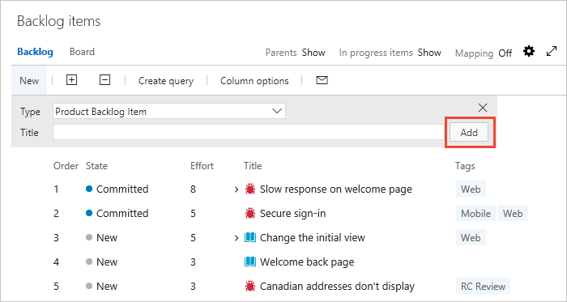

# Create your product backlog 

[!INCLUDE [temp](../_shared/version-vsts-tfs-all-versions.md)]

Your product backlog corresponds to your project plan, the roadmap for what your team plans to deliver. You create your product backlog by adding user stories, backlog items, or requirements.  

After you define it, you have a prioritized list of features and requirements to build. Your backlog also provides a repository of all the information you need to track and share with your team.

Your backlog consists of a list of [work items](../work-items/about-work-items.md). 
You use work items to share information, assign work to team members, track dependencies, organize work, 
and more. Because the most important work appears at the top of the list, your team always knows what to work on next.

> [!NOTE]  
> Your product backlog is one of three classes of backlogs available to you. For an overview of the features supported on each backlog and the two types of boards, see [Backlogs, boards, and plans](backlogs-boards-plans.md). If you're not seeing the work items you expect on your backlog, review [Setup your backlogs and boards](set-up-your-backlog.md).   

[!INCLUDE [temp](../_shared/prerequisites.md)]

## Open your backlog from the web portal

From your web browser, open your product backlog.  

::: moniker range=">= azure-devops-2019"

0. Check that you selected the right project, and select **Boards** > **Backlogs**. Then select the correct team from the team selector menu. 

	

	To select another backlog, open the selector and then choose a different team or select the  **Browse all backlogs** option. Or, enter a keyword in the search box to filter the list of team backlogs for the project.

	> [!div class="mx-imgBorder"]  
	>  

	> [!TIP]    
	> Select the  star icon to make a team backlog a favorite. Favorite artifacts ( favorite icon) appear at the top of the team selector list. 

0. Check that you selected **Backlog items** for Scrum, **Stories** for Agile, or **Requirements** for CMMI as the backlog level. 

	> [!div class="mx-imgBorder"]  
	>  

0. (Optional) To select which columns display and in what order, select the  actions icon and select **Column options**. To learn more, see [Change column options](../backlogs/set-column-options.md). 

	> [!div class="mx-imgBorder"]  
	>  

::: moniker-end

::: moniker range=">= tfs-2017 <= tfs-2018"

On your web browser, open your team's product backlog and select the team from the project and team selector. Then select **Work** > **Backlogs**. Select the product backlog, which is **Backlog items** for Scrum, **Stories** for Agile, or **Requirements** for CMMI. 

> [!div class="mx-imgBorder"]
>  

To select another team, open the project and team selector. Select a different team, or select the **Browse** option. 

> [!div class="mx-imgBorder"]  
>  
	
::: moniker-end
::: moniker range="<= tfs-2015"

On your web browser, open your team's product backlog. Select **Boards** > **Backlogs**. 

::: moniker-end

## Determine if bugs should appear on your backlog 

You can choose how you want to manage bugs. Some teams like to track bugs along with requirements on the backlog. Other teams like to track bugs as tasks performed in support of a requirement. The bugs then appear on their [taskboard](../sprints/task-board.md).

If you use the Scrum process, your default setup is to track bugs along with product backlog items (PBIs). If you work in a project based on the [Agile or CMMI processes](../work-items/guidance/choose-process.md), bugs don't automatically appear on your backlog.

Talk with your team to determine how they want to manage bugs. Then [change your team settings](../../organizations/settings/show-bugs-on-backlog.md) accordingly.

> [!NOTE]    
> Because this setting affects all team members' view of the team backlogs and boards, you must be a team administrator to change the setting. If you're not a team administrator, the option to change the setting is disabled. To be added as a team administrator, see [Add a team administrator](../../organizations/settings/add-team-administrator.md).

::: moniker range=">= tfs-2013 <= tfs-2018"
> [!TIP]  
> After you refresh a backlog or board and if you don't see bugs where you expect them, review [How backlogs and boards display hierarchical (nested) items](resolve-backlog-reorder-issues.md). Only leaf nodes of nested items appear on the Kanban or task boards.  

::: moniker-end

<a id="convert-ideas" />
## Convert ideas into backlog items or stories

Your backlog shows work that you plan to do or have started to work on. As soon as the state of a work item is set to Done or Completed, the work item no longer shows up on your backlog. You can use the [backlog controls](product-backlog-controls.md) to filter or change your view. 

> [!TIP]  
> If you already defined a long list of items, you don't have to reenter them one at a time. Instead, use [Microsoft Excel](../backlogs/office/bulk-add-modify-work-items-excel.md) to quickly import them to your backlog.

Users with **Stakeholder** access can only add work items to the end of the backlog. For details, see [About access levels](../../organizations/security/access-levels.md).

::: moniker range=">= azure-devops-2019"

0. Before you add work items, select the  view options icon and turn the slider for **Parents** and **Forecasting** to **Off**. Optionally, turn **In Progress Items** on or off. 

	> [!div class="mx-imgBorder"]
	>  

0. To add a work item, select **New Work Item** and enter a title. Then press Enter or select **Add to top**. 

	> [!div class="mx-imgBorder"]
	>  

0. Repeat this step to capture all your ideas as work items.  

::: moniker-end

::: moniker range="<= tfs-2018"

To build your backlog, enter a title and select **Add**. If you don't see the **Add** link, select **New** to open the quick add panel. Optionally, set **In progress items** to **Show** or **Hide**.

 

Repeat this step until you capture all your main ideas. 

::: moniker-end

> [!NOTE]  
> Depending on whether you create your project with [Basic](../get-started/track-issues-tasks.md), [Agile](../work-items/guidance/agile-process.md), [Scrum](../work-items/guidance/scrum-process.md), or [CMMI](../work-items/guidance/cmmi-process.md), the items in your backlog might be called user stories, PBIs, or requirements. All three are similar. They describe the customer value to be delivered and the work to be performed.   
>
>By default, user stories appear on Agile backlogs, PBIs and bugs appear on Scrum backlogs, and requirements appear on CMMI backlogs. 

## Move items into priority order

After you have some items in your backlog, you can reorder them to create a prioritized list of work. Review and prioritize your backlog frequently to help your team know what's most important to deliver next. 

To reorder a backlog, you must have Basic or higher level access. For details, see [About access levels](../../organizations/security/access-levels.md).

To reorder your backlog, drag the work items. Or, if you prefer to use the keyboard, hold down the Alt key and use the up and down arrows.

> [!div class="mx-imgBorder"]
> 

> [!TIP]  
> You can't sort your backlog on a column. To view a sorted listed, select **Create query**. Save and open the query, and then sort the query results. To learn more about queries, see [Use the query editor to list and manage queries](../queries/using-queries.md).

## Add details and estimates
Building and prioritizing your backlog provides you with a high-level roadmap. Before your team can start work on any item, they need more details. You capture these details within the work item form.

> [!TIP]  
> To plan a sprint, at a minimum, estimate the effort involved to implement each backlog item. To capture effort in the work item form, use **Effort** for Scrum, **Story Points** for Agile, or **Size** for CMMI. 

To open each item, double-click or press Enter. Then add all the information you want to track. Enter as much detail as the team needs to:  
- Understand the scope. 
- Estimate the work required. 
- Develop tests. 
- Ensure that the end product meets acceptance criteria.  

> [!div class="mx-imgBorder"]  
>  

<table valign="top" width="100%">
<tbody valign="top" >
<tr>
<th width="20%">Field</th>
<th width="80%">Usage</th>
</tr>
<tr>
<td>[Effort](../queries/query-numeric.md) 
[Story Points](../queries/query-numeric.md) 
[Size](../queries/query-numeric.md)</td> 
<td>

Provide a relative estimate of the amount of work required to complete a PBI. For user stories and requirements, you capture estimates in **Story Points** and **Size**.  

Most Agile methods recommend that you set estimates for backlog items based on relative size of work. Such methods include powers of 2 (1, 2, 4, 8) and the Fibonacci sequence (1, 2, 3, 5, 8, etc.). Use any numeric unit of measurement your team prefers. 

The estimates you set for **Effort**, **Size**, or **Story Points** are used to calculate [velocity](../../report/dashboards/velocity-chart-data-store.md) and [forecast sprints](../sprints/forecast.md).

</td> 
</tr>

<tr>
<td>[Business Value](../queries/query-numeric.md)</td> 
<td>Specify a priority that captures the relative value of a PBI compared to other PBIs. The higher the number, the greater the business value. Use this field when you want to capture a priority separate from the changeable backlog stack ranking.</td> 
</tr>

<tr>
<td>[Description](../queries/titles-ids-descriptions.md)</td> 
<td>Provide enough detail to create shared understanding of scope and support estimation efforts. Focus on the user, what they want to accomplish, and why. Don't describe how to develop the product. Do provide sufficient details so that your team can write tasks and test cases to implement the item.</td> 
</tr>

<tr>
<td>[Acceptance Criteria](../queries/titles-ids-descriptions.md) </td> 
<td>
Define what "Done" means by describing the criteria for the team to use to verify whether the PBI or the bug fix is fully implemented.

Before work begins on a PBI or bug, describe the [criteria for customer acceptance](best-practices-product-backlog.md#acceptance) as clearly as possible. Have conversations between the team and customers to determine the acceptance criteria. These criteria help ensure a common understanding within the team to meet customers' expectations. Also, this information provides the basis for acceptance testing.
</td> 
</tr>

</tbody>
</table>
 

## Try this next
Now that you have a working backlog in place, your team can begin work on the top-priority items. From here, it's time to decide how you want to work as a team. Do you want to use Scrum or Kanban? You can use these methods independently or together.

> [!div class="nextstepaction"]
> [Scrum: Schedule sprints](../sprints/define-sprints.md) or [Kanban](../boards/kanban-quickstart.md) 

Teams that want the least overhead in terms of tracking and estimating might prefer Kanban. Teams that like to work at a steady cadence and plot the details of their sprint plan might prefer Scrum and sprint planning.

## Related articles

- [Refine your backlog](best-practices-product-backlog.md)  
- [Product backlog controls](product-backlog-controls.md)
- [Filter product and portfolio backlogs](filter-backlogs.md)
- [Backlog priority or stack rank order](backlogs-overview.md#stack-rank)
- [Backlog keyboard shortcuts](backlogs-keyboard-shortcuts.md)

