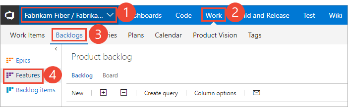
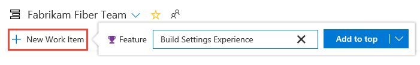
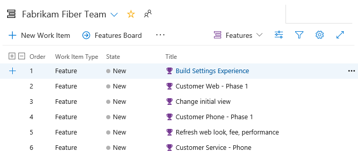
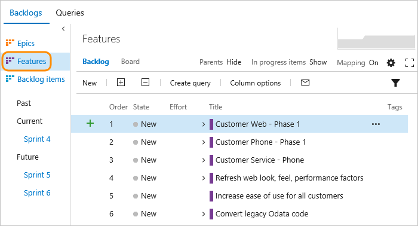
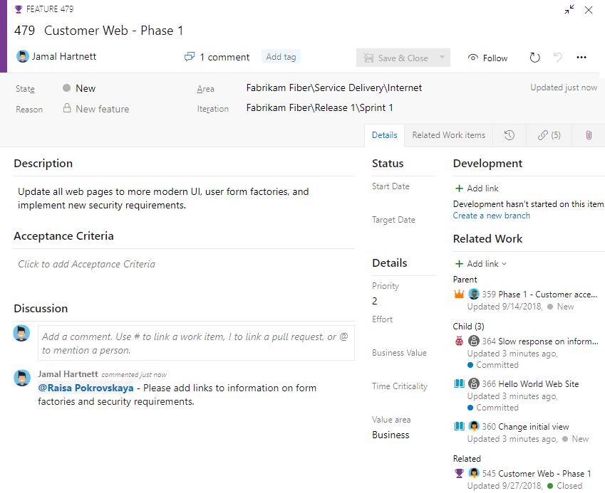

# Define features and epics, organize your product and portfolio backlogs in Azure Boards 

[!INCLUDE [version-lt-eq-azure-devops](../../includes/version-lt-eq-azure-devops.md)]

While many teams can work with a flat list of items, sometimes it helps to group related items into a hierarchical structure. 
Perhaps you like to start with several major features or scenarios and break them down into smaller deliverables. Or, you've got an existing backlog and now need to organize it.   

The following image shows a Features portfolio backlog that consists of a flat list of Feature work items. 

> [!div class="mx-imgBorder"]  
> 

No matter your starting point, you can use portfolio backlogs to bring more order to your backlog. 
Use your backlogs to plan your project and to:  
*   Manage a portfolio of features that are supported by different development and management teams  
*   Group items into a release train  
*   Minimize size variability of your deliverables by breaking down a large feature into smaller backlog items     

Use this article to learn how to perform these tasks: 
> [!div class="checklist"]      
> * Determine what is a good feature or epic
> * View a backlog or portfolio backlog  
> * Add features and epics  
> * Add child items   

With portfolio backlogs, you can quickly add and group items into a hierarchy. You can also drill up or down within the hierarchy, reorder and reparent items, and filter hierarchical views. Portfolio backlogs are one of three classes of backlogs available to you. To learn how to track progress across teams, see [Visibility across teams](../plans/visibility-across-teams.md).    

[!INCLUDE [temp](../includes/work-item-types.md)] 

[!INCLUDE [temp](../includes/prerequisites.md)]

## What makes a feature or epic?  

The epics and features that you create should reflect your business focus. As user stories or product backlog items roll up into features, and features roll up into epics&mdash;you'll want to name your features and epics with that in mind. 

Typically, a feature is a shippable software component. An epic corresponds to a collection of features that are related to one another and combine to form a larger value proposition. As you define your features and epics, consider the time required to complete them. In general, backlog items such as user stories or product backlog items, should be accomplished within a sprint. Features and epics may take one or more sprints to complete. Here are a few examples of each. 

**Features**
- View option enhancements 
- Shopping cart support on mobile devices
- Text alert support for sign in and account changes
- Web portal user interface improvements  

**Epics**
- New user experience complete 
- Performance improvements 
- Integration with communication apps  
- First phase of mobile apps complete

<a id="view-portfolio-backlog" />

## View a backlog or portfolio backlog 

To focus on one level of a backlog at a time, choose the name of the backlog you want to view. If you don&#39;t see all three backlog levels&mdash;
Epics, Features, and Backlog items&mdash;
you can [enable them for your team](../../organizations/settings/select-backlog-navigation-levels.md). 

For example, when you choose **Epics**, you'll see a list of all Epics in your team's active area paths. From there, you can drill down to see child features and backlog items.  

::: moniker range=">= azure-devops-2020"

1. (1) Check that you've selected the right project, (2) choose **Boards>Backlogs**, and then (3) select the correct team from the team selector menu. 

	> [!div class="mx-imgBorder"]  
	> 

    To select another backlog, open the selector and then choose a different team or select the **View Backlog directory** option. Or, enter a keyword in the search box to filter the list of team backlogs for the project.

	> [!div class="mx-imgBorder"]  
	>  

	> [!TIP]    
	> Choose the :::image type="icon" source="../../media/icons/icon-favorite-star.png" border="false"::: star icon to favorite a team backlog. Favorited artifacts (:::image type="icon" source="../../media/icons/icon-favorited.png" border="false"::: favorited icon) appear at the top of the team selector list. 

1. Check that you have selected **Stories** (for Agile), **Issues** (for Basic), **Backlog items** (for Scrum), or **Requirements** (for CMMI) as the backlog level. 

	> [!div class="mx-imgBorder"]  
	>  

2. (Optional) To choose which columns should display and in what order, choose the  :::image type="icon" source="../../media/icons/actions-icon.png" border="false"::: actions icon and select **Column options**. For more information, see [Change column options](../backlogs/set-column-options.md). 

	> [!div class="mx-imgBorder"]  
	>  

::: moniker-end

::: moniker range="azure-devops-2019"

1. (1) Check that you've selected the right project, (2) choose **Boards>Backlogs**, and then (3) select the correct team from the team selector menu. 

    

    To choose another team, open the selector and select a different team or choose the :::image type="icon" source="../../media/icons/home-icon.png" border="false"::: **Browse all backlogs** option. Or, you can enter a keyword in the search box to filter the list of team backlogs for the project.

    > [!div class="mx-imgBorder"]  
    >  

1. Choose the portfolio backlog that you want, **Features**. or **Epics**. 

    > [!div class="mx-imgBorder"]  
    >  

2. (Optional) To choose which columns should display and in what order, choose the  :::image type="icon" source="../../media/icons/actions-icon.png" border="false"::: actions icon and select **Column options**. You may want to add the Iteration Path to the set of columns that appear on your backlog. For more information, see [Change column options](../backlogs/set-column-options.md). 

    > [!div class="mx-imgBorder"]  
    >  

::: moniker-end

::: moniker range="tfs-2018"

1. From your web browser, open your team's backlog. (1) Select the team from the project/team selector, choose (2) **Work**, (3) **Backlogs**, and then (4) the portfolio backlog of interest, which is **Features**  or **Epics**. 

    > [!div class="mx-imgBorder"]
    >  

    To choose another team, open the project/team selector and select a different team or choose the **Browse** option. 

    > [!div class="mx-imgBorder"]  
    >  

1. Choose **Epics** to see a list of all epics defined in your team's active area paths.  

    

::: moniker-end

> [!TIP]  
> Each team can choose the backlog levels that are active as described in [Select backlog navigation levels for your team](../../organizations/settings/select-backlog-navigation-levels.md).  

## Add features and epics to  your backlog

Just as you can [add items to your product backlog](create-your-backlog.md), you can add items to your features and epics backlogs. 

::: moniker range=">= azure-devops-2019"

1. To add a feature, choose the **New Work Item**, enter a title, and then press **Enter** or choose **Add to top**. 

    > [!div class="mx-imgBorder"]
    >  

2. Repeat this step to capture all your ideas as work items.  

    Here, we've added six features.  

    > [!div class="mx-imgBorder"]
    >  

    You can add epics in the same way. Open the **Epics** backlog from the backlogs selector.  

::: moniker-end

::: moniker range="tfs-2018"

1. To add a feature, enter a title and choose **Add**. If you don't see the **Add** link, choose **New** to open the quick add panel. 

    > [!div class="mx-imgBorder"]
    >  

2. Repeat this step until you've captured all your main ideas. 

   Here, we've added six features.  

    

::: moniker-end

## Add details to a feature or epic 

Open each item by double-clicking, or press Enter to open a selected item. Then, add the info you want to track. Enter as much detail as possible. The team must understand the scope, estimate the work, develop tests, and ensure that the end product meets acceptance criteria.

[!INCLUDE [temp](../includes/image-differences-with-wits.md)]  

> [!div class="mx-imgBorder"]  
> 

:::row:::
   :::column span="1":::
   **Field**
   :::column-end:::
   :::column span="3":::
   **Usage**
   :::column-end:::
:::row-end:::
---
:::row:::
   :::column span="1":::
      [Value Area](../queries/planning-ranking-priorities.md)
   :::column-end:::
   :::column span="3":::
      The area of customer value addressed by the epic, feature, or backlog item. Values include:  
      - **Architectural** &mdash;technical services to implement business features that deliver solution  
      - **Business** (Default) &mdash;services that fulfill customers or stakeholder needs that directly deliver customer value to support the business 
   :::column-end:::
:::row-end:::
:::row:::
   :::column span="1":::
      [Effort](../queries/query-numeric.md)  
      [Story Points](../queries/query-numeric.md)  
      [Size](../queries/query-numeric.md)
   :::column-end:::
   :::column span="3":::
   Provide a relative estimate of the amount of work required to complete a Feature or Epic. Use any numeric unit of measurement your team prefers. Some options are [story points, time, or other relative unit](create-your-backlog.md#estimates). 
   :::column-end:::
:::row-end:::
:::row:::
   :::column span="1":::
      [Business Value](../queries/query-numeric.md)
   :::column-end:::
   :::column span="3":::
   Specify a priority that captures the relative value of an Epic, Feature, or backlog item compared to other items of the same type. The higher the number, the greater the business value.   Use this field when you want to capture a priority separate from the changeable backlog stack ranking.
   :::column-end:::
:::row-end:::
:::row:::
   :::column span="1":::
      [Time Criticality](../queries/planning-ranking-priorities.md)
   :::column-end:::
   :::column span="3":::
      A subjective unit of measure that captures how the business value decreases over time. Higher values indicate that the Epic or Feature is inherently more time critical than those items with lower values. 
   :::column-end:::
:::row-end:::
:::row:::
   :::column span="1":::
      [Target Date](../queries/query-by-date-or-current-iteration.md)
   :::column-end:::
   :::column span="3":::
   Specify the date by which the feature should be implemented.
   :::column-end:::
:::row-end:::
---

## Add child items

With your features defined, add child items to them. You can add child items from any backlog. 
And you can add features to epics and backlog items to features. 

> [!TIP]  
> You can also add child user stories (Agile), or product backlog items (Scrum) or requirements (CMMI) from the Kanban board for Features. And, you can add child features from the Epic board. For more information, see [Kanban board features and epics](../boards/kanban-epics-features-stories.md). Also, you can quickly parent or reparent children from a backlog using the mapping pane as described in [Organize your backlog, map child work items to parents](organize-backlog.md).

::: moniker range=">= azure-devops-2019"

Each team member has several tools to configure their backlog view: **Expand/Collapse one level**, **Column Options**, **Backlog level selector**, **View options**, and **Filter** toolbar. Options set for each backlog level are distinct and persist until changed. For tips on setting these view options and how to prioritize child items of portfolio backlog items, see [Configure your backlog view](../backlogs/configure-your-backlog-view.md). 

To add a work item, choose  **Add**, and choose from the options provided.

Here we add a product backlog item as a child to the Customer Web - Phase 1 feature. 

> [!div class="mx-imgBorder"]
>  

Whenever you see the  **Add** icon, you can add a child item. The work item always corresponds to the hierarchy of work item types that are defined for your project.

::: moniker-end

::: moniker range="tfs-2018"

To add a work item, choose :::image type="icon" source="../media/icons/green_plus_icon.png" border="false"::: **Add**, and choose from the options provided.

Here we add a product backlog item as a child to the Customer Web - Phase 1 feature. 

Whenever you see the :::image type="icon" source="../media/icons/green_plus_icon.png" border="false"::: **Add** icon, you can add a child item. 
The work item(s) always corresponds to the hierarchy of work item types that are defined for your project.   

::: moniker-end

For Scrum projects, your hierarchy is as shown: 

 

Because [teams can also set bugs as tasks](../../organizations/settings/show-bugs-on-backlog.md), bugs can be added as children of PBIs. 

The work item types you'll see depends on the [process you selected to create your project](../work-items/guidance/choose-process.md). 

If you want bugs to show up on your backlog and you're not seeing them, [enable them for your team](../../organizations/settings/show-bugs-on-backlog.md). 

[!INCLUDE [temp](../includes/add-portfolio-backlogs.md)]

[!INCLUDE [temp](../includes/display-rollup-section.md)]

 
## Next steps  

Portfolio backlogs are a great way to organize your project plan and provide visibility of project plans across enterprise teams. With portfolio backlogs, management teams gain insight into project status across their development teams. 

> [!div class="nextstepaction"]
> [Organize your backlog](organize-backlog.md)

## Related articles  

- [Configure your backlog view](configure-your-backlog-view.md)
- [Azure Boards FAQs](../faqs.yml) 
- [Filter product and portfolio backlogs](filter-backlogs-boards-plans.md)
- [Select backlog navigation levels for your team](../../organizations/settings/select-backlog-navigation-levels.md)   
- [Work with multi-team ownership of backlog items](backlogs-overview.md#multi-team)  
- [Product backlog controls](product-backlog-controls.md)
- [Keyboard shortcuts](../../project/navigation/keyboard-shortcuts.md)
