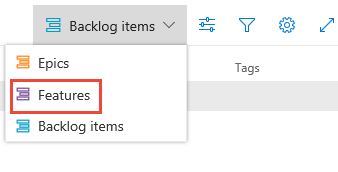

# Define features and epics, organize your backlog

[!INCLUDE [version-lt-eq-azure-devops](../../includes/version-lt-eq-azure-devops.md)]

While many teams can work with a flat list of work items, sometimes it helps to group related items into a hierarchical structure. You can start with several major features or scenarios and break them down into smaller deliverables. Or, if you have an existing backlog, you can begin to organize it with features and epics.   

## Portfolio backlogs

The following image shows a **features** portfolio backlog that consists of a flat list of feature work items. 

:::image type="content" source="media/features-epics/intro-image.png" alt-text="Screenshot of the features portfolio Backlog.":::

You can use portfolio backlogs to do the following tasks:
- Bring more order to your backlog 
- Manage a portfolio of features that different development and management teams support  
- Group items into a release train  
- Minimize size variability of your deliverables by breaking down a large feature into smaller backlog items 

Portfolio backlogs let you quickly add and group items into a hierarchy. You can also drill up or down within the hierarchy, reorder and reparent items, and filter hierarchical views. Portfolio backlogs are one of three classes of backlogs available to you. For more information, see [Visibility across teams](../plans/visibility-across-teams.md).    

[!INCLUDE [temp](../includes/work-item-types.md)] 

[!INCLUDE [temp](../includes/prerequisites.md)]

## What makes a feature or epic?  

Epics and features are higher level containers. Typically user stories or backlog items roll up into features, and features roll up into epics, so keep this information in mind when you name your features and epics.

As you define your features and epics, consider the time required to complete them. In general, you should complete backlog items, such as user stories or tasks, within a sprint. Features and epics may take one or more sprints to complete.

## View a backlog

To focus on one level of a backlog at a time, select the name of the backlog. If you don&#39;t see all three backlog levels—Epics, Features, and Backlog items&mdash;[enable the backlog levels for your team](../../organizations/settings/select-backlog-navigation-levels.md).

::: moniker range=">= azure-devops-2020"

1. Sign in to your organization (```https://dev.azure.com/{yourorganization}```) and go to your project.
2. Select **Boards** > **Backlogs**. 

   :::image type="content" source="media/open-boards-backlogs.png" alt-text="Screenshot of highlighted Boards and Backlogs selections.":::

    To select another backlog, open the selector and then choose a different team or select the **View Backlog directory** option. Or, enter a keyword in the search box to filter the list of team backlogs for the project.

   :::image type="content" source="../sprints/media/assign-items-sprint/backlog-team-selector-s155.png" alt-text="Screenshot of selecting another team process.":::

	> [!TIP]    
	> Select the :::image type="icon" source="../../media/icons/icon-favorite-star.png" border="false"::: star icon to favorite a team backlog. Favorited artifacts (:::image type="icon" source="../../media/icons/icon-favorited.png" border="false"::: favorited icon) appear at the top of the team selector list. 

3. Select either **Stories** (for Agile), **Issues** (for Basic), **Backlog items** (for Scrum), or **Requirements** (for CMMI) as the backlog level. 

   :::image type="content" source="../sprints/media/assign-items-sprint/select-product-backlog-agile-s155.png" alt-text="Screenshot of product backlog level selections.":::

4. (Optional) Choose which columns should display and in what order: select the  :::image type="icon" source="../../media/icons/actions-icon.png" border="false"::: actions icon and select **Column options**.

   :::image type="content" source="../sprints/media/assign-items-sprint/open-column-options-s155.png" alt-text="Screenshot showing how to Open Column Options from More commands menu.":::

::: moniker-end

::: moniker range="azure-devops-2019"

1. Sign in to your organization (```https://dev.azure.com/{yourorganization}```) and go to your project.
2. Select **Boards** > **Backlogs**.

   :::image type="content" source="../sprints/media/assign-items-sprint/open-work-backlogs-agile.png" alt-text="Screenshot opened work backlog, on-premises Azure DevOps Server 2019.":::

   To choose another team, open the selector and select a different team or choose the :::image type="icon" source="../../media/icons/home-icon.png" border="false"::: **Browse all backlogs** option. Or, you can enter a keyword in the search box to filter the list of team backlogs for the project.

   :::image type="content" source="../sprints/media/assign-items-sprint/team-selector-backlogs-agile.png" alt-text="Screenshot of Choose another team.":::

3. Choose the portfolio backlog that you want, **Features**. or **Epics**. 

    > [!div class="mx-imgBorder"]  
    >  

4. (Optional) To choose which columns should display and in what order, choose the  :::image type="icon" source="../../media/icons/actions-icon.png" border="false"::: actions icon and select **Column options**. You may want to add the Iteration Path to the set of columns that appear on your backlog. For more information, see [Change column options](../backlogs/set-column-options.md). 

   :::image type="content" source="../sprints/media/assign-items-sprint/open-work-backlogs-column-options-agile.png" alt-text="Screenshot showing how to Open Column Options from More commands menu, Azure DevOps Server 2019.":::

::: moniker-end

::: moniker range="tfs-2018"

1. From your web browser, open your team's backlog. (1) Select the team from the project/team selector, choose (2) **Work**, (3) **Backlogs**, and then (4) the portfolio backlog of interest, which is **Features**  or **Epics**. 

   :::image type="content" source="media/features-epics/open-features-epics.png" alt-text="Screenshot of opening Boards, Backlogs, and then Features, TFS 2018 version.":::

   To choose another team, open the project/team selector and select a different team or choose the **Browse** option. 

   :::image type="content" source="../sprints/media/assign-items-sprint/team-selector-backlogs-standard.png" alt-text="Screenshot of Choose another team, TFS 2018 version.":::

2. Select **Epics** to see a list of all epics defined in your team's active area paths.  

   :::image type="content" source="media/org-backlog-epics-ts-new-nav.png" alt-text="Screenshot of Epics pane and Value Area columns."::: 

::: moniker-end

> [!TIP]  
> For more information, see [Select backlog navigation levels for your team](../../organizations/settings/select-backlog-navigation-levels.md).  

## Add features and epics to your backlog

Just as you can [add items to your product backlog](create-your-backlog.md), you can add items to your **features** and **epics** backlogs. 

::: moniker range=">= azure-devops-2019"

1. Select the **New Work Item**, enter a title, and then select **Enter** or **Add to top**. 

   :::image type="content" source="media/features-epics/add-new-items-agile.png" alt-text="Screenshot of Add a product backlog item.":::

2. Repeat step #1 to capture all your ideas as work items.  

   In the following example, we added six features.  

   :::image type="content" source="media/features-epics/features-backlog-agile.png" alt-text="Screenshot showing how to add a feature, Azure DevOps Server 2019.":::

   You can add epics in the same way. Open the **Epics** backlog from the backlogs selector.  

::: moniker-end

::: moniker range="tfs-2018"

1. To add a feature, enter a title and choose **Add**. If you don't see the **Add** link, choose **New** to open the quick add panel. 

   :::image type="content" source="media/features-epics/add-feature-standard.png" alt-text="Screenshot showing how to add a feature, TFS 2018.":::

2. Repeat this step until you've captured all your main ideas.

   :::image type="content" source="media/org-backlog-features-ts-new-nav.png" alt-text="Screenshot of the Features backlog, TFS 2018.":::

::: moniker-end

## Add details to a feature or epic 

Open each item by double-clicking, or highlight the item and select **Enter**. Then, add the info that you want to track. Enter as much detail as possible, so your team can understand the scope, estimate the work, develop tests, and ensure that the final product meets acceptance criteria.

:::image type="content" source="media/features-epics/feature-work-item-form.png" alt-text="Screenshot of Feature work item form, Agile process, adding details to a feature.":::

:::row:::
   :::column span="1":::
   **Field**
   :::column-end:::
   :::column span="3":::
   **Usage**
   :::column-end:::
:::row-end:::
---
:::row:::
   :::column span="1":::
      [Value Area](../queries/planning-ranking-priorities.md)
   :::column-end:::
   :::column span="3":::
      The area of customer value addressed by the epic, feature, or backlog item. Values include:  
      - **Architectural—technical services to implement business features that deliver solution  
      - **Business** (Default)—services that fulfill customers or stakeholder needs that directly deliver customer value to support the business 
   :::column-end:::
:::row-end:::
:::row:::
   :::column span="1":::
      [Effort](../queries/query-numeric.md)  
      [Story Points](../queries/query-numeric.md)  
      [Size](../queries/query-numeric.md)
   :::column-end:::
   :::column span="3":::
   Provide a relative estimate of the amount of work required to complete a Feature or Epic. Use any numeric unit of measurement your team prefers. Some options are [story points, time, or other relative unit](create-your-backlog.md#estimates). 
   :::column-end:::
:::row-end:::
:::row:::
   :::column span="1":::
      [Business Value](../queries/query-numeric.md)
   :::column-end:::
   :::column span="3":::
   Specify a priority that captures the relative value of an Epic, Feature, or backlog item compared to other items of the same type. The higher the number, the greater the business value. Use this field when you want to capture a priority separate from the changeable backlog stack ranking.
   :::column-end:::
:::row-end:::
:::row:::
   :::column span="1":::
      [Time Criticality](../queries/planning-ranking-priorities.md)
   :::column-end:::
   :::column span="3":::
      A subjective unit of measure that captures how the business value decreases over time. Higher values indicate that the Epic or Feature is inherently more time critical than those items with lower values. 
   :::column-end:::
:::row-end:::
:::row:::
   :::column span="1":::
      [Target Date](../queries/query-by-date-or-current-iteration.md)
   :::column-end:::
   :::column span="3":::
   Specify the date by which to implement the feature.
   :::column-end:::
:::row-end:::
---

## Add child items

You can add child items to your features from any backlog. You can also add child user stories (Agile), or product backlog items (Scrum) or requirements (CMMI) from the Kanban board for features. And, you can add child features from the Epic board. For more information, see [Kanban board features and epics](../boards/kanban-epics-features-stories.md). To quickly parent or reparent children from a backlog, see [Organize your backlog, map child work items to parents](organize-backlog.md).

::: moniker range=">= azure-devops-2019"

Whenever you see the  **Add** icon, you can add a child item. The work item always corresponds to the hierarchy of work item types defined for your project.

For more information, see [Configure your backlog view](../backlogs/configure-your-backlog-view.md) and [About work items and work item types](../work-items/about-work-items.md).
::: moniker-end

::: moniker range="tfs-2018"

To add a work item, choose :::image type="icon" source="../media/icons/green_plus_icon.png" border="false"::: **Add**, and choose from the options provided.

In the following image, we added a product backlog item as a child to the Customer Web - Phase 1 feature. 

:::image type="content" source="media/org-backlog-features-add-child-ts.png" alt-text="Screenshot of how to add a child item to a backlog work item, TFS 2018.":::

Whenever you see the :::image type="icon" source="../media/icons/green_plus_icon.png" border="false"::: **Add** icon, you can add a child item. 
The work item(s) always corresponds to the hierarchy of work item types defined for your project.   

::: moniker-end

For Scrum projects, your hierarchy looks like the following example. 

:::image type="content" source="media/ALM_OB_Scrum_WIT_Hier_C.png" alt-text="Screenshot from top to bottom, the hierarchy shows Epic, Feature, Product Backlog Item, and Task.":::

For more information, see the following articles:
- [Teams can set bugs as tasks](../../organizations/settings/show-bugs-on-backlog.md)
- [Enable bugs to show up on your team's backlog](../../organizations/settings/show-bugs-on-backlog.md) 
- [Your project's process and resulting work item types view](../work-items/guidance/choose-process.md). 

[!INCLUDE [temp](../includes/add-portfolio-backlogs.md)]

[!INCLUDE [temp](../includes/display-rollup-section.md)]
 
## Next steps

> [!div class="nextstepaction"]
> [Organize your backlog](organize-backlog.md)

## Related articles  

- [Configure your backlog view](configure-your-backlog-view.md)
- [Select backlog navigation levels for your team](../../organizations/settings/select-backlog-navigation-levels.md)   
- [Work with multi-team ownership of backlog items](backlogs-overview.md#multi-team)  
