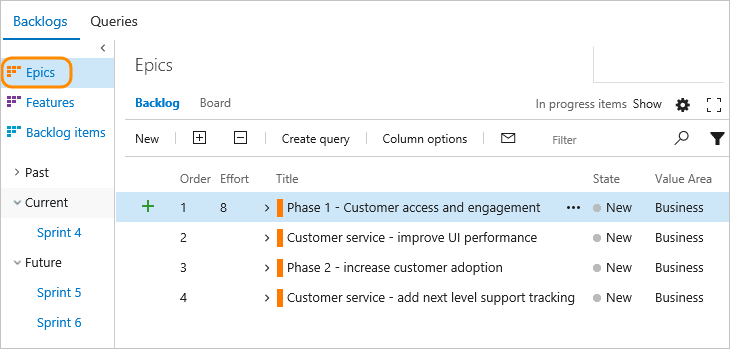
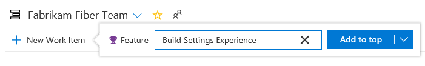
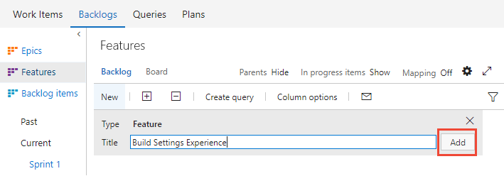
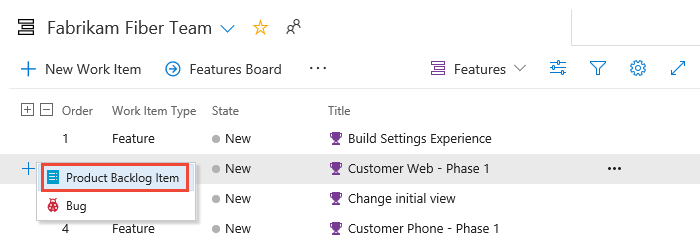

# Define features and epics  

[!INCLUDE [temp](../_shared/version-vsts-tfs-2015-on.md)]

While many teams can work with a flat list of items, sometimes it helps to group related items into a hierarchical structure. 
Perhaps you like to start with a big picture and break it down into smaller deliverables. 
Or, you've got an existing backlog and now need to organize it.   

No matter your starting point, you can use portfolio backlogs to bring more order to your backlog. 
Use your backlogs to plan your project and to:  
*	Manage a portfolio of features that are supported by different development and management teams  
*	Group items into a release train  
*	Minimize size variability of your deliverables by breaking down a large feature into smaller backlog items     

Use this topic to learn how to: 
>[!div class="checklist"]      
> * View a backlog or portfolio backlog  
> * Add features and epics  
> * Add child items   

> [!NOTE]
> To understand the features supported on each backlog and board, and how each display hierarchical items, see [Backlogs, boards, and plans](backlogs-boards-plans.md). To learn how to track progress across teams, see [Visibility across teams](../plans/visibility-across-teams.md).    

With portfolio backlogs you can quickly add and group items into a hierarchy, drill up or down within the hierarchy, reorder and reparent items, and filter hierarchical views. Portfolio backlogs are one of three classes of backlogs available to you. For an overview of the features supported on each backlog and the two types of boards, see [Backlogs, boards, and plans](backlogs-boards-plans.md).  

[!INCLUDE [temp](../_shared/prerequisites-work-items.md)]

<a id="view-portfolio-backlog" />
## View a backlog or portfolio backlog 
To focus on one level of a backlog at a time, choose the name of the backlog you want to view. If you don't see all three backlog levels&mdash;
Epics, Features, and Backlog items&mdash;
you can [enable them for your team](../../organizations/settings/select-backlog-navigation-levels.md). 

For example, when you choose **Epics**, you'll see a list of all Epics in your team's active area paths. From there, you can drill down to see child features and backlog items.  

[!INCLUDE [temp](../../_shared/new-navigation-5.md)] 

# [New navigation](#tab/new-nav)

::: moniker range=">= azdevserver-2019"

0. (1) Check that you have selected the right project, (2) choose **Boards>Backlogs**, and then (3) select the correct team from the team selector menu. 

	

	To choose another team, open the selector and select a different team or choose the  **Browse all sprints** option. Or, you can enter a keyword in the search box to filter the list of team backlogs for the project.

	> [!div class="mx-imgBorder"]  
	>  

0. Choose the portfolio backlog that you want, **Features** or **Epics**. 

	> [!div class="mx-imgBorder"]  
	>  

0. (Optional) To choose which columns should display and in what order, choose the  actions icon and select **Column options**. You may want to add the Iteration Path to the set of columns that appear on your backlog. To learn more, see [Change column options](../backlogs/set-column-options.md). 

	> [!div class="mx-imgBorder"]  
	>  

::: moniker-end

::: moniker range=">= tfs-2013 <= tfs-2018"

[!INCLUDE [temp](../../_shared/new-navigation-not-supported.md)] 

::: moniker-end

# [Previous navigation](#tab/previous-nav)

::: moniker range=">= tfs-2013 <= tfs-2018 || vsts"

0. From your web browser, open your team's backlog. (1) Select the team from the project/team selector, choose (2) **Work**, (3) **Backlogs**, and then (4) the portfolio backlog of interest, which is **Features**  or **Epics**. 

	> [!div class="mx-imgBorder"]
	>  

	To choose another team, open the project/team selector and select a different team or choose the **Browse** option. 

	> [!div class="mx-imgBorder"]  
	>  

0.	Choose **Epics** to see a list of all epics defined in your team's active area paths.  

	 

::: moniker-end

::: moniker range="azdevserver-2019"
[!INCLUDE [temp](../../_shared/previous-navigation-not-supported-azd.md)] 
::: moniker-end

---

> [!TIP]  
> Each team can choose the backlog levels that are active as described in [Select backlog navigation levels for your team](../../organizations/settings/select-backlog-navigation-levels.md).  

## Add features and epics 
Just as you can [add items to your product backlog](create-your-backlog.md), you can add items to your features and epics backlogs. 

# [New navigation](#tab/new-nav)

::: moniker range=">= azdevserver-2019"

0. To add a feature, choose the **New Work Item**, enter a title and then press the Enter key or choose **Add to top**. 

	> [!div class="mx-imgBorder"]
	>  

0. Repeat this step to capture all your ideas as work items.  

	Here, we've added six features.  

	> [!div class="mx-imgBorder"]
	>  

	You can add epics in the same way. Simply open the **Epics** backlog from the backlogs selector.  

::: moniker-end

::: moniker range=">= tfs-2013 <= tfs-2018"

[!INCLUDE [temp](../../_shared/new-navigation-not-supported.md)] 

::: moniker-end

# [Previous navigation](#tab/previous-nav)

::: moniker range=">= tfs-2013 <= tfs-2018 || vsts"

0. To add a feature, enter a title and choose **Add**. If you don't see the **Add** link, choose **New** to open the quick add panel. 

	> [!div class="mx-imgBorder"]
	>  

0. 	Repeat this step until you've captured all your main ideas. 

	Here, we've added six features.  

	 

::: moniker-end

::: moniker range="azdevserver-2019"
[!INCLUDE [temp](../../_shared/previous-navigation-not-supported-azd.md)] 
::: moniker-end

---

## Add details to a feature or epic 

Open each item (double-click, or press Enter to open the selected item) and add all the info you want to track. Enter as much detail as the team needs to understand the scope, estimate the work required, develop tests, and ensure that the end product meets acceptance criteria.

[!INCLUDE [temp](../_shared/image-differences-with-wits.md)]  

> [!div class="mx-imgBorder"]  
> [Feature work item form, Agile process, Add details to a feature](_img/features-epics/feature-work-item-form.png)
 
<table>
<tbody valign="top">
<tr>
<th width="20%">Field</th>
<th width="80%">Usage</th>
</tr>
<tr>
<td>
[Value Area](../queries/planning-ranking-priorities.md)
</td>
<td>The area of customer value addressed by the epic, feature, or backlog item. Values include:  
<ul>
<li><b>Architectural</b> &mdash;technical services to implement business features that deliver solution </li> 
<li><b>Business</b> (Default) &mdash;services that fulfill customers or stakeholder needs that directly deliver customer value to support the business </li>
</ul>
</td>
</tr>
<tr>
<td>
[Effort](../queries/query-numeric.md) 
[Story Points](../queries/query-numeric.md) 
[Size](../queries/query-numeric.md)
</td>
<td>
Provide a relative estimate of the amount of work required to complete a Feature or Epic. Use any numeric unit of measurement your team prefers. Some options are [story points, time, or other relative unit](create-your-backlog.md#estimates). 
</td>
</tr>

<tr>
<td>

[Business Value](../queries/query-numeric.md)
</td>
<td>
Specify a priority that captures the relative value of an Epic, Feature, or backlog item compared to other items of the same type. The higher the number, the greater the business value. Use this field when you want to capture a priority separate from the changeable backlog stack ranking.

</td>
</tr>

<tr>
<td>
[Time Criticality](../queries/planning-ranking-priorities.md)
</td>
<td>
A subjective unit of measure that captures the how the business value decreases over time. Higher values indicate that the Epic or Feature is inherently more time critical than those items with lower values. 
</td>
</tr>
<tr>
	<td>
[Target Date](../queries/query-by-date-or-current-iteration.md)
</td>
	<td>
Specify the date by which the feature should be implemented.
</td></tr>

</tbody>
</table>

## Add child items
With your features defined, you're able to add child items to them. From any backlog, you can add child items. 
You can add features to epics, and backlog items to features. 
 

# [New navigation](#tab/new-nav)

::: moniker range=">= azdevserver-2019"

To add a work item, choose the  and choose from the options provided.

Here we add a product backlog item as a child to the Customer Web - Phase 1 feature. 

> [!div class="mx-imgBorder"]
>  

Whenever you see the plus , you can add a child item. The work item always corresponds to the hierarchy of work item types that are defined for your project.

> [!TIP]    
> You can also add child user stories from the Kanban board for Features. For details, see 

::: moniker-end

::: moniker range=">= tfs-2013 <= tfs-2018"

[!INCLUDE [temp](../../_shared/new-navigation-not-supported.md)] 

::: moniker-end

# [Previous navigation](#tab/previous-nav)

::: moniker range=">= tfs-2013 <= tfs-2018 || vsts"

To add a work item, choose the  and choose from the options provided.

Here we add a product backlog item as a child to the Customer Web - Phase 1 feature. 

Whenever you see the plus , you can add a child item. 
The work item always corresponds to the hierarchy of work item types that are defined for your project.   

::: moniker-end

::: moniker range="azdevserver-2019"
[!INCLUDE [temp](../../_shared/previous-navigation-not-supported-azd.md)] 
::: moniker-end

---

For Scrum projects, your hierarchy is as shown: 

 

Because [teams can also set bugs as tasks](../../organizations/settings/show-bugs-on-backlog.md), bugs can be added as children of PBIs. 

The work item types you'll see depends on the [process you selected to create your project](../work-items/guidance/choose-process.md). 

If you want bugs to show up on your backlog and you're not seeing them, [enable them for your team](../../organizations/settings/show-bugs-on-backlog.md). 

 
## Try this next  

Portfolio backlogs are not only a great way to organize your project plan, but also a great way to provide visibility of project plans across enterprise teams. With portfolio backlogs, management teams can gain insight into project status across all their development teams. 

> [!div class="nextstepaction"]
> [Organize your backlog](organize-backlog.md)

## Related articles  

- [Product backlog controls](product-backlog-controls.md)
- [Filter product and portfolio backlogs ](filter-backlogs.md)
- [Select backlog navigation levels for your team](../../organizations/settings/select-backlog-navigation-levels.md)   
- [Work with multi-team ownership of backlog items](backlogs-overview.md#multi-team)  
- [Backlog keyboard shortcuts](backlogs-keyboard-shortcuts.md)

  

 

