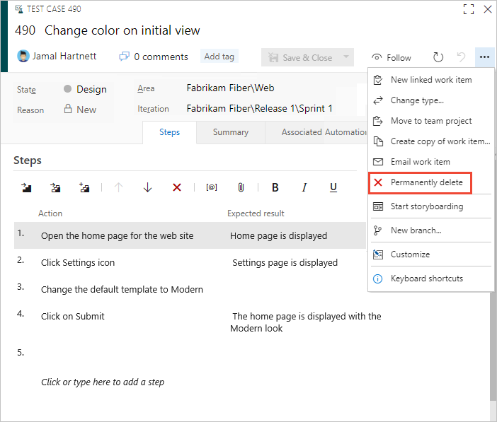
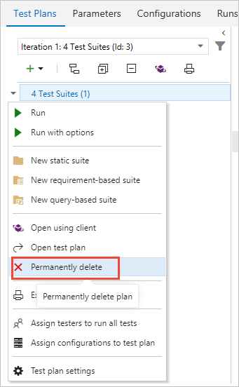

# Delete test artifacts in Azure Boards

[!INCLUDE [version-lt-eq-azure-devops](../../includes/version-lt-eq-azure-devops.md)]

 

Test artifacts such as test plans, test suites, and test cases are all considered work items in Azure DevOps. However, the method for deleting test artifacts differs from the method for deleting nontest work items.

> [!IMPORTANT]
> **Permanent and Irreversible Deletion:** Azure DevOps only supports the permanent deletion of test artifacts, including test plans, test suites, test cases, shared steps, and shared parameters. Deleted artifacts cannot be restored, and all associated child items, such as test results, are also removed. Additionally, bulk deletion of test artifacts is not supported; attempting to bulk delete results in the deletion of all other selected work items except the test artifacts.
> 
> **Back up any necessary information before deleting test artifacts, as this action cannot be undone.**

When you delete test artifacts, the following actions occur:

1. **Remove from TCM data store:**
    - The deleted test artifact is removed from the Test Case Management (TCM) data store.
    - The underlying work item associated with the test artifact is deleted.

2. **Delete child items:**
    - A background job initiates the deletion of all child items from both the TCM data store and the underlying work items.
    - This process might take a few minutes, depending on the number of artifacts being deleted.

3. **Permanent deletion:**
    - All information in both the work item tracking data store and the TCM data store is permanently deleted.
    - Deleted data can't be reactivated or restored under any circumstances.

## Prerequisites

| Category | Requirements |
|--------------|-------------|
| **Permissions** | - To delete test runs: Member of the **Project Administrators** group or the project-level [**Delete test runs**](../../organizations/security/change-project-level-permissions.md) permission set to **Allow**.   - To delete test plans and test suites: Member of the **Project Administrators** group or the Area Path node-level [**Manage test plans** or **Manage test suites**](../../organizations/security/set-permissions-access-work-tracking.md#manage-test-artifacts) permission set to **Allow**. If you're not part of the project administrators group: Project-level [**Delete test runs**](../../organizations/security/change-project-level-permissions.md) permission set to **Allow** along with Area Path node level permissions. |
| **Access levels** | To manage or delete test artifacts: At least [**Basic + Test Plans**](../../organizations/security/access-levels.md) access or **Visual Studio Enterprise**. This level provides access to the full Test Plans feature set. Users with **Basic** access and with permissions to permanently delete work items and manage test artifacts can only delete orphaned test cases, which means they can delete test cases created from **Work** that aren't linked to any test plans or test suites. |

## Work item types that support the test experience  

The following image illustrates the set of work item types that support the test experience and work with Microsoft Test Manager. These work item types are linked together using the link types shown. 

From the web portal or Microsoft Test Manager, you can view which test cases are defined for a test suite, 
and which test suites are defined for a test plan. 
However, these objects aren't connected to each other through link types. For definitions of each field used in these work item types, see [Query based on build and test integration fields](../queries/build-test-integration.md).

## Delete a test case, test suite, or test plan 

1. To delete a test case, test suite, or test plan, open it from the web portal and choose the **Permanently delete** option from the actions menu. Bulk deletion isn't supported from a query results page.    
 
     

   > [!NOTE] 
   > You only see the **Permanently delete** option if you have the necessary permissions and access. 

2. Confirm you want to delete the item.  
  
   :::image type="content" source="media/move-change-delete/perm-delete-test-artifacts-dialog.png" alt-text="Confirm delete of test artifacts dialog.":::  

::: moniker range=">= azure-devops-2020"
3. You can also delete a test plan directly from **Test Plans**. To delete a test plan, open **Test Plans** and choose :::image type="icon" source="../../media/icons/actions-icon.png" border="false"::: **More Actions** for the plan you want to delete, and choose **Delete**. 

	:::image type="content" source="media/move-change-delete/delete-test-suite-test-plans.png" alt-text="Screenshot of Test Plans page, delete a test plan.":::  
::: moniker-end

::: moniker range="< azure-devops-2020"
3. You can also delete a test plan directly from **Test** or **Test Plans**. 

	  
::: moniker-end

4.	To delete shared steps and shared parameters, first manually remove all references to them before you can delete them. 
	
     

## Related articles   

- [Create a test plan](../../test/create-a-test-plan.md)
- [Control how long to keep test results](../../test/how-long-to-keep-test-results.md) 
- [Set permissions and access for work tracking, Manage test artifacts](../../organizations/security/set-permissions-access-work-tracking.md#manage-test-artifacts)
