# Display rollup progress or totals

[!INCLUDE [temp](../_shared/version-vsts-only.md)]

Rollup columns allow you to view progress bars or totals of numeric fields or descendant items within a hierarchy. Descendant items correspond to all child items within the hierarchy. You can add one or more rollup columns to a product or portfolio backlog. For information on linking work items in a hierarchy, see [Linking, traceability, and managing dependencies, Parent-child work item links](../queries/link-work-items-support-traceability.md#parent-child-work-item-links).

> [!IMPORTANT]   
> Rollup data supports progress or counts within a project. Child items that link to a different project aren't counted within the parent rollup calculations.

For example, here we show **Progress by Work Items** which displays progress bars for ascendant work items based on the percentage of descendant items that have been closed. Descendant items for Epics includes all child Features and their child or grand-child work items. Descendant items for Features includes all child User Stories and their child work items.

> [!div class="mx-imgBorder"]  
> 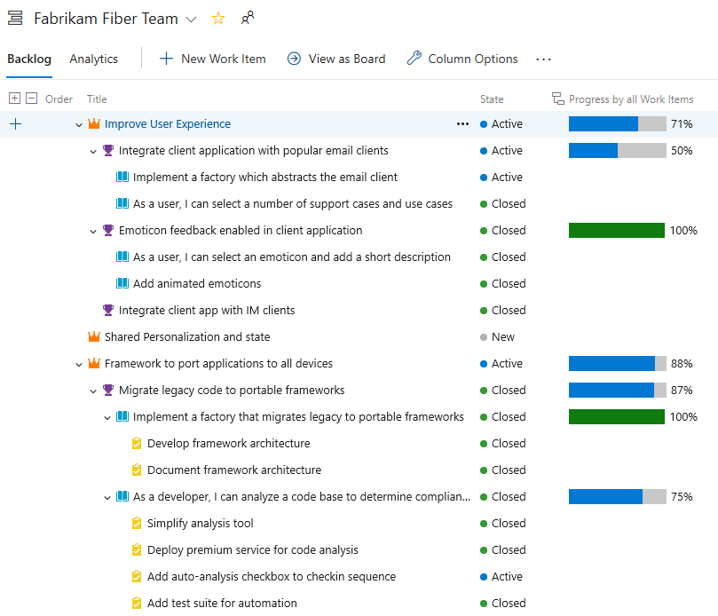

## Rollup and hierarchical work items

The default set of backlog work items which support a natural hierarchical grouping varies depending on the process chosen for your project. The easiest way to group work items into a hierarchy is by mapping them, or adding them to the parent item on a Kanban board. To learn more, see [Organize your backlog, map child work items to parents](organize-backlog.md#map-items-to-group-them-under-a-feature-or-epic) and [Kanban board features and epics](../boards/kanban-epics-features-stories.md).

#### [Agile process](#tab/agile-process) 

The following image shows the Agile process backlog work item hierarchy. Each team can configure how they manage bugs&mdash;at the same level as User Stories or Tasks&mdash; by configuring the [Working with bugs](../../organizations/settings/show-bugs-on-backlog.md) setting. 

> [!div class="mx-tdCol2BreakAll"]
> 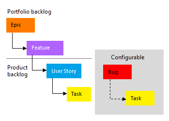  

#### [Basic process](#tab/basic-process) 

The following image shows the Basic process backlog work item hierarchy that includes epics, issues, and tasks.  

> [!div class="mx-imgBorder"]  
>  

#### [Scrum process](#tab/scrum-process) 

The following image shows the Scrum process backlog work item hierarchy. Each team can configure how they manage bugs&mdash;at the same level as Product Backlog Items or Tasks&mdash; by configuring the [Working with bugs](../../organizations/settings/show-bugs-on-backlog.md) setting.   

> [!div class="mx-tdCol2BreakAll"]
> 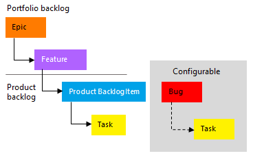  

#### [CMMI process](#tab/cmmi-process) 

The following image shows the CMMI process backlog work item hierarchy. Each team can configure how they manage bugs&mdash;at the same level as Requirements or Tasks&mdash; by configuring the [Working with bugs](../../organizations/settings/show-bugs-on-backlog.md) setting. 

> [!div class="mx-imgBorder"]  
> 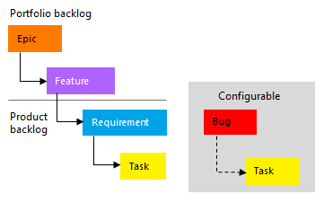 
 

* * * 
 
## Open a product or portfolio backlog 

Each user can set their own column options which persist for each backlog across the user's sessions. 

1. Open a product or portfolio backlog. Optionally, enable **Show parents** from your view options. Note that even if child items aren't listed, rollup for them displays.

	> [!TIP]  
	> Consider opening a portfolio backlog and choose to view **In Progress Items** and **Completed Child Items**. That way, you can check the State value of items against the rollup value. 
	>
	> 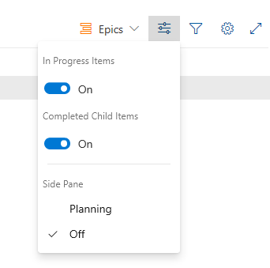 

2. Choose **Column options**, or choose the  actions icon and then select **Column options**. 

	> [!div class="mx-imgBorder"]  
	> 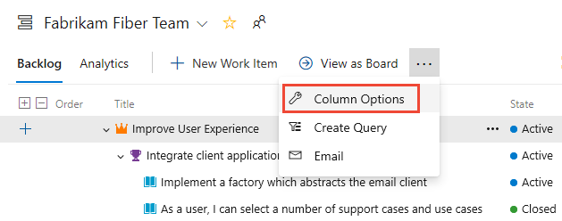 

	> [!TIP]  
	> Remember that the Column options you choose are for the selected backlog level. They persist across your sessions until you change them. 

## Add a rollup column 

1. In the Column options dialog, choose **Add a rollup column**, select **From quick list**, and then choose from one of the options listed.  

	> [!div class="mx-imgBorder"]  
	> 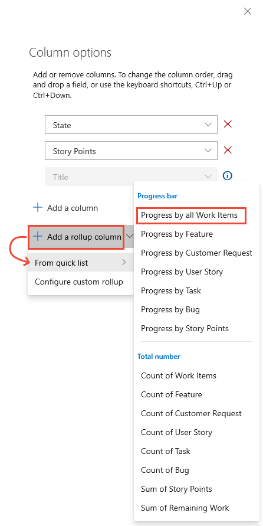 

	> [!NOTE]  
	> The menu options vary depending on the process chosen for your project, the backlog level you've selected, and whether or not you have the **Show parents** view option enabled. 

1. Choose from the menu provided. 

	- **Progress bar** displays progress bars based on the percentage of associated descendant work items which have been completed or closed. 
	- **Total number** displays the sum of descendant items or the associated fields of descendant items. Totals provide a measure of the size of a Feature or Epic based on the number of its child items. For example, **Count of Tasks** shows the sum of all tasks that are linked to parent items. The active or closed state is ignored. 

	> [!div class="mx-imgBorder"]  
	> 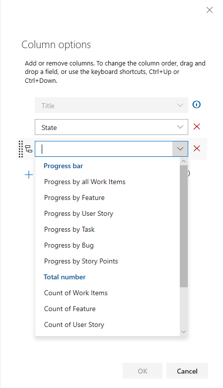
	
	For example, the following image shows the Count of Tasks for the parent user stories is 2 and 4, respectively. The Count of Tasks is 6 for the parent Feature and Epic. 

	> [!div class="mx-imgBorder"]  
	> 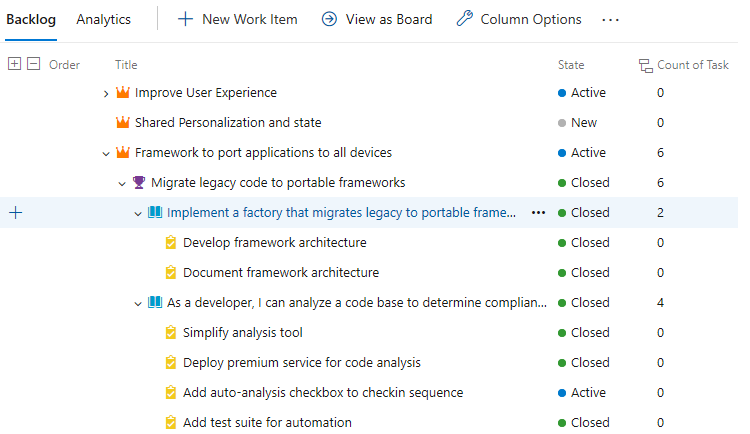 

4.  **Remaining Work of Tasks** shows the sum of Remaining Work of tasks that are linked to the parent item.   

	> [!div class="mx-imgBorder"]  
	> 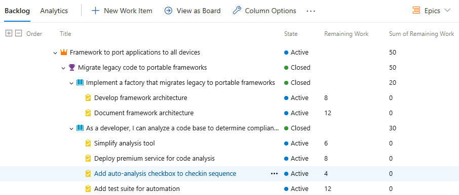 

	> [!TIP]  
	> Reminder that when a task is closed, the Remaining Work field is set to zero. 

## Analytics, latency, and error states

Rollup data is calculated from the Analytics service. When there is a large amount of data, it's possible to experience some latency in displaying rollup. If you hover over the  rollup icon, you can determine the state of the data. 

If an error occurs in retrieving rollup data, you'll see an  info icon and empty rows. Errors indicate when the Analytics data was last updated. This means that the Analytics services is still processing changes made which may affect rollup calculations. Once the Analytics data is up-to-date, the rollup columns will refresh with the latest data.  

> [!div class="mx-imgBorder"]  
> 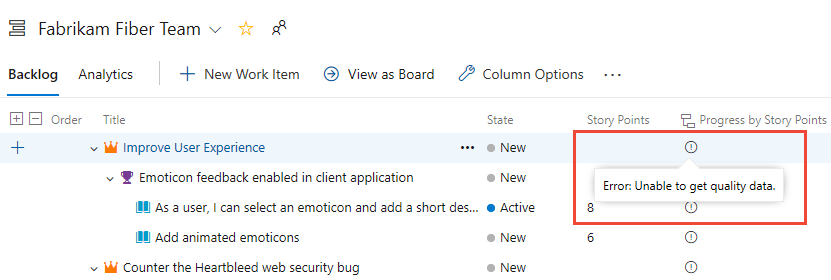 

To learn more about the service, see [What is Analytics?](../../report/powerbi/what-is-analytics.md).

## Change the column order or remove a rollup column 

To change the order of the fields, drag-and-drop the field where you want it within the set of selected fields. And, to remove a field, choose the .

## Rollup of custom work item types or custom fields

If you add a custom work item type or field to a backlog level, you can view rollup based on those options.  For example, the Customer Request type is added to the Requirements category, and a Count of Customer Requests is shown in the following image.

> [!div class="mx-imgBorder"]  
> 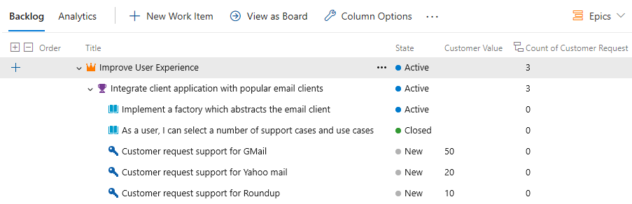 

1. From the Column options dialog, choose  **Add a rollup column**, select **Configure custom rollup** option.

1. Choose the options you want from the Custom Rollup column dialog. 

	> [!div class="mx-imgBorder"]  
	> 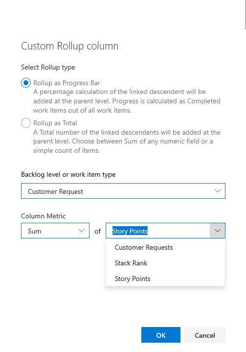 

1. Choose **OK**. and then **OK** to complete your operations.. 

	> [!TIP]  
	> If you add custom fields or custom work item types, you must refresh the backlog page to reflect your changes.  
## Use keyboard shortcuts to change the column order, column width, or sort options

You can change the column order, column size, or sort options by using the following keyboard commands:
- To change the column order, click the field and drag it to a new location
- To re-size a column, choose the column divider to the right of the field and drag to a new location  
 
 
## Related articles

- [Change column options](set-column-options.md)
- [Work item field index](../work-items/guidance/work-item-field.md) 
- [Backlogs, boards, and plans](backlogs-boards-plans.md)   
- [Create managed queries](../queries/using-queries.md)
