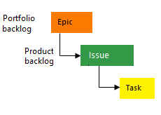
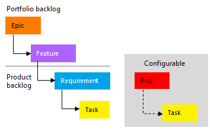
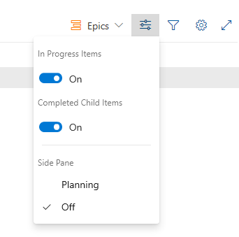
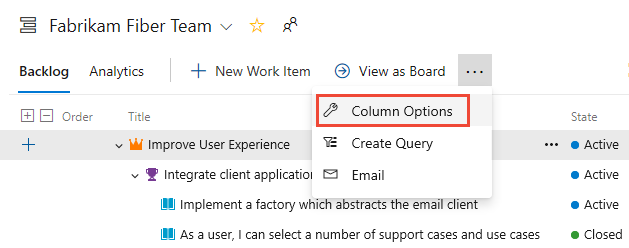
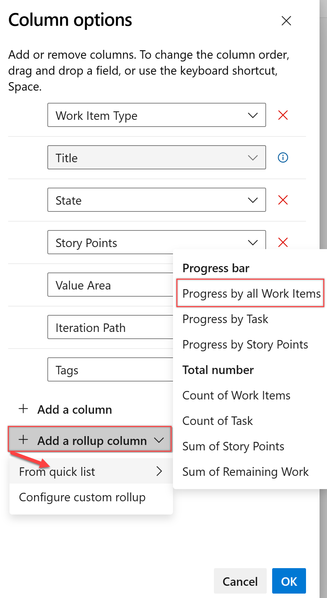
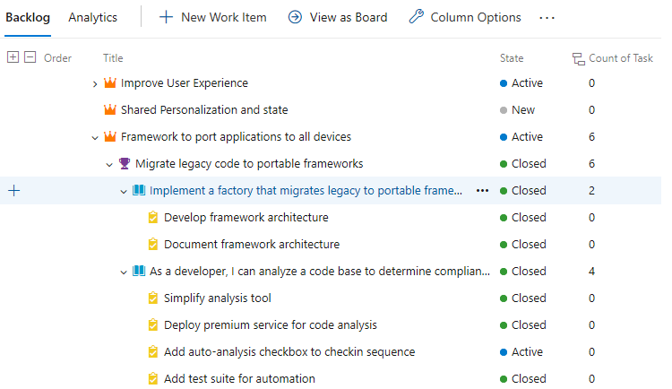
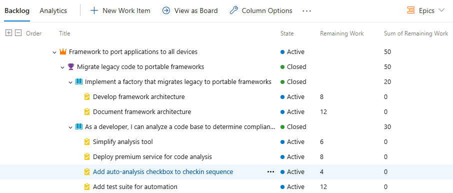
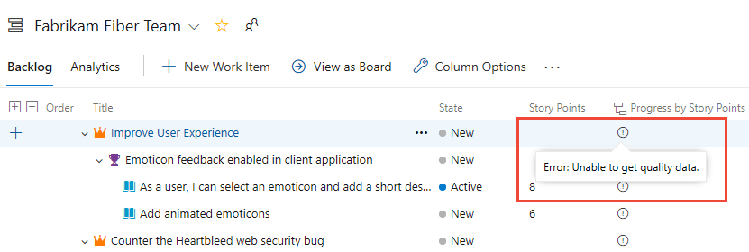
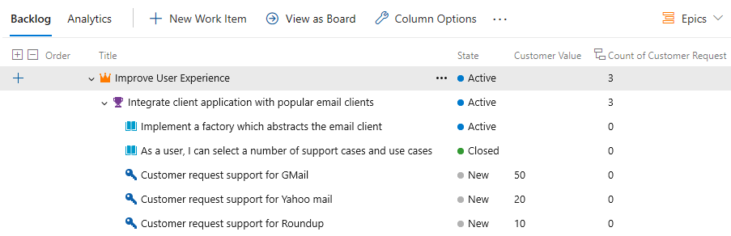
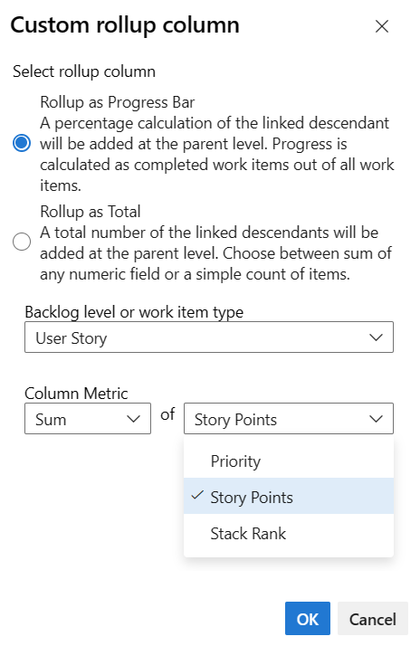

# Display rollup progress or totals in Azure Boards

[!INCLUDE [Azure DevOps Services | Azure DevOps Server 2022 | Azure DevOps Server 2020](../includes/version-gt-eq-2020.md)]

Rollup automatically sums child work item values to display totals on parent items. Use it to track work estimates, effort, size, or story points across your backlog hierarchy. Learn how to add rollup columns to backlogs, sprint planning, and taskboards.

> [!IMPORTANT]
> - Rollup supports progress bars, work item counts, and numeric field sums within a project only
> - Cross-project child items and test case links aren't included in rollup calculations
> - Rollup of Effort, Story Points, or Size fields isn't supported across product and portfolio backlogs

In the following example, **Progress by Work Items** shows progress bars based on the percentage of closed descendant items. For Epics, this includes all child Features and their descendants. For Features, this includes all child User Stories and their descendants.

> [!div class="mx-imgBorder"]
> 

::: moniker range="azure-devops"

> [!NOTE]
> Rollup progress is available in the new Delivery Plans (public preview). Enable **New Delivery Plans Experience** in [preview features](../../project/navigation/preview-features.md). For more information, see [Review team Delivery Plans](../plans/review-team-plans.md).

::: moniker-end

## Prerequisites

::: moniker range=" azure-devops"

| Category | Requirements |
|--------------|-------------|
| **Permissions** | To view delivery plans and rollup progress: Member of the **Project Collection Valid Users Group**. |
| **Access levels** | One of the following access levels assigned:   - [**Basic:**](../../organizations/security/access-levels.md) Full access to all Azure Boards features, including viewing and modifying work items.   - **Stakeholder:** View and modify work items with limited features. |
| **Use parent-child links** | Work items linked using parent-child relationships to support rollup. |
| **Add required fields** | The fields you want to roll up are present in the work item types. |

::: moniker-end

::: moniker range="< azure-devops"

| Category | Requirements |
|--------------|-------------|
|**Analytics service** |Analytics service enabled on your on-premises Azure DevOps Server. For more information, see [Install/uninstall or enable/disable the Analytics service](../../report/dashboards/analytics-extension.md).|
| **Parent-child links** | Work items linked using parent-child relationships to support rollup. |
| **Required fields** | The fields you want to roll up are present in the work item types. |

::: moniker-end

## Rollup and hierarchical work items

The default set of backlog work items that supports natural hierarchical grouping varies based on the process chosen for your project. The easiest way to create a hierarchy is by mapping work items or adding them to a parent item on a board. For more information, see [Organize your backlog, map child work items to parents](organize-backlog.md#map-items-to-group-them-under-a-feature-or-epic) and [Board features and epics](../boards/kanban-epics-features-stories.md).

#### [Agile process](#tab/agile-process)

The following image shows the Agile process backlog work item hierarchy. Each team can configure how they manage bugs—either at the same level as User Stories or Tasks—by adjusting the [Working with bugs](../../organizations/settings/show-bugs-on-backlog.md) setting.

> [!div class="mx-tdCol2BreakAll"]
> 

### [Basic process](#tab/basic-process)

The following image illustrates the Basic process backlog work item hierarchy, which includes Epics, Issues, and Tasks.

> [!div class="mx-imgBorder"]
> 

### [Scrum process](#tab/scrum-process)

The following image illustrates the Scrum process backlog work item hierarchy. Each team can configure how they manage bugs—either at the same level as Product Backlog Items or Tasks—by adjusting the [Working with bugs](../../organizations/settings/show-bugs-on-backlog.md) setting.

> [!div class="mx-tdCol2BreakAll"]
> 

### [CMMI process](#tab/cmmi-process)

The following image illustrates the CMMI process backlog work item hierarchy. Each team can configure how they manage bugs—either at the same level as Requirements or Tasks—by adjusting the [Working with bugs](../../organizations/settings/show-bugs-on-backlog.md) setting.

> [!div class="mx-imgBorder"]
> 

***

## Open a product or portfolio backlog

Each user can customize their column options, and these settings persist across sessions for each backlog.

1. Open a product or portfolio backlog. Optionally, enable **Show parents** in your view options. Even if child items aren't listed, rollup for them displays.

   Open a portfolio backlog and select **In Progress Items** and **Completed Child Items**. This allows you to compare the State value of items with the rollup value.

   > [!div class="mx-imgBorder"]  
   > 

2. Select **Column options**, or select the  :::image type="icon" source="../../media/icons/actions-icon.png" border="false":::  actions icon and then select **Column options**.
   
   > [!div class="mx-imgBorder"] 
   > 

   > [!TIP]
   > The Column options you select apply to the chosen backlog level and persists across your sessions until you change them.

## Add a rollup column

1. From your backlog, select **Column Options** > **Add a rollup column** > **From quick list**, and then choose from the menu provided.
   
   > [!div class="mx-imgBorder"]   
   > 

   The menu options vary based on the process chosen for your project, the selected backlog level, and whether the **Show parents** view option is enabled.

   For example, the following image shows that the Count of Tasks for the parent user stories is 2 and 4, respectively. The Count of Tasks for the parent Feature and Epic is 6.
   
   > [!div class="mx-imgBorder"]    
   > 

2. **Remaining Work of Tasks** shows the sum of Remaining Work of tasks linked to the parent item.
   
   > [!div class="mx-imgBorder"]  
   > 

   > [!TIP]
   > When a task is closed, the Remaining Work field automatically sets to zero.

## Get rollup data

Use the following methods to get rollup data:

- Create flat list queries:
  - Create a flat list query to include the fields you want to roll up.
  - Export the query results to Excel for further analysis.
- Use extensions:
  - Install extensions from the Azure DevOps Marketplace that support rollup functionality.
  - Example: [Roll-up Board](https://marketplace.visualstudio.com/search?term=rollup&target=AzureDevOps&category=All%20categories&visibilityQuery=all&sortBy=Relevance) extension.
- Use the Analytics Service:
  - Use the Analytics Service to create custom reports and dashboards that include rollup data.
  - Example: Create a Power BI report that displays rollup values for your work items.

### Use product and portfolio backlogs

1. Got to your product or portfolio backlog.
2. Ensure that the backlog view includes the fields you want to roll up.
  
   The rollup values display in the backlog view.

### Use the sprint planning pane

1. Open the sprint planning pane.
2. Add the fields you want to roll up to the view.

   The rollup values display for the parent work items.

### Use a sprint backlog and taskboard

1. Go to your sprint backlog or taskboards.
2. Ensure that the view includes the fields you want to roll up.

   The rollup values display for the parent work items.

## Analytics, latency, and error states

Rollup data gets calculated from the Analytics service. When dealing with a large amount of data, you might experience some latency in displaying rollup. Hover over the :::image type="icon" source="../../media/icons/rollup.png" border="false"::: rollup icon to determine the state of the data.

If an error occurs in retrieving rollup data, you see an :::image type="icon" source="../../media/icons/info.png" border="false"::: info icon and empty rows. Errors indicate when the Analytics data was last updated, meaning the Analytics services are still processing changes that might affect rollup calculations. Once the Analytics data is up to date, the rollup columns refresh with the latest data.

> [!div class="mx-imgBorder"]  
> 

For more information about the service, see [What is Analytics?](../../report/powerbi/what-is-analytics.md).

## Change the column order or remove a rollup column

To change the order of the fields, drag and drop the field to your desired position within the set of selected fields. To remove a field, select the .

## Rollup of custom work item types or custom fields

If you add a custom work item type or field to a backlog level, you can view rollup data based on those options. For example, the Customer Request type is added to the Requirements category, and the following image shows a Count of Customer Requests.

> [!div class="mx-imgBorder"]
> 

1. From the Column options dialog, select  **Add a rollup column** > **Configure custom rollup**.

2. Choose the options you want from the Custom Rollup column dialog.
   
   > [!div class="mx-imgBorder"]   
   > 

3. Select **OK** > **OK** to complete your operations.

   > [!TIP]
   > After adding custom fields or custom work item types, refresh the backlog page to see your changes.

## Use keyboard shortcuts to change the column order, column width, or sort options

Change the column order, column size, or sort options using the following actions:

- **Change column order:** Select the field and drag it to a new location.
- **Resize a column:** Select the column divider to the right of the field and drag it to adjust the size.

## Related articles

- [Change column options](set-column-options.md)
- [Access the work item field index](../work-items/guidance/work-item-field.md)
- [Create managed queries](../queries/using-queries.md)
