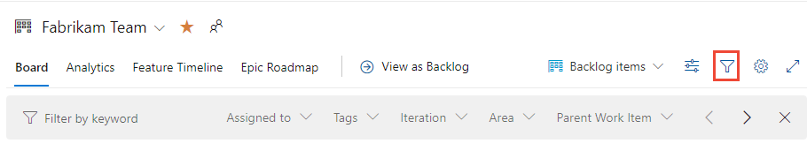
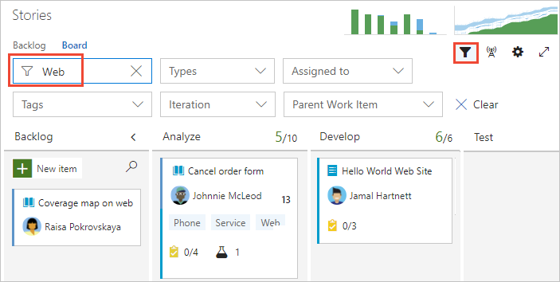
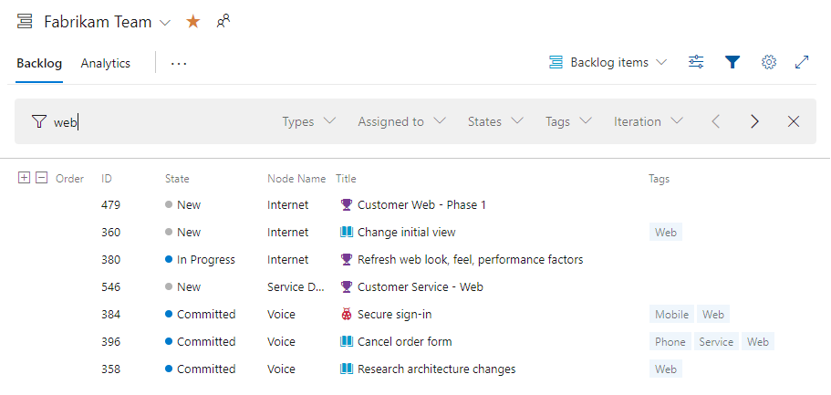
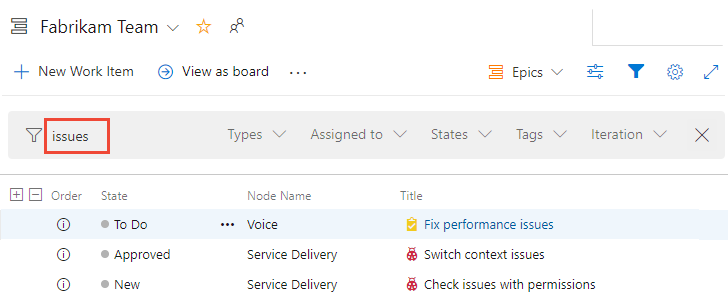
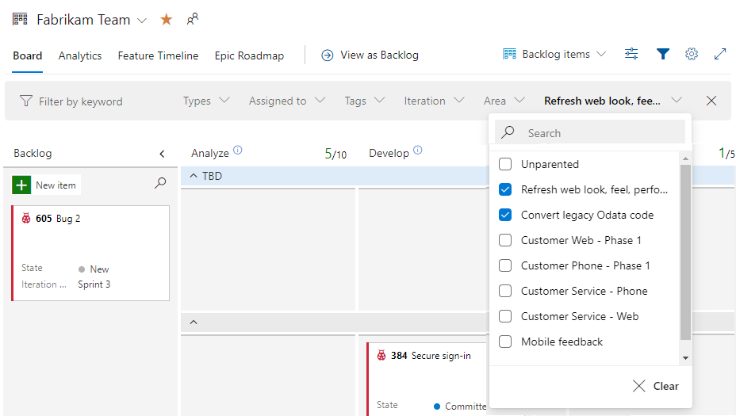
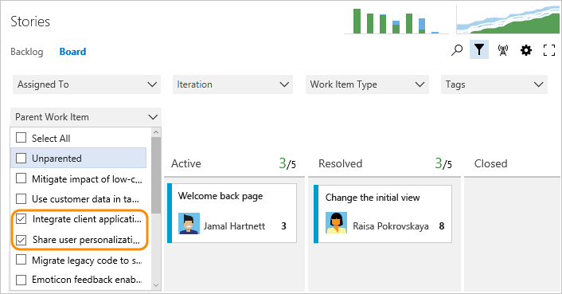
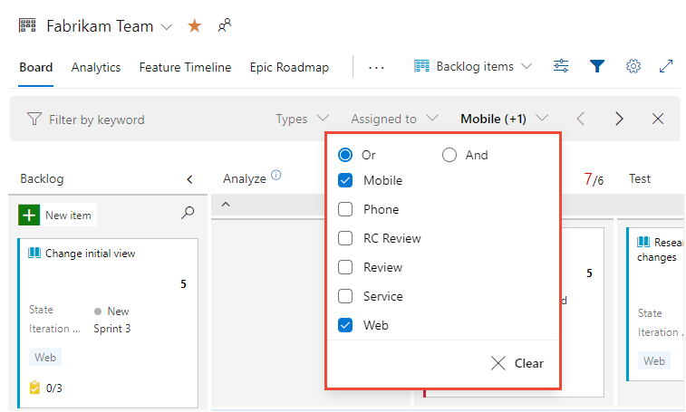

# Interactively filter backlogs, boards, queries, and plans in Azure Boards

[!INCLUDE [version-lt-eq-azure-devops](../../includes/version-lt-eq-azure-devops.md)] 

<a id="filter"></a>

With filter functions, you can interactively apply one or more filters to an Azure Boards tool. Each tool is already filtered to show a subset of work items according to the tool function. For example, Backlogs and Boards display work items based on the selected **Area Paths** and **Iteration Paths** for the team. **Query Results** list work items based on the query clauses you've defined. 

You enable the filter feature by choosing :::image type="icon" source="../../media/icons/filter-icon.png" border="false"::: **Filter**.

::: moniker range=">=azure-devops-2019"
:::image type="content" source="media/filter/filter-backlogs.png" alt-text="Screenshot of choosing Filter function latest versions.":::
::: moniker-end 

::: moniker range="tfs-2018"
:::image type="content" source="media/filter/filter-backlogs-options-tfs-2017.png" alt-text="Screenshot of initial keyword filter function.  ":::
::: moniker-end 


From these tools, you may still have a large number of work items listed or displayed. Interactive filtering supports your ability to focus on a subset of them. You can apply one or more filter functions to each of the Azure Boards tools.  

Use filters to complete these tasks:  
- In daily scrum meetings, filter the Kanban board to focus on assigned work for a specific sprint. 
- Or, if your team uses the Sprints Taskboard, filter for a team member's completed assigned work. 
- To focus on a group of work items, filter based on the **Parent Work Item**, by **Area Path**, or **Tags**.  
- To triage work items, create a query and filter to focus on similar work grouped by Area Path or Tags. 


## Supported filter functions 


::: moniker range=">= azure-devops-2019"
Filter functions are available from all Azure Boards tools: Work items, Boards, Backlogs, Sprint Backlogs and Taskboards, Queries, and Delivery Plans. The set of features supported depends on the tool and Azure DevOps version. *(Use the content selector to view the filters available for your version.)* 

The following table indicates the supported options based on the tool indicated with a ✔️ or is listed. 

Backlogs and boards are subject to filters defined for the team as described in [Set up your Backlogs and Boards](set-up-your-backlog.md). Other tools have predefined filters based on the view, query filter clauses, or settings you select. 

::: moniker-end 

::: moniker range="tfs-2018"

Filter functions are available from all Azure Boards tools: Boards, Backlogs, Sprint Backlogs, Taskboards, and Queries. The set of features supported depends on the tool and Azure DevOps version. *(Use the content selector to view the filters available for your version.)* 

Supported options are indicated with a ✔️ or listed. 

::: moniker-end 

:::row:::
   :::column span="1.5":::
      <br/>**Tool** 
   :::column-end:::
   :::column span="1":::
      **Keywords**<br/>or **ID**
   :::column-end:::
   :::column span="2":::
      <br/>**Fields**
   :::column-end:::
   :::column span="1.5":::
      **Parent<br/>Work Item**
   :::column-end:::
   :::column span="1":::
      <br/>**Tags**
   :::column-end:::
:::row-end:::
---
::: moniker range=">= azure-devops-2019"
:::row:::
   :::column span="1.5":::
      [**Work items**](../work-items/view-add-work-items.md) 
   :::column-end:::
   :::column span="1":::
      ✔️   
   :::column-end:::
   :::column span="2":::
      - Assigned To
      - Work Item Type
      - States
      - Area Path
   :::column-end:::
   :::column span="1.5":::
          
   :::column-end:::
   :::column span="1":::
      ✔️   
   :::column-end:::
:::row-end:::
---
::: moniker-end 
:::row:::
   :::column span="1.5":::
      [**Boards**](../boards/kanban-overview.md)   
   :::column-end:::
   :::column span="1":::
      ✔️   
   :::column-end:::
   :::column span="2":::
      - Assigned To
      - Work Item Type
      - States
      - Area Path
      - Iteration Path
   :::column-end:::
   :::column span="1.5":::
      ✔️   
   :::column-end:::
   :::column span="1":::
      ✔️   
   :::column-end:::
:::row-end:::
---
:::row:::
   :::column span="1.5":::
      [**Backlogs**](backlogs-overview.md) 
   :::column-end:::
   :::column span="1":::
      ✔️   
   :::column-end:::
   :::column span="2":::
      - Assigned To  
      - Work Item Type  
      - States  
      - Area Path  
      - Iteration Path
   :::column-end:::
   :::column span="1.5":::
      Note 1
   :::column-end:::
   :::column span="1":::
      ✔️   
   :::column-end:::
:::row-end:::
---
::: moniker range=">= azure-devops-2020"
:::row:::
   :::column span="1.5":::
     [**Sprints** (Backlogs  
     & Taskboards)](../sprints/scrum-overview.md)  
   :::column-end:::
   :::column span="1":::
      ✔️   
   :::column-end:::
   :::column span="2":::
      - Assigned To
      - Work Item Type
      - States  
      - Area Path 
   :::column-end:::
   :::column span="1.5":::
      ✔️ (Note 2)   
   :::column-end:::
   :::column span="1":::
      ✔️ 
   :::column-end:::
:::row-end:::
---
::: moniker-end 
::: moniker range="< azure-devops-2020"
:::row:::
   :::column span="1.5":::
     [**Sprints** (Backlogs  
     & Taskboards)](../sprints/scrum-overview.md)  
   :::column-end:::
   :::column span="1":::
      ✔️   
   :::column-end:::
   :::column span="2":::
      - Assigned To
      - Work Item Type
      - States  
      - Area Path  
   :::column-end:::
   :::column span="1.5":::
           
   :::column-end:::
   :::column span="1":::
      ✔️  
   :::column-end:::
:::row-end:::
---
::: moniker-end 
:::row:::
   :::column span="1.5":::
     [**Query Results**](../queries/view-run-query.md)
   :::column-end:::
   :::column span="1":::
      ✔️   
   :::column-end:::
   :::column span="2":::
      - Work Item Types
      - Assigned To
      - States
      - Tags
   :::column-end:::
   :::column span="1.5":::
      Note 1
   :::column-end:::
   :::column span="1":::
      ✔️   
   :::column-end:::
:::row-end:::
---
::: moniker range=">= azure-devops-2022"
:::row:::
   :::column span="1.5":::
     [**Delivery Plans**](../plans/review-team-plans.md)
   :::column-end:::
   :::column span="1":::
      ✔️   
   :::column-end:::
   :::column span="2":::
      - Work Item Types
      - Assigned To
      - States
      - Area Path
      - Iteration Path
      - Tags
   :::column-end:::
   :::column span="1.5":::
      ✔️   
   :::column-end:::
   :::column span="1":::
      ✔️   
   :::column-end:::
:::row-end:::
---
::: moniker-end 
::: moniker range="< azure-devops-2022"
:::row:::
   :::column span="1.5":::
     [**Plans**](../extensions/delivery-plans.md)
   :::column-end:::
   :::column span="1":::
      ✔️   
   :::column-end:::
   :::column span="2":::
      - Work Item Types
      - Assigned To
      - States
      - Tags
   :::column-end:::
   :::column span="1.5":::
        
   :::column-end:::
   :::column span="1":::
      ✔️   
   :::column-end:::
:::row-end:::
---
::: moniker-end  
::: moniker range=">= azure-devops-2019"
:::row:::
   :::column span="1.5":::
     [**Semantic search, Work Items**](../../project/search/functional-work-item-search.md)
   :::column-end:::
   :::column span="1":::
      ✔️   
   :::column-end:::
   :::column span="2":::
      - Projects
      - Area Paths
      - Assigned To  
      - Work Item Types
      - States 
   :::column-end:::
   :::column span="1.5":::
        
   :::column-end:::
   :::column span="1":::
      ✔️   
   :::column-end:::
:::row-end:::
---
::: moniker-end   

**Notes**

1. While the **Parent Work Item** isn't a filter function for **Backlogs** or **Query Results**, you can add the **Parent** field as a column and then do a keyword/phrase search on the Parent title to effectively filter on parent work items. The Parent field is supported for Azure DevOps Server 2020 and later versions. See also the [Parent field and Parent Work Item](#parent-filter) section later in this article. 
2. The **Parent Work Item** filter is supported for **Sprint Backlogs** and **Taskboards** for Azure DevOps Server 2020 and later versions. 


::: moniker range=">= azure-devops-2020"

### Additional filter, sort, group, reorder, and rollup functions 

Along with the standard filter functions summarized in the previous table, the following table indicates which tools have more filters you can apply, sort, group, reorder, and rollup functions. Some functions, such as reorder, don't work when the filter function is enabled.  

<br/>
::: moniker-end 

::: moniker range=">= azure-devops-2020"
---
:::row:::
   :::column span="2":::
      **Tool** 
   :::column-end:::
   :::column span="2":::
      **Filter settings**
   :::column-end:::
   :::column span="1":::
      **Sort**
   :::column-end:::
   :::column span="1":::  
      **Group**
   :::column-end:::
   :::column span="1":::
      **Reorder**
   :::column-end:::
   :::column span="1":::
      **Rollup**
   :::column-end:::
:::row-end:::
---
:::row:::
   :::column span="2":::
      [**Work items**](../work-items/view-add-work-items.md) 
   :::column-end:::
   :::column span="2":::
      ✔️ (Note 1)  
      Completed Work Items
   :::column-end:::
   :::column span="1":::
      ✔️   
   :::column-end:::
   :::column span="1":::
          
   :::column-end:::
   :::column span="1":::
          
   :::column-end:::
   :::column span="1":::

   :::column-end:::
:::row-end:::
---
:::row:::
   :::column span="2":::
      [**Boards**](../boards/kanban-overview.md)   
   :::column-end:::
   :::column span="2":::
      ✔️ (Note 1)  
   :::column-end:::
   :::column span="1":::
          
   :::column-end:::
   :::column span="1":::

   :::column-end:::
   :::column span="1":::
      ✔️ 
   :::column-end:::
   :::column span="1":::
       
   :::column-end:::
:::row-end:::
---
:::row:::
   :::column span="2":::
      [**Backlogs**](backlogs-overview.md) 
   :::column-end:::
   :::column span="2":::
      ✔️ (Note 1)  
      In Progress items  
      Completed Child items 
   :::column-end:::
   :::column span="1":::
          
   :::column-end:::
   :::column span="1":::
      ✔️ (Note 2)   
   :::column-end:::
   :::column span="1":::
      ✔️ (Note 3)   
   :::column-end:::
   :::column span="1":::
      ✔️    
   :::column-end:::
:::row-end:::
---
:::row:::
   :::column span="2":::
     [**Sprints**, **Backlogs** ](../sprints/scrum-overview.md)  
   :::column-end:::
   :::column span="2":::
      ✔️ (Note 1)  
   :::column-end:::
   :::column span="1":::
       
   :::column-end:::
   :::column span="1":::
      ✔️ (Note 2)  
   :::column-end:::
   :::column span="1":::
      ✔️ (Note 3)   
   :::column-end:::
   :::column span="1":::
         
   :::column-end:::
:::row-end:::
---
:::row:::
   :::column span="2":::
     [**Sprints**, **Taskboards**](../sprints/scrum-overview.md)  
   :::column-end:::
   :::column span="2":::
      ✔️ (Note 1)  
      Person  
   :::column-end:::
   :::column span="1":::

   :::column-end:::
   :::column span="1":::
      ✔️ (Note 4)   
   :::column-end:::
   :::column span="1":::
      ✔️    
   :::column-end:::
   :::column span="1":::
         
   :::column-end:::
:::row-end:::
---
:::row:::
   :::column span="2":::
     [**Query Results**](../queries/view-run-query.md)
   :::column-end:::
   :::column span="2":::
           
   :::column-end:::
   :::column span="1":::
      ✔️   
   :::column-end:::
   :::column span="1":::
      ✔️ (Note 2)  
   :::column-end:::
   :::column span="1":::
         
   :::column-end:::
   :::column span="1":::
         
   :::column-end:::
:::row-end:::
---
::: moniker-end 
::: moniker range="azure-devops"
:::row:::
   :::column span="2":::
     [**Delivery Plans**](../plans/review-team-plans.md)
   :::column-end:::
   :::column span="2":::
          
   :::column-end:::
   :::column span="1":::
        
   :::column-end:::
   :::column span="1":::
      ✔️ (Note 6)  
   :::column-end:::
   :::column span="1":::
            
   :::column-end:::
   :::column span="1":::
      ✔️    
   :::column-end:::
:::row-end:::
---
::: moniker-end 
::: moniker range=">= azure-devops-2020"
:::row:::
   :::column span="2":::
     [**Semantic search, Work Items**](../../project/search/functional-work-item-search.md)
   :::column-end:::
   :::column span="2":::
        
   :::column-end:::
   :::column span="1":::
      ✔️ (Note 7)  
   :::column-end:::
   :::column span="1":::
        
   :::column-end:::
   :::column span="1":::
         
   :::column-end:::
   :::column span="1":::
         
   :::column-end:::
:::row-end:::
---
::: moniker-end 

::: moniker range="< azure-devops-2020"

### Other filter, sort, group, and reorder functions 

Along with the standard filter functions summarized in the previous table, the following table indicates which tools have other filters you can apply, sort, group, and reorder functions. Some functions, such as reorder, don't work when the filter function is enabled. 

::: moniker-end 

::: moniker range="< azure-devops-2020"
---
:::row:::
   :::column span="2":::
      **Tool** 
   :::column-end:::
   :::column span="2":::
      **Filter settings**
   :::column-end:::
   :::column span="1":::
      **Sort**
   :::column-end:::
   :::column span="1":::  
      **Group**
   :::column-end:::
   :::column span="1":::
      **Reorder**
   :::column-end:::
:::row-end:::
---
::: moniker-end 
::: moniker range="azure-devops-2019"
:::row:::
   :::column span="2":::
      [**Work items**](../work-items/view-add-work-items.md) 
   :::column-end:::
   :::column span="2":::
      ✔️ (Note 1)  
      Completed Work Items
   :::column-end:::
   :::column span="1":::
      ✔️   
   :::column-end:::
   :::column span="1":::

   :::column-end:::
   :::column span="1":::

   :::column-end:::
:::row-end:::
---
::: moniker-end 
::: moniker range="< azure-devops-2020"
:::row:::
   :::column span="2":::
      [**Boards**](../boards/kanban-overview.md)   
   :::column-end:::
   :::column span="2":::
      ✔️ (Note 1)  
   :::column-end:::
   :::column span="1":::

   :::column-end:::
   :::column span="1":::

   :::column-end:::
   :::column span="1":::
      ✔️ 
   :::column-end:::
:::row-end:::
---
::: moniker-end 
::: moniker range="< azure-devops-2020"
:::row:::
   :::column span="2":::
      [**Backlogs**](backlogs-overview.md) 
   :::column-end:::
   :::column span="2":::
      ✔️ (Note 1)  
      In Progress items  
      Completed Child items 
   :::column-end:::
   :::column span="1":::

   :::column-end:::
   :::column span="1":::
      ✔️ (Note 2)   
   :::column-end:::
   :::column span="1":::
      ✔️ (Note 3)   
   :::column-end:::
:::row-end:::
---
::: moniker-end 
::: moniker range="< azure-devops-2020"
:::row:::
   :::column span="2":::
     [**Sprints**, **Backlogs** ](../sprints/scrum-overview.md)  
   :::column-end:::
   :::column span="2":::
      ✔️ (Note 1)  
   :::column-end:::
   :::column span="1":::

   :::column-end:::
   :::column span="1":::
      ✔️ (Note 2)  
   :::column-end:::
   :::column span="1":::
      ✔️ (Note 3)   
   :::column-end:::
:::row-end:::
---
::: moniker-end 
::: moniker range="< azure-devops-2020"
:::row:::
   :::column span="2":::
     [**Sprints**, **Taskboards**](../sprints/scrum-overview.md)  
   :::column-end:::
   :::column span="2":::
      ✔️ (Note 1)  
      Person  
   :::column-end:::
   :::column span="1":::

   :::column-end:::
   :::column span="1":::
      ✔️ (Note 4)   
   :::column-end:::
   :::column span="1":::
      ✔️    
   :::column-end:::
:::row-end:::
---
::: moniker-end 
::: moniker range="< azure-devops-2020"
:::row:::
   :::column span="2":::
     [**Query Results**](../queries/view-run-query.md)
   :::column-end:::
   :::column span="2":::

   :::column-end:::
   :::column span="1":::
      ✔️   
   :::column-end:::
   :::column span="1":::
      ✔️ (Note 2)  
   :::column-end:::
   :::column span="1":::

   :::column-end:::
:::row-end:::
---
::: moniker-end 
::: moniker range="< azure-devops-2022"
:::row:::
   :::column span="2":::
     [**Plans**](../extensions/delivery-plans.md)
   :::column-end:::
   :::column span="2":::

   :::column-end:::
   :::column span="1":::

   :::column-end:::
   :::column span="1":::
      ✔️ (Note 6)  
   :::column-end:::
   :::column span="1":::
        
   :::column-end:::
:::row-end:::
---
::: moniker-end  
::: moniker range="< azure-devops-2020"
:::row:::
   :::column span="2":::
     [**Semantic search, Work Items**](../../project/search/functional-work-item-search.md)
   :::column-end:::
   :::column span="2":::

   :::column-end:::
   :::column span="1":::
      ✔️ (Note 7)  
   :::column-end:::
   :::column span="1":::
        
   :::column-end:::
   :::column span="1":::
        
   :::column-end:::
:::row-end:::
---
::: moniker-end  


**Notes**
1. The **Work items** page is subject to filters based on the [view selected](../work-items/view-add-work-items.md#view-work-items). **Boards** and **Backlogs** are subject to filters defined for the team as described in [Set up your Backlogs and Boards](set-up-your-backlog.md).  Completed and In Progress work items are determined based on the state categories assigned to the workflow state as described in [How workflow states and state categories are used in Backlogs and Boards](../work-items/workflow-and-state-categories.md#state-categories). 
2. Grouping is supported through portfolio backlogs and boards, parent-child links, and tree hierarchy. Tree hierarchies are flattened when filtering is applied and reinstated when filtering is cleared.  
3. **Backlogs** and **Sprint Backlogs** support reordering. However, when filtering is enabled, reordering isn't supported.
4. **Taskboards** provides a **Group by** function based on **People** or **Stories**.  
5. **Query Results** supports [multi-column sort](set-column-options.md#sort-on-a-column).
6. Work items appear in the order defined for the team Sprint backlog, which it inherits from the team product backlog.  
7. Semantic search supports sorting search results by the following fields&mdash;**Assigned To**, **Changed Date**, **Created Date**, **ID**, **State**, **Tags**, **Title**, and **Work Item Type**&mdash;and Relevance. 


::: moniker range=">= azure-devops-2020"
To learn more about these other functions, see the following articles: 
- [Reorder cards (Kanban Boards)](../boards/customize-cards.md#reorder-cards)  
- [Display rollup progress or totals](display-rollup.md) 
- [About backlogs, Work with multi-team ownership of backlog items](backlogs-overview.md#work-with-multi-team-ownership-of-backlog-items) 
 
::: moniker-end 

::: moniker range="< azure-devops-2020"
To learn more about these other functions, see the following articles: 
- [Reorder cards (Kanban Boards)](../boards/customize-cards.md#reorder-cards)  
- [About backlogs, Work with multi-team ownership of backlog items](backlogs-overview.md#work-with-multi-team-ownership-of-backlog-items) 
 
::: moniker-end 


<a id="parent-filter" /> 

### Parent Work Item filter and Parent field

The **Parent Work Item** filter enables you to focus on one or more select features or epics. This filter function was added in July 2016 and made available in Azure DevOps Server 2017 and later versions.    

The **Parent** field was added to Azure Boards in July of 2019 and then made available with the release of Azure DevOps Server 2020. You can add the **Parent** field to a list through the **Column Options** dialog, except for the **Work items** tool. 
You can also add the **Parent** field to cards on the Kanban Boards and Taskboards. 


## Persistence and saving filter options

Once you set the filter options for a specific view, your settings persist until you change them. There's no save button or other action you need to take.   
 
> [!NOTE]    
> You can't set default filter options, nor set filter options for other members in your team. 


## Prerequisites

- All project members can exercise filter functions.  
- All filter functions are set only for the current user until the user clears them.  


- To filter using fields, first add the field as a column or to the card. For example, to filter by **Assign To**, **Iteration Path**, or **Work Item Type**&mdash;or the contents of any other field&mdash;add those fields to show on the cards, backlog, plan, or list. 

To add columns or fields, see the following articles: 

::: moniker range=">= azure-devops-2020"
- For Backlogs and Queries, see [Change column options](set-column-options.md)
- For Boards, see [Customize cards](../boards/customize-cards.md)
- For Taskboards, see [Customize a sprint Taskboard](../sprints/customize-taskboard.md)
- For Plans, see [Review team delivery plans]( ../plans/review-team-plans.md). 
::: moniker-end
::: moniker range="< azure-devops-2020"
- For Backlogs and Queries, see [Change column options](set-column-options.md)
- For Boards, see [Customize cards](../boards/customize-cards.md).
::: moniker-end

## Open and clear filter functions  

1. From the Azure Boards tool, choose the view you want. For example: 
	::: moniker range=">= azure-devops-2019"
	- For Work items, choose the **Assigned to me**, **Following**, **Mentioned**, or other view 
	- For Backlogs and Boards, choose the backlog level you want, such as **Stories**, **Features**, or **Epics**  
	- For sprint Backlogs and Taskboards, choose the iteration 
	- For queries, define the query filter criteria of interest. 
	::: moniker-end 

	::: moniker range="< azure-devops-2019"
	- For Backlogs and Boards, choose the backlog level you want, such as **Stories**, **Features**, or **Epics** 
	- For sprint Backlogs and Taskboards, choose the iteration   
	- For queries, define the query filter criteria of interest. 
	::: moniker-end 

1. Choose any other view settings available for your view.  For example: 
	::: moniker range=">= azure-devops-2019"
	- For Work items, from the **View options** menu, enable/disable **Completed Work Items** 
	- For Backlogs, from the **View options** menu, enable/disable **In Progress items** or **Completed Child items**  
	- For Taskboards, from the **Person** menu, choose **All**, **Unassigned**, or a specific team member.  
	::: moniker-end 

	::: moniker range="< azure-devops-2019"
	- For Backlogs, from the **View options** menu, enable/disable **In Progress items**  
	- For Taskboards, from the **Person** menu, choose **All**, **Unassigned**, or a specific team member.  
	::: moniker-end 

1. For list views, add columns to display fields containing text you want to filter on or possibly sort on. For card views, add fields to display on cards containing text you want to filter on. 

4. Open the filter function. 
	::: moniker range=">= azure-devops-2019"
	Choose **Filter** :::image type="icon" source="../../media/icons/filter-icon.png" border="false":::. Or, enter the **Ctrl+Shift+f** keyboard shortcut.  

	For example, here we open the filter toolbar for the Kanban board, **Backlog items**. 

	> [!div class="mx-imgBorder"]  
	> 
	::: moniker-end

	::: moniker range="< azure-devops-2019"
	Choose  **Filter** :::image type="icon" source="../media/icons/kanban-filter-icon.png" border="false":::.
	::: moniker-end

4. Choose the filters of interest. 

	::: moniker range=">= azure-devops-2019"
	The filter icon changes to a solid icon, **Filter** :::image type="icon" source="../../media/icons/filtered.png" border="false":::, to indicate filtering is applied. 
	::: moniker-end

	The page refreshes to show only those work items that meet all the selected filter criteria.


### Inactive functions
 
::: moniker range="azure-devops"
When filtering is applied, the following functions are disabled or altered. 
- For backlogs, the add-a-backlog-item panel, reordering (stack ranking), and forecasting tools are disabled. 
- For backlogs set to **Show Parents**, the tree hierarchy is flattened, unless you enable the **Keep hierarchy with filters** from the **View Options** menu. See [Filter your backlog and maintain the hierarchy](#keep hierarchy) provided later in this article. 
::: moniker-end

::: moniker range="< azure-devops"
When filtering is applied, the following functions are disabled or altered. 
- For backlogs, the add-a-backlog-item panel, reordering (stack ranking), and forecasting tools are disabled. 
- For backlogs set to **Show Parents**, the tree hierarchy is flattened. 
::: moniker-end

### Clear or dismiss filtering

To clear and dismiss filtering, choose **Clear and dismiss filtering** :::image type="icon" source="../../media/icons/close-filter.png" border="false":::.

Filters remain in place until you explicitly clear them.  When you refresh your backlog, board, or other tool, or sign in from another browser, filters remain set to your previous values.

Once the board is filtered, you can choose the filter icon to hide the drop downs and view the applied filters on the board. The filter icon turns opaque to signify a filtered board.

<a id="keep hierarchy" /> 

::: moniker range="azure-devops"

## Filter your backlog and maintain the hierarchy 
 
You can filter your backlog and maintain the hierarchy of work by choosing show **Parents** and **Keep hierarchy with filters** from the **View Options** menu. Use these options when you want to show work items assigned to one or more team members, work item types, area or iteration paths, or combination of these and keywords. The hierarchy is maintained and work items that match the filter criteria are shown in bold text.  

:::image type="content" source="media/filter/keep-hierarchy-with-filters.png" alt-text="Screenshot of View options menu, Keep hierarchy with filters selected."::: 

::: moniker-end


## Filter logic and Boolean operators

Applying Boolean operators to filters is only supported for tags, as described in [Filter based on tags](#tags) later in this article. All other filters are applied with an implicit **AND** operator.  

<a id="text-filter"></a>

## Apply keyword and ID filters

The keyword filter function filters lists or cards based on the fields displayed via **Column Options** or board settings. Also, you can enter a value for an ID, even the ID field is visible. As such, when filtering, consider what fields contain the keyword text or tags you want to filter on and make sure it's displayed.  

Filtering is case-insensitive. 

<a id="characters-ignore" />  

### Ignore characters by keyword filter criteria

::: moniker range=">= azure-devops-2019"
The filter criteria ignores the following characters: `,` (comma), `.` (period), `/` (forward slash), and `\` (back slash). 
::: moniker-end

::: moniker range="tfs-2018"
The filter criteria ignores the following characters when the field value starts with the character: ```{, (, [, !, @, #, $, %, ^, &, *, ~, `, ', "```.  
::: moniker-end


### Filter a board using a keyword

::: moniker range=">= azure-devops-2019"

Here we filter the Kanban board to only show those cards that include 'web', either in the title, tag, or field.

> [!div class="mx-imgBorder"]  
> 

::: moniker-end

::: moniker range="< azure-devops-2019"
Here we filter the Kanban board to only show those cards that include 'Web', either in the title, tag, or displayed field.


::: moniker-end


## Filter a backlog by using a keyword

Here we filter the Backlog with **Show Parents** enabled, to only show work items that include 'web'. 

> [!div class="mx-imgBorder"]  
> 

The filtered set is always a flat list, even if you've selected to show parents. 


<a id="field-filter" />

## Filter based on a field  

With filtering turned on, choose one or more values from the multi-select drop-down menu for each field available to you. The values for these fields are populated as follows: 


- **Area**: The Node Name, which specifies the last node of an Area Path, of valid Area Paths and for which there are work items assigned to that Area Path 
- **Assigned To**: All users who are currently assigned to work items on the board plus Unassigned
- **Iteration**: All Iteration Paths [selected for the current team](../sprints/define-sprints.md) and for which there are work items assigned to that iteration 
- **Work item type**: Work item types defined for the Requirements Category (product backlog) or Features or Epic categories (feature or epic portfolio backlogs), subject to work items being assigned to the work item types
- **Tags**: All tags assigned to work items on the board
- **Parent Work Items**: All features defined for the team, or all epics defined for the team when viewing the Features board  

> [!NOTE]   
> Filter options are dependent on the work items that meet the filter criteria. For example, if you don't have any work items assigned to Sprint 4, then the Sprint 4 option won't appear in the filter options for the Iteration Path.  

### Filter a Kanban board by using select field values

You can filter by select field values using the Kanban board for your product backlog (Stories, Product Backlog Items, or Requirements) or a portfolio backlog (Features or Epics).

For example, here we filter for all items assigned to Jamal and Raisa.

::: moniker range=">= azure-devops-2020"
> [!div class="mx-imgBorder"]  
> 
::: moniker-end

::: moniker range="< azure-devops-2020"


::: moniker-end


<a id="filter-logic"></a>


### Kanban board filter logic

Cards are filtered based on the assignments made in the following order and logic:

1. **Assigned to**:  Show all cards that are assigned to user 1 ```OR``` user 2
	```AND```
2. **Iteration**: Show all cards that are assigned to Iteration 1 ```OR```  Iteration 2
	```AND```
3. **Work Item type**: Show all cards that are work item type 1 ```OR``` work item type 2
	```AND```
4.	**Tags**: Show all cards that have tag 1 ```AND``` or ```OR``` tags 2, based on your selection of ```AND | OR```.
	```AND```
5.	**Parent Work Items**: Show all cards that have Parent Work Item 1 ```OR``` Parent Work Item 2.


### Filter a backlog by using fields

Here we show a filtered backlog based on the keyword "issues". Filtered pages show the :::image type="icon" source="../../media/icons/filtered.png" border="false"::: filtered icon. The filtered set is always a flat list, even if you've selected to show a hierarchical backlog view. 

> [!div class="mx-imgBorder"]  
>    


<a id="parent-filter"></a>

## Filter based on the Parent Work Item 

You can use the **Filter by parent** feature to filter by select parent work items using the Kanban board for your product backlog (Stories, Product Backlog Items, or Requirements) or a portfolio backlog (Features).

You can use this feature only when you've created features or epics and linked them to user stories or features, respectively. A quick and easy way to create the links is to [map them using drag-and-drop](organize-backlog.md). Mapping creates parent-child links between the work items.

> [!NOTE]
> The **Filter by parent**  feature doesn't support filtering of parent work items of the same work item type. For example, you can't filter the Stories backlog by specifying user stories that are parents of nested user stories.

To start filtering, choose **Filter** :::image type="icon" source="../media/icons/kanban-filter-icon.png" border="false":::. Choose one or more values from the multi-select drop-down menu for the Parent Work Item. These values are derived from the [Features](../boards/kanban-epics-features-stories.md) you've defined.

Here, we choose two features on which to filter the board.


::: moniker range=">= azure-devops-2020"
> [!div class="mx-imgBorder"]  
> 
::: moniker-end

::: moniker range="< azure-devops-2020"

::: moniker-end

The final board displays just those stories linked as child work items to the selected features.

<a id="tags" />

## Filter based on tags

If you've added tags to your work items, you can filter your work using one or more tags. For backlogs and query results, add **Tags** as a column option before filtering on tags.  

Check the boxes of those tags that you want to filter on. Keep the **OR** selection to do a logical OR for all the tags  you selected. Or, choose the **AND** option to do a logical AND on all the selected tags. 

::: moniker range=">= azure-devops-2019"

> [!div class="mx-imgBorder"]
>  

::: moniker-end

::: moniker range="< azure-devops-2019"

> [!div class="mx-imgBorder"]
>  
::: moniker-end

To learn more about tags, see [Add tags to work items to categorize and filter lists and boards](../queries/add-tags-to-work-items.md).
  


::: moniker range="azure-devops"


## Filter the history view within a work item form 

In addition to all the filter features described earlier in this article, you can also filter the history view within a work item form. 

To quickly find revisions made that contain a keyword, or made by specific people or to a specific field, enable the filter feature by choosing :::image type="icon" source="../queries/media/history-audit/filter-icon.png" border="false"::: **Toggle filter**.  

:::image type="content" source="../queries/media/history-audit/history-filter.png" alt-text="Screenshot of Work item form, History tab, Web portal, history filter enabled.":::

For more information, see [Query work item history and discussion fields](../queries/history-and-auditing.md#filter-history).

::: moniker-end


## Related articles  

- [Set up your Backlogs and Boards](set-up-your-backlog.md)
- [About backlogs](backlogs-overview.md#work-with-multi-team-ownership-of-backlog-items)
- [Change column options](set-column-options.md)
- [Display rollup progress or totals](display-rollup.md) 
- [Customize cards](../boards/customize-cards.md)
- [Customize a sprint Taskboard](../sprints/customize-taskboard.md)
- [Tags](../queries/add-tags-to-work-items.md) 
- [Query work items that you're following](../work-items/follow-work-items.md#query-work-items-that-youre-following)
- [Reorder cards (Kanban Boards)](../boards/customize-cards.md#reorder-cards)  

<!--- Other filter features cross-service such as Filter pipelines -->
