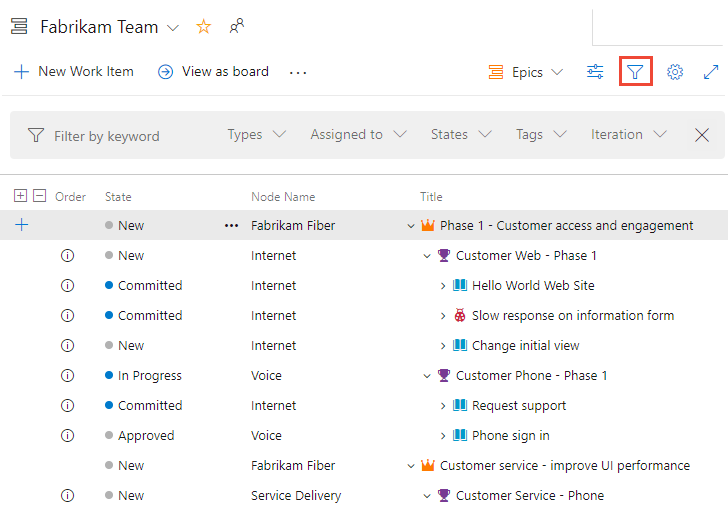
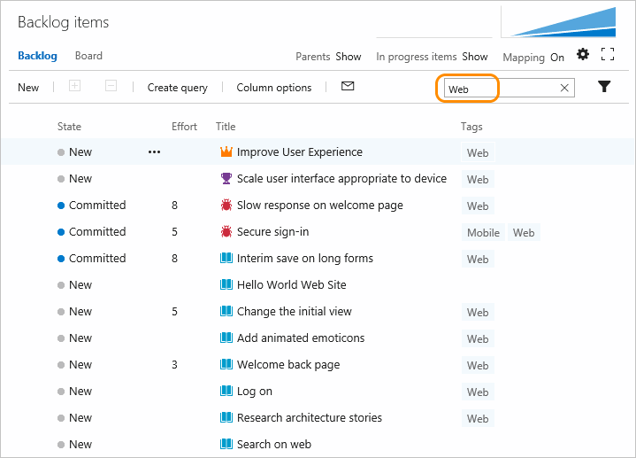

# Filter backlogs or queries based on keywords, tags, or other fields  

[!INCLUDE [temp](../includes/version-all.md)] 

<a id="filter"></a>
 
If you have many items listed in your product or portfolio backlog&mdash;and you want to focus on a subset of them&mdash;you can filter the set. 

The filter function is available from boards, backlogs, sprint backlogs, queries, and taskboards. For information on filtering Kanban boards, see [Filter your Kanban board](../boards/filter-kanban-board.md). 

## Filter based on keywords or fields   

::: moniker range=">= azure-devops-2019"

You can filter work items by typing a keyword or using one or more of the fields provided, such as work item type, assigned to, state, and tags. Based on the keyword that you enter, the filter function will list work items based on any visible/displayed column or field, including tags. Also, you can enter a value for an ID, whether or not the ID field is visible.

To show the filter toolbar, choose the :::image type="icon" source="../../media/icons/filter-icon.png" border="false"::: filter icon, or enter the **Ctrl+Shift+f** keyboard shortcut. You can filter all backlogs, boards, and query results. 

> [!div class="mx-imgBorder"]  
>   

Choose one or more values from the multi-select drop-down menu for each field. The values for these fields are populated as follows:

- **Assigned To**: All users who are currently assigned to work items on the board plus Unassigned
- **Iteration**: All Iteration Paths [selected for the current team](../sprints/define-sprints.md) and for which there are work items assigned to that iteration 
- **Work item type**: Work item types defined for the Requirements Category (product backlog) or Features or Epic categories (feature or epic portfolio backlogs), subject to work items being assigned to the work item types
- **Tags**: All tags assigned to work items on the board
- **Parent Work Items**: All features defined for the team, or all epics defined for the team when viewing the Features board  

> [!NOTE]   
> Filter options are dependent on the work items that meet the filter criteria. For example, if you don't have any work items assigned to Sprint 4, then the Sprint 4 option won't appear in the filter options for the Iteration Path.  

Here we show a filtered backlog based on the keyword "issues". Filtered pages show the :::image type="icon" source="../../media/icons/filtered.png" border="false"::: filtered icon. The filtered set is always a flat list, even if you've selected to show a hierarchical backlog view. 

> [!div class="mx-imgBorder"]  
>    

To clear and dismiss filtering, choose the :::image type="icon" source="../../media/icons/close-filter.png" border="false"::: close filter icon.

::: moniker-end


::: moniker range="tfs-2018"

You can filter work items by typing a keyword or using one or more of the fields provided, such as work item type, assigned to, state, and tags. Based on the keyword that you enter, the filter function will list work items based on any visible/displayed column or field, including tags. Also, you can enter a value for an ID, whether or not the ID field is visible.  

To show the filter toolbar, choose the :::image type="icon" source="../../media/icons/filter-icon.png" border="false"::: filter icon, or enter the **Ctrl+Shift+f** keyboard shortcut. You can filter all backlogs, boards, and query results. 

  

The filtered set is always a flat list, even if you've selected to show parents. 

::: moniker-end 


::: moniker range="<= tfs-2017"

## Filter based on keywords 

You can use keywords to filter your backlogs or queries. The filter function lists those work items based on any visible/displayed column or field, including tags, based on the keyword that you enter. Also, you can enter a value for an ID, whether or not the ID field is visible.  

Here, we filter the backlog to only show items that include 'Web' in any one of the displayed column fields. 

  

The filtered set is always a flat list, even if you've selected to show parents.  

## Filter based on tags

If you've [added tags to your work items](../queries/add-tags-to-work-items.md), you can filter your backlogs, Kanban boards, and query results using the  tag filter. For backlogs and query results, add Tags as a column option prior to filtering on tags.  

To learn more about filtering using tags, see [Add tags to work items to categorize and filter lists and boards, Filter lists using tags](../queries/add-tags-to-work-items.md#filter).
 
::: moniker-end

## Characters ignored by keyword filter criteria

::: moniker range=">= azure-devops-2019"

The filter criteria ignores the following characters: `,` (comma), `.` (period), `/` (forward slash), and `\` (back slash). 

::: moniker-end

::: moniker range="<= tfs-2018"

The filter criteria ignores the following characters when the field value starts with the character: ```{, (, [, !, @, #, $, %, ^, &, *, ~, `, ', "```.  
::: moniker-end

## Related articles  

- [Tags](../queries/add-tags-to-work-items.md) 
- [Set column options](set-column-options.md)  
- [Keyboard shortcuts](../../project/navigation/keyboard-shortcuts.md)

