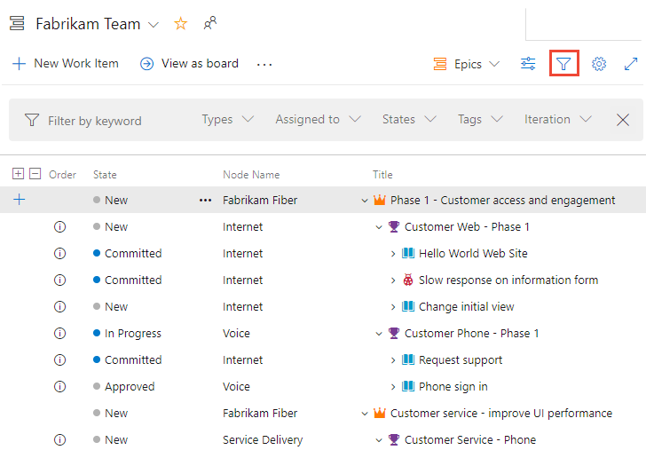
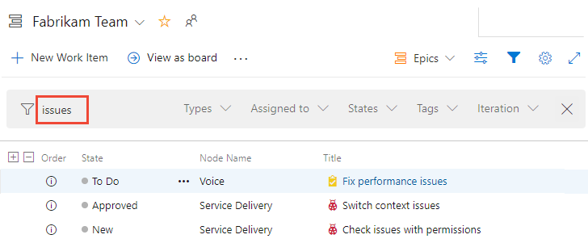

::: moniker range=">= tfs-2018"
# Filter backlogs or queries based on keywords, tags, or other fields  
::: moniker-end 


::: moniker range="<= tfs-2017"
# Filter backlogs or queries based on keywords 
::: moniker-end 

[!INCLUDE [temp](../_shared/version-vsts-tfs-all-versions.md)] 

<a id="filter"></a>
 
If you have many items listed in your product or portfolio backlog&mdash;and you want to focus on a subset of them&mdash;you can filter the set. 

::: moniker range=">= azure-devops-2019"

## Filter based on keywords or fields   

You can filter work items by typing a keyword or using one or more of the fields provided, such as work item type, assigned to, state, and tags. Based on the keyword that you enter, the filter function will list work items based on any visible/displayed column or field, including tags. Also, you can enter a value for an ID, whether or not the ID field is visible.

To show the filter toolbar, choose the  filter icon, or enter the **Ctrl+Shift+f** keyboard shortcut. You can filter all backlogs, boards, and query results. 

> [!div class="mx-imgBorder"]  
>   

Here we show a filtered backlog based on the keyword "issues". Filtered pages show the  filtered icon. The filtered set is always a flat list, even if you've selected to show a hierarchical backlog view. 

> [!div class="mx-imgBorder"]  
>    

To clear and dismiss filtering, choose the  close filter icon.

::: moniker-end


::: moniker range="tfs-2018"
## Filter based on keywords or fields   

You can filter work items by typing a keyword or using one or more of the fields provided, such as work item type, assigned to, state, and tags. Based on the keyword that you enter, the filter function will list work items based on any visible/displayed column or field, including tags. Also, you can enter a value for an ID, whether or not the ID field is visible.  

To show the filter toolbar, choose the  filter icon, or enter the **Ctrl+Shift+f** keyboard shortcut. You can filter all backlogs, boards, and query results. 

  

The filtered set is always a flat list, even if you've selected to show parents. 

::: moniker-end 


::: moniker range="<= tfs-2017"

## Filter based on keywords 
You can use keywords to filter your backlogs or queries. The filter function lists those work items based on any visible/displayed column or field, including tags, based on the keyword that you enter. Also, you can enter a value for an ID, whether or not the ID field is visible.  

Here, we filter the backlog to only show items that include 'Web' in any one of the displayed column fields. 

  

The filtered set is always a flat list, even if you've selected to show parents.  


## Filter based on tags
If you've [added tags to your work items](../queries/add-tags-to-work-items.md), you can filter your backlogs, Kanban boards, and query results using the  tag filter. For backlogs and query results, add Tags as a column option prior to filtering on tags.  

To learn more about filtering using tags, see [Add tags to work items to categorize and filter lists and boards, Filter lists using tags](../queries/add-tags-to-work-items.md#filter).
 
::: moniker-end


## Characters ignored by keyword filter criteria

::: moniker range=">= azure-devops-2019"
The filter criteria ignores the following characters: `,` (comma), `.` (period), `/` (forward slash), and `\` (back slash). 
::: moniker-end

::: moniker range=">= tfs-2017 <= tfs-2018"
The filter criteria ignores the following characters when the field value starts with the character: ```{, (, [, !, @, #, $, %, ^, &, *, ~, `, ', "```.  
::: moniker-end

## Related articles  
- [Tags](../queries/add-tags-to-work-items.md) 
- [Set column options](set-column-options.md)  
- [Backlog keyboard shortcuts](backlogs-keyboard-shortcuts.md)

