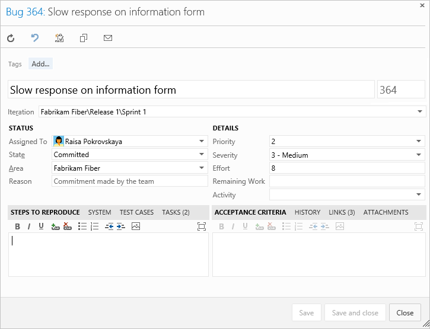
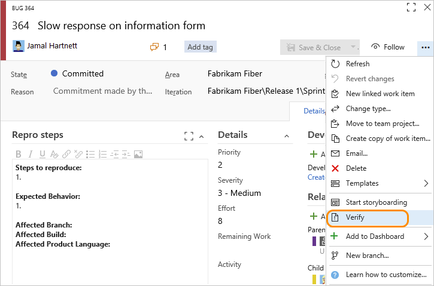

# Define, capture, triage, and manage bugs

[!INCLUDE [temp](../includes/version-all.md)]

How do you track and manage defects in your code? How do you make sure software problems and customer feedback get addressed in a timely manner to support high-quality software deployments? And, how do you do this while making good progress on new features? 

At a minimum, you need a way to capture your software issues, prioritize them, assign them, and track progress. Moreover, you'll want to manage your bugs in ways that align with your Agile practices. 

To support these scenarios, Azure Boards provides a Bug work item type. The Bug work item type shares all the features of other work item types with some additional features. The main additional features include:

- Option for each team to choose how they want to track bugs 
- Test tools to capture bugs 
- Built-in integration across Azure DevOps to support tracking and resolving bugs 


[!INCLUDE [temp](../includes/basic-process-bug-note.md)]  


- *Benefits of using Bugs to track code defect*s  
- *Manage technical debt* 


## Bug work item type 

The Bug work item type tracks similar information to the one shown in the following image for the Scrum process. It is designed to support tracking on the product backlog along with requirements or tracking on the Taskboard along with tasks.  

[!INCLUDE [temp](../includes/image-differences-with-wits.md)] 

::: moniker range=">= azure-devops-2020"
> [!div class="mx-imgBorder"]  
> 
::: moniker-end

::: moniker range=">= tfs-2017 < azure-devops-2020"

::: moniker-end

::: moniker range="< tfs-2017"
 
::: moniker-end

::: moniker range=">= tfs-2017"
> [!TIP]
> Use the [Discussion section](../work-items/work-item-form-controls.md#discussion) to add and review comments made about the work being performed to resolve the bug.  
::: moniker-end

## Bug-specific fields  

When defining a bug, use the fields listed in the following table to capture both the initial issue and ongoing discoveries made when triaging, investigating, fixing, and closing the bug.  


---
:::row:::
   :::column span="1":::
      **Field, Group, or Tab** 
   :::column-end:::
   :::column span="3":::
      **Usage**
   :::column-end:::
:::row-end:::
---
:::row:::
   :::column span="1":::
      [Steps to Reproduce](../queries/titles-ids-descriptions.md)  
      (friendly name=Repro Steps)
   :::column-end:::
   :::column span="3":::
      Capture enough information so that other team members can understand the full impact of the problem as well as whether they have fixed the bug. This includes actions taken to find or reproduce the bug and expected behavior.  
      Describe the criteria that the team should use to verify whether the code defect is fixed.  
   :::column-end:::
:::row-end:::
---
:::row:::
   :::column span="1":::
      [System Info](../queries/titles-ids-descriptions.md)
   :::column-end:::
   :::column span="3":::
      Information about the software and system configuration that is relevant to the bug and tests to apply. 
   :::column-end:::
:::row-end:::
---
:::row:::
   :::column span="1":::
      [Acceptance Criteria](../queries/titles-ids-descriptions.md)
   :::column-end:::
   :::column span="3":::
      Provide the criteria to meet before the bug or user story can be closed. Before work begins, describe the customer acceptance criteria as clearly as possible. The acceptance criteria can be used as the basis for acceptance tests so that you can more effectively evaluate whether an item has been satisfactorily completed. 
   :::column-end:::
:::row-end:::
---
:::row:::
   :::column span="1":::
      [Found In Build](../queries/build-test-integration.md)  
      [Integrated in Build](../queries/build-test-integration.md) 
   :::column-end:::
   :::column span="3":::
      When a bug is created using a testing tool, it automatically populates **System Info** and **Found in Build** with information about the software environment and build where the bug occurred. To learn more about defining the software environments, see [Test different configurations](../../test/test-different-configurations.md).  
      When you resolve the bug, use **Integrated in Build** to indicate the name of the build that incorporates the code that fixes the bug.  
      For on-premises Azure DevOps, to access a drop-down menu of all builds that have been run, you can update the `FIELD` definitions for **Found in Build** and **Integrated in Build** to reference a global list. The global list is automatically updated with each build that is run. To learn more, see [Query based on build and test integration fields](../queries/build-test-integration.md).  
      For information about how to define build names, see [build number format options](../../pipelines/build/options.md). 
   :::column-end:::
:::row-end:::
---
:::row:::
   :::column span="1":::
      [Priority](../queries/planning-ranking-priorities.md)<sup>1</sup>
   :::column-end:::
   :::column span="3":::
      - **1**: Product cannot ship without the successful resolution of the work item, and it should be addressed as soon as possible.
      - **2**: Product cannot ship without the successful resolution of the work item, but it does not need to be addressed immediately.
      - **3**: Resolution of the work item is optional based on resources, time, and risk.
   :::column-end:::
:::row-end:::
---
:::row:::
   :::column span="1":::
      [Severity](../queries/planning-ranking-priorities.md)<sup>1</sup>
   :::column-end:::
   :::column span="3":::
      A subjective rating of the impact of a bug on the project or software system. For example: If clicking a remote link (a rare event) causes an application or web page to crash (a severe customer experience), you might specify **Severity = 2 - High** and **Priority = 3**.  Allowed values and suggested guidelines are: 
      - **1 - Critical**: Must fix. A defect that causes termination of one or more system components or the complete system, or causes extensive data corruption. And, there are no acceptable alternative methods to achieve required results.
      - **2 - High**: Consider fix. A defect that causes termination of one or more system components or the complete system, or causes extensive data corruption. However, an acceptable alternative method exists to achieve required results.
      - **3 - Medium**: (Default) A defect that causes the system to produce incorrect, incomplete or inconsistent results.
      - **4 - Low**: A minor or cosmetic defect that has acceptable workarounds to achieve required results. 
   :::column-end:::
:::row-end:::
---
::: moniker range=">= azure-devops-2019"
:::row:::
   :::column span="1":::
      [Deployment](../work-items/work-item-deployments-control.md)
   :::column-end:::
   :::column span="3":::
      The **Deployment** control supports links to and display of releases which contains the work items. For example, the following image shows several releases which contain links to the current work item. You can expand each release to see details about each stage. You can choose the link for each release and stage to open the corresponding release or stage. To learn more, see [Link work items to deployments](../work-items/work-item-deployments-control.md). 
      > [!div class="mx-imgBorder"]  
      >   
   :::column-end:::
:::row-end:::
---
::: moniker-end
:::row:::
   :::column span="1":::
      [Development](connect-work-items-to-git-dev-ops.md) 
   :::column-end:::
   :::column span="3":::
      The **Development** control supports linking to and displaying links made to builds, Git commits and pull requests, or TFVC changesets and versioned items. You can choose the link for each linked item to open the corresponding item. To learn more, see [Drive Git development from a work item](connect-work-items-to-git-dev-ops.md).
      > [!div class="mx-imgBorder"]  
      >   
   :::column-end:::
:::row-end:::
---

#### Notes: 

<sup>1</sup> To change the menu selection or picklist, see [Customize the work tracking experience](../../reference/customize-work.md). The customization method depends on the process model used by your project. 

For information about fields specific to the CMMI process, see [Bugs, issues, and risks field reference](../work-items/guidance/cmmi/guidance-bugs-issues-risks-field-reference-cmmi.md). For information about all other fields, see [Work item field index](../work-items/guidance/work-item-field.md). 


## Choose how your team tracks bugs

There are a number of factors to consider when determining how your team will track bugs. The main ones to consider are: 

- Size of your team, smaller teams will want to maintain a lightweight footprint
- Organization requirements to track work, if you're team is required to track hours, then tracking bugs as tasks makes sense
- How your team prioritizes work
- Tools your team wants to use such as planning pane, velocity chart, rollup, delivery plans  

The following table summarizes the three options team's have to track bugs. To learn more, see [Show bugs on backlogs and boards](../../organizations/settings/show-bugs-on-backlog.md). 

[!INCLUDE [temp](../includes/pro-con-matrix-show-bugs.md)] 


## Customize your bug work item type 

You can customize your bug work item type or create additional work item types to track software issues or customer feedback. With all work item types, you can customize the following elements: 

- Add or remove custom fields 
- Customize the workflow states 
- Add conditional rules 
- Determine the backlog the work item type appears 
  
Before you customize your process, we recommend you review [Configure and customize Azure Boards](../configure-customize.md). 

## Define or capture bugs 

You can define bugs from several different tools.  

> [!TIP]   
> By default, the only required field when creating a bug is the **Title** field. You can quickly add bugs in the same way you add user stories or product backlog items using Azure Boards. If you want to make some fields required, you can do that by adding conditional rules based on a state change. To learn more, see [Add a rule to a work item type (Inheritance process)](../../organizations/settings/work/custom-rules.md). 

### Create a bug from your backlog or board 

If your team chose to manage bugs with requirements, you can define bugs from your product backlog or Kanban board.

- **Add from the product backlog**  
	> [!div class="mx-imgBorder"]  
	>   

- **Add from the product backlog**  
	> [!div class="mx-imgBorder"]  
	>   

### Create a bug from your backlog or board 

If your team chose to manage bugs with tasks, you can define bugs from your Kanban board, product backlog, Sprint backlog, or Sprint Taskboard. You add a bug as a child to a product backlog work item. 

- **Add child bug from the Kanban board**  
	> [!div class="mx-imgBorder"]  
	>   

- **Add child bug from the Sprint Backlog**  
	> [!div class="mx-imgBorder"]  
	>  

### Create a bug from a testing tool

Other tools you can use to create bugs are testing tools as illustrated and described in the following two tools.  

- **Test & Feedback extension**: see [Exploratory testing with the Test & Feedback extension](../../test/connected-mode-exploratory-testing.md) 

	  

- **Test Runner**: see [Run manual tests](../../test/run-manual-tests.md).  

	> [!div class="mx-imgBorder"]  
	> 


<a id="fix-resolve-close">  </a>

## Bug lifecycle and workflow states

As with all other work item types, the Bug work item type has a well-defined workflow. Each workflow consists of three or more **States** and a **Reason** for each supported transition from one State to another. The following images illustrate the default bug workflow defined for the [Agile](../work-items/guidance/agile-process.md), [Scrum](../work-items/guidance/scrum-process.md), and [CMMI](../work-items/guidance/cmmi-process.md) processes.


| Agile | Scrum | CMMI | 
|------------|------------|-----------| 
|  |  |   |  

For Scrum bugs, you simply change the **State** from *Committed* (similar to *Active*) to *Done*. For Agile and CMMI, you first resolve the bug, indicating that the bug has been fixed. Typically, the person who created the bug then verifies the fix and updates the State from *Resolved* to *Closed*. If more work has been found after a bug has been resolved or closed, it can be reactivated by setting the State to Committed or Active. 


::: moniker range=">= azure-devops-2020"  
> [!NOTE]  
> The Agile process bug work item type previously had a rule which reassigned the bug to the person who created it. This rule has been [removed from the default system process](../work-items/guidance/changes-to-process-templates.md). You can reinstate this automation by adding a rule. For an Inheritance process, see [Apply rules to workflow states, Automate reassignment based on state change](../../organizations/settings/work/apply-rules-to-workflow-states.md#reassign).
 
::: moniker-end  

### Verify a fix 

To verify a fix, a developer or tester should attempt to reproduce the bug and look for additional unexpected behavior. If necessary, they should reactivate the bug.

When verifying a bug resolution, you may find that the bug was not completely fixed or you may disagree with the resolution. In this case, discuss the bug with the person who resolved it, come to an agreement, and possibly reactivate the bug. If you reactivate a bug, include the reasons for reactivating the bug in the bug description.

::: moniker range=">= tfs-2017"  

<a id="verify-bug">  </a>

### Verify a bug, re-run tests defined for web apps 

::: moniker-end  

::: moniker range=">= tfs-2018"  
Choose the **Verify** option to re-run tests which identified the bug. You can invoke the **Verify** option from the bug work item form context menu to launch the relevant test case in the web runner. Perform your validation using the web runner and update the bug work item directly within the web runner.
::: moniker-end  

::: moniker range="tfs-2017"
Choose the **Verify** option to re-run tests which identified the bug. (Requires TFS 2017.1 or later version.) You can invoke the **Verify** option from the bug work item form context menu to launch the relevant test case in the web runner. Perform your validation using the web runner and update the bug work item directly within the web runner.  
::: moniker-end  

::: moniker range=">= tfs-2017"  
  

To learn more about running test from the web portal, see [Run tests for web apps](../../test/run-manual-tests.md).
::: moniker-end  

<a id="close">  </a>

### Close a bug  

You close a bug once it's verified as fixed. However, you may also close a bug for one of these reasons:

- Deferred - deferring a fix until the next product release
- Duplicate - bug has already been reported, you can link each bug with the Duplicate/Duplicate of link type and close one of the bugs  
- As Designed - feature works as designed
- Cannot Reproduce - tests prove that the bug can't be reproduced
- Obsolete - the bug's feature is no longer in the product
- Copied to Backlog - a PBI or user story has been opened to track the bug

> [!TIP]   
> Once a bug has been closed and the fix is actively released in deployments, recommended practice is to never reopen it due to regression. Instead, you should consider opening a new bug and link to the older, closed bug.   

It's always a good idea to describe any additional details for closing a bug in the Discussion field (new web form) or the History field (old web form) to avoid future confusion as to why the bug was closed. 


## List and triage bugs 

Prioritize bugs on your backlog 
Assign bugs to a sprint from your backlog 


Once you've started coding and testing, you'll want to hold periodic triage meetings to review and prioritize your bugs. How frequently you meet and for how long depends on your situation. Typically, the project owner runs the bug triage meetings, and team leads, business analysts and other stakeholders who can speak about specific project risks attend them.

The project owner can create or open a shared query for new and reopened bugs to generate a list of bugs to be triaged. 

### Bug queries
Open a shared query or [use the query editor](../queries/using-queries.md) to create useful bug queries, such as the following:
- Active bugs by priority (```State <> Done``` or ```State <> Closed```)
- In Progress bugs (```State = Committed``` or ```State = Active```)
- Bugs to fix for a target release (```Tags Contains RTM```)
- Recent bugs - bugs opened within the last 3 weeks (```Created Date > @Today-21```) 

Once you have the queries of interest to your team, you can [create status or trend charts](../../report/dashboards/charts.md) that you can also add the chart to a [dashboard](../../report/dashboards/dashboards.md).  

### Triage mode in query results

From the query results page, you can quickly move up and down within the list of bug work items using the up and down arrows. As you review each bug, you can assign it, add details, or set priority. 

To learn more, see [Triage work items](../queries/triage-work-items.md). 

## Update bug status 

(Fix, resolve and close bugs (update status)
Change bug assignment 


## Monitor bug status, assignments, and trends

Queries and query charts
Dashboards and widgets
Built-in charts 
Analytics views 
Analytics service 


You can track the bug status, assignments, and trends using queries which you can then chart and add to a dashboard. 

For example, here are two examples showing active bugs by priority trend and a snapshot of bugs by priority.

      

To learn more about queries, charts, and dashboards; see [About managed queries](../queries/about-managed-queries.md) and [Charts](../../report/dashboards/charts.md), and [Dashboards](../../report/dashboards/dashboards.md).   


::: moniker range=">= azure-devops-2019"

### Use the Analytics service to create bug reports

You can use Power BI to create more complex reports than what you can get from a query. To learn more, see [Connect with Power BI Data Connector](../../report/powerbi/data-connector-connect.md). 

::: moniker-end  

::: moniker range="< azure-devops-2019"  


### Pre-defined SQL Server bug reports

If you work from an on-premises Azure DevOps Server and you have SQL Server Analysis Services and SQL Server Reporting Services configured for your project, you have access to the following reports (Agile and CMMI processes only).  

- [Bug Status](../../report/sql-reports/bug-status-report.md)  
- [Bug Trends](../../report/sql-reports/bug-trends-report.md)  
- [Reactivations](../../report/sql-reports/reactivations-report.md)  

To learn how to add SQL Server reports for a project, see [Add reports to a project](../../report/admin/add-reports-to-a-team-project.md).  

::: moniker-end  

 

## Integration across Azure DevOps 

### Pipelines

### Test


<a id="customize"> </a>

## Customize the bug work item type 

[!INCLUDE [temp](../includes/customize-work-tracking.md)] 


## Marketplace extensions 


- [Reactivations Report](https://marketplace.visualstudio.com/items?itemName=EnterpriseServicesDevOpsTeam.ServicesBugReactivationReport&ssr=false#overview)
- [Bug Bash Pro](https://marketplace.visualstudio.com/items?itemName=mohitbagra.bugbashpro&ssr=false#overview)


## Try this next
> [!div class="nextstepaction"]
> [Triage work items](../queries/triage-work-items.md)


## Related articles 


- [Scrum and working with sprints best practices](../sprints/best-practices-scrum.md)  
- [Follow a work item or pull request](../work-items/follow-work-items.md)
- [Move, change type, or delete work items](remove-delete-work-items.md)
- [Pre-populate fields using a template](work-item-template.md)
- [Copy or clone a work item](copy-clone-work-items.md#copy-clone)


<!---


Bug fixes that involve more than a single section of code may require significant regression testing and may involve other team members. Record any conversations that relate to assessing the risk of bug fixes in the **Discussion** section of the Bug work item.

### Bug workflow lifecycle  
 


-->
