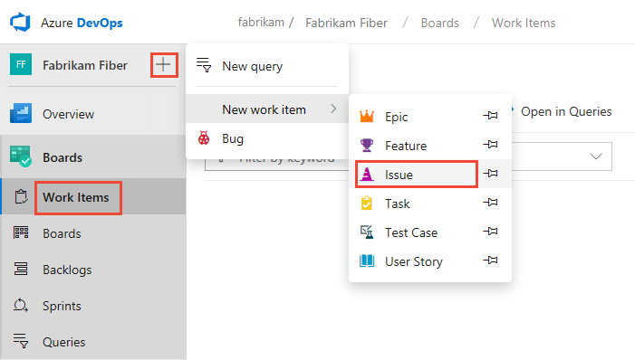

# Manage issues or impediments 

[!INCLUDE [temp](../_shared/version-vsts-tfs-all-versions.md)]

If you have known issues you want to track, you can do so by defining an impediment (Scrum) or issue (Agile or CMMI). Impediments and issues represent unplanned activities. Resolving them requires more work beyond what's tracked for actual requirements. Using the impediment work item type helps you track and manage these issues until you can resolve and close them. 

Don't confuse impediments with bugs. You track impediments that may cause problems with delivering one or more requirements. For example, you may have to address feature ambiguity, personnel or resource issues, problems with environments, or other risks that impact scope, quality, or schedule. Other issues that deserve tracking are decisions that require several stakeholders or product teams to weigh in on.

In this topic you'll learn: 

>[!div class="checklist"]      
> * How to capture issues or impediments as a work item   
 
[!INCLUDE [temp](../_shared/prerequisites-work-items.md)]   

[!INCLUDE [temp](../_shared/image-differences-with-wits.md)]   

## Add an issue or impediment 

[!INCLUDE [temp](../../_shared/new-navigation-azd.md)]  

# [New navigation](#tab/new-nav)  

::: moniker range=">= azdevserver-2019"  

Open **Boards>Work Items**, and choose the  plus icon, and then select from the **New work item** menu of options. 

> [!div class="mx-imgBorder"]  
>    

Choose the  pin icon to have it show up within the add drop down menu. 

::: moniker-end   

::: moniker range=">= tfs-2013 <= tfs-2018"   
[!INCLUDE [temp](../../_shared/new-navigation-not-supported.md)] 
::: moniker-end   

# [Previous navigation](#tab/previous-nav)

::: moniker range=">= tfs-2017 <= tfs-2018 || vsts"

From **Work**, choose **Impediment** from the **New Work Item** list of options. Choose the  pin icon to have it show up within **Work** drop down menu. 

  
  
::: moniker-end

::: moniker range=">= tfs-2013 <= tfs-2015"

From the Queries page, choose Impediment from the **New** drop down menu.

  

::: moniker-end

::: moniker range="azdevserver-2019"
[!INCLUDE [temp](../../_shared/previous-navigation-not-supported-azd.md)] 
::: moniker-end

---

## Customize issues tracking

[!INCLUDE [temp](../_shared/customize-work-tracking.md)] 
::: moniker range=">= azdevserver-2019"
Impediments and issues don't appear on your backlog. Instead, you track them using [queries](../queries/using-queries.md). If you want them to appear on your backlog, or you want to track other work item types on your backlog, see [Customize your backlogs or boards](../../organizations/settings/work/customize-process-backlogs-boards.md).
::: moniker-end

::: moniker range="<= tfs-2018"
Impediments and issues don't appear on your backlog. Instead, you track them using [queries](../queries/using-queries.md). If you want them to appear on your backlog, or you want to track other work item types on your backlog, see [Add a work item type to a backlog and board](../../reference/add-wits-to-backlogs-and-boards.md).
::: moniker-end

## Related articles 
- [Add work items](add-work-items.md)
- [Work item form controls](../work-items/work-item-form-controls.md)
- [Manage bugs or code defects](manage-bugs.md)
- [Create your backlog](create-your-backlog.md) 

