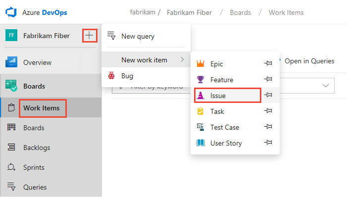
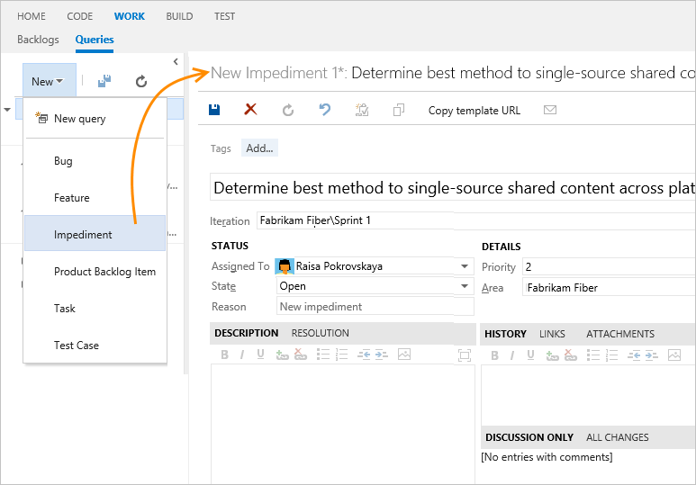

# Manage issues or impediments 

[!INCLUDE [temp](../includes/version-all.md)]

If you have known issues you want to track, you can do so by defining an impediment (Scrum) or issue (Agile or CMMI). Impediments and issues represent unplanned activities. Resolving them requires more work beyond what's tracked for actual requirements. Using the impediment work item type helps you track and manage these issues until you can resolve and close them. 

Don't confuse impediments with bugs. You track impediments that may cause problems with delivering one or more requirements. For example, you may have to address feature ambiguity, personnel or resource issues, problems with environments, or other risks that impact scope, quality, or schedule. Other issues that deserve tracking are decisions that require several stakeholders or product teams to weigh in on.

::: moniker range="> tfs-2018"

> [!IMPORTANT]  
> Issues and Impediments discussed in this article are defined for projects created with the [Agile](../work-items/guidance/agile-process.md), [Scrum](../work-items/guidance/scrum-process.md), or [CMMI](../work-items/guidance/cmmi-process.md) process. By default, these work item types don't appear on the product backlog or taskboard. 
> 
> If your project was created using the [Basic](../get-started/plan-track-work.md) process, which tracks work using Epics, Issues, and Tasks, then you track Issues using the product backlog. To learn more, see [Track issues and tasks](../get-started/plan-track-work.md).

::: moniker-end

::: moniker range="<= tfs-2018"

> [!IMPORTANT]  
> Issues and Impediments discussed in this article are defined for projects created with the [Agile](../work-items/guidance/agile-process.md), [Scrum](../work-items/guidance/scrum-process.md), or [CMMI](../work-items/guidance/cmmi-process.md) process. By default, these work item types don't appear on the product backlog or taskboard. 

::: moniker-end

In this article you'll learn: 

::: moniker range="azure-devops"

> [!div class="checklist"]      
> * When to use issues versus tasks
> * How to capture issues or impediments as a work item  
> * Add issues or impediments to your product backlog  
 
::: moniker-end

::: moniker range="< azure-devops"

> [!div class="checklist"]      
> * When to use issues versus tasks
> * How to capture issues or impediments as a work item   
 
::: moniker-end

[!INCLUDE [temp](../includes/prerequisites-work-items.md)]   

[!INCLUDE [temp](../includes/image-differences-with-wits.md)]   

## When to use issues versus tasks

You use issues or impediments to track items that may block work from getting done. In general, you link these items to user stories or other work items using a Related link type.

You define tasks when you want to create a [checklist of tasks](../boards/add-task-checklists.md) or if you use Scrum methods and track work using the [Remaining Work](../sprints/task-board.md) field. By linking user stories, or other requirement work item types, to tasks using the Parent-Child link type, the tasks appear on the taskboard for each linked user story.

::: moniker range=">= azure-devops-2019 < azure-devops"

> [!NOTE]  
> If your project collection uses the On-premises XML process model to customize work tracking, you can enable work item types that you add to the Task Category to appear as a checklist on your product Kanban board. To learn how, see [Set up your backlogs and boards, Customize your Kanban Board checklist items](set-up-your-backlog.md#customize-checklist-2019). 

::: moniker-end

::: moniker range="azure-devops-2019"  

If you want to add these work item types to a backlog, see [Customize your backlogs or boards](../../organizations/settings/work/customize-process-backlogs-boards.md).

::: moniker-end

## Add an issue or impediment 

::: moniker range=">= azure-devops-2019"  

Open **Boards>Work Items**, and choose the :::image type="icon" source="../../media/icons/blue-add.png" border="false"::: plus icon, and then select from the **New work item** menu of options. 

> [!div class="mx-imgBorder"]  
>    

Choose the  :::image type="icon" source="../media/icons/pin-icon.png" border="false":::  pin icon to have it show up within the add drop down menu. 

::: moniker-end   

::: moniker range=">= tfs-2017 <= tfs-2018"

From **Work**, choose **Impediment** from the **New Work Item** list of options. Choose the  :::image type="icon" source="../media/icons/pin-icon.png" border="false":::  pin icon to have it show up within **Work** drop down menu. 

  
  
::: moniker-end

::: moniker range=">= tfs-2013 <= tfs-2015"

From the Queries page, choose Impediment from the **New** drop down menu.

  

::: moniker-end

## Customize issues tracking

[!INCLUDE [temp](../includes/customize-work-tracking.md)] 

::: moniker range="azure-devops"

By default, issues and impediments don't appear on your backlog. Instead, you track them using [queries](../queries/using-queries.md). To track them on a backlog, see the next section, [Add issues or impediments to your product backlog](#add-to-backlog). 

::: moniker-end

::: moniker range=">= azure-devops-2019 < azure-devops"

Impediments and issues don't appear on your backlog. Instead, you track them using [queries](../queries/using-queries.md). You can only have them appear on your backlog if your project is customized using the On-premises XML process model. To learn more, see [Customize the On-premises XML process model](../../reference/on-premises-xml-process-model.md).

::: moniker-end

::: moniker range="<= tfs-2018"

Impediments and issues don't appear on your backlog. Instead, you track them using [queries](../queries/using-queries.md). If you want them to appear on your backlog, or you want to track other work item types on your backlog, see [Add a work item type to a backlog and board](../../reference/add-wits-to-backlogs-and-boards.md).

::: moniker-end

<a id="add-to-backlog" /> 

::: moniker range="azure-devops"

<a id="add-to-backlog" /> 

## Add issues or impediments to your product backlog  

If you want to track issues or impediments along with your requirements or a portfolio backlog, you can by adding them to your custom Inherited process. For details, see [Customize your backlogs or boards (Inheritance process)](../../organizations/settings/work/customize-process-backlogs-boards.md#edit-product-backlog).

::: moniker-end

## Related articles 

- [Add work items](add-work-items.md)
- [Work item form controls](../work-items/work-item-form-controls.md)
- [Manage bugs or code defects](manage-bugs.md)
- [Create your backlog](create-your-backlog.md)