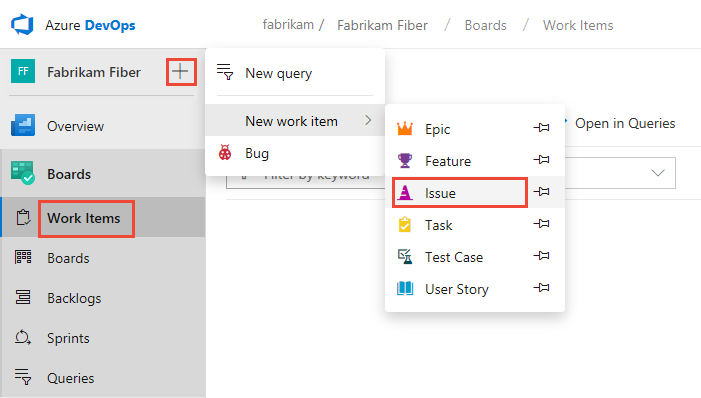

# Manage problems or impediments in Azure Boards

[!INCLUDE [version-lt-eq-azure-devops](../../includes/version-lt-eq-azure-devops.md)]

Track unplanned activities that block your team's progress by using the impediment (Scrum) or problem (Agile or CMMI) work item type. These work items represent blockers that require extra effort beyond what's planned for actual requirements. Use them to track and manage problems until you resolve and close them.

Don't confuse impediments with bugs. Impediments track broader blockers that affect delivery of one or more requirements, such as:

- Feature ambiguity or unclear specifications
- Personnel or resource constraints
- Environment or infrastructure problems
- Risks that affect scope, quality, or schedule
- Decisions that require input from multiple stakeholders or product teams

> [!IMPORTANT]  
> Problems and impediments in this article apply to projects created with the [Agile](../work-items/guidance/agile-process.md), [Scrum](../work-items/guidance/scrum-process.md), or [CMMI](../work-items/guidance/cmmi-process.md) process. By default, these work item types don't appear on the product backlog or taskboard. 
> 
> If your project uses the [Basic](../get-started/plan-track-work.md) process, which tracks work with Epics, Problems, and Tasks, you track Problems on the product backlog. For more information, see [Track problems and tasks](../get-started/plan-track-work.md).

## Prerequisites

[!INCLUDE [temp](../includes/prerequisites-work-items.md)] 

[!INCLUDE [ai-assistance-mcp-server-tip](../../includes/ai-assistance-mcp-server-tip.md)]

## Link issues to work items and define tasks

Use a **Related** link type to connect issues or impediments to user stories or other work items they block.

You can also define tasks that relate to the blocker:

- Create a [checklist of tasks](../boards/add-task-checklists.md) to track resolution steps.
- If you use Scrum methods, track effort with the [Remaining Work](../sprints/task-board.md) field.
- Link requirement work item types to tasks with the **Parent-Child** link type so tasks appear on the taskboard for each linked user story.

::: moniker range="< azure-devops"

> [!NOTE]  
> If your project collection uses the On-premises XML process model, you can enable work item types added to the Task Category to appear as a checklist on your product board.

::: moniker-end

## Add a problem or impediment

::: moniker range="<=azure-devops"

1. Go to **Boards** > **Work Items** and select the :::image type="icon" source="../../media/icons/blue-add.png" border="false"::: plus icon.
1. From the **New work item** menu, select the work item type for your process — **Impediment** (Scrum), **Issue** (Agile), or **Problem** (CMMI).

   > [!div class="mx-imgBorder"]  
   >    

1. (Optional) Select the :::image type="icon" source="../media/icons/pin-icon.png" border="false"::: pin icon to pin the work item type to the **add** dropdown menu for quick access.

::: moniker-end   

## Customize problem and impediment tracking

[!INCLUDE [temp](../includes/customize-work-tracking.md)] 

::: moniker range="azure-devops"

By default, problems and impediments don't appear on your backlog. Use [queries](../queries/using-queries.md) to track them, or add them to your backlog by customizing your process. For more information, see [Add problems or impediments to your product backlog](#add-to-backlog).

::: moniker-end

::: moniker range="< azure-devops"

By default, problems and impediments don't appear on your backlog. Use [queries](../queries/using-queries.md) to track them. To show them on your backlog, customize your project with the On-premises XML process model. For more information, see [Customize the On-premises XML process model](../../reference/on-premises-xml-process-model.md).

::: moniker-end
 
 

## Add problems or impediments to your product backlog  

::: moniker range="azure-devops"

To display problems or impediments alongside your requirements or on a portfolio backlog, add the work item type to your custom Inherited process. For step-by-step instructions, see [Customize your backlogs or boards (Inheritance process)](../../organizations/settings/work/customize-process-backlogs-boards.md#edit-product-backlog).

::: moniker-end

::: moniker range="< azure-devops"

To display problems or impediments alongside your requirements or on a portfolio backlog, customize your project's process:

- **Inherited process**: [Customize your backlogs or boards](../../organizations/settings/work/customize-process-backlogs-boards.md#edit-product-backlog)
- **On-premises XML process**: [Process configuration XML element reference](../../reference/xml/process-configuration-xml-element.md#configure-a-backlog)

::: moniker-end

## Use AI to manage problems and blockers

If you connect the [Azure Boards MCP Server](../../mcp-server/mcp-server-overview.md) to your AI agent in agent mode, you can use natural language prompts to create and manage problems or blockers.

| Task | Example prompt |
|------|----------------|
| Create a blocker | `Create a new blocker titled 'Test environment unavailable' with priority 1 and assign it to <me>` |
| List active blockers | `List all active blockers in the current sprint for my team` |
| Create a problem | `Create a problem to track the decision about the API versioning strategy and assign it to <Jamal>` |
| Resolve a blocker | `Update blocker 456 to the Resolved state and add a comment that the environment issue is fixed` |
| Find recurring blockers | `Show blockers in <Contoso> that were created in the last 3 sprints with similar titles or tags` |
| Track blocker age | `List active blockers in <Contoso> sorted by how long they've been open` |
| Link blocker to blocked items | `Show all work items in the current sprint for <Contoso> that are linked to active blockers` |
| Escalate unresolved problems | `List problems in <Contoso> with priority 1 that have been active for more than 7 days` |
| Categorize blockers | `Show active blockers in <Contoso> grouped by tag` |
| Sprint retrospective prep | `List all blockers that were resolved during the current sprint in <Contoso> with their resolution comments` |

> [!NOTE]
> Agent mode and the MCP Server use natural language, so you can adjust these prompts or ask follow-up questions to refine the results.

## Related content 

- [Add work items](add-work-items.md)
- [Work item form controls](../work-items/about-work-items.md#work-item-form-controls)
- [Manage bugs or code defects](manage-bugs.md)
- [Create your backlog](create-your-backlog.md)
