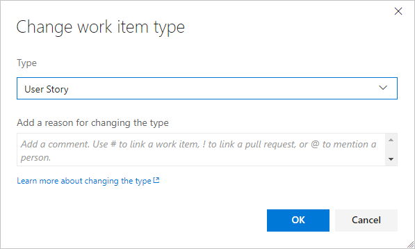
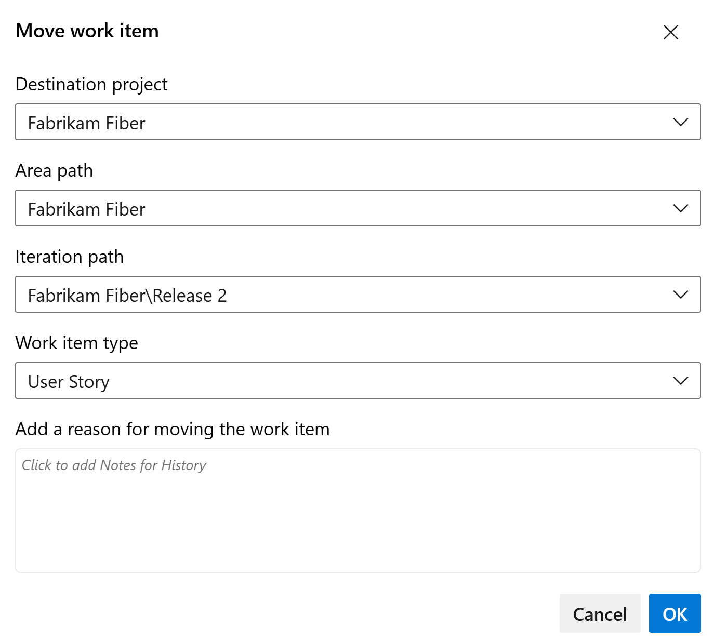

# Move work items, change work item type 

[!INCLUDE [temp](../includes/version-vsts-plus-azdevserver-2019.md)]

Often you find that someone created a work item of the wrong work item type (WIT) or within an incorrect project. You can correct these issues for individual work items or bulk modify several work items. You can also remove work items added to your backlog or taskboard that aren't relevant anymore.  

> [!TIP]
> For TFS 2018 and earlier versions, you can't change the work item type for an existing work item, but you can [copy the work item and specify a new type](copy-clone-work-items.md#copy-clone). Also, if you have several work items with type changes you want to make, you can [export them using Excel](office/bulk-add-modify-work-items-excel.md), and then re-add them as a new type. 

To remove, delete, or restore deleted work items, see [Remove, delete, or restore work items](remove-delete-work-items.md). 

In this article you'll learn:  

> [!div class="checklist"]    
> * How to change the work item type of one or more work items   
> * How to move one or more work items to another project     

> [!TIP]  
> From the web portal, you can [multi-select several work items](bulk-modify-work-items.md) from a backlog or query results page and perform a bulk update using the associated feature.  To change, move, delete, or restore several work items at the same time, see [Bulk modify work items](bulk-modify-work-items.md). 

## Prerequisites  

::: moniker range="azure-devops"

* You must be a member of the **Contributors** or **Project Administrators** security group. To get added, [Add users to a project or team](../../organizations/security/add-users-team-project.md). 
* To modify work items, you must have your **View work items in this node** and **Edit work items in this node** permissions set to **Allow**. By default, the **Contributors** group has this permission set. To learn more, see [Set permissions and access for work tracking](../../organizations/security/set-permissions-access-work-tracking.md). 
* To change the work item type, you must be granted **Stakeholder** access or higher. 
* To move work items to another project, you must be a member of the **Project Administrators** group or have the **Move work items out of this project** permission set to **Allow**. By default, the **Contributors** group doesn't have this permission set.

> [!NOTE]  
> Users with **Stakeholder** access for a public project have full access to all work tracking features just like users with **Basic** access. For details, see [Stakeholder access quick reference](../../organizations/security/stakeholder-access.md).

::: moniker-end

::: moniker range=">= azure-devops-2019 < azure-devops"

* You must be added to a project as a member of the **Contributors** or **Project Administrators** security group. To get added, [Add users to a project or team](../../organizations/security/add-users-team-project.md). 
* To modify work items, you must have your **View work items in this node** and **Edit work items in this node** permissions set to **Allow**. By default, the **Contributors** group has this permission set. To learn more, see [Set permissions and access for work tracking](../../organizations/security/set-permissions-access-work-tracking.md). 
* To move work items to another project, the project must use an Inherited process model.  
* To move work items to another project, you must be a member of the **Project Administrators** group or have the **Move work items out of this project** permission set to **Allow**. By default, the **Contributors** group doesn't have this permission set.
* To change the work item type, you must be granted **Stakeholder** access or higher. For details, see [Stakeholder access quick reference](../../organizations/security/stakeholder-access.md).

	> [!IMPORTANT]  
	> You can change the work item type or move work items to another project within a project collection. These features require that the data warehouse is disabled. With the data warehouse disabled, you'll use the [Analytics Service](../../report/powerbi/what-is-analytics.md) to support your reporting needs. To learn more about disabling the data warehouse, see [Disable the data warehouse and cube](../../report/admin/disable-data-warehouse.md). 

::: moniker-end 

To learn more, see [Set permissions and access for work tracking](../../organizations/security/set-permissions-access-work-tracking.md) or [Set permissions at the project-level or project collection-level](../../organizations/security/set-project-collection-level-permissions.md). 

::: moniker range="azure-devops"

> [!IMPORTANT]  
> You can't change type or move work items whose work item types support test management or that belong to the [Hidden Types Category](../work-items/agile-glossary.md#hidden-types). This includes all work items that track tests&mdash;such as test cases, shared steps, and shared parameters&mdash;code review requests and responses, and feedback requests and responses.

::: moniker-end

::: moniker range=">= azure-devops-2019 < azure-devops"

> [!IMPORTANT]  
> You can't change type, move work items, or delete/restore work items whose work item types support test management or that belong to the [Hidden Types Category](../work-items/agile-glossary.md#hidden-types). This includes all work items that track tests&mdash;such as test cases, shared steps, and shared parameters&mdash;code review requests and responses, and feedback requests and responses.
> 
> Also, you can't change the work item type if the project is defined on a collection that uses the On-premises XML process model. 

::: moniker-end

  

## Change the work item type 

Changing the work item type refreshes the work item form with the fields defined for the type selected. For example, you can change a bug to a task and the form will refresh with the fields defined for a task. 

> [!NOTE]  
> You can't change the work item type if the project is defined on a collection that uses the On-premises XML process model. Also, you can't change the work item type of work items associated with test management. 

You can change a single work item or several [multi-selected work items](bulk-modify-work-items.md) to a new type. 

1. Open a work item, choose the  :::image type="icon" source="../media/icons/actions-icon.png" border="false"::: actions icon, and select the :::image type="icon" source="../media/icons/change-type-icon.png" border="false"::: **Change type...** option. 

	  

	Or, from the backlog or query results page, multi-select several work items whose type you want to change. You can select several work items of the same type or different type so long as you want to change them all to the same work item type.  

	Choose the  :::image type="icon" source="../media/icons/actions-icon.png" border="false"::: actions icon,  and select the :::image type="icon" source="../media/icons/change-type-icon.png" border="false"::: **Change type...** option.     

	> [!div class="mx-imgBorder"]  
	>   

	> [!IMPORTANT]   
	> From the Query results page, the **Change type&hellip;** option becomes unavailable if you have checked the Query Editor's **Query across projects** checkbox. 

1. Select the type and optionally enter a comment.  

	    

	Comments are automatically added to the [Discussion control](../work-items/work-item-form-controls.md#discussion). 

2. Save the work item(s) to complete the change.  
 
	> [!NOTE]     
	> The system automatically resets the State and Reason fields to the default initial values of the specified type. However, in some cases you may need to open the work item to change the State or Reason field to a value supported by the changed-to work item type.

	From the Query results page, you must save all work items that you bulk-modified. When you bulk modify items from the backlog, they are automatically saved. Work items shown in bold text indicate that local changes have not yet been saved to the data store. The system automatically saves each work item. Refresh the page to reflect your changes.   

  

## Move a work item to another project  

When you discover that a work item belongs to a different project within your organization or collection, you can move it where it belongs. You can move a single work item or several [multi-selected work items](bulk-modify-work-items.md).  

Note the following: 
- You can only move work items from one project to another project within the organization or collection. 
- You can only move work items whose type exists in the project you're moving it to. For example, you can't move User Stories to a project that is based on the Scrum process that doesn't contain User Story as a work item type. 
- You can't move work items associated with test management. 
- To move work items to another project, you must be a member of the Project Administrators group or be [granted explicit permissions to move work items](../../organizations/security/set-permissions-access-work-tracking.md#move-delete-permissions).

1. Open the work item and choose the  **Move...** option from the work item form's  Actions menu.    

	If you don't see the option, then you haven't been granted [permissions to move work items out of the project](../../organizations/security/set-permissions-access-work-tracking.md#move-delete-permissions).  

	Or, from the backlog or query results page, multi-select several work items whose type you want to change. You can select several work items of the same type or different type so long as you want to change them all to the same work item type. 

	Choose the  :::image type="icon" source="../media/icons/actions-icon.png" border="false"::: actions icon to open the context menu of one of the selected work items, and choose the  **Move&hellip;** option. 

2. Select the destination project and choose the other options available, including changing the work item type. Optionally enter a comment.  

	::: moniker range="azure-devops"
	:::image type="content" source="media/move-change-delete/move-work-item-change-type-dialog.png" alt-text="Move work item type and change type dialog.":::
	::: moniker-end
	::: moniker range=">= azure-devops-2019 < azure-devops"
	
	::: moniker-end

	Comments are automatically added to the [Discussion control](../work-items/work-item-form-controls.md#discussion) and an entry is made to the History control. Also, the system automatically resets the State and Reason fields to the default initial values for the work item type that you move.  

## Related articles   

- [Remove or delete work items](remove-delete-work-items.md)  
- [View and add work items using the Work Items page](../work-items/view-add-work-items.md)  
- [Best tool to add, update, and link work items](../work-items/best-tool-add-update-link-work-items.md)  
