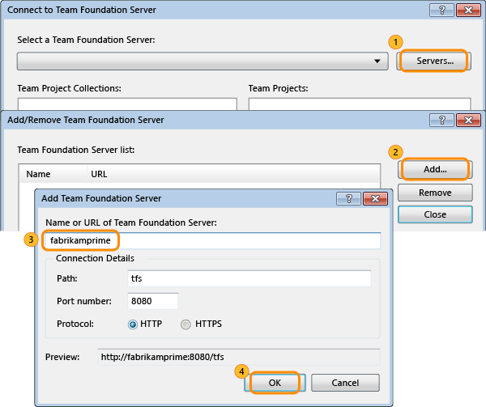
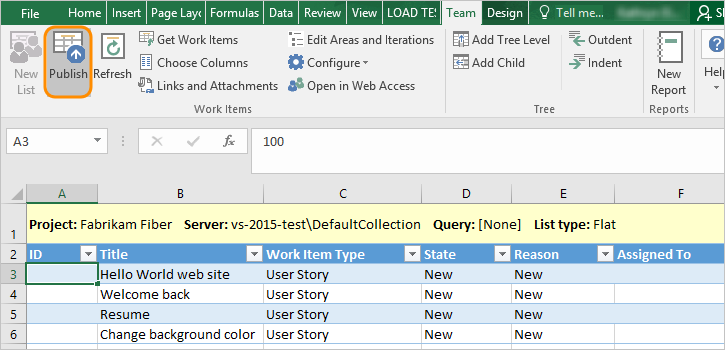
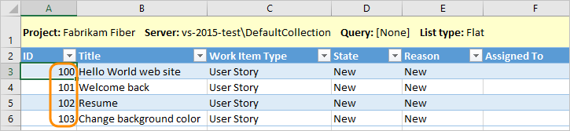
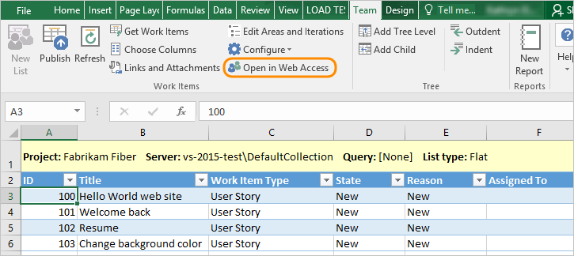
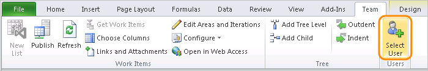
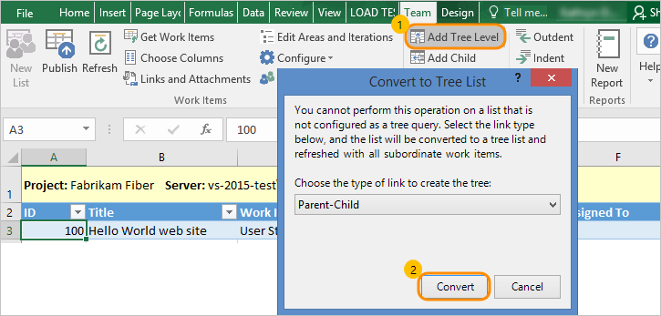
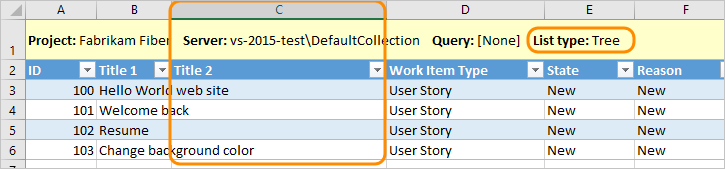
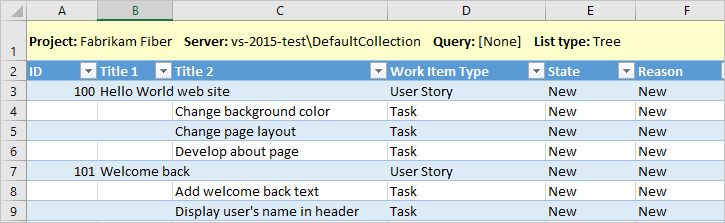
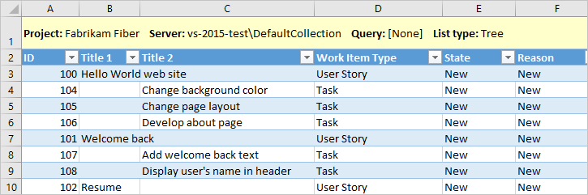

# Bulk add or modify work items with Excel 

[!INCLUDE [temp](../../includes/version-vsts-tfs-all-versions.md)]

When you have many work items to add or modify, using Microsoft Excel can save you time. [Use a flat list](../../queries/using-queries.md#flat-list-query) to bulk add or modify several types of work items at once, such as backlog items, tasks, bugs, or issues. [Use a tree list](../../queries/using-queries.md#tree-query) to bulk add or modify work items and their parent-child links.

::: moniker range="azure-devops"
> [!NOTE]  
> If you don't have access to Excel, you can still perform bulk import and update using CSV formatted files. To learn more, see [Bulk import or update work items using CSV files](../../queries/import-work-items-from-csv.md).

::: moniker-end

In this article you'll learn how to perform the following tasks:  

> [!div class="checklist"]    
> * Connect to a project from Excel 
> * Add or edit work items and publish your changes to Azure Boards or Azure DevOps
> * Refresh your Excel worksheet with the latest changes made to the work tracking data store   
> * Select user accounts  
> * Add hierarchically linked backlog items and tasks   
> * Work with different list types    

::: moniker range="azure-devops" 
> [!NOTE]   
> While the examples shown here primarily represent connecting to an on-premises Azure DevOps Server, you can connect to the cloud service Azure Boards and bulk add and modify work items. Once you've connected to the cloud server, you use the same procedures to work in Excel. 
::: moniker-end  

::: moniker range="<= tfs-2018" 
> [!NOTE]   
> You can also bulk add and modify work items using [Microsoft Project](create-your-backlog-tasks-using-project.md).
::: moniker-end  

For answers to specific questions about the integration of Microsoft Excel and Azure DevOps, see [FAQs: Work in Excel connected to Azure Boards ](faqs.md).

## Prerequisites 

::: moniker range="azure-devops" 

Integration of Microsoft Excel with the cloud service for Azure Boards is fully supported. 

- First you need to connect your Excel worksheet to a particular project, if you don't have an Azure Boards Project yet, you can [create one](/azure/devops/boards/get-started/sign-up-invite-teammates).   
- You'll need [permissions to connect to the project](../../../organizations/security/add-users-team-project.md) in Azure Boards. 
- To add or modify work items, you must be granted **Stakeholder** access or higher. For details, see [About access levels](/azure/devops/organizations/security/access-levels).
- To view or modify work items, you must have these permissions set to **Allow**: **View work items in this node** and **Edit work items in this node**. By default, the **Contributors** group has this permission set. To learn more, see [Set permissions and access for work tracking](/azure/devops/organizations/security/set-permissions-access-work-tracking).  
- Microsoft Excel 2010 or later version, including Microsoft Office Excel 365
- Installed [Azure DevOps Office Integration 2019 (free)](https://visualstudio.microsoft.com/downloads/#other-family).

::: moniker-end  

::: moniker range=">= tfs-2017 < azure-devops" 

 - First you need to connect your Excel worksheet to a particular project, if you don't have an project yet, you can [create one](/azure/devops/organizations/projects/create-project). 
- [Permissions to connect to the project](../../../organizations/security/add-users-team-project.md) in Azure Boards. 
- To add or modify work items, you must be granted **Stakeholder** access or higher. For details, see [About access levels](/azure/devops/organizations/security/access-levels).
- To view or modify work items, you must have these permissions set to **Allow**: **View work items in this node** and **Edit work items in this node**. By default, the **Contributors** group has this permission set. To learn more, see [Set permissions and access for work tracking](/azure/devops/organizations/security/set-permissions-access-work-tracking).  
- Microsoft Excel 2010 or later version, including Microsoft Office Excel 365
- Visual Studio 2013 or later version or [Team Foundation Server Standalone Office Integration (free)](https://visualstudio.microsoft.com/downloads#team-foundation-server-office-integration-2017)

::: moniker-end  

::: moniker range=">= tfs-2013 <= tfs-2015" 

- Microsoft Excel 2007, Microsoft Excel 2010, or Microsoft Excel 2013
- Visual Studio 2013 or Visual Studio 2015 or [Team Foundation Server Standalone Office Integration (free)](https://go.microsoft.com/fwlink/?LinkId=832491&clcid=0x409)
- [Permissions to connect to the project](../../../organizations/security/add-users-team-project.md). 

::: moniker-end  

To learn more about compatibility requirements, see [Compatibility with Azure DevOps](/azure/devops/server/compatibility). 

  

## Add work items

1.  If you don't have Microsoft Excel 2007 or a more recent version, [install it](https://products.office.com/excel). For Azure Boards and TFS 2017 and later versions, you'll need Excel 2010 or a later version. 

2.  If you haven't installed a version of [Visual Studio (2010 or later)](https://visualstudio.microsoft.com/downloads/download-visual-studio-vs) or the [Team Foundation Server Standalone Office Integration (free)](https://go.microsoft.com/fwlink/?LinkId=832491&clcid=0x409), you'll need to install one of these versions to connect to an Azure DevOps or TFS project. 
	
	::: moniker range=">= azure-devops-2019"
	> [!NOTE]   
	> The only way to get the Azure DevOps Office Integration plug-in is by installing one of the latest editions of Visual Studio or theAzure DevOps Office Integration installer. The plug-in supports connection to Azure Boards and Azure DevOps Server from Excel.
	::: moniker-end
	::: moniker range="<= tfs-2018"
	> [!NOTE]   
	> The only way to get the Team Foundation plug-in is by installing one of the latest editions of Visual Studio or the TFS Standalone Office Integration installer. The TFS Office Integration 2017 plug-in supports connection to Azure Boards and TFS from Excel, Project, and the PowerPoint-based storyboarding tool.
	::: moniker-end

3.  In Excel, start with a blank worksheet. If you don't see the **Team** ribbon (or the **Team** menu if you use Excel 2007), see step 2 or [TFS-Office integration issues](tfs-office-integration-issues.md). 

	(1) Choose Team tab, (2) place your cursor in Cell A1, and then (3) choose **New List**.  

	> [!div class="mx-imgBorder"]  
	> 

    > [!TIP]  
    > If the **Team** ribbon no longer appears, you might need to [re-enable it](tfs-office-integration-issues.md). 

4.  Connect to your project where you want to add work items. If you can't connect, [get added as a team member](../../../organizations/security/add-users-team-project.md#add-team-members).  

    

    If it is your first time connecting from Excel, you might have to add the URL to the list of recognized servers.

	**Azure Boards**  

	(1) Choose **Servers...**, (2) choose **Add...**, (3) enter the URL of your Azure Boards organization, and (4) check that the preview matches the URL that you entered. Then choose **OK**. 

	

	**Azure DevOps Server or TFS**  

	(1) Choose **Servers...**, (2) choose **Add...**, (3) enter the name of your Azure DevOps Server instance. As needed, change the Port number if your deployment uses a non-default port number. The Preview entry should display the correct URL for your deployment. (4) Choose **OK**.  

    

	Choose **Close** to close the Add/Remove servers dialog. From the Select a Team Foundation Server dialog, make sure the server you added is selected, and then choose **Connect**. 

	> [!TIP]    
	> You can use multiple worksheets within an Excel workbook to work with different input or query lists. However, you can only connect to one project per workbook.

5. From the New List dialog, choose **Input list**.  

	::: moniker range=">= tfs-2017"
    
	::: moniker-end
	::: moniker range="< tfs-2017"
    
	::: moniker-end

	If, instead, you want to work with a list of work items defined in a query, choose **Query list**.

6.  Your worksheet is now bound to your project as a flat list. What this means is that you can add work items to the project from the worksheet or add work items to the worksheet from the project.

	::: moniker range=">= tfs-2017"
	> [!div class="mx-imgBorder"]  
	> 
	::: moniker-end
	::: moniker range="< tfs-2017"
    
	::: moniker-end

7.  Specify the titles of the work items you want to add and their work item type.

	::: moniker range=">= tfs-2017"
	> [!div class="mx-imgBorder"]  
	> 
	::: moniker-end
	::: moniker range="< tfs-2017"
    
	::: moniker-end

    Notice how the **State** and **Reason** fields automatically fill in with default values once your select the work item type.

8.  Publish your worksheet.

	::: moniker range=">= tfs-2017"
	> [!div class="mx-imgBorder"]  
	> 
	::: moniker-end
	::: moniker range="< tfs-2017"
    
	::: moniker-end

    Make sure your cursor is in a cell that contains data. Otherwise, the **Publish** button might appear disabled.

    Notice how IDs are now assigned to your work items.

	::: moniker range=">= tfs-2017"
	> [!div class="mx-imgBorder"]  
	> 
	::: moniker-end
	::: moniker range="< tfs-2017"
    
	::: moniker-end

9.  Also, note how you can open a work item in the web portal to add more information.

	::: moniker range=">= tfs-2017"
	> [!div class="mx-imgBorder"]  
	> 
	::: moniker-end
	::: moniker range="< tfs-2017"
	
	::: moniker-end

::: moniker range=">= azure-devops" 

You can make changes to work items in Excel, the web portal, Visual Studio/Team Explorer, or Team Explorer Everywhere. You can also make changes to work items using the [az boards work-item create](../../work-items/view-add-work-items.md#add-work-item) command.

::: moniker-end  

::: moniker range="azure-devops-2019" 
You can make changes to work items in Excel, the web portal, Visual Studio/Team Explorer, or Team Explorer Everywhere. 
::: moniker-end  

::: moniker range="<= tfs-2018" 

You can make changes to work items in Excel, Project, the web portal, or Visual Studio, or Team Explorer Everywhere.

::: moniker-end  

> [!TIP]
> **Follow these tips to keep your work in sync:**   
>- When you first open a saved worksheet, use  (**Refresh**) to download the latest data from the data store.  
>- Enter data for additional fields by adding columns to the worksheet using  <strong>Choose Columns</strong>.  
>- To avoid data conflicts, publish your additions and modifications often.  
>- To prevent loss of data before you publish or refresh, save your workbook periodically.  

## Select user accounts 

> [!NOTE]  
> To access the [Select User](#select-user) feature, you need to install [Visual Studio (at least VS 2015.1 or later version](https://visualstudio.microsoft.com/downloads/) or [Team Foundation Server Office Integration 2015 Update 2 or later version](https://visualstudio.microsoft.com/downloads/). You can download the free version of Visual Studio Community. Get this feature to avoid data validation errors by misspelling user names and when you must assign user names from a large group of user accounts.  

You can use the Select User feature to find user accounts and assign values to person named fields. Also, this feature provides access to the most recently used (MRU) values. If your team contains several hundreds or thousands of user accounts, you'll want to use this feature.  

1. If you haven't installed or updated to the latest version of [Visual Studio (at least VS 2015.1 or later version](https://visualstudio.microsoft.com/downloads/), do that now. You need the latest update in order to access the Select User feature.  

2. Choose a person-named field to activate the **Select User** feature in the Team ribbon.  

	  

	A person-named field is a field that contains a user identity. These fields are typically synchronized to a database of user accounts, such as Azure Active Directory, Active Directory, or a Workgroup. Such fields are identified as those whose `syncnamechanges` attribute has been set to [synchronize](../../../reference/xml/field-definition-element-reference.md).  

3. Begin typing the name of the user account and the Assign User dialog will automatically filter the results until you can select the account of interest.  

	  

	Enter a letter to tab to the start of names beginning with that letter. Enter only user names as account aliases aren't recognized.   

	You'll notice that as you select user names, Excel remembers your recent selections and you can select those user accounts directly from the field.   

	  

> [!TIP]  
> Without the Select User feature active, you must enter user names exactly as they are in the database, or you'll receive data validation errors upon trying to publish.  

## Add a hierarchy of linked work items

You can bulk add a nested list of work items, such as a work breakdown structure or a hierarchical set of user stories and customer experiences. For example, you can add a nested list of tasks, subtasks, and bugs, as shown in the following illustration, or linked tasks to product backlog items, as described in the following steps.

Here's how a three-level nested tree of items appears in Excel:   

> [!IMPORTANT]  
> Note that only the Parent-Child link types are supported by the Tree list. 

Parent-child links support creating a hierarchical backlog structure. The work item types that participate in the hierarchy differ with different processes and are shown in the following images. 

[!INCLUDE [temp](../../includes/work-item-types.md)]

To import a hierarchical list, perform the following steps: 

1.  Follow steps 1 through 6 from the previous procedure.

2.  Convert your flat list to a tree list by adding a tree level.

    

    Notice how the list type is now labeled **Tree**, and an additional **Title 2** column has been inserted.

    

3.  Enter titles for backlog items under **Title 1** and for tasks, under **Title 2**. Also, select the corresponding work item type for each. Here we specify Task.

    

4.  Just as before, publish your worksheet and notice how IDs are assigned to the new work items.

    

    In the background, parent-child links are created for each task listed under a user story.

## Useful tips when working with a tree list 

- The plug-in interprets the data in the **Title** columns to determine the pattern of links between work items. When you publish changes, any of the following conditions can result in an error, an invalid link, or a tree link to be created between incorrect work items:
	- A row between parent and child work items is blank. 
	- The Title of a work item is in the wrong column. Make sure you enter a title for each child work item.
	- Within a row, multiple **Title** columns contain data. Enter text in only one of the title columns within each row.
	- The list was sorted. Don't sort a tree list. Sorting a tree list can change the hierarchical link relationships. If you do sort a tree list, you can recover from this operation by immediately refreshing.
- To resolve an error, see [Resolve invalid links in an Excel tree list](resolve-excel-invalid-links-tree-list.md).
- You can use the  or  indent/outdent icons to demote or promote a work item within the tree hierarchy. Verify that the column to the left or right of the parent work item's title is a **Title** column. The header at the top of the column should read **Title** &lt;number&gt;, if it does not, add a tree level.
- A parent-child linked work item can only have one parent. You can't add the same work item task to two backlog items. Instead, you need to define distinct work item tasks.
- If you receive error TF208104, changes you made to the fields are published, but all changes you made to the link hierarchy are not published. At least one of the link relationships defined for the work item is locked by another process, such as Project Server integration. For more information, see [Addressing Error TF208104: Hierarchical Link Relationship Is Locked](resolve-excel-invalid-links-tree-list.md#tf208104). 
- When you move a work item, make sure that you select the entire table row. 

## Work with different list types 

Select your list structure based on these guidelines.  

<table>
<thead>
<tr>
<th width="60%">
Task
</th>
<th width="15%">
List structure
</th>
<th width="15%">
List refresh
</th>
</tr>
</thead>
<tbody>
<tr>
<td>
Create and publish many unrelated work items
</td>
<td>
Flat list
</td>
<td>
Input list
</td>
</tr>
<tr>
<td>
Perform bulk edits on many unrelated work items
</td>
<td>
Flat list
</td>
<td>
Query list or input list
</td>
</tr>
<tr>
<td>
Perform bulk edits on many work items and their dependent or related work items
</td>
<td>
Tree list
</td>
<td>
Query list
</td>
</tr>
<tr>
<td>
Perform top down planning and publish parent-child linked work items
</td>
<td>
Tree list
</td>
<td>
Input list
</td>
</tr>
<tr>
<td>
View and modify the hierarchy and parent-child link relationships of many work items
</td>
<td>
Tree list
</td>
<td>
Query list
</td>
</tr>
<tr>
<td>
Review reports based on a filtered set of work items that change over time
</td>
<td>
Flat or tree list
</td>
<td>
Query list
</td>
</tr>
</tbody>
</table>

### Enable the Tree commands

If the Tree group commands are not available, your worksheet is configured as a flat list. You can convert the flat list to a tree list as described in step 2 in [Add backlog items and tasks and their parent-child links using a tree list](#tree-list).

### Convert a tree to a flat list

First, publish whatever changes you have made. Then, on the **Team** ribbon, choose **Configure**, **List**, and then choose **Refresh work items only**. These actions flatten the tree structure and change the query list to an input list.

### Remove a tree level

Remove any content entered under the tree-level **Title** *number* column you want to remove&mdash;the highest numbered column&mdash;and, then **Refresh** your worksheet.

> [!TIP]  
> Always publish changes that you have made to work items before you remove a tree level. Removing a tree level requires a refresh, which overwrites data in the work item list. You will lose any data you have not published. 
 

### Convert from an input list to a query

On the **Team** ribbon, choose **Configure**, **List**, and then select the query you want to use. The worksheet will refresh with only those work items returned by the query. Also, if you select a tree query, then the list becomes a tree list.

### Add existing work items to a list

If you're working with a non-query input list, you can add work items by choosing  from the Team ribbon. If you're working from a query, then you need to [modify your query](../../queries/using-queries.md) to contain the work items you want. Then refresh your list.

## Related articles

::: moniker range="azure-devops"
- [Bulk modify work items (web portal)](../../backlogs/bulk-modify-work-items.md)  
- [Azure DevOps Office integration issues](tfs-office-integration-issues.md)
- [FAQs: Work in Excel connected to Azure Boards](faqs.md)
- [Bulk import or update work items using CSV files](../../queries/import-work-items-from-csv.md)
- [Basic Excel tasks](https://support.office.com/article/basic-tasks-in-excel-dc775dd1-fa52-430f-9c3c-d998d1735fca) 
::: moniker-end

::: moniker range="< azure-devops"
- [Bulk modify work items (web portal)](../../backlogs/bulk-modify-work-items.md)  
- [Azure DevOps Office integration issues](tfs-office-integration-issues.md)
- [FAQs: Work in Excel connected to Azure Boards](faqs.md)
- [Create Excel reports from a work item query](../../../report/excel/create-status-and-trend-excel-reports.md)
- [Basic Excel tasks](https://support.office.com/article/basic-tasks-in-excel-dc775dd1-fa52-430f-9c3c-d998d1735fca) 
::: moniker-end