# Bulk add or modify work items with Excel 

[!INCLUDE [temp](../../includes/version-all.md)]

When you have many work items to add or modify, using Microsoft Excel can save you time. Excel supports adding work items, updating existing work items, adding links and attachments to multiple work items, and more. In addition, you can use native Excel features to support other actions, such as summing a column, copy-and-paste rows, perform fill down, and more. 

In this article you'll learn how to perform the following tasks:  

> [!div class="checklist"]    
> * Choose the type of list or query to support your task 
> * Use select Excel features when connected to Azure Boards 
> * Import or update work items, either a flat list or hierarchy tree list 
> * Publish and refresh your work items  
> * Convert a flat-list to a tree-list, change your list type or query  
> * Add work items to your worksheet 
> * Add and remove work item fields from your worksheet 
> * Select user accounts for identity or person-named fields 
> * Link work items, find work items to link to, edit links, and more
> * Add attachments to one or more work items   
> * Open a work item from Excel to add additional information (opens in web portal)  
> * Edit Area and Iteration Paths (opens in web portal)   

For information about connecting to Excel, see [Connect Azure Boards to an Office client](track-work.md). For answers to specific questions about the integration of Excel and Azure DevOps, see [FAQs: Work in Excel connected to Azure Boards ](faqs.yml).  

::: moniker range=">= azure-devops-2020"

> [!NOTE]  
> If you don't have access to Excel, you can still perform bulk import and update using CSV formatted files. To learn more, see [Bulk import or update work items using CSV files](../../queries/import-work-items-from-csv.md).

::: moniker-end

::: moniker range="<= tfs-2018" 
> [!NOTE]   
> You can also bulk add and modify work items using [Microsoft Project](create-your-backlog-tasks-using-project.md).
::: moniker-end  

## Prerequisites 

> [!NOTE]  
> macOS isn't supported. Even if you've installed Visual Studio for Mac, connection to Azure DevOps from Excel isn't supported.   

::: moniker range="azure-devops" 

- Installed Microsoft Excel 2010 or later version, including Microsoft Office Excel 365
- Installed [Azure DevOps Office Integration 2019 (free)](https://visualstudio.microsoft.com/downloads/#other-family).
	> [!NOTE]   
	> The only way to get the Azure DevOps Office Integration plug-in is by installing one of the latest editions of Visual Studio or the Azure DevOps Office Integration installer. The plug-in supports connection to Azure Boards and Azure DevOps Server from Excel.  
- To connect to an Azure Boards project, you need to be a [member of the project](../../../organizations/security/add-users-team-project.md). If you don't have an Azure Boards project yet, you can [create one](../../get-started/sign-up-invite-teammates.md).  
- To view or modify work items, you must have these permissions set to **Allow**: **View work items in this node** and **Edit work items in this node**. By default, the **Contributors** group has this permission set. To learn more, see [Set permissions and access for work tracking](../../../organizations/security/set-permissions-access-work-tracking.md).  
- To add or modify work items, you must be granted **Stakeholder** access or higher. For details, see [About access levels](../../../organizations/security/access-levels.md). 
- To use the [Select User](#select-user) feature, you need to install [Visual Studio (at least VS 2015.1 or later version](https://visualstudio.microsoft.com/downloads/) or [Team Foundation Server Office Integration 2015 Update 2 or later version](https://visualstudio.microsoft.com/downloads/). You can download the free version of Visual Studio Community. Get this feature to avoid data validation errors by misspelling user names and when you must assign user names from a large group of user accounts.  

::: moniker-end  

::: moniker range=">= tfs-2017 < azure-devops" 

- Installed Microsoft Excel 2010 or later version, including Microsoft Office Excel 365
- Installed [Azure DevOps Office Integration 2019 (free)](https://visualstudio.microsoft.com/downloads/#other-family).
	> [!NOTE]   
	> The only way to get the Team Foundation plug-in is by installing one of the latest editions of Visual Studio or the TFS Standalone Office Integration installer. The TFS Office Integration 2017 plug-in supports connection to Azure Boards and TFS from Excel, Project, and the PowerPoint-based storyboarding tool.
- To connect to an Azure Boards project, you need to be a [member of the project](../../../organizations/security/add-users-team-project.md). If you don't have an Azure Boards project yet, you can [create one](../../../organizations/projects/create-project.md). 
- To view or modify work items, you must have these permissions set to **Allow**: **View work items in this node** and **Edit work items in this node**. By default, the **Contributors** group has this permission set. To learn more, see [Set permissions and access for work tracking](../../../organizations/security/set-permissions-access-work-tracking.md).  
- To add or modify work items, you must be granted **Stakeholder** access or higher. For details, see [About access levels](../../../organizations/security/access-levels.md). 
- To use the [Select User](#select-user) feature, you need to install [Visual Studio (at least VS 2015.1 or later version](https://visualstudio.microsoft.com/downloads/) or [Team Foundation Server Office Integration 2015 Update 2 or later version](https://visualstudio.microsoft.com/downloads/). You can download the free version of Visual Studio Community. Get this feature to avoid data validation errors by misspelling user names and when you must assign user names from a large group of user accounts.  

::: moniker-end  

::: moniker range=">= tfs-2013 <= tfs-2015" 

- Installed Microsoft 2007, Microsoft Excel 2010, or Microsoft Excel 2013 
- Installed Visual Studio 2013 or Visual Studio 2015 or [Team Foundation Server Standalone Office Integration (free)](https://go.microsoft.com/fwlink/?LinkId=832491&clcid=0x409)
- To connect to an Azure Boards project, you need to be a [member of the project](../../../organizations/security/add-users-team-project.md). If you don't have an Azure Boards project yet, you can [create one](../../../organizations/projects/create-project.md). 
- To view or modify work items, you must have these permissions set to **Allow**: **View work items in this node** and **Edit work items in this node**. By default, the **Contributors** group has this permission set. To learn more, see [Set permissions and access for work tracking](../../../organizations/security/set-permissions-access-work-tracking.md).  
- To add or modify work items, you must be granted **Stakeholder** access or higher. For details, see [About access levels](../../../organizations/security/access-levels.md).   

::: moniker-end  

To learn more about compatibility requirements, see [Compatibility with Azure DevOps](/azure/devops/server/compatibility). 

## Choose list and query type  

When you work in Excel connected to Azure Boards, you're always working with a query type and a list type. Queries correspond to the queries you create using the Query Editor.
- **Query types**: 
	- **None**: Indicates it is an **input list**. 
	- **Query title**: Indicates the list of work items is tied to the specified **query**. 
- **List types**: 
	- **Flat list**: Simple list of work items that shows a single **Title** column. No link management is supported. 
	- **Tree list**: Hierarchical list of work items that support creating and updating tree topology links, such as Parent-Child links, between work items. These lists include two or more **Title** columns.  

You can add, modify, publish, and refresh work items using any query type and list type. 

### Query types 

Azure Boards supports three query types. The icon next to each query indicates the query type. The first two query types, **Flat list of work items** and **Work items and direct links** are imported as flat list queries. 

> [!div class="mx-imgBorder"]  
> 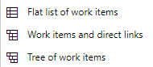

Only the **Tree of work items** queries import as a tree list. Direct links queries are imported as a flat list into Excel as modifying multiple types of links isn't a supported feature in Excel. 

### Tree lists

You can bulk add a nested list of work items, such as a work breakdown structure or a hierarchical set of user stories and customer experiences. For example, you can add a nested list of tasks, subtasks, and bugs, as shown in the following illustration, or linked tasks to product backlog items.

Here's how a three-level nested tree of items appears in Excel. 

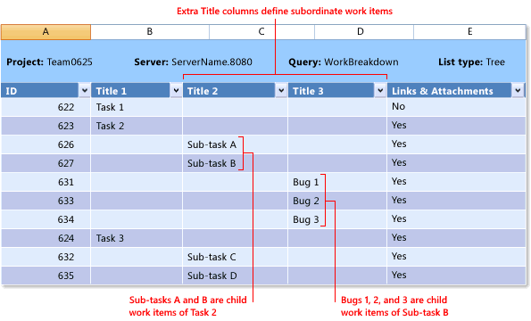

Parent-child links or other tree topology link types support creating a hierarchical backlog structure. The work item types that participate in the hierarchy differ with different processes and are shown in the following images. 

[!INCLUDE [temp](../../includes/work-item-types.md)]

To import a hierarchical list, see [Add or import a hierarchical list of work items](#add-work-items-tree) later in this article. 

### My queries versus shared queries 

You can open in Excel any query you've defined in Azure Boards. That includes queries defined under My Queries and Shared Queries. However, if you plan to share the workbook with other team members, then you should only work with a Shared Query. Other team members won't be able to use the workbook or worksheet if it is based on a personal query stored under your My Queries folder. 

### Guide to list and query type usage

In general, you [Use a flat list](../../queries/using-queries.md#flat-list) to bulk add or modify several types of work items at once, such as backlog items, tasks, bugs, or issues. [Use a tree list](../../queries/using-queries.md#tree-query) to bulk add or modify work items and their tree-topology links. 

Here is some additional guidance: 

::: moniker range="azure-devops" 

- Use an **input list, flat list**: To import a list of work items or create new work items, no hierarchy   
- Use an **input list, tree list**: To perform top down planning and import hierarchically linked work items  
- Use a **query list, tree list**: To view and modify the hierarchy of link relationships of many existing work items. 
- Use a **query list, flat list**: To bulk update a list of work items or create new work items, no hierarchy   

::: moniker-end  

::: moniker range="< azure-devops" 

- Use an input list, flat list: To import a list of work items or create new work items, no hierarchy  
- Use an input list, tree list: To perform top down planning and publish parent-child linked work items  
- Use a query list, flat list: To create an Excel report based on the query of work items  
	> [!NOTE]
	To create an Excel report, you're project collection must be configured to support Analytics reporting. For more information, see [Create Excel reports from a work item query](../../../report/create-status-and-trend-excel-reports.md).
- Use a query list, tree list: To view and modify the hierarchy and parent-child link relationships of many existing work items. 

 
::: moniker-end  

## Use Excel features 

You can use most Excel features when working with a list of work items. For example, you can use the following features: 

- Format a cell or apply conditional formatting to a cell or column 
- Cut and paste from one cell to other cells 
- Cut and paste a single row 
- Sum a column or add other formulas  
- Fill down cells 
- Filter 
- Add multiple worksheets to your workbook 

Each worksheet in Excel can contain a different input list or query. However, all worksheets within the workbook must connect to the same project within an organization or project collection.

The following features work slightly differently when working with a worksheet connected to Azure Boards.  

- Each cell or column of cells corresponds to a work item field. Each field is associated with a data type. Excel won't allow you to enter data into a cell that doesn't meet the data type and requirements for that field.  
- You can only insert a single row at a time within the worksheet. 
- You can copy and paste multiple rows within the worksheet. 
- To move a work item within a hierarchy, cut the entire row and paste it under the work item you want as its parent. 
- Use **Outdent** and **Indent** to change the location of a work item within the tree. 
- Undo (Ctrl Z) may not work. If you do something that you want to revert, you can refresh the worksheet. 

We recommend you publish and refresh your worksheet often to make sure your local work remains in sync with Azure Boards data store.

To learn more about Excel, see [Basic Excel tasks](https://support.office.com/article/basic-tasks-in-excel-dc775dd1-fa52-430f-9c3c-d998d1735fca) .

###  Sort work items  

You can sort work item flat lists using the [Excel sort feature](https://support.office.com/article/sort-data-in-a-range-or-table-62d0b95d-2a90-4610-a6ae-2e545c4a4654). 

However, if you're working from a tree list, you don't want to perform any type of sort. Doing so changes the tree structure and therefore the links between work items.  

If you want to use Excel to manage the order of your work items as they appear in a [team backlog](../create-your-backlog.md#reorder-your-backlog), you can do that by using the [Stack Rank](../../queries/planning-ranking-priorities.md#fields-table) or [Backlog Priority](../../queries/planning-ranking-priorities.md#fields-table) field (Agile or Scrum process). You can set values in these fields, publish your worksheet, and refresh your backlog. Your backlog items should appear reordered based on lowest to highest number. However, the next time the backlog is reordered from the backlog, the values you entered are subject to change. 

If you want to maintain a certain order of work items, consider adding a custom field to manage the sort order, and then use that within Excel to sort your flat list of work items. This option, however, won't change the order that appears in your backlog. 

### Tasks you can and can't perform from Excel

You can perform the following tasks: 

- Add tags and bulk update work items with tags as described in [Add work item tags to categorize and filter lists and boards](../../queries/add-tags-to-work-items.md).
	Add the **Tags** field to your worksheet. Add multiple tags separated by a semicolon (;). 
- You can add simple text to a rich-text field, but if you're bulk updating several work items, you may lose formatting in existing work items. 
- You can work offline and then reconnect and publish your changes. For details, see [Connect Azure Boards to an Office client, Work offline and reconnect](track-work.md#work-offline).

You can't perform the following tasks from an Excel worksheet: 

::: moniker range="azure-devops" 

- You can't delete work items 
- You can't change the work item type of an existing work item
- You can't move work items to another project  
- You can't import or update test case steps or other test artifacts 
- You can't add work items in any other State than the new State 
- You can't add to a work item discussion thread 
- You can't link to a remote work item. 

::: moniker-end  

::: moniker range="azure-devops-2020" 

- You can't delete work items 
- You can't change the work item type of an existing work item
- You can't move work items to another project  
- You can't import or update test case steps or other test artifacts 
- You can't add work items in any other State than the new State 
- You can't add to a work item discussion thread. 

::: moniker-end  

::: moniker range="<= azure-devops-2019" 

- You can't delete work items 
- You can't import or update test case steps or other test artifacts 
- You can't add work items in any other State than the new State 
- You can't add to a work item discussion thread 

::: moniker-end  

  

## Import work items, flat list 

1. Open Excel and connect to your Azure Boards project. Use one of the four methods provided in [Connect Azure DevOps project to Excel](track-work.md#excel).

	> [!NOTE]   
	> When you connect to Azure Boards in the cloud, the **Team Project Collection** is automatically selected as their is only one collection associated with your Azure DevOps Services organization. When you connect to Azure Boards in an on-premises server, you choose the **Team Project Collection** prior to choosing the project.  

1.  In Excel, start with a blank worksheet. If you don't see the **Team** ribbon (or the **Team** menu if you use Excel 2007), see [Azure DevOps Office integration issues](tfs-office-integration-issues.md). 
1. Choose **New List** from the Team ribbon. 

	> [!div class="mx-imgBorder"]  
	> 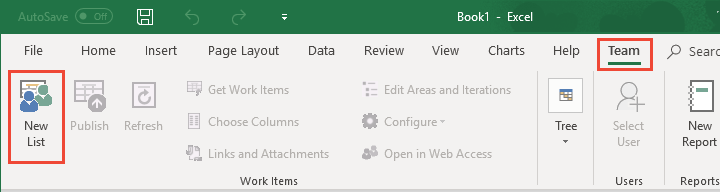

1.	From the **New List** dialog, choose **Input list**.  

    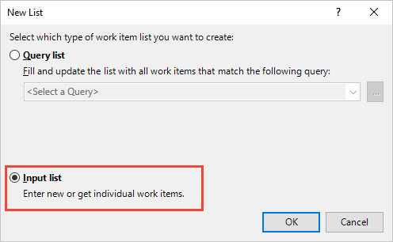

1.  <a id="step-5" />Your worksheet is now bound to your project as an input list (Query[None]), flat list.  

	> [!div class="mx-imgBorder"]  
	> 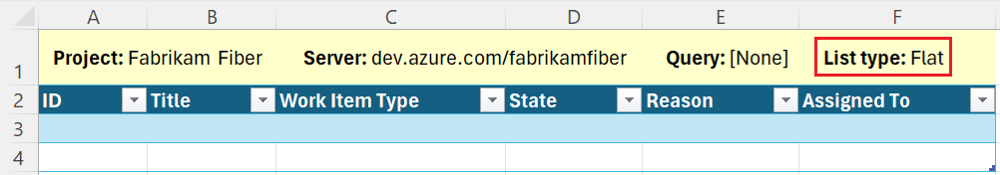

1.  Specify the titles of the work items you want to add and their work item type.

	> [!div class="mx-imgBorder"]  
	> 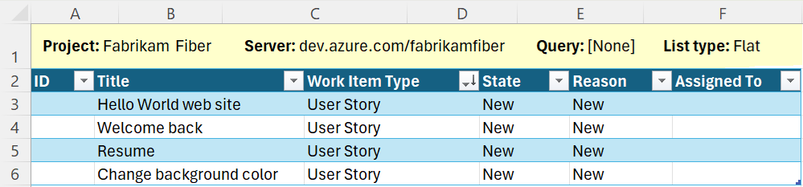

    Notice how the **State** and **Reason** fields automatically fill in with default values once your select the work item type.

1.  Publish your worksheet. 

	> [!div class="mx-imgBorder"]  
	> 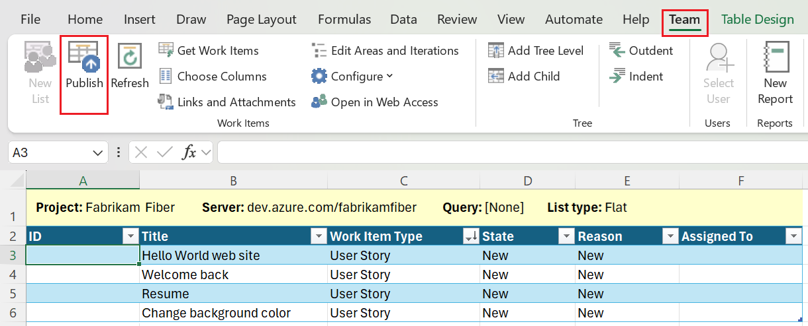

    Make sure your cursor is in a cell that contains data. Otherwise, the **Publish** button might appear disabled.

    Notice how IDs are now assigned to your work items.

	> [!div class="mx-imgBorder"]  
	> 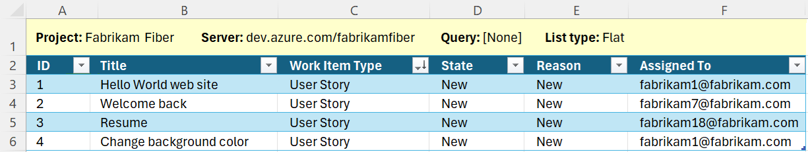

1.  To assign values to other fields, open [**Choose Columns**](#choose-columns), add the fields, make the assignments, and publish your changes. 

    > [!TIP]
    > If you're adding work items that you want to appear on a team backlog, make sure that you add and specify the team's Area Path and Iteration Path. If you need to add Area Paths or Iteration Paths, choose the **Edit Areas and Iterations** link. The link opens a web browser to the Project Settings page. To learn more, see [Define area paths and assign to a team](../../../organizations/settings/set-area-paths.md) and [Define Iteration Paths and configure team iterations](../../../organizations/settings/set-iteration-paths-sprints.md).  

1. To open a work item to add more information, Choose the work item you want to open and then choose **Open in Web Access**. Before you do, make sure you publish any changes you've made.  

	> [!div class="mx-imgBorder"]  
	> 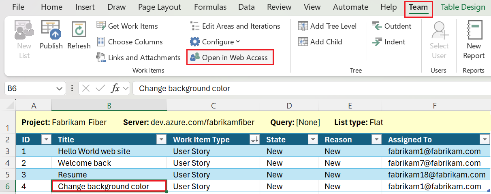

    A web browser opens and displays the work item. 

    If you make changes to the work item, you should then immediately refresh your worksheet to capture the changes.  

  

## Import work items, tree list

You can add a hierarchy of work items linked using parent-child links or other tree topology link type. 

> [!IMPORTANT]
> Don't sort a tree list. Sorting a tree list can change the hierarchical link relationships.  

1. Starting from [Step 5](#step-5) from the previous procedure, convert your flat list, input list into a tree list. Choose a cell within the flat list and then choose **Add Tree Level**. 
 
	> [!div class="mx-imgBorder"]  
	> 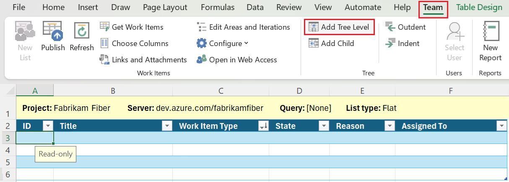

	If the **Add Tree Level** is disabled, you're working from a query list. To convert your list to a tree list, you must first [reconfigure your list](#reconfigure-list) to an input list. 

1. Choose the link type to use when adding work items to a hierarchy, and then choose **Convert**. The most usual choice is **Parent-Child**. You can only select from tree topology link types. To learn more, see [Link type topologies and restrictions](../../../reference/xml/link-type-element-reference.md#topology). 

	> [!div class="mx-imgBorder"]  
	> 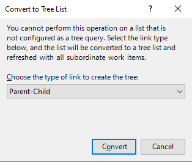

	Note the List type has changed to **Tree**, and a second **Title** column appears.  

	> [!div class="mx-imgBorder"]  
	> 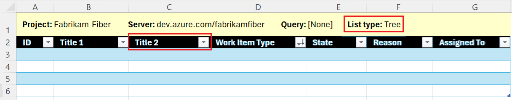

1. To add more levels to the hierarchy, choose **Add Tree Level** again. For example, if you want to add a hierarchy of Epics, Features, and User Stories, you'll want to have **Title 1**, **Title 2**, and **Title 3** columns.

	If you want to add tasks, add another tree level to have four title columns. To remove a column, see [Remove a tree level](#remove-tree-level). 

1. Save your Excel file. 

1. Enter the **Work Item Type** and **Titles** for the hierarchy you want to import. The **State** fields automatically fill in with default values once you select the work item type. 

	> [!div class="mx-imgBorder"]  
	> 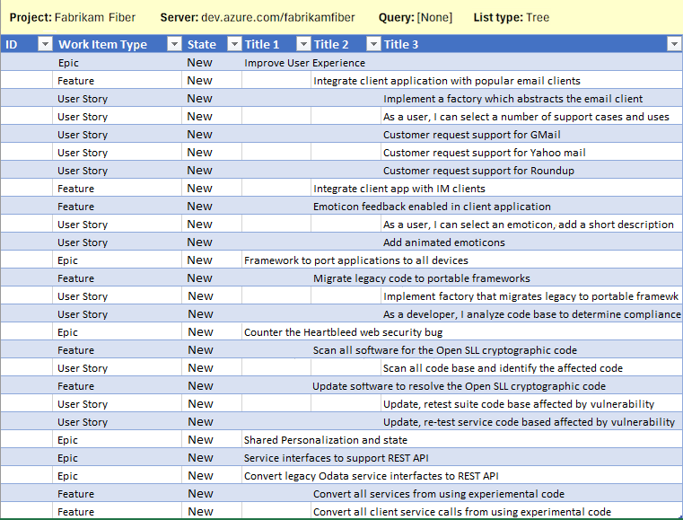

8.  Publish your worksheet.

	> [!div class="mx-imgBorder"]  
	> 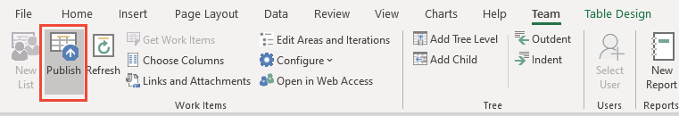

    Make sure your cursor is in a cell that contains data. Otherwise, the **Publish** button might appear disabled. 

    IDs are now assigned to your work items. In the background, the link type you selected is used to link each work item in the hierarchy. Epics are linked to Features, Features are linked to User Stories. 

1. To check the links made, choose a work item and choose **Links and Attachments**.

    For example, here we show the Child and Parent links created for a Feature that was imported. 

	> [!div class="mx-imgBorder"]  
	> 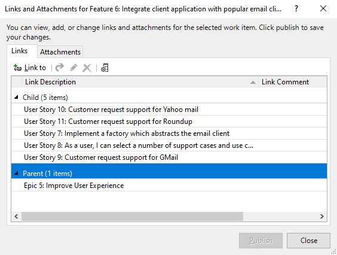

1. To enter a row under a work item where you want to add a child, choose the row and then choose **Add Child**.

	> [!div class="mx-imgBorder"]  
	> 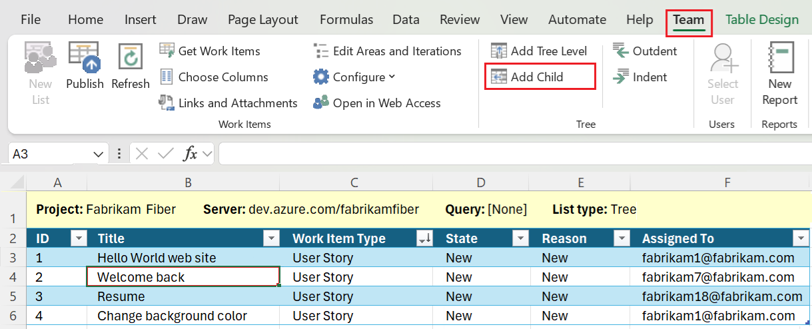 

1. To assign values to other fields, open [**Choose Columns**](#choose-columns), add the fields, make the assignments, and publish your changes. 

1. To change the hierarchy, cut and paste the row of a work item to place it under the new parent.  Make sure that you select the entire table row. When you publish the change, the old hierarchical links are deleted and the new hierarchical link are created. 

    You can use the  or  indent/outdent icons to demote or promote a work item within the tree hierarchy. Verify that the column to the left or right of the parent work item's title is a **Title** column. The header at the top of the column should read **Title n**, if it does not, add a tree level.

<a id="remove-tree-level" />

### Remove a tree level

1. First, publish changes that you have made to work items before you remove a tree level. Removing a tree level requires a refresh, which overwrites data in the work item list. You will lose any data you have not published. 

2. Next, remove any content entered under the tree-level **Title** *number* column you want to remove&mdash;the highest numbered column&mdash;. This should be the highest numbered column in the tree. 

3. **Refresh** your worksheet. The column containing empty values for the Title is removed. 

	You'll receive an error message if you attempt to delete the column. 

### Useful tips when working with a tree list 

- Excel interprets the data in the **Title** columns to determine the pattern of links between work items. When you publish changes, any of the following conditions can result in an error, an invalid link, or a tree link to be created between incorrect work items:
	- A row between is blank between two work items within the hierarchy 
	- The Title of a work item is in the wrong column. Make sure you enter a title for each child work item.
	- Within a row, multiple **Title** columns contain data. Enter text in only one of the title columns within each row.
	- The list was sorted. Don't sort a tree list. Sorting a tree list can change the hierarchical link relationships. If you do sort a tree list, you can recover from this operation by immediately refreshing.
- To resolve an error, see [Resolve invalid links](resolve-excel-invalid-links-tree-list.md).
- A parent-child linked work item can only have one parent. You can't add the same work item task to two backlog items. Instead, you need to define distinct work item tasks.

## Bulk update work items, query list

The easiest way to bulk update many work items is to create a query with the work items you want to update, and then open that query in Excel. 

> [!TIP]
> **Follow these tips to keep your work in sync:**   
>- When you first open a saved worksheet, use  (**Refresh**) to download the latest data from the data store.  
>- Enter data for additional fields by adding columns to the worksheet using  <strong>Choose Columns</strong>.  
>- To avoid data conflicts, publish your additions and modifications often.  
>- To prevent loss of data before you publish or refresh, save your workbook periodically.  

1. From the web portal or Visual Studio, create the work item query that contains the work items you want to update. For details, see [Create and save managed queries with the query editor](../../queries/using-queries.md). 

3. Open Excel and connect to your Azure Boards project. Use one of the four methods provided in [Connect Azure DevOps project to Excel](track-work.md#excel).

1.  If you opened your query from the web portal or Visual Studio, you're done. Make any changes you want. Open [**Choose Columns**](#choose-columns), add fields, make assignments, and publish your changes.  

1. If you start from Excel, open a blank worksheet. You can add a worksheet to an existing workbook, as long as you are choosing a query from the same project the workbook is bound to. 

1. Choose **New List** from the Team ribbon. 

	> [!div class="mx-imgBorder"]  
	> 

1.	From the **New List** dialog, choose **Query list**, and select the query you want from the drop-down menu.  

	> [!div class="mx-imgBorder"]  
	> 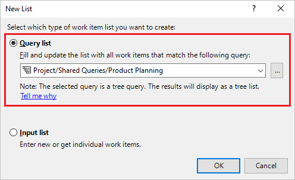

	The icon next to each query indicates the query type. The first two query types, **Flat list of work items** and **Work items and direct links** are imported as flat list queries. Only the **Tree of work items** queries import as a tree list. 

	> [!div class="mx-imgBorder"]  
	> 

1. With the work items imported to Excel, make the modifications you want and publish your changes. 

    If you're working with a tree list, see also the information provided in [Import a hierarchical list of work items](#add-work-items-tree).

## Enable Tree commands

If the **Tree group** commands are not available, your worksheet is configured as a flat list, query list. You must first convert the list to either an input list or a list based on a tree query in order to enable the Tree group commands. To learn how, see the next section on [Change your list type or query](#reconfigure-list).

## Change your list type or query

You can change the work items listed in your worksheet. Specifically, you can: 
- Change your flat list to a tree list
- Change from a query list to an input list
- Change from an input list to a query list 
- Change the query your worksheet references

If you want to change your flat list to a tree list, you can. However, if you're list is a query list, then you first need to reconfigure the list. You'll know that it is a flat list, query list as the **Tree group** commands are disabled. 

> [!div class="mx-imgBorder"]  
> 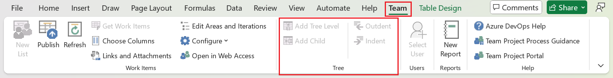

To convert your query list to an input list, follow these steps. 

1. First, publish whatever changes you have made. 

1. Next, on the **Team** ribbon, choose **Configure**, **List**.

	> [!div class="mx-imgBorder"]  
	> 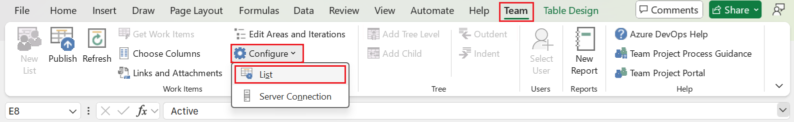

1. Choose **Refresh work items only** and then **Apply**. 

    This choice changes the query list to an input list.  

	> [!div class="mx-imgBorder"]  
	> 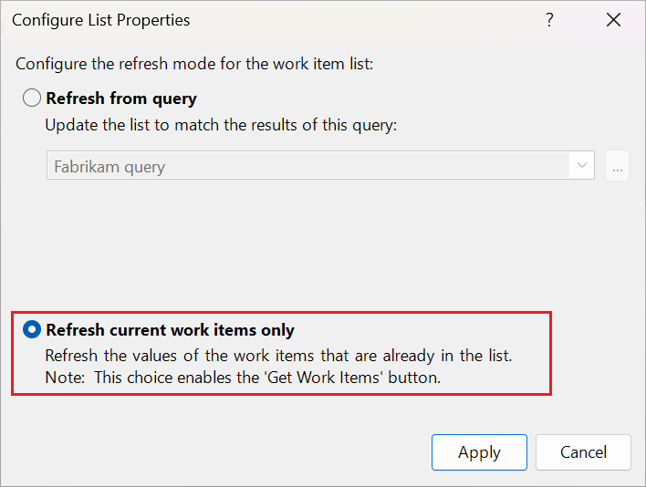

1. To convert from an input list to a query list, choose **Refresh from query**, select the query, and then **Apply**. 

	> [!div class="mx-imgBorder"]  
	> 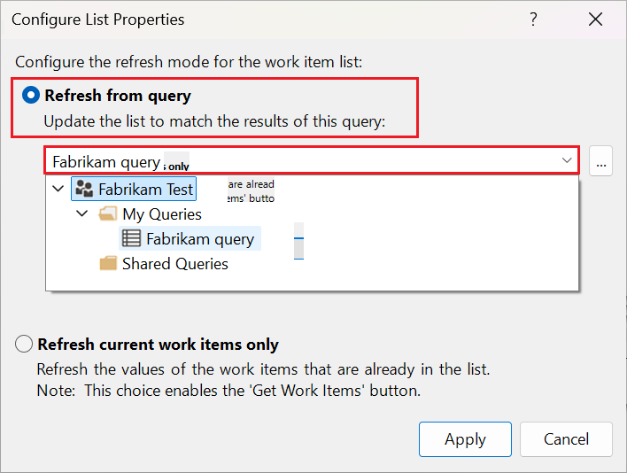

<a id="get-work-items" />

## Add existing work items to your worksheet 

If you're working from a query, [modify your query](../../queries/using-queries.md) to contain the work items you want. Then refresh your list. The additional work items will appear in your list. 

If you're working with an input list, perform these steps. 

1. From the **Team** ribbon, choose **Get Work Items**. 

	> [!div class="mx-imgBorder"]  
	> 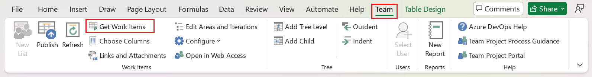

1. Choose the method you want from the three options available. 

	> [!div class="mx-imgBorder"]  
	> 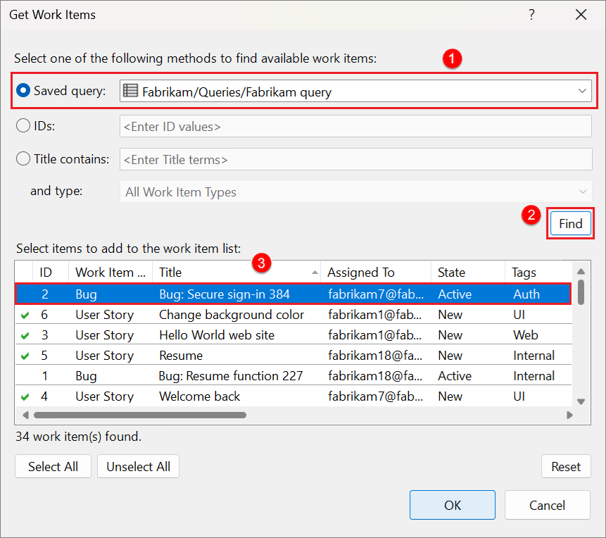

    If the work items are defined in another project, then first select the Project. Then, make your selections: 

    -   **Query**. Use this method when you have defined a query that you know contains the set or superset of the work items that you want.   
    -   **IDs**. Use this method when you know the IDs of the work items that you want to link to. 
          In the **IDs** box, type the IDs of the work items that you want to find, separated by commas or spaces. 
    -   **Title contains**. Use this method to find work items that have a common word or phrase in the title field. In the **and type** list, click the type of work item that you want to retrieve.   
    > [!NOTE]
    >  To minimize the time required to run the query, narrow the filter criteria of the search.  

1.  Choose **Find**.

     Only those work items defined for the selected project and specified work item type are listed. To sort on a column field, choose the column **Title**. 

1.  In the list of returned work items, select the check-box of one or more work items.   

    - Select each work item that should link to the current work item. You can also press the SHIFT key while clicking to select a range of work items, or press the CTRL key while clicking to select multiple work items.  
    - Choose **Select All** to select all work items in the list.  

  

## Add or remove column fields 

If you start your worksheet with a **New List**, you'll see only a set of default field columns. You can add columns using the **Choose Columns** on the Team ribbon.

If you start your worksheet from an existing query, you'll see all the column fields defined for the query. From there, you can add columns using the **Choose Columns**. However, your additions don't modify the underlying query. 

1. To assign values to other fields, choose **Column Options** to add the fields of interest.  

	> [!div class="mx-imgBorder"]  
	> 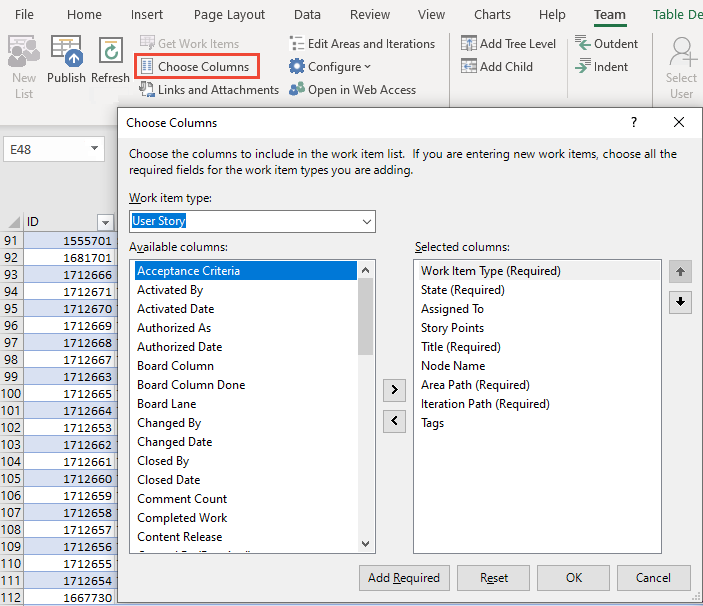

	- To filter the fields based on work item type, select the **Work item type**.
	- To move or remove a field, choose the field and then click the > or < icons.
	- To change the field sequence, move the field up or down in the list using the up and down arrows. 
	- You can add a rich-text field, such as the **Description** field, however you may lose some of the formatting upon publish.  

1. Once the fields appear in the worksheet, assign values and publish your updates. When working with identity fields, ones that accept user accounts, see the next section, [Select user accounts](#select-user).

1. Save your worksheet. 

## Select user accounts 

You can use the Select User feature to find user accounts and assign values to person named fields. Also, this feature provides access to the most recently used (MRU) values. If your team contains several hundreds or thousands of user accounts, you'll want to use this feature.  

> [!TIP]  
> Without the **Select User** feature, you must enter user names exactly as they are in the database, or you'll receive data validation errors upon trying to publish.  

1. If you haven't installed or updated to the latest version of [Visual Studio (at least VS 2015.1 or later version](https://visualstudio.microsoft.com/downloads/), do that now. You need the latest update in order to access the Select User feature.  

2. Choose an identity or person-named field to activate the **Select User** feature in the Team ribbon.  

	> [!div class="mx-imgBorder"]  
	> 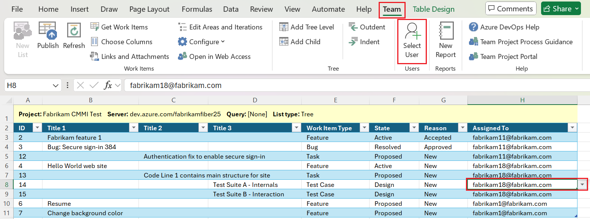

	An identity or person-named field is a field that contains a user identity. These fields are typically synchronized to a database of user accounts, such as Azure Active Directory, Active Directory, or a Workgroup. 

3. Begin typing the name of the user account and the Assign User dialog will automatically filter the results until you can select the account of interest.  

	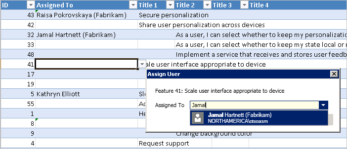  

	Enter a letter to tab to the start of names beginning with that letter. Enter only user names as account aliases aren't recognized.   

	You'll notice that as you select user names, Excel remembers your recent selections and you can select those user accounts directly from the field.   

	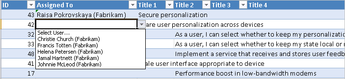  

## Link work items  

You can perform a number of actions from the **Links** tab of the **Links and Attachments** dialog. Specifically, you can: 
- Review the existing links defined for the selected work item 
- Add links to a selected work items to one or more work items or select objects 
- Delete links 
- Open a linked work item (opens in the web portal)  
- Edit the link type of an existing link 
- Add columns to the Link list and sort on that list 

For more information on linking work items, see [Link user stories, issues, bugs, and other work items](../add-link.md). 

### View and add links 

You can't use the Links and Attachments dialog to bulk update work item links. You can only bulk update tree-topology link types using a tree list. 

1. To link a work item to other work items, choose the work item and then choose **Links and Attachments**. From the Links tab, choose **Link to** and then choose the **Link Type** and work item(s) you want to link to. Choose **OK** and then **Publish**. 

	> [!div class="mx-imgBorder"]  
	> 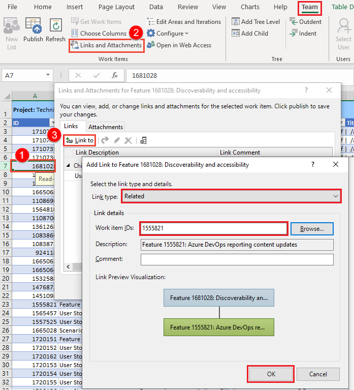

	When finished, choose **Close** to dismiss the dialog. 

1. To link several work items to the same work item(s), multi-select them by using **Ctrl-click** for consecutive rows, or **Shift-click** for non-consecutive rows. 

  

### Find work items to link to   

From the Add link dialog you can open a secondary dialog to help you choose one or more work items to link to. If you are going to find and list work items to link to by using a saved query, first [define the query](../../queries/using-queries.md) that you want to use. 

From the Add link dialog, choose the **Browse** button (Visual Studio) to open the following dialog. 

> [!div class="mx-imgBorder"]  
> 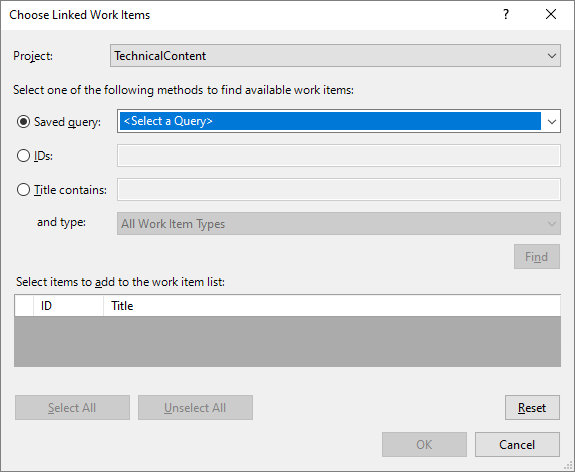

The **Choose Linked Work Items** dialog works in the same way as the **Get Work Items** dialog. To learn more, see [Add existing work items to your worksheet](#get-work-items) described earlier in this article.

### Add columns to the links list

1. From the **Links** tab, choose the :::image type="icon" source="media/icons/choose-columns.png" border="false"::: **Columns** icon, and add the fields you want displayed. Here we add the Assigned to and State fields. 

	> [!div class="mx-imgBorder"]  
	> 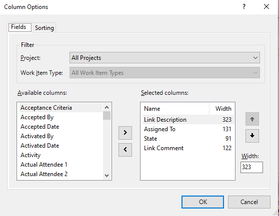 

1. To reorder the links, choose the field to sort the list on that field. 

	> [!div class="mx-imgBorder"]  
	> 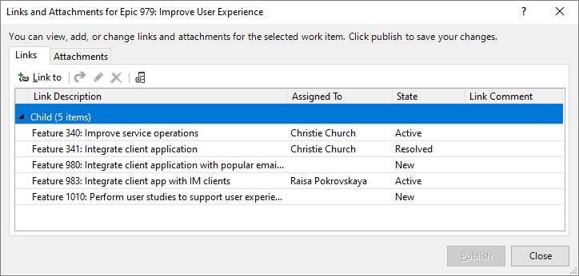 

This dialog works in the same way as the **Get Work Items** dialog. See [Add existing work items to your worksheet](#get-work-items) described earlier in this article.
### Open a linked work item

From the **Links** tab, choose the linked work item, right-click to open the context menu, and choose **Open Linked Item**. 

> [!div class="mx-imgBorder"]  
> 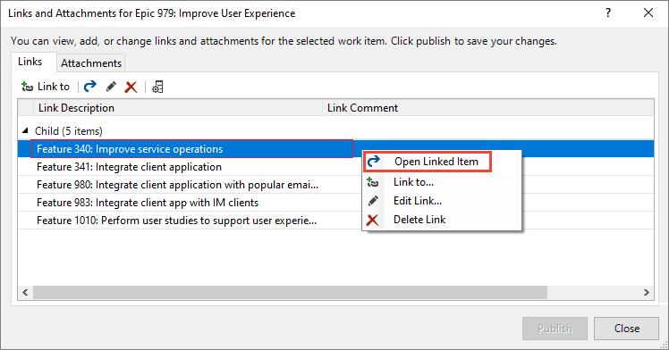

The work item opens in your web portal.

### Edit the link, change the link type 

You can edit any link listed. You can change the link type and the work items linked to.
  
1. Choose the link and choose the :::image type="icon" source="media/icons/edit.png" border="false"::: **Edit** icon. 

1. Change the link type as needed. 

	> [!div class="mx-imgBorder"]  
	> 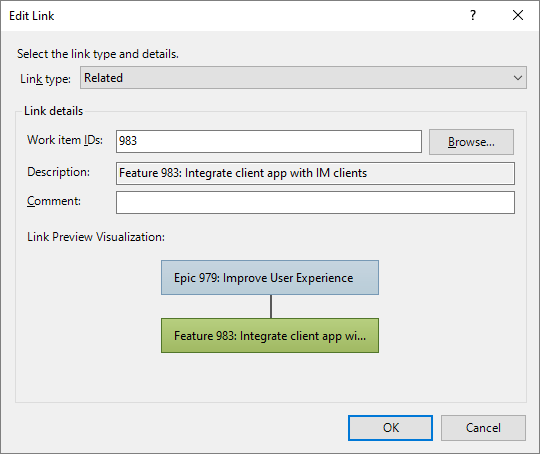

1. To change the work item linked to, enter the ID of the work item, or choose **Browse** to find the work item(s) to link to. 

	The **Choose Linked Work Items** dialog works in the same way as the **Get Work Items** dialog. To learn more, see [Add existing work items to your worksheet](#get-work-items) described earlier in this article.

## Add attachments

- To add attachments, choose the work item, then **Links and Attachments**, and then the **Attachments** tab.  

	Choose the file you want to attach, then choose **OK** and then **Publish**.  

	> [!div class="mx-imgBorder"]  
	> 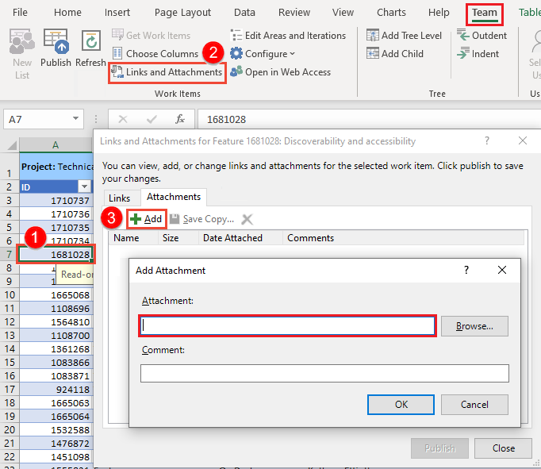

	When finished, choose **Close** to dismiss the dialog. 

- To add the same attachment(s) to several work items, multi-select them by using **Ctrl-click** for consecutive rows, or **Shift-click** for non-consecutive rows. 

## Create a report 

You can create a report or chart from the web portal for flat-list queries. See [Track progress by creating status and trend query-based charts](../../../report/dashboards/charts.md). 

> [!IMPORTANT]
> You can only create an Excel report using **New Report** from an on-premises Azure DevOps Server. These reports require that your project's project collection is configured to support SQL Server Analytics Server. 
 
You can create a report using the **New Report** feature based on a flat list of work items. 

> [!div class="mx-imgBorder"]  
> 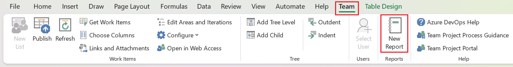

To learn more, see [Create Excel reports from a work item query](../../../report/create-status-and-trend-excel-reports.md). 

## Resolve publishing errors  

To resolve publishing errors that arise when working in Excel, see one of the following topics:   

- [Resolve data conflicts](resolve-excel-data-conflicts-publish-refresh.md): 
    A data conflict occurs when a field value is changed in Azure Boards since the last time you published from Excel.  

- [Resolve data validation errors](resolve-excel-data-validation-errors.md):
    A data validation error occurs if a field value violates the rules for that field and work item type.  
  
- [Resolve invalid links in a tree hierarchy](resolve-excel-invalid-links-tree-list.md):
    An invalid link occurs if a team member views work items in Excel as a hierarchy or tree list, and moves a work item or sorts the list so that it breaks the dependencies between work items. You can resolve this error by reviewing the error message and repositioning work items to reflect the work item structure.

- [Address Error TF208104: Hierarchical Link Relationship Is Locked](resolve-excel-invalid-links-tree-list.md#tf208104):  
    If you receive error TF208104, changes you made to the fields are published, but all changes you made to the link hierarchy are not published. At least one of the link relationships defined for the work item is locked by another process, such as Project Server integration. 

## Related articles

::: moniker range=">= azure-devops-2020"  

- [Bulk modify work items (web portal)](../../backlogs/bulk-modify-work-items.md)  
- [Azure DevOps Office integration issues](tfs-office-integration-issues.md)
- [FAQs: Work in Excel connected to Azure Boards](faqs.yml) 
- [Bulk import or update work items using CSV files](../../queries/import-work-items-from-csv.md)
- [View and add work items, az boards work-item create](../../work-items/view-add-work-items.md#add-work-item) 
- [Basic Excel tasks](https://support.office.com/article/basic-tasks-in-excel-dc775dd1-fa52-430f-9c3c-d998d1735fca) 

::: moniker-end  

::: moniker range="< azure-devops"

- [Bulk modify work items (web portal)](../../backlogs/bulk-modify-work-items.md)  
- [Azure DevOps Office integration issues](tfs-office-integration-issues.md)
- [FAQs: Work in Excel connected to Azure Boards](faqs.yml) 
- [Create Excel reports from a work item query](../../../report/create-status-and-trend-excel-reports.md)
- [Basic Excel tasks](https://support.office.com/article/basic-tasks-in-excel-dc775dd1-fa52-430f-9c3c-d998d1735fca) 

::: moniker-end  

