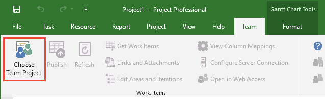
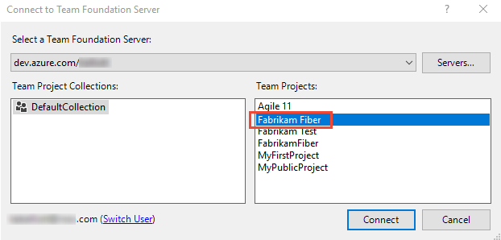
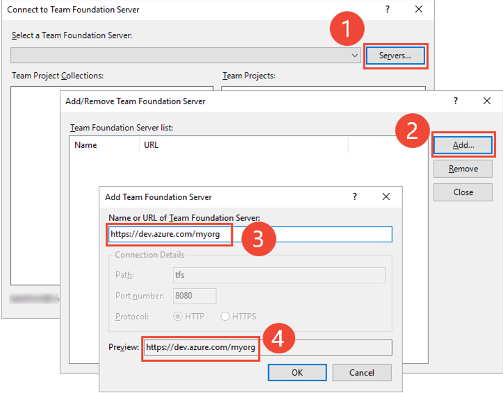
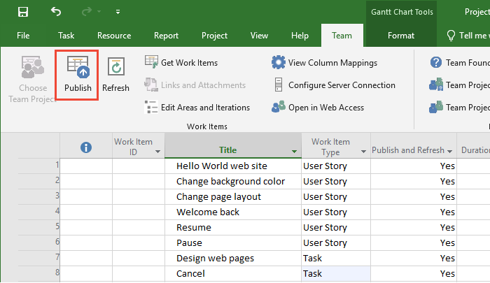
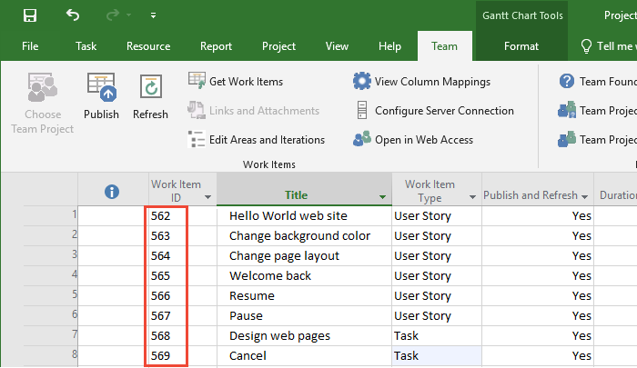
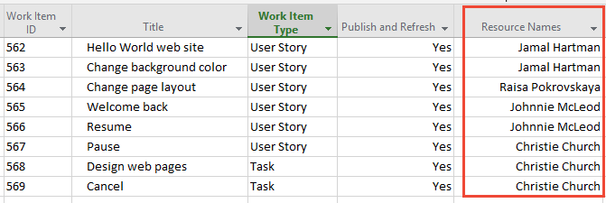
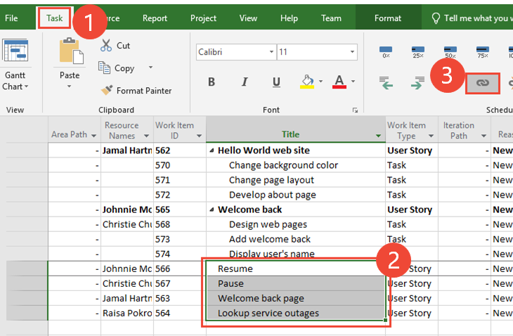
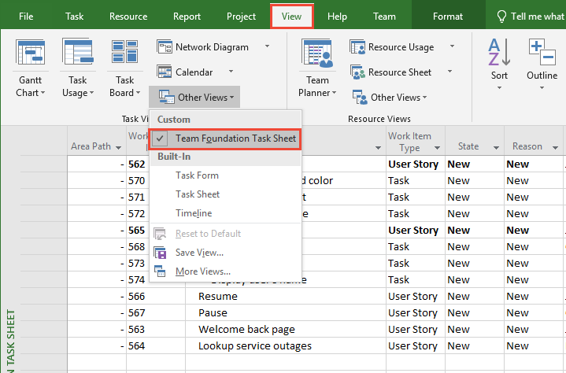
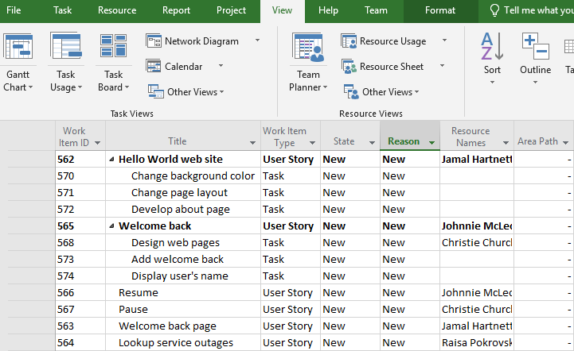
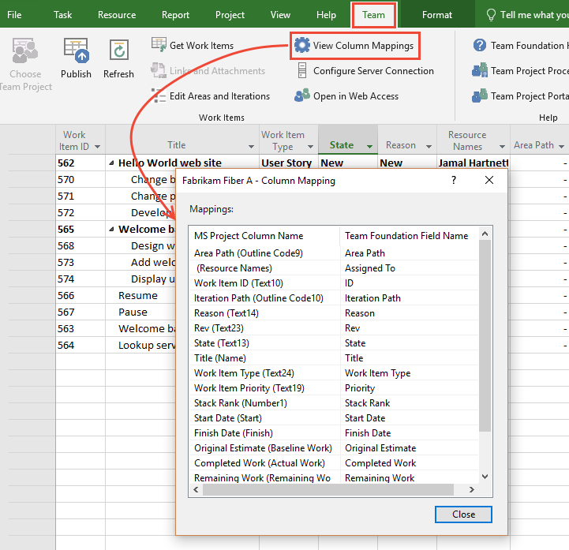

# Create your backlog and tasks using Microsoft Project 

[!INCLUDE [temp](../../_shared/version-vsts-tfs-all-versions.md)]

If Microsoft Project is your preferred tool for tacking projects, you can use it to create your backlog, schedule tasks, assign resources, and track work that is also tracked in Azure Boards or Team Foundation Server (TFS). You can use Project while your development team uses the tools they prefer, all while sharing information transparently.

> [!IMPORTANT]  
> Starting with Visual Studio 2019, the Team Foundation plug-in for Office is deprecating support for Microsoft Project. Project integration and the **TFSFieldMapping** command is not supported for Azure DevOps Server 2019 nor for Azure DevOps Services. You can continue to use Microsoft Excel.  

Working in Project is similar to publishing and refreshing work items using [Office Excel](bulk-add-modify-work-items-excel.md), with a few differences as described [later in this article](#differences).

Use this article to learn how to:  

> [!div class="checklist"]      
> * Connect a Project plan to a project  
> * Add tasks to Project and publish them as work items 
> * Indent tasks to create parent-child links 
> * Link tasks to create predecessor-successor links  
> * View how Project columns map to work item fields    

::: moniker range="<= tfs-2017"  
> [!NOTE] 
>You can also manage projects using Project Professional and [Project Server synchronized with TFS](../../../reference/tfs-ps-sync/synchronize-tfs-project-server.md), but you can't use Project Professional to both publish and refresh to TFS and synchronize with TFS.
::: moniker-end  

## Prerequisites 
::: moniker range=">= tfs-2017" 
- Office Project 2010 or later version, including Office Project 365
- Visual Studio 2013 or later version or [Team Foundation Server Standalone Office Integration (free)](https://visualstudio.microsoft.com/downloads#team-foundation-server-office-integration-2017)
- [Permissions to connect to the project](../../../organizations/security/add-users-team-project.md) in  Azure Boards or TFS. 

::: moniker-end  

::: moniker range=">= tfs-2013 <= tfs-2015" 
- Office Project 2007, Office Project 2010, or Office Project 2013
- Visual Studio 2013 or Visual Studio 2015 or [Team Foundation Server Standalone Office Integration (free)](https://visualstudio.microsoft.com/downloads#team-foundation-server-office-integration-2017)
- [Permissions to connect to the project](../../../organizations/security/add-users-team-project.md). 
::: moniker-end  

To learn more about compatibility requirements, see [Compatibility with Azure DevOps Services and TFS versions](/azure/devops/server/compatibility). 

## Add tasks and publish work items

# [Office Project 365](#tab/office-365)

0.  If you don't have Office Project 2010 or a more recent version, [install it](https://products.office.com/project). 

0.  If you haven't installed a version of [Visual Studio (2010 or later)](https://visualstudio.microsoft.com/downloads/download-visual-studio-vs) or the [Team Foundation Server Standalone Office Integration (free)](https://go.microsoft.com/fwlink/?LinkId=832491&clcid=0x409), you'll need to install one of these versions to connect to an Azure Boards or TFS project. 

	> [!NOTE]    
	> The only way to get the Team Foundation plug-in is by installing one of the latest editions of Visual Studio or the TFS Standalone Office Integration installer. TFS Office Integration 2015 supports connection to Azure Boards and TFS from Excel, Project, and the PowerPoint-based storyboarding tool. 

0.  In Project, start with a blank worksheet. If you don't see the **Team** ribbon see step 2 or [TFS-Office integration issues](tfs-office-integration-issues.md). 

	> [!TIP]  
	> If you want to first import a list or tree of work items you've already defined, follow steps 3 and 4 under [Bulk add or modify work items with Excel, Add work items](bulk-add-modify-work-items-excel.md#add-work-items). In the New list dialog, select the **Query** that contains the work items you want to import. 

	> [!div class="mx-imgBorder"]  
	> 

    Another way to start is to open a backlog query in Team Explorer and from the context menu, choose **Open Query in Microsoft Project**.

	> [!TIP]  
	> If the **Team** ribbon no longer appears, you might need to [re-enable it](tfs-office-integration-issues.md).

4.  Connect to Azure Boards or TFS and the project that you want to plan. If you can't connect, [get added as a team member](../../../organizations/security/add-users-team-project.md).

	> [!div class="mx-imgBorder"]  
	> 

    If it's your first time connecting from Project, you might have to add the URL of Azure Boards or the name of your TFS instance to the list of recognized servers.

	**Azure Boards**  

	(1) Choose **Servers...**, (2) choose **Add...**, (3) enter the URL of your Azure Boards organization, (4) check that the preview matches the URL that you entered, and then choose **OK**. 

	

	**TFS**  

	(1) Choose **Servers...**, (2) choose **Add...**, (3) enter the name of your TFS instance. As needed, change the Port number if your deployment uses a non-default port number.   The Preview entry should display the correct URL for your deployment. (4) Choose **OK**.  

    

	Choose **Close** to close the Add/Remove servers dialog. From the Select a Team Foundation Server dialog, make sure the server you added is selected, and then choose **Connect**. 

    Project is now bound to your project. The Team Foundation Gantt view supports entry and display of several work tracking fields.

	> [!div class="mx-imgBorder"]  
	> 

5.  Add task information and then publish the project. To add a work item, specify the **Title**, **Work Item Type**, **Publish and Refresh**, and any other required fields. Resize and move columns using standard [Project methods](https://support.office.com/article/hide-or-unhide-a-column-in-a-project-view-29b1449f-32fe-4ae0-9041-cb59e09d28cf).

	> [!TIP]  
	> Set the **Publish and Refresh** field for a task to **Yes** if you want to have a work item created for it. For example, set user stories, backlog items, and tasks to be published and refreshed. However, any summary tasks that you create to group tasks or to assign milestones, set **Publish and Refresh** to **No**.

	> [!div class="mx-imgBorder"]  
	> 

    Notice how IDs are now assigned to your work items.

	> [!div class="mx-imgBorder"]  
	> 

    Optionally, you can use  **Get work items** icon, select a work item query, and add work items to your project plan.

6.  Assign resources to tasks, and then choose **Publish** to publish your assignments. Or, leave that field blank for the development team to assign. 

	> [!div class="mx-imgBorder"]  
	> 

	> [!TIP]  
	> Although Project supports allocation of more than one resource to a task, Azure Boards work tracking does not. If a task requires more than one resource to complete, divide the task into subtasks and assign one resource to each subtask. Only assign a project member as a resource to those tasks that you will publish.
    >  
    >Specify resources by their display names from Azure Active Directory (for Azure DevOps Services) or Active Directory Domain Services (for TFS). If you assign a resource by its alias or other name, you risk incurring validation errors.

7.  Save your project plan to retain scheduling and other data that Azure Boards doesn't store.

# [Office Project 2007](#tab/office-2007)

0.  If you don't have Office Project 2007 or a more recent version, [install it](https://products.office.com/project). 

2.  If you haven't installed a version of [Visual Studio (2010 or later)](https://visualstudio.microsoft.com/downloads/download-visual-studio-vs) or the [Team Foundation Server Standalone Office Integration 2015 (free)](https://visualstudio.microsoft.com/downloads/#team-foundation-server-office-integration-2015-update-3-1), you'll need to install one of these versions to connect to an Azure Boards or TFS project. 

	> [!NOTE]    
	>The only way to get the Team Foundation plug-in is by installing one of the latest editions of Visual Studio or the TFS Standalone Office Integration installer. TFS Office Integration 2015 supports connection to Azure Boards and TFS from Excel, Project, and the PowerPoint-based storyboarding tool. 

3.  In Project, start with a blank worksheet. If you don't see the **Team** ribbon (or the **Team** menu if you use Project 2007) see step 2 or [TFS-Office integration issues](tfs-office-integration-issues.md). 

	> [!TIP]  
	>If you want to first import a list or tree of work items you've already defined, follow steps 3 and 4 under [Bulk add or modify work items with Excel, Add work items](bulk-add-modify-work-items-excel.md#add-work-items). In the New list dialog, select the **Query** that contains the work items you want to import. 

    

    Another way to start is to open a backlog query in Team Explorer and from the context menu, choose **Open Query in Microsoft Project**.

	> [!TIP]  
	> If the **Team** ribbon no longer appears, you might need to [re-enable it](/visualstudio/vsto/how-to-re-enable-a-vsto-add-in-that-has-been-disabled).

4.  Connect to TFS and the project that you want to plan. If you can't connect, [get added as a team member](../../../organizations/settings/add-teams.md).

    

    If it's your first time connecting to TFS from Project, you might have to add the name of your TFS to the list of recognized servers.

    

    Project is now bound to your project. The Team Foundation Gantt view supports entry and display of several TFS fields.

    

5.  Add task information and then publish the project. To add a work item, specify the **Title**, **Work Item Type**, **Publish and Refresh**, and any other required fields. Resize and move columns using standard [Project methods](https://support.office.microsoft.com/client/HP010351693?lcid=1033&query=&NS=WINPROJ&Version=14&ShowNav=false&syslcid=1033&uilcid=1033&app=&msg=&origin=&ocmsassetID=HP010351693).

	> [!TIP]  
	> Set the **Publish and Refresh** field for a task to **Yes** if you want to have a work item created for it in TFS. For example, set user stories, backlog items, and tasks to be published and refreshed. However, any summary tasks that you create to group tasks or to assign milestones, set **Publish and Refresh** to **No**.

    

    Notice how IDs are now assigned to your work items.

    

    Optionally, you can use , select a work item query, and add work items from TFS to your project plan.

6.  Assign resources to tasks. Or, leave that field blank for the development team to assign.

    

	> [!TIP]  
	> Although Project supports allocation of more than one resource to a task, TFS does not. If a task requires more than one resource to complete, divide the task into subtasks and assign one resource to each subtask. Only assign a TFS team member as a resource to those tasks that you will publish.
    >  
    >Specify resources by their display names from Active Directory Domain Services (AD DS). If you assign a resource by its alias or other name, you risk incurring validation errors.

7.  Save your project plan to retain scheduling and other data that TFS doesn't store.

---

## Indent tasks to create parent-child links

When you indent tasks and then publish your plan, you create parent-child links between work items. Tasks will show up on the [taskboard](../../sprints/task-board.md) when they are assigned to the taskboard sprint.

# [Office Project 365](#tab/office-365)

> [!div class="mx-imgBorder"]  
> 

To see the parent-child links that you just created, open **Links and Attachments**.

> [!div class="mx-imgBorder"]  
> 

# [Office Project 2007](#tab/office-2007)

To see the parent-child links that you just created, open **Links and Attachments**.

---

## Link tasks to create predecessor-successor links

When you link two tasks and publish your plan, TFS creates predecessor-successor links between the two work items.

# [Office Project 365](#tab/office-365)

> [!div class="mx-imgBorder"]  
> 

# [Office Project 2007](#tab/office-2007)

  

---

Although the work tracking system tracks predecessor-successor dependencies as work item links, it does not track dependency types, lead and lag time, or other constraints that Project does.

## Specify data for other work tracking fields 

To enter data into other work tracking fields, switch to the Team Foundation Task Sheet.

# [Office Project 365](#tab/office-365)

  

This view displays all the work tracking fields that have been mapped to Project.

  
  
Optionally, you can add a mapped work tracking field as a column to the Team Foundation Gantt view. To see which work tracking fields are mapped, open **Column Mappings**.

  

# [Office Project 2007](#tab/office-2007)

  

This view displays all the work tracking fields that have been mapped to Project.

  
  
Optionally, you can add a mapped work tracking field as a column to the Team Foundation Gantt view. To see which work tracking fields are mapped, open **Column Mappings**.

  

---

To add more work tracking fields or change the way fields are mapped, see [Customize the Microsoft Project field mapping file](../../../reference/xml/customize-project-field-mapping-file.md). 

## Tips for working in Project and other Team Foundation clients

You can manage your project plan using Project and all the features that Project provides. Because you and other team members can modify TFS work items from the web portal, Excel, Project, and Team Explorer, follow these tips to manage your work effectively:

- When you first open a project plan, choose the Team ribbon  **Refresh** icon to download the latest work tracking data.  
- Publish your changes and refresh your plan periodically while you work. Otherwise, you can encounter data conflicts between plan data and the work tracking data store.  
- Save your project plan to maintain scheduling data and other information that isn't stored in the work tracking data store.  
- When defining areas and iterations, keep in mind that Project and Excel restrict the length of the area and iteration path field to 256 characters.  
- In Project 2010 and later versions, when you choose the  **Pinned task** icon (Manually scheduled tasks, Task Mode field), team members can place a manually scheduled task anywhere in their schedules, and Project will not move it. In order for team members to manually schedule their tasks, you will have to add the necessary project fields to work tracking task definitions.  

	Start and finish dates for autoscheduled tasks ( **Auto Update Task Mode** icon) are determined by the scheduling engine based on task dependencies and the project calendar, as in previous releases of Project.  
- Use Project to manage and update changes to these fields:
	- Finish Date
	- Start Date
	- Calculated fields for completed and remaining work

	Although work tracking data store can store estimated, completed, and remaining work, and start and finish dates, Azure DevOps Services and TFS do not recalculate the fields when updates to these fields are made.  

	When you publish to Azure DevOps Services and TFS, start and finish times are read-only by default. Project does not download start and finish times when you refresh the plan.   
- If you see that hours are counted twice in reports that contain task hours, [correct the problem](../../../report/sql-reports/address-inaccuracies-published-for-summary-values.md).  

	Project assigns parent tasks the rollup of hours that are assigned to all its child tasks. Rollup hours are not published to the work tracking data store to prevent hours within reports from being counted twice. The Microsoft Project mapping file attribute, **IfSummaryRefreshOnly**, suppresses the hours that are assigned to summary tasks.
</li>

<a id="differences" />
## Differences working in Project versus Excel

|Area|Project|Excel|
|---|---|---|
|Adding work tracking fields|You can only add fields to your Project plan that are defined in the Microsoft Project mapping file.|You can add any work tracking field to your Excel worksheet that is listed in the **Choose Columns** dialog, subject to Excel limitations on text length.|
|Publish/Refresh|You specify the **Publish or Refresh** field for individual tasks. Also, field attributes defined in the Microsoft Project mapping file affect how fields are published and refreshed.|All work items are subject to publish and refresh.|
|Linking|You can create and modify parent-child links or predecessor-successor links between work items.|Using the tree list view, you can create and modify parent-child links.|

## Related articles  

- [Bulk modify work items using Excel](bulk-add-modify-work-items-excel.md)
- [Create your backlog](../create-your-backlog.md)
- [Azure DevOps Service and TFS compatibility](/azure/devops/server/requirements) 

If the Team ribbon fails to appear, see [TFS-Office integration issues](tfs-office-integration-issues.md). 

### Delete work items
You can't delete work items from Excel nor from Project. The only way to delete work items is from the web portal or the **witadmin** command line tool. For details, see [Move, change, or delete work items](../remove-delete-work-items.md).

### Do you want to add Project fields to work items?

For team members to be able to view or modify Project fields from a Team Foundation client, you must customize both the definition file for the task work item type and update the [The Microsoft Project Field Mapping File](../../../reference/xml/customize-project-field-mapping-file.md). For resources, see [Schedule projects using Microsoft Project 2010](schedule-projects-using-microsoft-project.md).

### Do you want to map additional work tracking fields to Project, or change how fields are mapped?

You can change how work tracking fields map to fields in Project, and you can change how specific fields are published. See [The Microsoft Project Field Mapping File](../../../reference/xml/customize-project-field-mapping-file.md).

### Project for Mac 

macOS is not supported. You need to use Project on the same computer where you have installed Visual Studio or the Team Foundation Server Standalone Office Integration 2015 in order to get the Team Foundation add-in. These applications require Windows.
