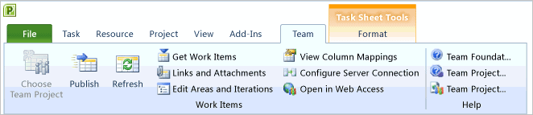

# Schedule projects using Microsoft Project  

[!INCLUDE [temp](../../_shared/version-vsts-tfs-all-versions.md)]

You can use [Project to plan and schedule work items](create-your-backlog-tasks-using-project.md) that you define in Team Foundation Server (TFS). Some features may require customizing the Microsoft Project Mapping file which is only supported for the On-Premises XML process model. For an overview of process models and supported customizations, see [Customize your work tracking experience](../../../reference/customize-work.md).  

> [!IMPORTANT]  
> Starting with Visual Studio 2019, the Team Foundation plug-in for Office is deprecating support for Microsoft Project. Project integration and the **TFSFieldMapping** command is not supported for Azure DevOps Server 2019 nor for Azure DevOps Services. You can continue to use Microsoft Excel.  

You can use Project 2010 or later versions to plan projects, schedule tasks, assign resources, and track changes to data that is stored in Azure Boards and TFS. By using Project, you can access many tools and functions through the simplified graphical menus and Office Ribbon. The Team tab menu, as shown in the following illustration, displays the same functions that are available from the Team tab in Excel.

> [!NOTE]  
> For version compatibility and Office clients, see [Requirements and compatibility, Office](/azure/devops/server/compatibility#office).  
 
**Project team tab ribbon** 

  
  
  
Project 2010 and later versions support several new project fields and functions. Depending on how you use Project to schedule team tasks, you may want to update the task work item form to display some of the new fields. To maintain new Project fields in both your project plan and in TFS, you have to customize the task work item type and the Microsoft Project Field mapping file for the project. 

> [!NOTE]  
>Customizing the Project Field mapping file is only support for on-premises TFS and the On-premises XML process model.  
  
 
##  New task-related features in Project 2010 and Project 2013  
 
### Schedule tasks manually or automatically
By using Task Mode, which is accessed through the following Ribbon menu, you have more flexibility in the way you and team members schedule tasks.

By using manually scheduled tasks, which are indicated by the  icon, you can manually schedule the duration and the start and finish dates for a task. Team members can place a manually scheduled task anywhere in their schedules, and Project will not move it. 

> [!IMPORTANT]  
>In order for team members to manually schedule their tasks, you'll have to [add the necessary project fields to the task work item](#download). You can only modify the task WIT definition for the On-premises XML process model.  

Start and finish dates for autoscheduled tasks () are determined by the scheduling engine based on task dependencies and the project calendar, as in previous releases of Project. Project managers who are accustomed to automatic scheduling with past versions of Project can turn the new manual scheduling feature off for specific tasks or the entire project.

### Perform what-if analysis by inactivating select tasks ( **Project Professional only**). 

By using Active Mode, you can determine the impact to the schedule when you specify some tasks as inactive. When you mark a task as inactive, you maintain all the data that is associated with the task, but you remove it from consideration in the schedule and resource allocation. 

> [!IMPORTANT]  
>When you inactivate a task in Project, you do not inactivate the task in Azure Boards and TFS. Inactive tasks are published and refreshed according to their **Publish and Refresh** assignment in the Project plan.   

**Scalable 64-bit support**. With 64-bit compatibility, Project provides performance improvements to support creation of very large and complex projects.
   

   
##  Add Project fields to TFS (On-premises XML)  

For team members to be able to view or modify new Project fields from the web portal or Team Foundation client, you must customize both the task WIT definition and update the Microsoft Project Mapping file. By making these changes, you maintain the data fields in both the Project plan and in the work tracking database. You can make these fields read-only or modifiable. You can use them to find work items by using queries and construct reports. Specifically, you can add fields that enable team members to specify their start and end dates for pinned tasks. By adding these fields to the task work item form, you can view and modify the start and end dates using a Team Foundation client.  
  
The following table provides the sequence of tasks to perform and related topics for completing these tasks.  
  
### Determine the Project fields to add to your project

If you want team members to schedule tasks manually from a Team Foundation client, you must add the Project fields that store the manual date and duration for tasks to the work item form and project mapping file. You can use the following information to determine which of these Project scheduling fields to add:
- To support manually scheduled tasks, add one or more of the pjTaskStartText, pjTaskFinishText, or pjTaskDurationText fields to the mapping file. You must map pj\*Text fields to String fields in Team Foundation. These fields accept text strings only.
- The pjTaskStart, pjTaskFinish, and pjTaskDuration fields contain the scheduled committed dates and duration of a task. 

	> [!TIP]  
	>By default, these fields are mapped based on the process template that was used to create your project.

- The scheduling engine uses the pjTaskScheduledStart, pjTaskScheduledFinish, and pjTaskScheduledDuration fields to store the calculated dates and duration of an autoscheduled task.
- The pjTaskManual, pjTaskPlaceholder, and pjTaskWarning fields indicate whether a task is scheduled manually or automatically, whether a manual task has insufficient information to be scheduled, and whether a Project has identified a potential scheduling conflict with the start date, finish date, or duration, respectively, of a manually scheduled task. 

To learn more, see: 
- [Available Fields](https://support.office.com/article/Available-fields-reference-615a4563-1cc3-40f4-b66f-1b17e793a460)
- [Customize the Microsoft Project field mapping file](../../../reference/xml/customize-project-field-mapping-file.md)

  
###Add fields to the task work item type
To update a work item type, you add a `FIELD` element for each new field you want to track and a `CONTROL` element for each field you want to display on the work item form. You use the `witadmin` command line tool to export and import the definition file for each work item type. 
 
[!INCLUDE [temp](../../_shared/process-editor.md)]

For more information, see: 
- [Add or modify a work item field](../../../reference/add-modify-field.md)
- [Add or modify work item fields to support reporting](../../../reference/xml/add-or-modify-work-item-fields-to-support-reporting.md)

###Update the Microsoft Project Mapping File
The project mapping file determines how the fields in each task are mapped to fields in Team Foundation and how each field is published and refreshed. Each project is associated with its own mapping file. You use the `TFSFieldMapping` command-line tool to download and upload the project mapping XML file.

To learn more, see [TFSFieldMapping](../../../reference/xml/upload-or-download-the-microsoft-project-mapping-file.md).   
  
## Related articles
- [Create your backlog and tasks using Project](create-your-backlog-tasks-using-project.md)